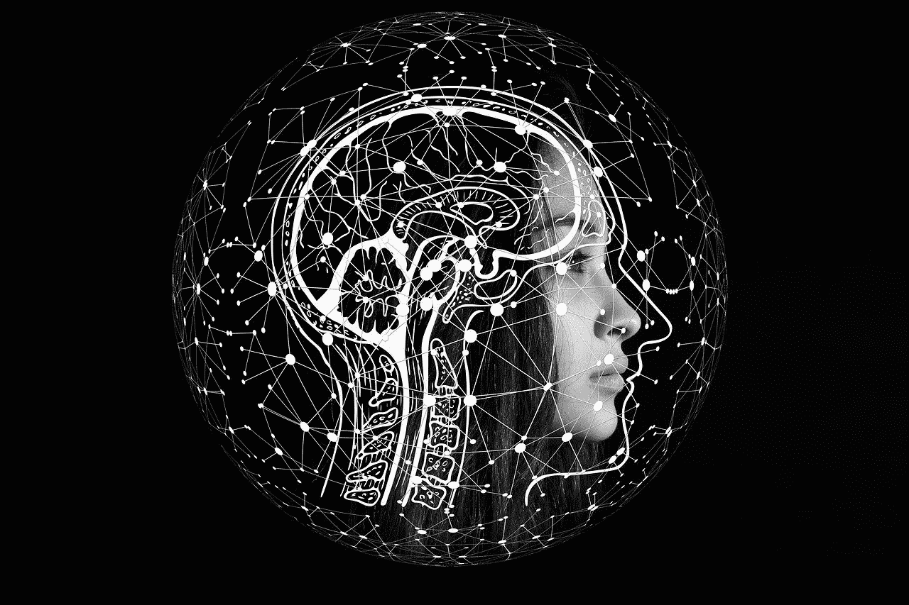

# 打击数据科学偏见的 3 个切实步骤— ClosedLoop.ai

> 原文：<https://towardsdatascience.com/3-tangible-steps-in-combating-prejudice-in-data-science-closedloop-ai-fb514b4d8400?source=collection_archive---------49----------------------->

## 我们都希望我们的算法是公平的，但有时，很难知道如何开始。

图片由[皮克斯拜](https://pixabay.com/?utm_source=link-attribution&utm_medium=referral&utm_campaign=image&utm_content=4389372)的 Gerd Altmann 提供

当我们想到偏见时，我们往往会想到它最明显的表现方式。当前的时代精神暴露了被动接受不公正所造成的危害。作为一名数据科学家，你有责任朝着公平的方向前进。通常，驱动力必须来自作为实践者的你。可能很难知道如何处理这个问题。我将重点介绍三种具体方法，通过这些方法，您可以努力消除数据科学决策中的偏见。

# 1.以有意义的方式衡量公平

在提到机器学习模型时说出“准确性”这个词，数据科学家就会凭空解释为什么这不是正确的指标。他们将继续列举六种更好的量化有效性的方法。令人怀疑的是，同样的语义战士也精通在 ML 模型中测量公平性的[方法](https://dl.acm.org/doi/pdf/10.1145/3194770.3194776)。我们希望我们的模型是公平的，就像我们希望我们的模型是有效的和高性能的一样。因此，我们衡量公平。你对一个模型的报道反映了你的优先考虑，衡量公平应该是优先考虑的。

衡量模型的公平性可能具有挑战性。为了避免在我们的模型中引入偏见，许多数据集将不包括人口统计信息。这是好心导致坏结果的一个很好的例子。您应该记录人口统计信息，即使它从模型中保留。没有这些信息，就不可能衡量您的模型在这些线上的表现。如果您的公司没有记录这些信息，请考虑倡导代表这样做。

一旦你有能力衡量公平性，你就需要选择正确的度量标准。[在之前的一篇文章](/a-new-metric-for-quantifying-machine-learning-fairness-in-healthcare-closedloop-ai-fc07b9c83487)中，我讨论了一种用于量化医疗保健中的偏见的指标，称为群体利益平等，并深入探讨了为什么我认为这是医疗保健背景下最合适的衡量标准。如果您在算法中发现了偏见，提供了一个很好的描述，说明了如何使用 SHAP 分数来量化决策存在偏见的原因。

# 2.不要让你的数据变得奇怪

社会科学领域的研究人员经常在归纳他们的理论时遇到问题。一个原因是，他们在大学生身上进行实验，而大学生代表了社会的一小部分。对这些数据集的描述很奇怪:西方的、受过教育的、工业化的、富裕的、民主的。如果你只是想预测这些群体，这样的现象是可以的。当你试图将社会理论应用到世界其他地方时，关于规范的潜在假设就失效了。我们使用的大多数数据集对个人如何生成数据都有类似的假设，这往往会导致不平等。

这种影响在医疗保健领域尤其糟糕。富人和穷人使用卫生系统的方式存在明显差异。例如，较穷的人使用流动服务乘车去正常的约会。当你从未缺少汽车时，这是很难预料的。通常，主题专家(SME)会敏锐地意识到这种现象。与 SME 合作对于集思广益解决这种影响是非常有价值的，尤其是在特征工程阶段。

那些没有被数据记录下来的东西是一个更大的挑战。医疗专业人员知道，决定你健康的很大一部分因素是基于你的家庭和工作环境。与财富和邮政编码相关的健康因素的几个例子是获得健康食品、接触有害化学物质和容易进入绿色空间。解释这些影响是困难的，但往往是理解为什么一个群体在公平性方面表现不佳的关键。

# 3.关注真实世界的效果

伟大的数据科学家与其他人最大的区别之一是他们理解他们的模型如何影响现实世界的能力。这一点之所以如此重要，是因为理解预期用途会影响到你如何定义你所预测的群体，以及你如何定义你的结果。虽然关注预期结果会让你成为一名优秀的数据科学家，但考虑非预期结果会让你成为一名伟大的数据科学家。

例如，您可以考虑建立一个模型来预测一个人是否会因心脏病发作而住院。一个合理的步骤可能是将你的人群限制在那些先前被诊断患有心脏病的人群中。以这种方式过滤人口是一把双刃剑。虽然它会使您的模型更加精确，但它也会过滤掉那些以前没有诊断过的人。如果一个人定期检查，更有可能记录下心脏病发作的情况。通过排除那些有不寻常使用模式的人，你最终建立了一个模型，将资源导向那些已经得到最好治疗的人。

从事数据科学工作的最大好处之一是医疗服务提供商和患者的利益一致。医疗保健提供者希望预测严重的医疗并发症，以便可以应用干预措施。举个例子，如果你注意到一个人有跌倒受伤的风险，干预措施可能是给他们一个踏凳。这非常简单而且非常有效。双赢。医疗保健中许多已知的不平等是有影响的。积极参与 SME 应该指导您的建模工作，以帮助使这些工作更加有效。你的模型有潜力让人们更健康，帮助底线，并创造一个更公平的医疗保健计划。这是一个很大的双赢局面。

*原载于 2020 年 9 月 18 日*[*https://closed loop . ai*](https://closedloop.ai/3-tangible-steps-in-combating-prejudice-in-data-science/)*。*