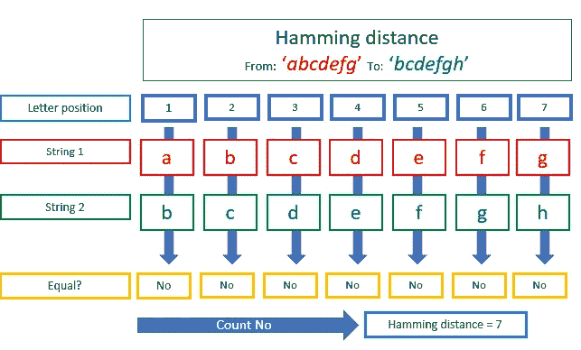
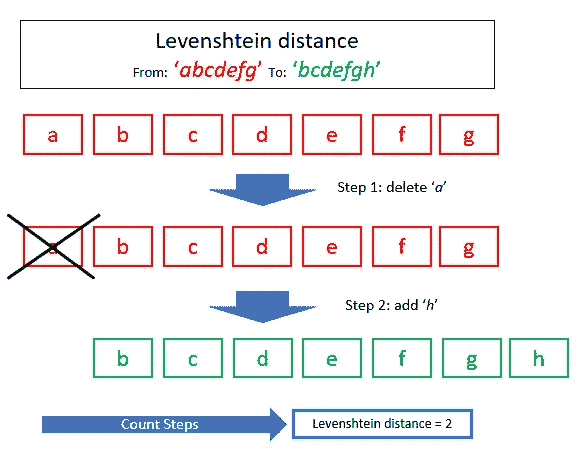
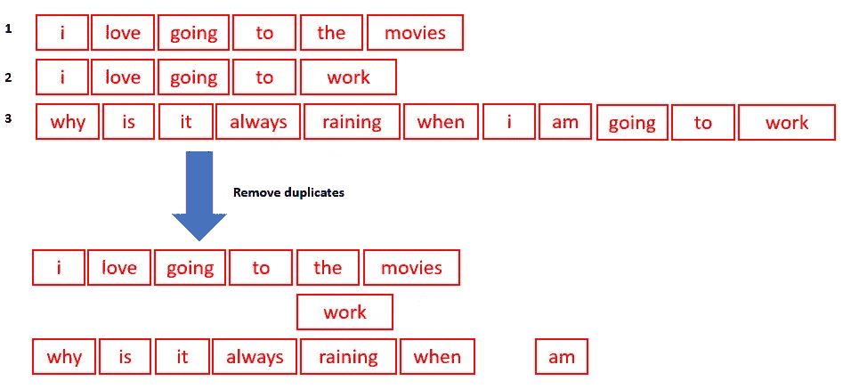
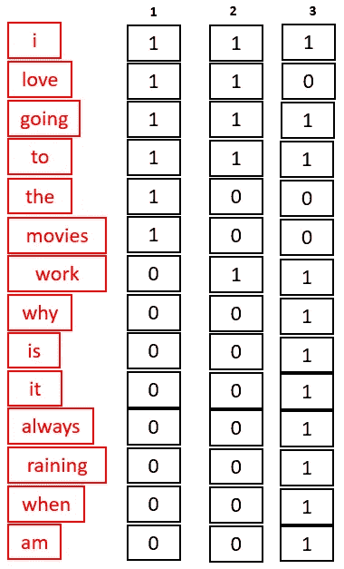
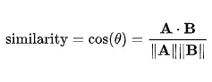
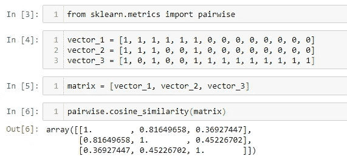

# 每个数据科学家都应该知道的 3 种文本距离

> 原文：<https://towardsdatascience.com/3-text-distances-that-every-data-scientist-should-know-7fcdf850e510?source=collection_archive---------15----------------------->

## 无论您是刚刚开始研究数据科学，还是已经在这个领域工作了很长时间，您都需要了解这三种文本距离

在之前的一篇文章中，我描述了每个数据科学家都应该知道的三个距离。那些距离**几何距离**:从一个点到一个点。在这篇文章中，我谈论从一个文本到另一个文本的距离度量。

> 测量从一个文本到另一个文本的距离和从一个点到另一个点的距离是不同的。

# 如何定义两个文本之间的距离？

## 解决方案 1 —汉明距离

汉明距离根据位置比较两个字符串中的每个字母。所以单词 1 的第一个字母与单词 2 的第一个字母相比较，等等。

> 汉明距离纯粹基于位置来比较两个字符串中的每个字母。

要计算两个字符串之间的汉明距离，需要比较字符串中每个位置的字符。不相等字符的个数就是汉明距离。

汉明距离的一个优点是进行这种位置比较非常快速和简单。另一方面，批评者认为它不能考虑到两个字母数不相等的字符串。另一个批评者是太严格了，比如“*abcdefg”*和“*bcdefgh”*被认为完全不同，而 7 个字符中有 6 个是相同的。

## 解决方案 2 — Levenshtein 距离

Levenshtein 距离是将一个字符串转换成另一个字符串所需的运算次数。所以每一次编辑都需要在 Levenshtein 距离上加 1。

> Levenshtein 距离是将一个字符串转换成另一个字符串所需的运算次数。

三种类型的操作很重要:

*   插入/添加一个字符算作一个操作
*   删除一个字符算作一次操作
*   替换一个字符算作一个操作

要计算 Levenshtein 距离，您需要确定将一个字符串转换为另一个字符串所需的编辑操作(删除、插入或替换)的数量。

Levenshtein 距离要直观得多。当汉明距离表示' *abcdefg* '和' *bcdefgh* '完全不同时，在 Levenshtein 距离中它们相对相似。

另一方面，Levenshtein 距离确实需要更多的时间来计算，并且算法不太简单。

## 解决方案 3 —余弦距离

余弦距离与前面讨论的度量有很大不同，因为它考虑了两个文档之间的距离。它通常用于自然语言处理。

> 余弦距离适用于文档的矢量表示。

余弦距离或更常用的余弦相似度的核心思想是对文本进行矢量化:将文本转换成数字数据。最简单的方法是使用字数矢量器:

**步骤 1:获取组合文本文档中的所有独特单词**

文本矢量化的第一步:获取所有文档中的独特单词

**第二步:通过字数统计为每个文档制作一个向量**

文本矢量化的第二步:通过计算每个句子的字数来获得矢量

**步骤 3:使用余弦相似度计算向量之间的相似度(相似度与距离相反)**

相似性的公式是通过计算你的两个向量的点积除以 a 的范数乘以 b 的范数来计算的。

余弦相似性公式

为了计算这个，我们可以使用 Python 中的 scikit 学习库。对于当前示例，它给出了以下结果:

这意味着:

*   句子 1 和句子 2 的相似度是 0.816…
*   句子 1 和 3 的相似度是 0.369…
*   句子 2 和 3 的相似度是 0.452…

所以 1 和 2 最相似，那么 2 和 3 最相似，1 和 3 最不同，和预期完全一样。

## 结论

在本文中，我分享了 3 种计算文本数据距离的方法，从非常基本到相对复杂。

我希望这对您有所帮助，并祝您在数据科学之旅中好运！敬请期待更多；)