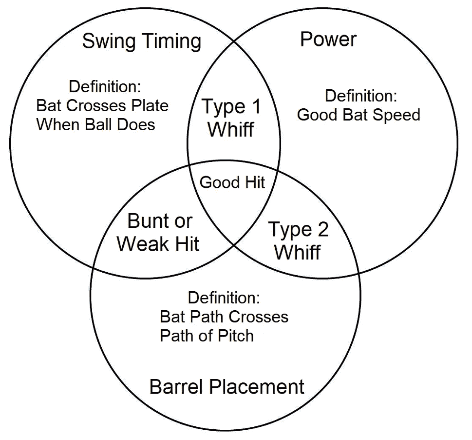
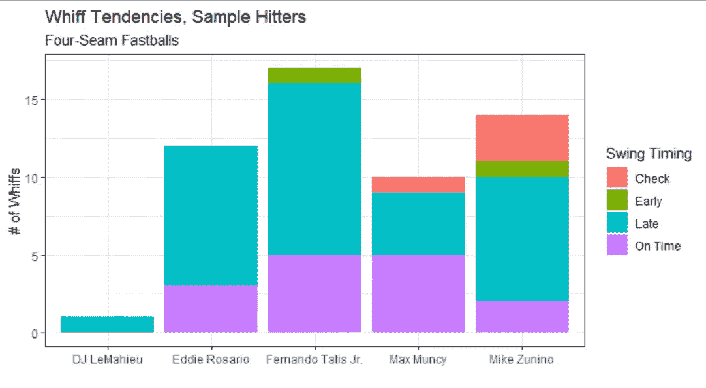
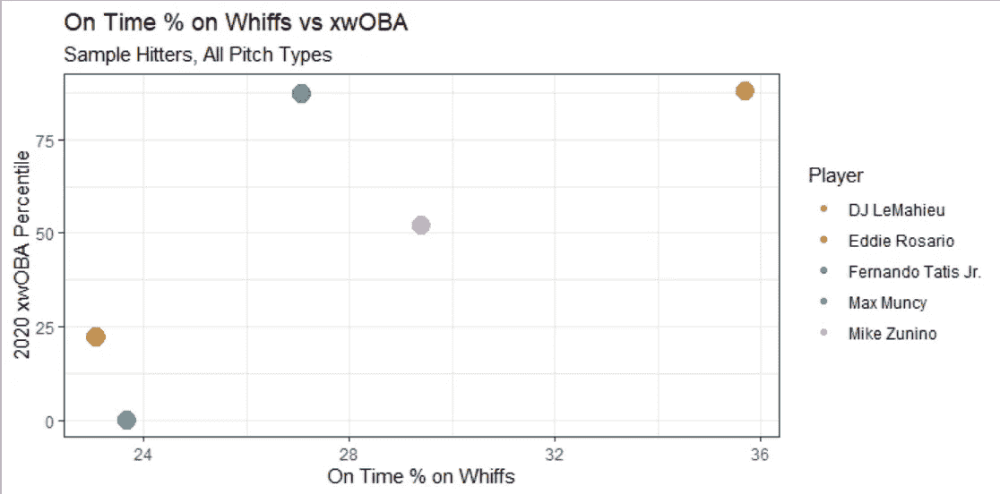
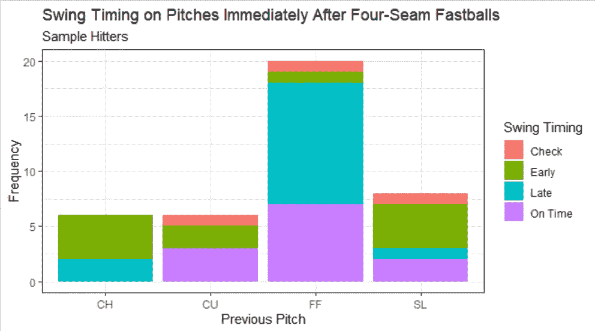
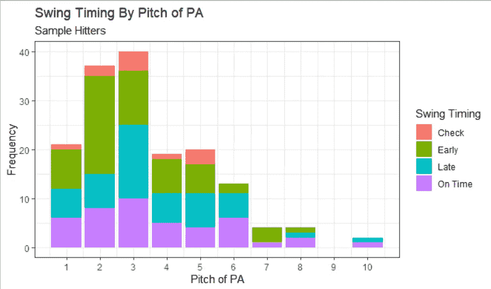

# 我们可以从挥杆时机分析中学到的 3 件事

> 原文：<https://towardsdatascience.com/3-things-we-could-learn-from-swing-timing-analysis-84486fdab209?source=collection_archive---------60----------------------->

对美国职业棒球大联盟数据进行新型分析的机会可能很快就会到来。我们可以这样准备。

人们很容易认为我们目前正在追踪棒球比赛中的一切，但这是不真实的。尽管我们随时都有大量与棒球位置相关的数据，但在我们的数据收集中，仍然有很多游戏的方面被完全忽略了(据我所知)。在我看来，一旦我们开始跟踪它，分析的首要方面就成熟了，那就是与每次挥杆是早了、准时了还是晚了相关的数据，我将这些数据称为挥杆计时数据。

虽然我们几十年前就知道挥杆时机会影响球是否被击中，但是这方面的信息却没有公开的数据。在棒球的数据革命中，每次挥杆的时间都没有被记录下来。一个可能的原因是，很难判断一次挥杆是太早、太晚还是准时，但这并没有阻止我去尝试！

有了一点样本数据和一些想象力，我开始挖掘一个全新的棒球分析领域，这可能是 MLB 球队竞相寻找鹰眼数据最佳新用途的军备竞赛的重要组成部分。

## 抽样资料

为了这个项目，我观察了 2020 年来自 5 个不同击球手的总共 160 次挥杆，并尽最大努力将每次挥杆标记为早挥杆、准时挥杆、晚挥杆或检查挥杆。收集这些数据是为了让我们知道，利用全面的挥杆时机数据，我们可以回答什么样的问题，而不是用**而不是**来确定地回答这些问题。

我选择了五名具有不同进攻特征的样本球员，观看了他们 2020 年的每一次(截至 8 月 13 日)，根据他们的时机将他们分组，早，准时，晚，或检查。这些击球手是:

**DJ LeMahieu:** 高产量，低气味(第 88 百分位 xwOBA，第 99 百分位气味率)

**埃迪·罗萨里奥:**低产量，低排名(第 22，第 87)

**小费尔南多·塔蒂斯:**高产，高人气(第 87，21)

迈克·祖尼诺:产量低，气味大(第 0，第 6)

**最大 Muncy:** 平均产量，平均气味(第 52，52)

通过选择一组不同的击球手，我能够从这种分析中扩展我可以提出的问题类型！不再赘述，下面是我认为可以用全面的挥杆时机数据来回答的最有趣的问题。

# #1.为什么打者挥棒不中？

打棒球很难。但是为什么呢？在我看来，击球有三个主要组成部分:时机、力量和枪管位置。你需要这三个人来进行艰难的接触。如果你的挥杆只有两个主要部分，你可以预期会有微弱的接触。

作者图片

正如你所看到的，我相信不是所有的气味都是同样产生的，这里我将命名和描述两种主要的气味。

一个***1 型挥杆*** 是一个具有力量和良好时机的挥杆，但是球棒打错了地方。这种味道是由于打者误算了球越过本垒板时在好球区的位置。在 8 月 7 日对阵雅各布·朱尼斯的比赛中，罗萨里奥在一个高速球下挥棒。他的挥杆既有力又准时，但是球下太远，导致了 1 型挥杆。([视频](https://baseballsavant.mlb.com/sporty-videos?playId=97b27947-d290-4e70-a7ab-ebf5a69a49e9))

相比之下，***2 型挥杆*** 是一种具有力量和良好杆身位置但时机不好的挥杆。这种味道是由于打者错误估计球何时会越过好球带造成的。当击球手挥棒太晚或太早时，就会出现这种情况。7 月 24 日对阵玄柳镇，迈克·祖尼诺的变速球太早了。([视频](https://baseballsavant.mlb.com/sporty-videos?playId=323ee537-501a-4219-95d9-51b0ebda4a2f))

祖尼诺有很好的桶放置，因为他的球棒的路径与球的路径相交(因为两者是重叠的)，但他挥棒太早，所以他的球棒错过了球。

我的理论是有两种截然不同的气味。当球的移动与打者预期的不同时，就会发生第一种类型的波动。当投球速度比打者预期的慢或快时，就会发生第二种类型的喷击。第三种气味是遵循前两种气味定义的气味，这是典型的非常丑陋的气味。

拥有全面的挥杆时机数据可以从本质上证明或否定这个理论，并帮助我们更好地理解为什么打者会挥杆。

# #2.不同的击球手有不同的气味特征吗？

根据目前的公开数据，我们可以量化哪些投球类型给每个击球手带来了最大的麻烦，但看一下时机可以让我们对*为什么*击球手在某些投球中挣扎有另一层理解。

2009 年至 2010 年间，何塞·包蒂斯塔将自己从第四外野手转变为全垒打联盟的领导者。在这部 [ESPN 特写](http://between 2009 and 2010)(我强烈推荐)中，包蒂斯塔提到他在 [2009](https://www.youtube.com/watch?v=6s_8k28sRyY) 和 [2010](https://www.youtube.com/watch?v=Ao91ChpWVi8) 之间增加了一个腿踢，这有助于改善他在本垒板的计时。

本质上，包蒂斯塔将这十年最大的球员发展成功故事之一归功于固定他的挥杆时机，这是我们目前没有衡量的。有多少其他玩家目前正因为未被发现的可修复的计时问题而苦苦挣扎？

我的理论是每个击球手对他的时机都有一定的倾向。以下是这种数据能够为我们提供的时间配置文件的量化示例，有助于我们诊断和了解我们的攻击者:

作者图片

在这张图上，长条的高度代表快速球的总击球次数。塔蒂斯的最多，莱马约的最少。这是重要的信息。在快速球方面，曼西最擅长守时，罗萨里奥通常会迟到。也非常重要！

比如说，曲线球的气味特征呢？

作者图片

我们可以看到 Tatis 从弧线球中吸取了最多的东西(尽管更大规模的分析可能应该着眼于吸取率，而不是原始吸取)。当罗萨里奥打出弧线球时，他总是很早。当祖尼诺打出弧线球时，他总是很准时。有意思！

从更大的画面来看，我们可以很容易地看到，我们的打者在这个赛季对快速球的打击比曲线球更多，打者通常在快速球上的打击晚，在曲线球上的打击早，但这并不总是如此。类似的图表和趋势可以针对所有音高类型和许多不同的场景进行分析。

我们还可以回答关于联盟范围内趋势的问题，比如那些把握好时机的球员在他们不击球的时候是否更有效率:

作者图片

回答问题:是的，样本数据中存在正关联！(不，这个趋势不应该在这个时候推广到联盟！)

在我看来，挥杆时机变量可能有很多预测能力，可以帮助我们更好地预测击球手可能会如何前进。但不管是不是这种情况，能够可视化击球手的时间配置文件有机会成为一个有价值的球员评估工具。

# #3.其他因素如何影响挥杆时机？

有这么多的变量会影响一个板块的表现，那么哪些变量会影响挥杆时机呢？之前的推销？板外观的间距数？

我听到一些传闻说，如果一个打者连续两次看到球，他就更有可能有好的投球时机。挥杆时机分析可以测试这一点！但更广泛地说，我们将能够更好地理解后续音高之间的相互作用。当先前的球是一个缓慢的曲线时，打者是否更有可能在一个高快速球上迟到？当打者投出一个快速球后，投手接下来应该投哪个球？

目前，我们可以整天推测这些问题的答案，并尝试估计音高如何相互作用。有了全面的挥杆时机数据，我们基本上可以确定。

在我的样本数据中，我制作了一些有趣的图表:

作者图片

我发现我们的打者样本最常见的是在一个接一个的快速球投出时迟到，但也有相当一部分时间是准时的。请记住，你在上面看到的每一个观察都是一种暗示。在这些数据中，快速球之后的慢速球最常引发晚期挥杆。这一切都符合我们现有的理解，这是一个好迹象！

此外，我们可以看看打者在投球区看到的投球越多，他们是否更有可能准时:

作者图片

通过跟踪紫色柱的高度，我们可以看到，在这个样本中，击球手不太可能在盘子出现时准时。但是联盟的其他人都是这样吗？我们不知道，但我们会用摆动计时数据！

# 结论

希望这篇文章激发了你的想象力，并让你相信从挥杆计时数据中可以学到很多关于棒球比赛的知识(尤其是击球手和投手的互动)。这篇文章只关注了 MLB 队 3 周比赛中 5 名 MLB 击球手的挥杆和失误。想象一下，我们可以从所有比赛中所有击球手的挥杆计时数据中学到多少东西！

摆动时间数据目前还没有公开(据我所知)，但如果鹰眼能够像宣传的那样发挥作用，它可能在不远的将来可用。如果是这样，团队将有很大的机会比他们的竞争对手更好地使用这些数据来获得竞争优势，就像任何大型的新数据源一样，甚至很难知道从哪里开始分析。但读完这篇文章后，我希望团队能够从这个潜在的改变游戏规则的话题开始。

感谢您的阅读！如果您有任何意见或问题，请在 Twitter 上告诉我: [@Moore_Stats](https://twitter.com/Moore_Stats)

来自 baseballsavant.com 的数据和视频