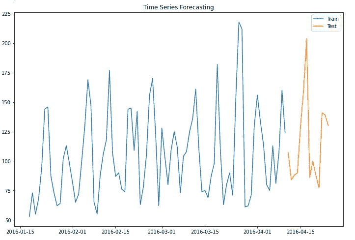
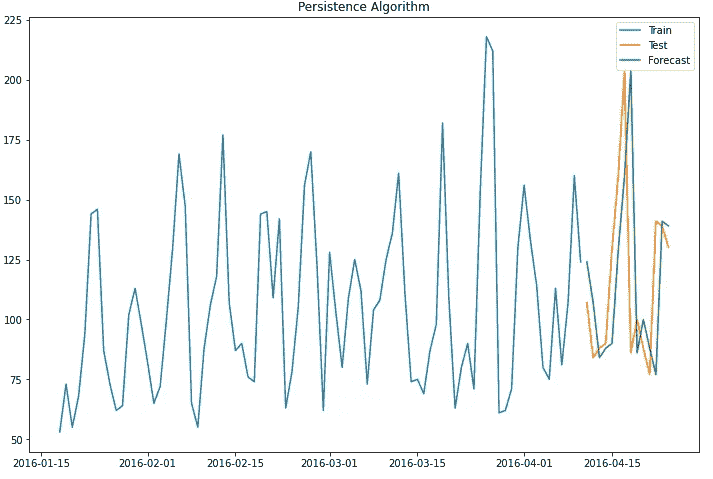
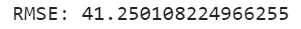
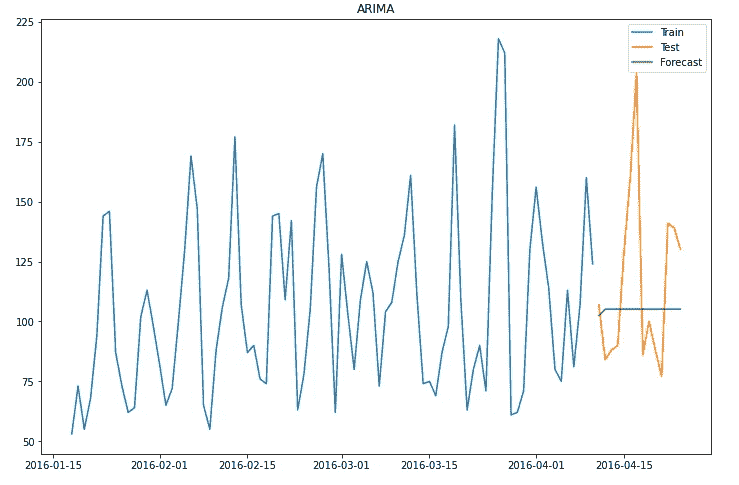
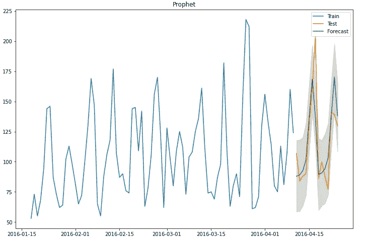

# 任何人都可以建立的 3 个时间序列模型

> 原文：<https://towardsdatascience.com/3-time-series-models-anyone-can-build-e6943b017c41?source=collection_archive---------26----------------------->


艾萨克·史密斯在 [Unsplash](https://unsplash.com?utm_source=medium&utm_medium=referral) 上拍摄的照片

最近接受了预测时间序列数据的挑战，我自学习机器学习以来第一次深入研究时间序列预测的细节。

这是我发现的。

—时间序列预测与通常的机器学习模型完全不同。

您的数据是不同的格式，您的数据清理过程是不同的，并且所使用的模型没有在其他任何地方使用过。似乎时间序列本身就是一种不同的技术。斯坎达的[帖子](/3-facts-about-time-series-forecasting-that-surprise-experienced-machine-learning-practitioners-69c18ee89387)完美地描述了这一现象。

因此，在花了几个小时钻研时间序列之后，我决定写这个简单的指南来帮助你建立你的第一个时间序列模型。

在这篇短文中，我将使用[卡格尔·M5 预测](https://www.kaggle.com/c/m5-forecasting-accuracy)比赛数据。

由于数据由沃尔玛中各种商品的销售数据组成，我将只关注单个商品的销售数据。

```
# Reading various csv into dataframe
sales_train = pd.read_csv("sales_train_validation.csv")
date = pd.read_csv("calendar.csv")# filter to get single item
single = sales_train[sales_train["id"]=="FOODS_3_090_CA_3_validation"].iloc[:,6:].T.reset_index().copy()datetime = date[["date","d"]].copy()single = pd.merge(left=single,right=datetime,left_on="index",right_on="d",how="left")#  Data processing to prepare for modeling
single.drop(["d","index"],axis=1,inplace=True)
single["date"] = pd.to_datetime(single["date"])
single = single.rename({"date":"ds",single.columns[0]:"y"},axis=1)[["ds","y"]]
ts= single.iloc[-98:,:].copy()
```

对于培训和测试分割，我决定使用过去 3 个月(84 天)的数据来预测未来 2 周(14 天)的销售数量。

```
# use past 3 months (84 days) data to forecast the next 2 weeks
duration = 14
train = ts.iloc[:-duration,:].copy()
test = ts.iloc[-duration:,:].copy()
```

绘制数据，

```
# Visualization
plt.figure(figsize=(12,12))
plt.plot(train["ds"],train["y"],label="Train")
plt.plot(test["ds"],test["y"],label="Test")
plt.title("Time Series Forecasting")
plt.legend()
```



现在来建造我们的第一个模型。我要介绍的第一个算法是持久性算法。通过预测下一个时间步长与前一个时间步长的值相同，这种方法是获得时间序列数据基线预测的简便方法。

这意味着 t+1 的值就是 t 的真实值。

用代码实现它，

```
## Persistence algorithm
pred= []
for i in range(duration):
    pred.append(train.iloc[-1,1]) # add test data to train
    train = train.append(test.iloc[i])
```

这就是结果。



看起来很准确吧。但是外表是会骗人的。让我们来计算均方根误差(RMSE)，这是时间序列预测中使用的一个常用指标。

```
from sklearn.metrics import mean_squared_error
rmse =  np.sqrt(mean_squared_error(pred,test["y"]))
print("RMSE:",rmse)
```



41.2 的 RMSE，现在记住这一点，因为这是我们基线模型的误差。

接下来，我们转到时间序列预测的统计方法。ARIMA 是该领域许多从业者使用的一种常见和流行的预测方法。算法的细节不是这里的重点，但是你可以在这个详细的[指南](https://www.machinelearningplus.com/time-series/arima-model-time-series-forecasting-python/)中找到更多关于 ARIMA 的信息。

首先，如果你还没有下载 pmdarima 包，请确保下载到你的机器中。这是 auto-arima 包，我们将使用它来获得模型的最佳参数。

需要注意的另一点是，该包只需要值的一维输入。

```
# Split into train and test set
duration = 14
train = ts.iloc[:-duration,:].copy().set_index("ds")
test = ts.iloc[-duration:,:].copy().set_index("ds")
```

使用自动 arima 建立模型并进行预测。

```
import pmdarima as pmmodel = pm.auto_arima(train,start_p=0,start_q=0,test="adf",max_p=3,max_q=3,error_action="ignore",suppress_warnings=True,seasonal=False)# prediction
pred = model.predict(duration)
```

看剧情…



预测值几乎形成一条直线。然而，如果你计算 RMSE，你会发现你的模型提高了 36.7 的 RMSE。

我们要看的最后一个模型是由脸书的数据科学家团队开发的一个包，名为 [Prophet](https://facebook.github.io/prophet/) 。对于那些对使用的算法感兴趣的人，你可以在这里找到论文[。](https://peerj.com/preprints/3190/)

prophet 模型所需的数据格式非常具体。它需要一个名为‘ds’的日期列和一个名为‘y’的值列，这解释了为什么需要在前面的预处理阶段重命名我们的列。

一旦数据格式正确，您就可以开始训练模型了。

```
from fbprophet import Prophet
model = Prophet()
model.fit(train)
```

预测是通过一个特殊的函数来完成的，这个函数为未来的日期创建数据帧。

```
# Making prediction
future = model.make_future_dataframe(duration,include_history=False)
pred = model.predict(future)
pred = pred[["yhat","yhat_lower","yhat_upper"]]
```



几行代码所能实现的东西非常惊人。这款车型的 RMSE 只有 22.5，比之前的任何一款车型都要好。

这就是你要的，3 个时间序列模型，你可以快速的建立来探索你的数据。

快乐学习！