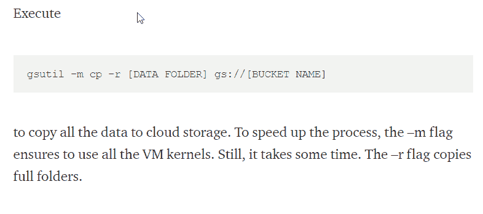

# 从数据科学文章中获取更多信息的 3 个技巧

> 原文：<https://towardsdatascience.com/3-tips-to-get-more-out-of-data-science-articles-9228feee7266?source=collection_archive---------66----------------------->

## 阅读在机器学习中的作用

本·怀特在 [Unsplash](https://unsplash.com?utm_source=medium&utm_medium=referral) 上的照片

数据科学作为计算机科学、统计学和许多其他学科的交叉学科，对学生来说有几个障碍。其中之一就是知识的获取。
除了获得过去几十年的基础知识，数据科学的一个关键挑战是跟上每天发布的最新技术。所以，三点是每一个数据科学家和想成为数据科学家的人必须认真考虑的。

# 1.你不能什么都读

## 首先，你必须承认不可能阅读所有发表在数据科学网站或学术期刊上的文章。

每天都有大量关于数据科学和机器学习的文章发表。由于我们每个人每天只有 24 小时可以支配，我们应该问自己到底如何利用这些时间来最大限度地提高我们的学习进度。最好的办法就是找到符合你目前问题的文章，仔细阅读。偶尔，偶然选择和阅读一篇文章也会有所帮助。这允许你以新的视角，以新的创造性方式解决当前的数据科学问题。
您可能还会发现，使用媒体和数据科学时事通讯来选择您的阅读材料很有帮助。《月刊》和《每日文摘》帮助你追踪 TWDS 的最佳文章。确保您的[时事通讯偏好](https://medium.com/me/settings)和您的[兴趣](https://medium.com/me/following/suggestions)保持最新。

# 2.笔记和草图

## 第二点，对技能和工具的理解应该是机器学习学生的核心。因此，不仅要读一篇文章，而且要做笔记和画提纲。

试着从一篇文章中记录下你的结论。此外，你还应该把你的发现画下来。除了 PC 上的笔记之外，您还可以使用 Medium 的突出显示和注释功能。

# 3.落实！

## 最后，尝试将新获得的能力应用到自己的项目中。

光读书并不能让你成为数据科学家。在您自己的项目中实现并重现本文中描述的功能和过程。通过这种方式，你可以从你阅读的文章中产生可持续的知识，这将对你产生最显著的长期附加值。这也是扩展你的 GitHub 投资组合的一个很好的方式，因此雇主将能够更快地看到你在多大程度上真正处理了数据科学问题。

# 结论

仔细选择你的阅读材料。上面的提示将帮助你选择。此外，尝试将新获得的能力应用到自己的项目中。这是您从阅读数据科学文章中获得最大收益的方式。