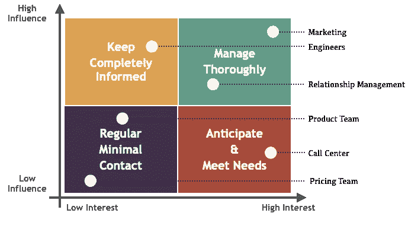
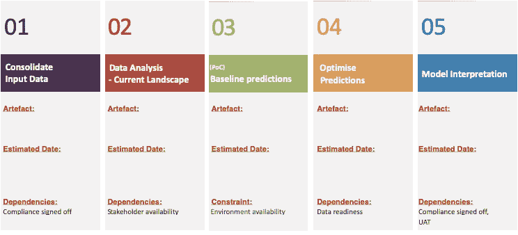

# 你需要保存数据科学项目范围的 3 个技巧

> 原文：<https://towardsdatascience.com/3-tips-you-need-to-save-your-data-science-project-scope-832c38c8fd17?source=collection_archive---------58----------------------->

## 如何以数据科学家的身份与企业交流

## 永远不要花时间去构建一个与最初的提议相去甚远的巨型应用。并为此受到责备。

作为一名数据科学家，你希望得到一份能让你做酷事情的工作——大数据、大机器(或者像成年人一样的云)和深度神经网络。当你意识到你的模型、你的项目经理的时间表和你的利益相关者的期望之间的不匹配时，现实很快就来了。

您的项目离最初的范围越来越远，而您离完成还有很长的路要走。演示是在星期二，你眼睛流泪，手心冒汗。

照片由[**agrêBarros**](https://unsplash.com/@agebarros)**上[Unsplash](https://unsplash.com/photos/qgA-K7Ky2fM) 。作者通过 AdobeSpark 添加的引文。**

> **“那不在要求里！”—几乎每个开发人员**

**之前，我写过关于[与业务利益相关者一起定义数据科学范围](/tips-on-defining-a-data-science-project-scope-with-business-baa5a5b652b7)的重要性。通过引导企业从他们认为他们需要的到他们真正想要的，它可以省去很多麻烦。不幸的是，有一个明确的目标是不够的。业务需求一直在变化，昨天重要的事情不是今天紧迫的事情。谁知道明天会怎样？**

**这篇文章旨在讨论 3 个技巧(还有一个额外的！)来管理不断变化的数据科学项目范围。为了说明这一点，让我们从一个非常熟悉的例子开始。**

# ****建立一个客户流失模型，他们说****

**作为一个连续场景，让我们假设你公司新产品的保留率很低。你的老板比尔让你建立一个客户流失模型，找出是谁取消了他们的订阅。您花了一周时间收集需求，又花了两周时间清理数据，现在您终于准备好开始工作了。**

**直到。**

## **范围蔓延:让我们包括一些新的数据源…**

**老板比尔认为社交媒体在预测客户行为方面至关重要。这可能是真的，这是可以做到的，但你的时间表没有改变，你没有得到更多的报酬。**

****

**范围蔓延示例。由作者创建。**

**对你来说不幸的是，比尔说你项目的部分预算来自用户参与团队。如果他们的数据没有被使用，这是一种侮辱。所以现在你必须这么做。哦，等等，我有没有提到数据是如此稀少，无论如何都很可能会被丢弃。**

**然后。**

## **范围变化:让我们完全改变我们的假设…**

**有时，当这些“额外的特性”在项目中表现得太深入时，它就变成了一个范围变更。例如，夜间运行的批处理过程与实时预测有着根本不同的架构。**

****

**范围变更示例。由作者创建。**

**让我们在这里暂停一下，回想一下这是什么时候发生在你身上的。看看下面三个与范围蔓延或范围变更相关的选项。如果你能回到过去选一个，你会怎么做？**

****

**这里(或永远)没有正确或错误的答案，考虑到时间表和预算的灵活性，这些都是可以采用的好方法。与其试图重新定义或盲目地完成改变，我建议的是**问更多的问题**。**

**范围变更问题发生在我们当中最优秀的人身上。尽管不是所有的范围变化都是不好的(有些是有害的)，但是它们确实给我们带来了不必要的压力。让我们深入探讨一下有望挽救你一些白发的建议。**

# **技巧 1:知道谁是你的项目干系人**

**一旦我们得到了一个明确的项目纲要，我们当中的问题解决者就很自然地投入到开发模式中。这些是我们通常采取的步骤:**

****1⃣** 与拥有我们所需数据的团队对话**

****2⃣** 火车模型**

****3⃣** 与将帮助我们部署模式的团队交谈(比如数据工程和基础设施团队，如果你还没有足够幸运与他们一起工作的话)**

**酷，但是这里出了什么问题？**

**看看下面复杂的组织结构。大多数数据科学项目在组织内都有多个接触点。需要管理的不同数据源，由具有不同需求的部门提供的联合预算，以及具有我们需要的洞察力的支持业务职能。**

****

**简单机器学习模型的复杂组织接触点。由作者创建。**

**如果没有牢牢抓住众多的利益相关者，你就会意识到…**

**❌:你的生命周期价值计算是不正确的，因为你不知道定价团队给了在正式发布前注册的客户折扣。**

**❌:你创建的产品满意度指数是 NPS 的一个糟糕的代理，因为你不知道产品团队在把它传递给关系管理团队之前会多次转换它。**

**❌:最重要的是，你没有搞清楚**谁是你的型号**的用户。一线呼叫中心员工需要在短时间内访问预测。或许，他们也不太在乎精度，想优化召回。**

> **通常，范围的改变是由于在开始时没有涉及正确的涉众。**

**如果我们知道关系管理团队为项目提供资金，我们会包括他们关心的指标——无论是 NPS 还是转发次数。如果我们知道呼叫中心的员工是我们的用户，我们会包括一个强大的模型解释器，这样他们就可以在客户放下电话说“不，我不需要新的手机合同，这是本周第三次了”之前优化电话的前 3 秒钟。**

**所有这些涉众都有需求，随着时间的推移，这些需求会逐渐融入到项目中。在项目早期绘制出[利益相关者矩阵](https://www.mindtools.com/pages/article/newPPM_07.htm)是在整个项目生命周期中管理他们的好方法。**

****

**项目利益相关者矩阵示例(利益相关者的位置因项目而异)。由作者创建。**

**有很多关于利益相关者分析的好材料，但是要点是:**

## **不要寻求让每个人都满意。**

> **根据这些风险承担者对项目成功的重要性对变更请求的类型进行分类。**

**否则，你将会耗尽时间和预算。**

# **提示 2:使用非常具体的句子来传达问题陈述**

**一个项目通常有多个接触点，功能请求可能会飞来。你需要通过创造**一个非常具体的句子来记住你项目的目标。****

> **使用一个非常具体的句子来记住目标和包含的范围**

**每次收到请求时，你可以很快决定它是否与你想要达到的目标一致。**

**例如，你可以有一个模糊的句子说:**

****

**含糊不清且不具体的问题陈述示例**

**然而，**客户保持**是一个宽泛的说法。主动取消是唯一的客户流失类型，还是套餐降级和过期订阅也包括在内？我们的目标仅仅是合同客户，还是我们更关心高价值或高影响力的客户？**

**以下三个句子是提炼问题陈述的更好例子:**

****

**精炼的问题陈述示例**

**这有助于将句子分成四部分:**

**🔍**识别/洞察**:是有人监督还是无人监督的问题？是分类问题还是回归问题？**

**❓ **我们试图优化的指标是什么:主动取消的数量，或呼出电话的转换率？****

**🙋‍♀:我们的目标客户是谁:所有合同客户还是有资格升级的高价值客户？**

**🕰 **应该在什么时候**进行预测:当客户打电话进来时，是否需要快速的预测时间，或者是否可以是一个每夜批处理的过程来创建第二天的呼出电话列表？**

**如果你不能缩小你的句子，那么你很可能需要把你的项目分成几个阶段。对于流失模型，您可以从识别客户群开始，并将结果用作主动取消模型的输入特征。**

# **技巧 3:定义明确的成功标准**

**在模型培训期间，许多想法被抛出，并由多个团队成员进行测试。度量越简单，我们就越容易快速确定我们的努力是否朝着正确的方向前进。**

**我们的大脑更容易理解 F1 的分数，而不是试图平衡精确性和回忆性。不比较区域 A 和区域 B 之间的 F1 分数，更容易理解两个区域之间的加权 F1 分数。**

> **一个精心选择的度量标准可以确保你不会乱搞和调优不必要的东西**

**看到 0.1%的精度收益很有趣，但投入往往不实际。**

**有时，当您有多个度量标准(比如说 *n 个*度量标准)无法组合时，您应该[选择 *n-1 个满意度量标准和仅仅 1 个优化度量标准*](/how-to-improve-my-ml-algorithm-lessons-from-andrew-ngs-experience-i-551ca1a32634) *:***

**👍**满意度度量:**足够好的度量。通常有一个阈值，如模型大小小于 5MB 或运行时间小于 1 秒。**

**🚀**优化指标:**最小化或最大化的指标。通常没有界限，比如我能得到的最高精度(理论上是 100%，但你明白我的意思)。**

**只有一个优化指标是比较多个实验的关键。如果我们使用上面的例子:**

****

**👍**满意度指标**:评分速度低于 2 秒。这使得呼叫中心代理能够根据客户流失的可能性，快速决定是否要为该客户提供更好的交易。**

**🚀**优化指标:**预测取消的 F1 分数。需要一个平衡的观点，所以我们要确保为可能流失的客户提供好的交易，但不要给那些可能不会流失的客户太多好的交易。**

> **吴恩达在他的书《机器学习的渴望》中讨论了选择单一指标的想法。我鼓励数据专业的每一个人去读这本书。他还在 Coursera 上发布了关于这个主题的[结构化机器学习项目课程](https://www.coursera.org/learn/machine-learning-projects)(以及更多)。**

# **好处:使用路线图来跟踪和展示进展**

**项目一直在运行，没什么大不了的。重要的是当你告诉你的利益相关者你还没有完成，在你应该完成的那天。企业想要的只是知道你有一个计划——并且你在积极地跟踪它。**

****

**安迪·比厄斯在 [Unsplash](https://unsplash.com/photos/BjcGdM-mjL0) 上的照片。**

> **“除非做出承诺，否则只有承诺和希望；但是没有计划。”~彼得·德鲁克**

**除了传统的软件项目之外，数据科学项目[还面临着许多挑战](https://www.oreilly.com/radar/what-you-need-to-know-about-product-management-for-ai):不确定的结果、准确性或相关性的不确定性、不透明性、公平性问题。这些使得 AI 很难被决策者和上层管理人员接受。**

**我们总是回避给出数据科学项目的时间表，这是可以理解的。但是这产生了两个问题:**

*   **缺乏透明度使商业变得非常可怕，所以他们对你的一举一动都进行微观管理。**
*   **比起交付商业价值，你太容易陷入研究一些无关紧要的新技术了。**

## **制定一个路线图，让你和你所依赖的每个人都负起责任。**

****

**路线图示例。由作者创建。**

**路线图至少需要包括以下 4 项:**

****1⃣你要做什么:**你要做的实际任务，比如评估环境准备情况，整合输入数据，或者创建基线模型。这些应该是小的冲刺阶段(比如 2-6 周)，所以如果超过了，很容易增加风险。**

****2⃣他们能得到什么:**并不是你做的每件事都能直接转化为企业可以利用的成果，但重要的是要努力让你的任务适合他们可以消费的东西。例如，在整合输入数据后，可以很容易地组合一个快速幻灯片或仪表板来传达您的结果。企业可以玩仪表板，询问结果，甚至可能帮助您创建一两个功能。**

**3⃣他们什么时候能得到它:给出任务完成的估计日期。想象一下，你登上一架飞机，飞行员告诉你他不确定你什么时候能到达目的地——可变风速等等。承诺一个你认为合理的日期，并尽早提出问题以控制期望。**

****4⃣保护以防出错:**在大型项目中，每个人都必须一起工作，向利益相关者强调这种依赖性是很重要的。要么他们可以帮你追着团队给你你需要的数据，要么他们让你再有一周的时间完成。**

**最后…**

# **不要害怕寻求帮助。**

**除非你问，否则你永远不知道他们会说什么。令我惊讶的是，当我向一位前客户解释说他可以更快地得到他需要的结果时，他决定雇用另外两个资源。**

**如果你喜欢这篇文章，我以前也在这方面发表过类似的文章:**

*   **[定义数据科学项目业务范围的 3 个技巧](/tips-on-defining-a-data-science-project-scope-with-business-baa5a5b652b7)**
*   **[超越平凡——数据科学阅读榜](/to-rising-above-the-ordinary-a-data-science-reading-list-4548c363fb9)**

****感谢阅读** ⭐在[中](https://medium.com/@mereldawu)、 [LinkedIn](https://www.linkedin.com/in/mereldawu/) 上关注我，或访问我的[网站](https://merelda.com/)。此外，如果您想要对您的机器学习部署框架进行评估，请通过电子邮件[向我们发送位于 Melio Consulting 的](http://info@melio.co.za/)。**