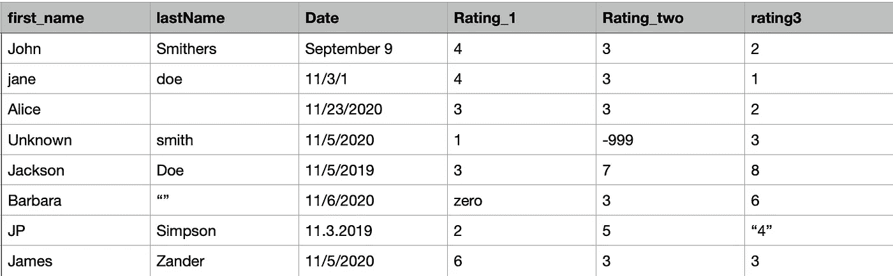

# 3 种类型的数据科学工程师面试问题

> 原文：<https://towardsdatascience.com/3-types-of-data-science-engineer-interview-questions-1b612676d049?source=collection_archive---------38----------------------->

## 自信地完成数据科学工程师面试

照片来自[猎人在](https://unsplash.com/@huntersrace) [Unsplash](https://unsplash.com/) 上比赛

我的背景主要是软件工程和数据科学。当我开始寻找数据科学方面的工作时，面试官注意到了我在软件方面的经验。许多受访者没有软件背景，但来自数学、物理或信号处理领域。在我的采访中，我经常在三个主要领域看到问题:数据接收和清理、可伸缩性和研发。

# 1.数据接收和清理

数据接收和清理是任何数据科学工作中的两个基本主题。在数据科学领域工作时，你会非常关注你称之为基础事实的数据源，你如何吸收这些数据源，然后你用什么方法来清理数据。

## 数据摄取

数据摄取可以有多种形式，根据您所工作的团队，问题可能会有很大的不同。假设你想成为一名数据工程师。在这种情况下，您将需要良好的数据库概念基础知识，并回答关于如何与新数据库交互或开发新数据库的更有针对性的问题。您可能会遇到的问题类型包括:

*   **数据体验** —解释你处理过的数据类型以及你是如何存储这些数据的？比如你用过多少图像数据？你是如何存储和使用这些图像的？面试官想了解你对哪种类型的数据有经验。
*   数据量 —这是一个常见的问题:你处理过的数据量有多大？面试官想知道你是否处理过大型数据集，特别是如果职位描述中提到处理大数据。
*   **大数据摄取** —您能对大型数据集执行 ETL 吗？在执行 ETL 时，您使用过哪些工具和技术？
*   **数据库类型** —不同数据库类型之间的主要区别是什么，比如 NoSQL 与 SQL 数据库？您何时会使用每种类型的数据库？
*   **合并** —你会如何合并两个数据集？
*   **联接**—SQL 中有哪些不同种类的联接，在什么情况下会使用每种联接？

在任何问题中，一定要大声说出解决方案。解释你到目前为止的经历，并诚实地说出你所不知道的。

## 数据清理

在我做过的每一次采访中，数据清理并不是一个被提及的话题，但是在某些情况下，它是被提及的。所以，我相信准备这些类型的问题是有好处的。最值得注意的一个案例是，采访者在白板上展示了一个微小的数据集。

以样本假数据集为例—图片来自作者。

查看一个数据集，如上所示，面试官问—“***你如何清理这个数据集的每一列？*** “这项任务的目标是讨论你在数据集中看到的问题，以及你将如何处理每个案例。当你审视这样一个问题时，请考虑:

*   **列名** —它们是否一致，如果不一致，如何创建兼容的模式？
*   **字符串列**——哪些价值观让你印象深刻？你如何清除这些价值，为什么？如果缺少值，您会如何处理这些数据？
*   **日期** —是否使用了一致的日期格式？如果不是，你应该使用什么格式，为什么？如果日期不完整或错误会怎样？
*   **数字**——你觉得哪些值应该删除或清理？如果数据缺失，您会估算缺失点还是将其留空？

当你在做这样的例子时，试着一栏一栏地讲述你的决定。解释您将经历的清理数据的过程以及您根据您的信息做出的任何假设。如果你没有 100%的把握，可以提问。如果您不知道他们想对缺少信息的列或行做什么，您可以推荐一些您可以考虑的想法，并询问他们的想法。这种类型的问题是衡量你将如何处理数据清理问题的一种方式。我发现这是我在面试时收到的最难忘的问题之一，因为它引出了一些非常吸引人的对话。

***在这样的例子中，您会考虑数据清理的其他哪些方面？***

# 2.可量测性

从摄取和清理开始，另一个常见的问题是可伸缩性。采访者希望了解两件事，(1)您如何利用他们当前的流程和规模分析来运行大数据，以及(2)您如何将代码带入生产状态。

*   **并行化** —您需要了解如何并行化大量数据，以快速生成分析结果和可视化。我经常看到的一个焦点领域是如何将处理和重现结果的速度提高 10 倍？
*   **软件开发流程** —根据访谈情况，编码和开发可能不会关注讨论。假设你作为一名软件开发人员加入了一个数据科学团队。在这种情况下，对话可能包括如何生产代码、开发更严格的流程以及引入 CI/CD 管道。能够谈论你在这方面的技能，并解释它们如何为团队提供价值。解释这些类型的过程和开发实践可以做些什么来确保一个更健壮的分析集。
*   **自动化** —如何自动化流程以加快分析速度？我们如何以 10 倍的速度重现结果？当讨论团队已经在工作的方法以及他们将如何利用你的软件技能来扩展过程时，自动化通常会在访谈中出现。

如果您来自软件背景，可伸缩性和自动化是讨论的基本话题。软件工程师拥有开发生产代码、使用 CI/CD 管道和自动化流程的经验。让你的技能在这里大放异彩，并解释它们如何对数据科学团队有价值。

# 3.研究与开发

最后一个面试领域更宽泛，因为它将研发作为一个整体来看待。在与数据科学团队的许多工作面试中，您将浏览您所从事的项目和您所做的分析。

*   **关键成就**——知道你在简历、求职信、LinkedIn 或申请中做了哪些研究工作。只在你的简历上写你知道你能说好的内容。你想在这里展示你最好的作品，与面试官一起讨论。
*   **合作** —了解你在研究项目中的角色，并解释你是如何与他人合作完成这项工作的。这个项目的总体成果是什么？这项工作完成后，流程是如何改进的？
*   **万无一失** —研发的另一个方面是，并非每个项目都能带来生产就绪的解决方案。学会识别运行不佳的实例，并能够快速排除故障。在面试中解释这一点有助于面试官理解你的项目管理和批判性思维技能。他们希望看到你能在这种环境下工作。

数据科学就是研究和开发新的流程和方法来推动商业价值。了解如何在 R&D 团队中工作以推动有价值的行动将非常有帮助。

# 最后的想法

数据科学面试因公司而异，但一些常见的问题是数据接收和清理、可扩展性以及研发。面试你的团队想知道你能处理各种数据源，并有效地清理数据以用于分析。他们想知道您是否以及如何扩展他们的流程，并使用大数据和自动化流程。最后，他们希望看到你能在快节奏的研究环境中发挥作用。

***你们在面试中讨论过哪些常见的问题或领域？***

如果你想阅读更多，看看我下面的其他文章吧！

 [## 每位数据科学家的 8 大技能

### 当我参加大学讲座时，最常被问到的问题是“我需要具备什么技能？”

towardsdatascience.com](/top-8-skills-for-every-data-scientist-79e6b1faf3e1)  [## 每个数据科学家都应该阅读的 3 本编程书籍

### 用 Python 掌握数据科学的编程和架构

towardsdatascience.com](/3-programming-books-every-data-scientist-should-read-badbb7a64c4a)  [## 创建用于熊猫分组的自定义聚合

### Pandas groupby 是一个函数，您可以在数据帧上使用它来分割对象、应用函数以及组合…

towardsdatascience.com](/creating-custom-aggregations-to-use-with-pandas-groupby-e3f5ef8cb43e)  [## 数据可视化的前 3 篇文章

### 如果您想更好地构建数据可视化，这些文章很有帮助。

towardsdatascience.com](/top-3-articles-for-data-visualization-956a08a54b04)  [## 不要太骄傲而不愿寻求帮助

### 如果你被一个 bug 卡住了或者感到不知所措，你可以寻求你需要的帮助。

towardsdatascience.com](/dont-be-too-proud-to-ask-for-help-76f21d16f318)  [## 理解分析开发生命周期

### 将您的分析从摇篮带到坟墓。

towardsdatascience.com](/understanding-the-analytic-development-lifecycle-2d1c9cd5692e)