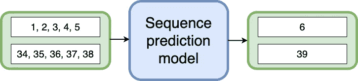
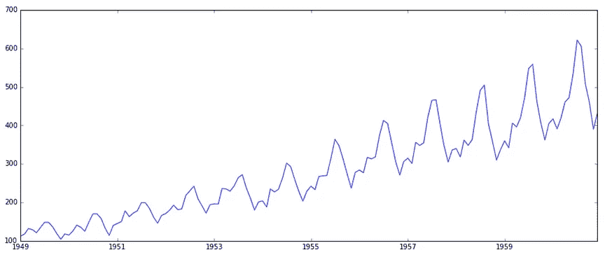
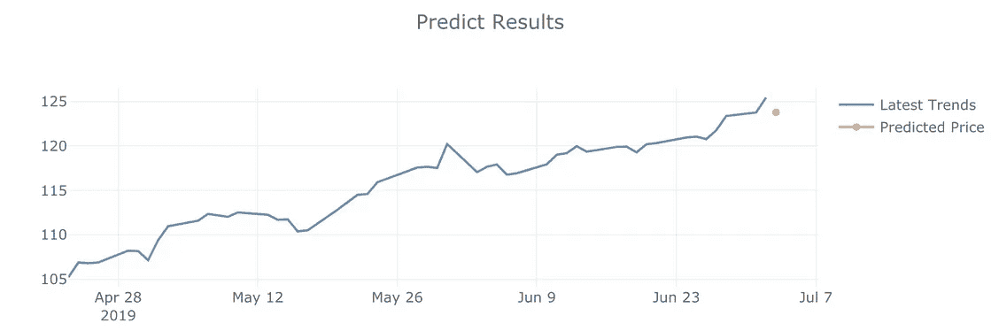
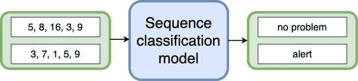
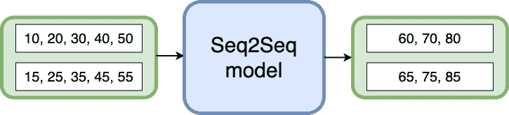
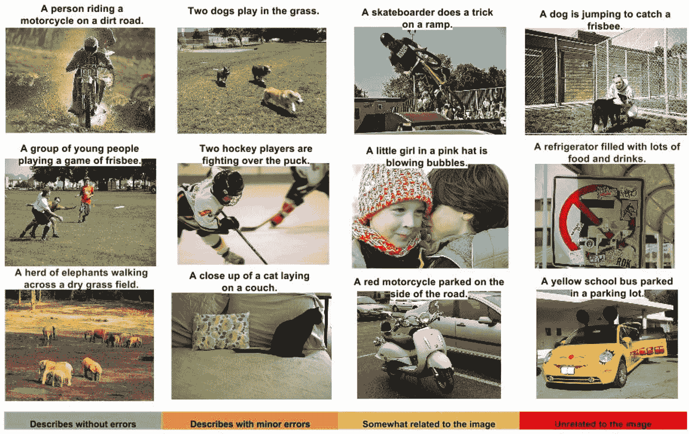
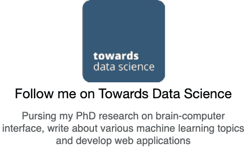

# 3 种类型的序列预测问题

> 原文：<https://towardsdatascience.com/3-types-of-sequence-prediction-problems-97f22e946318?source=collection_archive---------21----------------------->

## 在实现序列预测模型之前了解您的问题。

[ [来源](https://pixabay.com/photos/flight-seagull-sequence-bird-1179587/)

序列预测是一种流行的机器学习任务，它包括基于先前观察到的符号序列来预测下一个符号。这些符号可以是一个数字、一个字母、一个单词、一个事件或一个对象，如网页或产品。例如:

*   文本中的一系列单词或字符
*   客户购买的一系列产品
*   在日志上观察到的一系列事件

序列预测不同于其他类型的监督学习问题，因为它要求在训练模型和进行预测时必须保持数据的顺序。

序列预测是一个常见的问题，在现实生活中发现各种行业的应用。在本文中，我将向您介绍三种类型的序列预测问题:

☝Predicting 下一个值
✌️Predicting 一个类标签
👌预测序列

# ☝Predicting 的下一个价值

在许多应用中，猜测序列的下一个元素是一个重要的问题。序列预测模型学习识别顺序输入数据中的模式并预测下一个值。

## 时间序列预测

时间序列是指有序的数据序列，其中观察序列在时间维度上是连续的。时间序列预测是对序列中接下来发生的事情进行预测。因此，时间序列预测包括根据历史数据训练模型，并使用它们来预测未来的观察结果。

但是时间序列预测和回归问题有什么不同呢？有两件事:

*   时间序列是时间相关的，是按时间排序的。但是回归可以应用于无序数据，其中目标变量依赖于特征所取的值。
*   时间序列寻找季节性趋势。例如，一天中的电力需求在夜间会下降，而在夏季，航空乘客的数量会增加。

左图:历年[航空旅客数量](https://www.kaggle.com/chirag19/air-passengers)。右图:[预测次日微软股价](https://jinglescode.github.io/datascience/2019/05/17/time-series-forecasting-with-tensorflow-js/)。

你可以尝试在[航空乘客数据集](https://www.kaggle.com/chirag19/air-passengers)上用 LSTM 或 ARIMA 建立你的时间序列预测模型，或者试试这个 [TensorFlow.js 演示](https://jinglescode.github.io/datascience/2019/05/17/time-series-forecasting-with-tensorflow-js/)。

## 网页/产品推荐

你有没有搜索过什么东西，接下来看到的每一个广告都和你搜索的内容有关？

例如，在看完电影《复仇者联盟 4：终局之战》后，我在寻找某些场景的解释。从那时起， [Google Discover Feed](https://www.blog.google/products/search/introducing-google-discover/) 开始向我展示围绕漫威电影宇宙的内容，甚至直到今天。

[谷歌发现提要](https://www.blog.google/products/search/introducing-google-discover/)

尽管看起来 Google Discover Feed 是在推荐一组网页，但每个网页都是一个单独的输出。

同样，我们可以将这个想法应用于产品推荐。如果我们用所有过去的交易训练一个顺序预测模型，我们也许能够预测客户的下一次购买。

# ✌️Predicting a 级标签

序列分类使用带有一些序列输入和类别标签作为输出的标记数据集来训练分类模型，该分类模型可用于预测未知序列的类别标签。

## 序列分类应用的一些例子:

**文本分类**。给用自然语言写的文档分配标签有许多现实世界的应用，包括[情感分类](https://www.aclweb.org/anthology/D16-1058.pdf)和[主题分类](https://arxiv.org/pdf/1602.02373.pdf)。

**异常检测**。研究人员探索[在 4 个不同的时间序列数据集中检测异常行为](https://www.elen.ucl.ac.be/Proceedings/esann/esannpdf/es2015-56.pdf)，1)心电图，2)航天飞机马洛塔阀门，3)电力需求和发动机传感器数据集。

**基因组研究**。研究人员一直在对蛋白质序列进行分类。这项工作可能有助于发现广泛的蛋白质功能。

健康信息学。研究人员使用 LSTM 将心电图信号分为五个不同的类别，以识别患者的心脏状况。这允许端到端学习，在没有任何专家干预的情况下提取与 ECG 信号相关的特征。

**脑机接口**。我们[从脑电图](https://jinglescode.github.io/datascience/2020/02/24/control-exoskeleton-with-your-brain/)中提取大脑信号，解码用户操作辅助设备的意图。

# 👌预测序列

序列到序列学习(Seq2Seq)是关于训练模型来转换一个输入序列并输出另一个序列。像所有的监督学习一样，Seq2Seq 模型是用对的数据集训练的，但是输入序列和输出序列可以有不同的长度。

该模型由两个 LSTMs 组成；一个将充当编码器，它编码输入序列并产生内部状态表示。这些表示对输入序列的“含义”进行编码，并作为解码器的输入，解码器负责生成目标序列。实际上，Seq2Seq 模型的训练是通过“强迫”解码器生成完美序列并因生成错误序列而惩罚它来完成的。

## 机器翻译

“有一只白猫”，翻译过来就是“一只白猫”Seq2Seq 模型将我们从序列长度和顺序中解放出来，这使它成为语言翻译的理想选择。在神经机器翻译之前，机器翻译是基于规则的，专注于逐字关系，使用上下文无关语法。

2013 年， [Sutskever 等人](https://arxiv.org/abs/1409.3215)推出了用于机器翻译的 Seq2Seq 架构，而 [Cho 等人](https://arxiv.xn--org%20%20cs-4t3f/)提出了编码器和解码器架构。在过去的几年里，这方面的发展非常活跃。当前为[谷歌翻译](https://translate.google.com/)实现的最先进的机器翻译是基于[注意力](https://www.tensorflow.org/tutorials/text/nmt_with_attention)和[转换](https://arxiv.org/abs/1706.03762)的。

## 图像字幕生成

根据图像中观察到的内容自动生成自然语言描述吸引了许多人工智能领域的研究人员。这是具有挑战性的，因为它结合了计算机视觉和自然语言处理的知识，涉及到物体检测以推断图像中的物体和物体的关系，并学习语法以生成文本描述。

[Vinyals 等人](https://arxiv.org/pdf/1411.4555.pdf)介绍了一种端到端的神经网络，由视觉卷积神经网络和随后的语言生成递归神经网络组成。

[展示和讲述:一个神经图像字幕生成器](https://arxiv.org/pdf/1411.4555.pdf)

在这个模型中，编码器是一个卷积神经网络，用于提取图像中的特征。解码器是一个递归神经网络，主要用于生成文本描述。与机器翻译类似，当前的技术水平使用注意机制，其中网络注意输入的部分，并将有限的信息处理资源分配给那些重要的部分。

