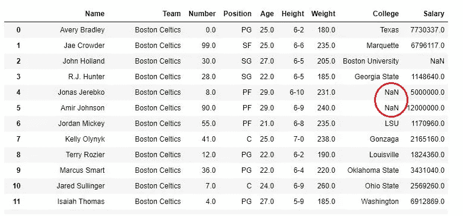

# 3 个被低估的应对缺失价值观的策略

> 原文：<https://towardsdatascience.com/3-underrated-strategies-to-deal-with-missing-values-a539fb6c0690?source=collection_archive---------15----------------------->

## 实施、理解和学习如何使用 3 种强大的方法(包括深度学习)来估算数据。


照片由[像素](https://www.pexels.com/photo/black-and-white-blank-challenge-connect-262488/?utm_content=attributionCopyText&utm_medium=referral&utm_source=pexels)上的 [Pixabay](https://www.pexels.com/@pixabay?utm_content=attributionCopyText&utm_medium=referral&utm_source=pexels) 拍摄

我相信每个数据科学家/ ML 从业者都面临过数据集中缺失值的挑战。这是一个常见的数据清理过程，但坦率地说，是一个非常容易被忽视的过程。但是，有效的缺失值策略会对模型的性能产生重大影响。

# 出现缺失值的原因

缺失值出现的原因通常是特定于问题域的。但是，大多数情况下，它们发生在以下场景中:

*   **代码错误**:数据收集方法遇到了一个错误，一些值没有被正确获取(例如，如果您要通过 *REST API* 收集数据，并且您可能没有正确解析响应，那么值将会丢失。)
*   **不可用**:对于给定的观察，没有足够的数据可用(例如，如果有一个名为“学院”的特征，但是该观察(人/运动员等)没有上过学院，那么显然该值将为空。)
*   **故意 NaN 插补:**这可能发生在 Kaggle 等编码竞赛中，其中部分挑战是处理缺失值。



照片由 [GeeksForGeeks](https://www.geeksforgeeks.org/python-pandas-dataframe-fillna-to-replace-null-values-in-dataframe/)

> 您应该处理缺失值的原因是因为**许多** ML 算法需要数字输入值，并且不能对缺失值进行操作，因此如果您尝试运行缺失值的算法，它将会响应一个错误(scikit-learn)。**然而**，一些算法，如 XGBoost，将基于训练损失减少来估算值。

# **缺失值的处理方法:**

有两种方法可以用来处理丢失的值:

*   **插补**:使用某种方法填充数据
*   **删除**:删除缺失值的行

虽然没有真正的"**最佳**"选项，但是*通常* *估算数据比删除数据更好*，因为不这样做可能会导致大量信息丢失，以及更有可能对数据进行欠填充的模型。

**然而**，请注意，有时删除行可能是更好的选择，因为它创建了一个更健壮的模型，并且可以加速训练。

好吧，我知道你可能很想得到深度学习法(我知道，太神奇了！).所以，事不宜迟，让我们来了解一下技术！

# 策略 1: KNNImputer


图片来自[维基百科](https://medium.com/feedium/does-top-writer-status-on-medium-actually-mean-anything-2edb0041a4a8)

这种方法基本上使用 KNN，一种机器学习算法，来估算缺失值，每个值是在样本附近找到的 **n_neighbors** 个样本的平均值。

如果你不知道 KNN 是如何工作的，你可以看看我关于它的文章。但本质上，KNNImputer 将执行以下操作:

1.  测量新样本和第 **N** 个最近样本之间的距离(由**N _ neighbors**参数指定)

*   基于其最近的邻居，它将把第 **N** 个最近的非空邻居的平均值作为缺失值。

## KNNImputer 在行动

让我们看一个使用 KNNImputer 的简单例子:

```
import pandas as pd
import numpy as np
from sklearn.impute import KNNImputerdf = pd.read_csv('[https://raw.githubusercontent.com/datasciencedojo/datasets/master/titanic.csv'](https://raw.githubusercontent.com/datasciencedojo/datasets/master/titanic.csv'))
```

我们将使用著名的泰坦尼克号数据集作为我们的示例数据集。

接下来，我们检查哪些要素缺少值:

```
df.isnull().sum()OUT:
passengerId      0
Survived         0
Pclass           0
Name             0
Sex              0
Age            177
SibSp            0
Parch            0
Ticket           0
Fare             0
Cabin          687
Embarked         2
dtype: int64
```

使用这种方法，我们可以看到哪些值需要估算。

```
df = df.drop(['PassengerId','Name'],axis=1)
df = df[["Survived", "Pclass", "Sex", "SibSp", "Parch", "Fare", "Age"]]df["Sex"] = [1 if x=="male" else 0 for x in df["Sex"]]
```

在这里，我们删除了一些不需要的特征，并快速地对我们的性特征进行一次性编码。

> 注意:通常人们会做一些特性工程和转换，但这不是本文的目的，因此我跳过这一部分。然而，在一个正常的项目中，您应该总是正确地检查和清理您的数据。

接下来，我们实例化我们的 KNNImputer，并给它一个 n _ neighbours 值 5。

```
imputer = KNNImputer(n_neighbors=5)
imputer.fit(df)
```

现在剩下要做的就是转换数据，以便估算值:

```
imputer.transform(df)
```

这就是你要的。KNNImputer。scikit-learn 再次使这个过程变得非常简单和直观，但是我建议在 Github 上查看这个算法的代码，以便更好地理解 KNNImputer 真正做了什么。

## KNNImputer 的优点:

*   可能比平均值、中间值或众数更准确(取决于数据集)。

## KNNImputer 的缺点:

*   计算开销很大，因为它存储在内存中的整个数据集中。
*   对异常值非常敏感，因此估算值可能会导致模型无法尽可能好地运行。
*   您必须指定邻居的数量

# 策略 2:通过链式方程进行多重插补(小鼠)


照片可以从[栈中找到](https://stackoverflow.com/questions/50351736/mice-number-of-multiply-imputed-data-sets)

这是一种非常强大的算法，其基本工作原理是选择一个具有缺失值的要素作为目标变量，并利用回归模型根据数据集中的所有其他变量来估算缺失值。

然后，它以循环方式重复这一过程，这意味着将针对所有其他要素回归每个缺失值的要素。

有点迷惑？没错。这就是为什么它的…类比时间！

# 用类比的方法理解老鼠


由[邦妮·凯特](https://unsplash.com/@bonniekdesign?utm_source=unsplash&utm_medium=referral&utm_content=creditCopyText)在 [Unsplash](https://unsplash.com/s/photos/mice?utm_source=unsplash&utm_medium=referral&utm_content=creditCopyText) 上拍摄

假设您的数据集具有以下特征:

*   年龄
*   性别
*   身体质量指数
*   收入

而每个特征，*除了*性别，都有缺失值。在这个场景中，**鼠标**算法将执行以下操作:

1.  对于每个缺少值的特性(年龄、身体质量指数、收入)，您用一些临时的“占位符”来填充这些值。这通常是要素中所有值的平均值，因此，在这种情况下，我们将使用数据的平均年龄填充缺失的年龄，使用身体质量指数的平均值填充缺失的身体质量指数，等等。
2.  返回到缺少一个要估算的要素。因此，如果我们选择估算年龄，那么年龄将是一个缺少值的要素，正如我们在上一步中估算其他要素一样。
3.  回归所有(或部分)要素的年龄。为了使这一步起作用，删除 age 可能包含的所有 NaN 值。本质上我们是在拟合线性回归，年龄是目标特征，其他特征是独立特征。
4.  使用之前拟合的回归模型来预测缺少的年龄值。(**重要提示:**当年龄稍后被用作独立变量来预测其他特征的缺失值时，观察值和预测值都将被使用)。随机成分也被添加到该预测中。
5.  对所有缺失数据的要素(在本例中为身体质量指数和收入)重复步骤 2-4

当**鼠标**算法完成了从 1 到 5 的所有步骤时，这就是所谓的**循环。**通常，鼠标需要用户浏览数据 5-10 次左右。

一旦我们到了最后一个周期，我们输出一个估算数据集。通常，我们希望在数据集的 5 个副本上运行该算法，然后将**池**我们的结果放在一起。完成此操作后，我们可以分析结果并报告综合结果。

## 老鼠在行动

虽然这些步骤可能看起来漫长而困难，但多亏了我们的朋友 scikit-learn，实现 mice 就像做馅饼一样简单:

```
import numpy as np 
import pandas as pd
from sklearn.experimental import enable_iterative_imputer
from sklearn.impute import IterativeImputerdf = pd.read_csv('[https://raw.githubusercontent.com/datasciencedojo/datasets/master/titanic.csv'](https://raw.githubusercontent.com/datasciencedojo/datasets/master/titanic.csv'))df = df.drop(['PassengerId','Name'],axis=1)
df = df[["Survived", "Pclass", "Sex", "SibSp", "Parch", "Fare", "Age"]]df["Sex"] = [1 if x=="male" else 0 for x in df["Sex"]]
```

**注意**:确保在导入迭代估算器之前导入*enable _ iterative _ inputr*函数，因为该特性被归类为实验性的，否则将导致导入错误。

现在让我们调用实例化 IterativeImputer 类:

```
imputer = IterativeImputer(imputation_order='ascending',max_iter=10,random_state=42,n_nearest_features=None)
```

这里需要注意一些事情:

**max_iter** :返回插补数据集之前要进行插补的周期数

**插补 _ 顺序:**特征插补的顺序。

可能的值:

***升序***
从缺失值最少的特征到最多的特征。
***降序***
从缺失值最多的特征到最少的特征。
***罗马***
从左到右。
***阿拉伯文***
从右向左。
***随机***
每轮随机下单。

**n_nearest_features** :用于估计每个特征列缺失值的其他特征的数量。特征的接近度由绝对相关系数决定

**random_state:** 为使您的结果可重复而设置的随机种子

接下来，我们只需将它与数据相匹配，并对其进行转换！

```
imputed_dataset = imputer.fit_transform(df)
```

## 鼠标的优点:

*   非常灵活，可以处理二进制和连续值
*   通常比简单的均值/众数/中位数插补更准确。

## 鼠标的缺点:

*   计算量很大，因为它存储数据集并循环 N 次。
*   对于大型数据集可能会很慢

# 策略 3:利用深度学习进行插补


由[计算机科学维基](https://computersciencewiki.org/index.php/Multi-layer_perceptron_(MLP))拍摄的照片

这可能是现有的最强大和最准确的插补方法。它本质上利用 MXnet 的深度神经网络来预测缺失值。它非常灵活，因为它支持分类变量和连续变量，可以在 CPU 和 GPU 上运行。

## 行动中的深度学习归因

我们正在使用的库名为 [datawig](https://datawig.readthedocs.io/en/latest/) 。来安装它。只需运行:

```
pip3 install datawig
```

在您的终端/命令行中。

```
import pandas as pd
import numpy as np
import datawigdf = df.drop(['PassengerId','Name'],axis=1)
df = df[["Survived", "Pclass", "Sex", "SibSp", "Parch", "Fare", "Age"]]df["Sex"] = [1 if x=="male" else 0 for x in df["Sex"]]
```

现在，我们将实例化 datawig 的 SimpleImputer 类:

```
imputer = datawig.SimpleImputer(
    input_columns=['Pclass','SibSp','Parch'], 
    output_column= 'Age', 
    output_path = 'imputer_model'
    )
```

这里需要注意一些参数:

*   *input_columns* :包含我们想要估算的列的信息的列
*   *output_columns:* 我们要为其估算值的列
*   *输出 _ 模型*:存储模型数据和度量

接下来，我们将估算值与我们的数据进行拟合，估算缺失值并返回估算数据框架:

```
# Fit an imputer model on the train data
# num_epochs: defines how many times to loop through the network
imputer.fit(train_df=df, num_epochs=50)# Impute missing values and return original dataframe with predictions
imputed = imputer.predict(df)
```

这就是深度学习的估算方法。

## 深度学习插补的优势

*   与其他方法相比相当准确。
*   它具有可以处理分类数据的功能(特征编码器)。
*   它支持 CPU 和 GPU。

## 深度学习插补的缺点

*   在大型数据集上可能会很慢
*   一次只能估算一个特征
*   您必须指定输入和输出列

# 结论


由[凯利·西克玛](https://unsplash.com/@kellysikkema?utm_source=unsplash&utm_medium=referral&utm_content=creditCopyText)在 [Unsplash](https://unsplash.com/s/photos/conclusion?utm_source=unsplash&utm_medium=referral&utm_content=creditCopyText) 上拍摄的照片

总而言之，我们必须承认，没有一种有保证的策略可以永远适用于每一个数据集。有些方法可能对一个数据集非常有效，但对另一些数据集则很差。

因此，检查您的数据，看看您应该如何输入值，以及使用什么策略总是好的。确保对不同的插补方法进行交叉验证，看看哪种方法最适合给定的数据集。

我希望你喜欢这篇文章，非常感谢我所有的追随者，他们让我保持不断的动力和求知欲！我希望你今天学到了一些新东西，请继续关注，因为我还有更多内容要发布！


照片由[普里西拉·杜·普里兹](https://unsplash.com/@priscilladupreez?utm_source=unsplash&utm_medium=referral&utm_content=creditCopyText)在 [Unsplash](https://unsplash.com/s/photos/thanks?utm_source=unsplash&utm_medium=referral&utm_content=creditCopyText) 上拍摄