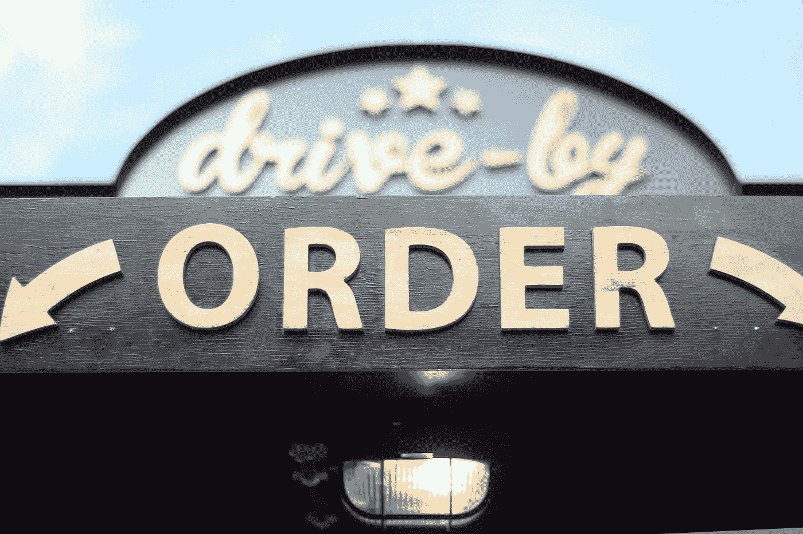

# 为了更好地了解你的用户，你必须知道的 3 个变量

> 原文：<https://towardsdatascience.com/3-variables-you-most-know-to-understand-your-users-better-94a3763ac9d9?source=collection_archive---------23----------------------->

## 用户、顾客或受众:多少，多少，多久一次？

迈克·什切潘斯基在 [Unsplash](https://unsplash.com?utm_source=medium&utm_medium=referral) 上的照片

T 根据产品或服务的不同，它们有不同的名称，无论我们谈论的是[用户、客户或受众](https://uxdesign.cc/what-was-before-the-user-4ad4c125ab05)，媒介或网络平台，还是衡量的方法。但无论你是否拥有一家餐厅、一个应用程序或一个电视广播频道，你都必须了解它们。

别担心，你不需要成为数学家就能理解它们。

## 餐馆的模型

每个人都去过那家很受欢迎的餐馆，那里总是挤满了食客，很难找到座位。你猜这是一个成功，你甚至私下想有一个这样的企业。

但客户数量是一个不完整的衡量标准。如果每个顾客只是要一杯咖啡会怎么样？你可以为客户创造完美的体验，一个伟大的环境，卓越的服务，但这可能不是你的服务或产品的目标。

所以，在餐馆里，顾客的数量不足以衡量成功。你需要知道他们在这上面花了多少钱。

照片由[在](https://unsplash.com/@elevatebeer?utm_source=medium&utm_medium=referral) [Unsplash](https://unsplash.com?utm_source=medium&utm_medium=referral) 上提升

让我们假设这家餐馆有大量的顾客，每个人的平均消费也不错。这个概念很棒，每个人都想了解这家餐厅。在最初的几周，也许是最初的几个月，餐馆里挤满了顾客。但是突然，有一天你从它面前经过，发现它是空的。发生了什么事？

再说一次，你为顾客创造了最好的体验，一个很棒的环境，优质的服务，但是出于某种原因，顾客不会再回到餐厅。

因此，在一家餐馆里，顾客数量和消费金额不足以衡量成功与否。你需要知道他们来餐馆的频率。

网站、应用程序、服务或产品也是如此。

# 1.到达

你需要知道你有多少用户、客户或受众。为此，您需要定义用户、客户或受众的含义。

在餐馆里，这似乎是显而易见的。每个支付最低金额的人。但要小心，因为你可以有一个人谁支付，但一个或多个来与她或他吃饭。你应该衡量食客。

用户可以是使用你的应用的人。但在这些时候，下载是不够的，所以你可以将你的用户定义为订阅者，或者基于应用程序中的一些交互。

对于电视和视频来说，[观众](https://en.wikipedia.org/wiki/Audience_measurement)通常是根据最少消耗的秒数或分钟数来定义的，但在电影中是根据门票来定义的。

在[广告和媒体](https://learn.g2.com/audience-research)中，你使用词语 [*受众到达*](https://en.wikipedia.org/wiki/Reach_(advertising)) 意味着在给定的时期内，不同的人至少接触过一次媒体的总数。

在[社交媒体营销](https://en.wikipedia.org/wiki/Social_media_reach)中，您使用了术语*社交媒体接触*，它指的是在社交平台上接触过特定内容的用户数量。

无论我们谈论的是用户、顾客还是受众，你都必须知道你接触了多少人。

# 2.平均花费

一旦你定义了你的顾客，你需要知道他们在你的餐馆消费了多少。在这种情况下，你必须考虑到每一个用餐者，而不仅仅是付钱的人。一般来说，这被称为每位顾客的平均花费，在餐饮业中被称为每位用餐者的平均花费。

在某些情况下，您希望增加客户数量。但是一旦你有了足够多的顾客(你的桌子都坐满了)，你就想增加每个顾客(或用餐者)的平均消费。

照片由[伊尔努尔·卡里穆林](https://unsplash.com/@kalimullin?utm_source=medium&utm_medium=referral)在 [Unsplash](https://unsplash.com?utm_source=medium&utm_medium=referral) 上拍摄

在电视、音频或视频等媒体中，交换的货币是时间。你可能听说过注意力经济。嗯，衡量你的产品或服务得到多少关注的唯一方法是通过观众花在它上面的时间。

如果你提供一个 60 分钟长的播客或视频，每人平均花费 30 分钟，你说你的内容有 50%的保真度*。*

*一旦你有了用户或观众，你希望他们在你的产品或服务上花更多的时间。*

*一些在线服务或应用程序也是如此。在 web analytics 中，保真度被称为页面平均停留时间。但在大多数 web 和 app 案例中，时间并不是度量的统一，因为它没有太大意义。*

*你还记得你的用户旅程或者你的用户流吗？还是你的营销漏斗？嗯，你通过它建立某些互动，你衡量你的用户走了多远。例如，在游戏中，你有关卡或阶段。在登录页面上，您可以在行动号召之前执行一些步骤。*

*在 web analytics 中，除了在页面上的平均时间，你还有每个用户的会话数，每个会话的平均时间…所有这些都是同一个概念的变体。*

*然而，无论你衡量的是金钱、时间还是行动，这都是一个试图衡量与你的目标相关的用户行为的变量。或者换句话说，用户做什么。*

# *3.频率*

*在餐馆里，如果你把每个顾客的账单或购买作为你的第一个衡量标准，你将无法识别顾客和他们的行为。例如，在一周内，你可以有一百张账单或购物单。但这并不意味着你有一百个顾客。有些顾客可能每天早上都来吃早餐，有些则一周来几次。*

*识别客户有助于测量重要的变量，如回头客*的百分比*。不管顾客已经回头客多少次，你的顾客中有多少是回头客？15%, 20%, 50%?***

**但最重要的是，你可以计算出*购买频率*，即你的客户在给定时期内返回的平均次数。**

**对于一家餐馆，你可以用几周或几个月的时间。例如，你的顾客每月来你的餐馆两次。请记住，我们谈论的是平均值。你有几乎每个工作日都来的大客户，也有永远不会回来的客户。**

****

**照片由[丽贝卡·阿尔达马](https://unsplash.com/@rebapocket?utm_source=medium&utm_medium=referral)在 [Unsplash](https://unsplash.com?utm_source=medium&utm_medium=referral) 上拍摄**

**在实体店的情况下，你如何识别顾客而不是账单或购买？你见过那些“顾客忠诚卡”吗？忠诚度计划的优势之一是你可以从中获得数据。**

**在媒体和广告中，频率也是一个人接触内容的次数。这在广告中很重要，因为为了传递广告信息，观众需要不止一次地看到它。根据内容的不同——从简单的品牌信息到带有说明的具体促销活动——活动可能需要或多或少的频率。**

**在网站和应用上，你有回头客或用户。你可能在社交网络或订阅服务中听过“活跃用户”这个词。有时用户数量不够，您希望将用户定义为在给定时间段内使用过该服务或登录过该服务的人。**

**与餐馆的例子及其购买与客户的情况类似，在 web 和应用程序中，您可能有很多视图、下载或任何定义的交互，但识别实际用户很重要。某些视图、下载或交互可以由同一用户多次完成。**

# **变量有变化**

**这只是对了解你的用户的 3 个基本变量的介绍。考虑到一旦你有了这些变量的数据，你就可以[测量它们的变化或片段](https://www.statisticssolutions.com/why-your-variables-need-to-vary/)而不仅仅是平均值。**

**例如，你可以根据不同种类的顾客或用户花了多少钱，他们来的频率，或者任何有用的人口统计学分类，比如流派，年龄，学者等等。一个*目标*是一个特定的人口统计。要不要多卖给青少年？嗯，你把青少年定义为你的目标，开始衡量他们的行为。**

**或者你可以找出你的重度用户，并试着了解他们相对于轻度用户的特征。当你开始玩数据的时候，天空就是极限。**

# **外卖食品**

****

**照片由[米歇尔·亨德森](https://unsplash.com/@micheile?utm_source=medium&utm_medium=referral)在 [Unsplash](https://unsplash.com?utm_source=medium&utm_medium=referral) 上拍摄**

**了解你的用户、客户或受众是提供更好的服务、产品、内容或体验的基础。这是适用于任何类型企业的三个基本变量。**

**下一次，尝试使用餐馆示例作为参考:用餐者的数量、每个人的支付金额和返回频率。**

**在某种程度上，这些变量对于任何一个拥有餐馆或商店的人来说都是直观的。但在其他层面上，如果我们理解并利用它们，它们可以为我们的决策提供大量信息。**

## **资源**

*   **[受众测量—维基百科](https://en.wikipedia.org/wiki/Audience_measurement)**
*   **[什么是受众研究？(+如何进行)](https://learn.g2.com/audience-research)**
*   **[Reach(广告)—维基百科](https://en.wikipedia.org/wiki/Reach_(advertising))**
*   **[社交媒体覆盖范围—维基百科](https://en.wikipedia.org/wiki/Social_media_reach)**
*   **[重复购买率，如何计算](https://www.littlestreamsoftware.com/articles/repeat-purchase-rate-calculate/)**
*   **[为什么您的变量需要变化—统计解决方案](https://www.statisticssolutions.com/why-your-variables-need-to-vary/)**
*   **[用户之前是什么](https://uxdesign.cc/what-was-before-the-user-4ad4c125ab05)**