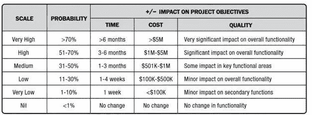
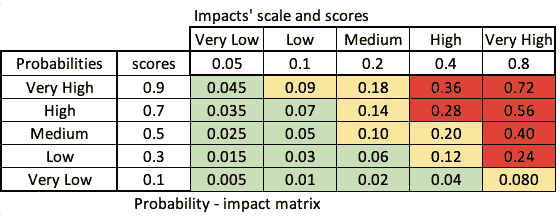
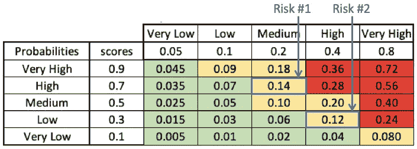
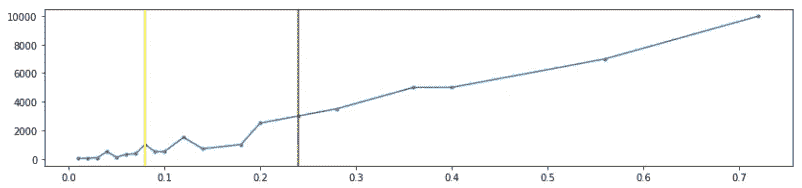

# 风险管理方法可能误导的 3 种方式以及如何纠正！

> 原文：<https://towardsdatascience.com/3-ways-risk-management-methods-can-be-misleading-and-how-to-fix-it-c9b60ae0f535?source=collection_archive---------16----------------------->

## 常见的错误会使你的风险管理努力完全无用，甚至适得其反。

埃斯彭·比埃尔德的照片

> 🔥【公告】
> 在你继续阅读这篇文章之前，我只想让你知道，几天前，我发布了一个完整的课程，帮助你**提高你的决策技能，并在竞争中领先**。
> 它是多年研究的成果，在有限的时间内**免费**提供。
> 👉如果你想用科学的方法做出更好的决定，这里有一个链接:[https://smart-decision-makers.streamlit.app/](https://smart-decision-makers.streamlit.app/)
> [/Announcement]🔥

为了最大化任何努力的成功机会，关键是要正确地识别和优先考虑风险，将你的精力和注意力集中在最重要的事情上。

在本文中，我将与您分享三个常见的错误，这些错误可能会使您的风险管理努力完全无用，甚至适得其反。

首先，我们来回忆一下一些定义；PMBoK(项目管理知识体系)指南将风险描述为:不确定的事件或条件，如果发生，会对项目目标产生积极或消极的影响。

因此，为了正确管理您在项目中识别的风险，您需要评估它们的概率和影响。

大多数风险管理方法依靠简单的尺度来评估风险的概率或影响。

例如，PMBoK 指南建议使用下面的定义表，按照从“非常高”到“非常低”的明确范围对概率和影响进行分类

PMBOK 指南 2017 年第 6 版—项目管理协会，表 11–1，第 407 页

# 错误#1:重复使用现有的比例定义

在许多情况下，比例定义是标准化的，由您的组织提供。您也可能会尝试重用以前项目中的比例定义。

为了说明这种做法有多危险，让我们举个例子。

如果你被告知优先考虑两个风险，一个可能会给你的项目增加 17%的延迟，另一个可能会使你的总预算增加 2 倍。你认为哪一个更重要？

这个问题的答案取决于你的项目的性质，然而，大多数人会同意损失 100%比损失 17%更重要。

现在，让我们使用 PMBOK 中提供的以前的规模定义表，并将其应用于一个预计持续两年的 50 万美元的项目。

假设您必须以相同的概率优先考虑两个风险，一个可能会使您的项目延迟 17% (4 个月)，第二个风险可能会使您损失 100%的预算(50 万美元)。

根据定义表，第一个风险(17%延迟)将被评定为“高优先级”，而第二个风险(100%超出预算)将被评定为“中等”。这和我们之前做出的直观结论正好相反！

作为一个收获，在使用任何尺度的定义之前，即使它是由您的组织提供的，您也应该始终确保不同的尺度是一致的、连贯的，并且非常适合您的项目环境。

# 错误#2:秤的压缩偏差

一旦您使用明确定义的等级评估了概率和影响级别，传统的风险管理方法会建议为每个等级关联一个分数。然后将概率和影响得分相乘，计算风险的重要程度。

这种危险程度越高，风险就越被认为是重要的，值得您采取行动，将其可能性或影响降低到可接受的水平。

在 PMBoK 指南中提供的示例中，建议的分数范围从 0.9 表示“非常高”的概率到 0.1 表示“非常低”的概率，影响分数范围从 0.8 到 0.05。

用这样的尺度，两个显著不同的随机事件可以被认为是等同的。例如，概率分别等于 0.71 和 0.99 的两个事件将具有相同的分数 0.9。

这种规模压缩现象甚至可以颠倒风险的优先顺序。例如，考虑两种风险:

*   风险 1:高概率(51% — 70%)和中等影响(50.1 万美元—100 万美元)
*   风险 2:低概率(11% — 30%)和高影响(100 万美元—500 万美元)

根据上面的概率-影响矩阵，第一个风险的重要程度(0.14)高于第二个风险(0.12)。我们希望它有更高的优先级。

但是，如果我们计算在两种情况下都有风险的最大预期影响，我们会发现优先级顺序相反！

事实上，第一种风险的最坏情况是 70 万美元(70% * 100 万美元:损失 100 万美元的可能性为 70%)，而第二种风险的最坏情况是 150 万美元(损失 500 万美元的可能性为 30%)。

如果我们将预算影响的所有可能值与关键程度的演变进行绘图，我们可以看到该函数正在减少的其他几个点。这意味着它颠倒了已识别风险的自然优先级顺序。

风险预算是风险重要程度的函数

我们刚刚证明，由于规模的压缩效应，风险管理方法可能导致风险优先级的逆转。

# 错误#3:秤的解释

我们在处理风险时犯的最后一种错误与人们(错误地)解释概率尺度的方式有关。

福特汉姆大学(Fordham University)心理计量学和定量心理学教授大卫·布德斯库(David Budescu)进行了几项研究，他询问了成千上万不同国籍的人对政府间气候变化专门委员会(IPCC)报告中句子的理解。

IPCC 是联合国评估气候变化相关科学的机构。IPCC 依靠概率尺度(如“不太可能”和“非常可能”)来传达其预测的潜在不确定性。

David Budescu 证明了人们系统地曲解概率陈述，即使他们被提供了这些尺度的明确定义(例如，不太可能< 33%; very likely > 90%)。

大卫·布德斯库的团队通过改变量表的定义，以匹配参与者将“可能”、“非常可能”和其他日常生活中使用的词联系起来的概率，成功地提高了与定义一致的解释的百分比。

因此，一致解释的百分比从 26%跃升至 40%。然而，40%的理解尺度的一致性仍然很低。
想象一下，你正在和你的同事开会，刚刚同意将一个特定的风险归类为“非常可能”，而你指的是“非常可能”与高于 90%的概率相关联的等级定义。
根据这项研究，您的团队中仍有 40%的人同意您使用“非常可能”这一级别，而如果让他们为同一事件分配一个概率，他们会说> 50%。

在这次会议中，你唯一成功做到的事情就是在你的团队中创造一种沟通和一致的假象，让他们知道什么是最重要的要解决的风险。

# 结论:

在本文中，我们刚刚分享了传统风险管理方法可能产生误导和模糊的 3 种方式。

我不是说你应该停止使用这些方法。然而，重要的是要意识到这些偏差，以便最大限度地利用这些方法，同时限制它们可能的缺点。
以下是增加你成功机会的几条指导方针:

*   如果你使用的是天平，确保它们是一致的，并且相互对齐。
*   当把你的量表转换成分数时，总是使用对称的分数，否则你会偏爱一种类型的影响。
*   总是倾向于直接使用定量概率，而不依赖于中间尺度。这是对不确定性进行明确描述的最佳方式。

## 参考

布德斯库，D.V .，波尔 h .，，布鲁姆尔，S. (2012 年)。IPCC 报告中不确定性的有效沟通。气候变化，113，181–200。

布德斯库，D.V .，波尔，h .，布鲁姆尔，s .，，史密森，M. (2014)。世界范围内 IPCC 概率声明的解释。自然气候变化，4508–512。DOI:10.1038。/NCLIMATE2194。