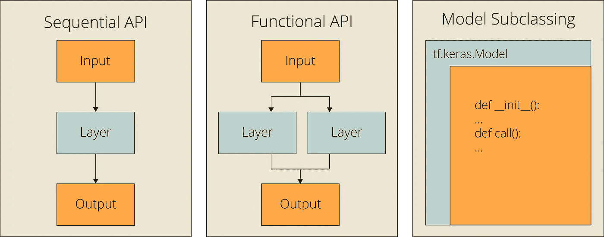
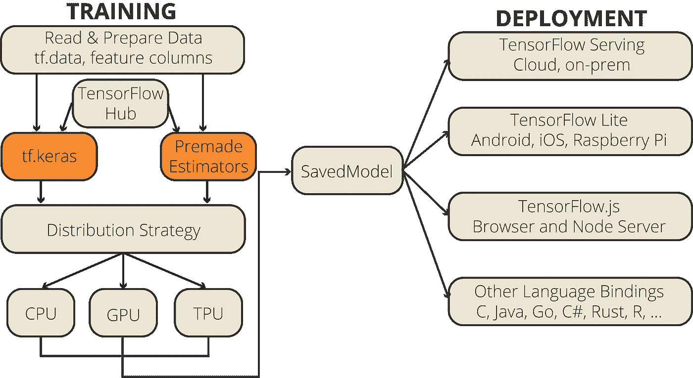
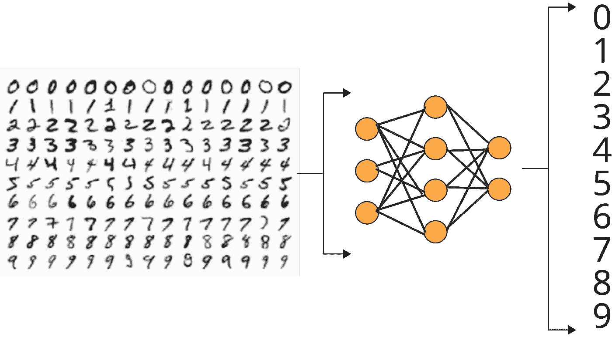
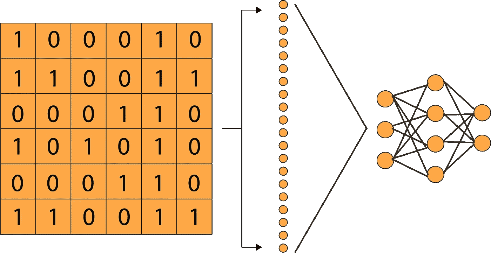

# 使用 Keras API 在 TensorFlow 中构建神经网络的 3 种方法

> 原文：<https://towardsdatascience.com/3-ways-to-build-neural-networks-in-tensorflow-with-the-keras-api-80e92d3b5b7e?source=collection_archive---------10----------------------->

## 在 TensorFlow 2.x 中使用 Keras 构建深度学习模型，可以使用**顺序 API** 、**功能 API** 和模型**子类**

图一。顺序 API、函数 API、并行的子类化方法模型

如果你四处逛逛，查看不同的教程，进行谷歌搜索，花大量时间研究 TensorFlow 的堆栈溢出，你可能已经意识到有大量不同的方法来建立神经网络模型。长期以来，这一直是 TensorFlow 的一个问题。这几乎就像 TensorFlow 试图找到通往光明的深度学习环境的道路。如果你仔细想想，这正是正在发生的事情，对于 2.x 版本的库来说，这很正常。由于 TensorFlow 是迄今为止市场上最成熟的深度学习库，这基本上是你能得到的最好的库。

# 克拉斯-张量流关系

## 一点背景

TensorFlow 向深度学习平台的进化不是一蹴而就的。最初，TensorFlow 将自己推销为一个符号数学库，用于跨一系列任务的数据流编程。所以 TensorFlow 最初提供的价值主张并不是一个纯粹的机器学习库。目标是创建一个高效的数学库，以便在这个高效结构之上构建的定制机器学习算法可以在短时间内以高精度进行训练。

然而，用低级 API 重复地从零开始构建模型并不是很理想。所以，谷歌工程师 Franç ois Chollet 开发了 Keras，作为一个独立的高级深度学习库。虽然 Keras 已经能够在不同的库上运行，如 TensorFlow、Microsoft Cognitive Toolkit、Theano 或 PlaidML，但 TensorFlow 过去是，现在仍然是人们使用 Keras 的最常见的库。

## 现状

在看到模型构建过程的混乱之后，TensorFlow 团队[宣布【Keras 将成为用于在 TensorFlow 2.0 中构建和训练模型的核心高级 API。另一个高级 API](https://blog.tensorflow.org/2019/01/whats-coming-in-tensorflow-2-0.html)[Estimator API](https://www.tensorflow.org/guide/estimator)，在这个声明之后，已经开始失去它已经逐渐减少的受欢迎程度。

## Estimator API 和 Keras API

图二。Keras API 和估算器 API 在张量流图中的位置

现在，让我们回到问题上:人们使用 TensorFlow 建立模型的方法有很多种。造成这个问题的主要原因是 TensorFlow 没有采用单一模型 API。

在 1.x 版本中，对于生产级项目，最常用的模型构建 API 是 Estimator API。但是，随着最近的变化，Keras API 几乎赶上了 Estimator API。最初，Estimator API 更具可伸缩性，允许多种分布，并且具有方便的跨平台功能。然而，[Estimator API](https://www.reddit.com/r/tensorflow/comments/czr0ms/tf2_keras_vs_estimators/)的大部分优势现在都消失了，因此，很快 Keras API 可能会成为构建 TensorFlow 模型的单一标准 API。

因此，在本文中，我们将只关注在 TensorFlow 中构建模型的 Keras API 方法，其中有三种方法:

*   使用顺序 API
*   使用函数式 API
*   模型子类化

我将直接将它们与相应的模型构建代码进行比较，这样您就可以亲自测试它们了。让我们深入编码。

# 进行比较的初始代码

为了测试这三种 Keras 方法，我们需要选择一个深度学习问题。用 MNIST 进行图像分类是一项非常简单的任务。我们试图实现的是训练一个模型来识别手写数字，使用著名的 MNIST 数据集。

图 3。基准分析的虚拟任务:MNIST 图像分类

MNIST 数据集，代表修改的国家标准和技术研究所数据库，是一个手写数字的大型数据库，通常用于训练各种图像处理系统。MNIST 数据库包含来自美国人口普查局员工和美国高中生的 60，000 幅训练图像和 10，000 幅测试图像。如果你想看完整的教程，你可以找到我关于[图像分类](/image-classification-in-10-minutes-with-mnist-dataset-54c35b77a38d)的单独教程。

 [## 使用 MNIST 数据集在 10 分钟内完成图像分类

### 利用 TensorFlow 和 Keras |监督深度学习使用卷积神经网络来分类手写数字

towardsdatascience.com](/image-classification-in-10-minutes-with-mnist-dataset-54c35b77a38d) 

使用下面的代码，我们将导入所有的层和模型，这样在接下来的部分就不会打扰我们了。我们还下载了 MNIST 数据集并对其进行预处理，以便它可以用于我们将使用这三种不同方法构建的所有模型中。只需运行下面的代码:

要点 1。必要的进口，MNIST 装载，预处理

现在，这部分就不碍事了，让我们把重点放在建立张量流模型的三种方法上。

# 构建 Keras 模型的 3 种方法

在 TensorFlow 中构建 Keras 模型有三种方法:

*   **顺序 API:** 当你试图构建一个只有一个输入、输出和层分支的简单模型时，顺序 API 是最好的方法。对于想快速学习的新人来说，这是一个很好的选择。
*   **函数式 API:** 函数式 API 是构建 Keras 模型最流行的方法。它能做顺序 API 能做的一切。此外，它允许多输入、多输出、分支和层共享。这是一种简洁易用的方法，并且仍然允许很好的定制灵活性。
*   **模型子类化:**模型子类化适用于需要完全控制他们的模型、层和训练过程的高级开发人员。您需要创建一个定义模型的定制类，并且您可能在日常任务中不需要它。但是，如果你是一个有实验需求的研究者，那么模型子类化可能是你最好的选择，因为它会给你所有你需要的灵活性。

图 4。使用展平图层将二维图像阵列转换为一维阵列

让我们看看这些方法是如何实现的。我们将建立一个基本前馈神经网络，它具有一个平坦层，将二维图像阵列转换为一维阵列和两个密集层。

## 顺序 API

在顺序 API 中，我们需要从 tf.keras.Models 模块创建一个顺序对象。我们可以简单地将所有层作为列表格式的单个参数传递，如下所示。如你所见，这很简单。

要点 2。用 Keras 顺序 API 构建的前馈神经网络

## 功能 API

对于函数式 API，我们需要单独定义我们的输入。然后，我们需要创建一个输出对象，方法是创建所有相互关联并与输出关联的层。最后，我们创建一个模型对象，它接受输入和输出作为参数。代码仍然非常干净，但是我们在函数式 API 中有了更多的灵活性。

要点三。用 Keras Functional API 构建的前馈神经网络

## 模型子类化

让我们继续讨论模型子类化。在模型子类化中，我们从创建一个扩展 tf.keras.Model 类的类开始。模型子类化有两个关键功能:

*   ***__init__*** 函数充当构造函数。多亏了 *__init__* ，我们可以初始化模型的属性(*例如层*)。*用于调用父构造函数(构造函数在 *tf.keras.Model* )和 ***self*** 用于引用实例属性(*如图层*)。*
*   ****调用*** 函数是在 *__init__* 函数中定义图层后定义操作的地方。*

*为了用模型子类化构建相同的模型，我们需要编写更多的代码，如下所示:*

*要点 4。基于 Keras 模型子类化的前馈神经网络*

# *结束代码*

*既然您可以用三种不同的方法创建同一个模型，那么您可以选择其中的任何一种，构建模型，并运行下面的代码。*

*要点 5。模型配置、培训和评估*

*上面几行负责模型配置、训练和评估。当我们比较这三种方法的性能时，我们看到它们非常接近，但略有不同。*

*表 1。不同 Keras 方法的性能:顺序 API、函数 API 和模型子类化*

**

*Jonathan Chng 在 [Unsplash](https://unsplash.com?utm_source=medium&utm_medium=referral) 上的照片*

*我们更复杂的模型子类化方法优于顺序 API 和函数 API。这表明这些方法在低端的设计上也有细微的差别。然而，这些差异可以忽略不计。*

## *最终评估*

*到目前为止，您已经了解了这三种 Keras 方法之间的异同。但是，让我们用一个表格来总结一下:*

*表二。TensorFlow 中构建 Keras 模型的不同方法比较:顺序 API、函数 API 和模型子类化*

*总之，如果您刚刚开始，请坚持使用顺序 API。当您深入到更复杂的模型时，尝试一下函数式 API。如果你正在读博士或者只是喜欢进行独立的研究，试试模型子类化。如果你是专业人士，坚持使用功能 API。它可能会满足你的需要。*

****在评论中让我知道你最喜欢的建立 Keras 模型的方法。****

# *订阅邮件列表获取完整代码*

*如果你想在 Google Colab 上获得完整的代码，并获得我的最新内容，请订阅邮件列表:✉️*

> *[*现在就订阅*](http://eepurl.com/hd6Xfv)*

# *喜欢这篇文章吗？*

*如果你喜欢这篇文章，可以考虑看看我的其他类似文章:*

* [## 4 个预训练的 CNN 模型，用于具有迁移学习的计算机视觉

### 使用最先进的预训练神经网络模型，通过迁移学习解决计算机视觉问题

towardsdatascience.com](/4-pre-trained-cnn-models-to-use-for-computer-vision-with-transfer-learning-885cb1b2dfc)  [## TensorFlow Hub & Magenta 在 5 分钟内实现快速神经风格转换

### 利用 Magenta 的任意图像风格化网络和深度学习，将梵高的独特风格转移到照片中

towardsdatascience.com](/fast-neural-style-transfer-in-5-minutes-with-tensorflow-hub-magenta-110b60431dcc)  [## 使用 MNIST 数据集在 10 分钟内完成图像分类

### 利用 TensorFlow 和 Keras |监督深度学习使用卷积神经网络来分类手写数字

towardsdatascience.com](/image-classification-in-10-minutes-with-mnist-dataset-54c35b77a38d)*