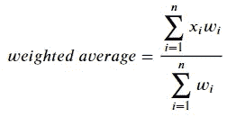

# Python 中计算加权平均值的 3 种方法

> 原文：<https://towardsdatascience.com/3-ways-to-compute-a-weighted-average-in-python-4e066de7a719?source=collection_archive---------1----------------------->

## [编程](https://towardsdatascience.com/tagged/programming) | [面试](https://towardsdatascience.com/tagged/interviewing) | [办公时间](https://towardsdatascience.com/tagged/office-hours)

## 在这篇简短的教程中，我将展示如何在 Python 中定义自己的函数或使用 NumPy 来计算加权平均值


照片来自[像素](https://www.pexels.com/)

*更新:你们中的许多人联系我，要求提供宝贵的资源，以便使用 Python* *自动化 Excel 任务，或者使用 Python****应用流行的统计概念*** *。下面我分享我推荐的四门课程:*

*   [**Python 中的数据科学编程(纳米级)**](https://imp.i115008.net/2rrmW7)
*   [**Python 中练习统计面试题**](https://datacamp.pxf.io/jWm44P)

希望你也会发现它们有用！现在欣赏:D 的文章

# 何时使用加权平均值？

假设您必须分析下表，该表显示了一家小公司员工的年薪，这些员工分为五组(从*低*到*高*工资):


作者在 Tableau 中创建的图像。使用了模拟数据。

如果您计算`Salary Per Year`列的简单平均值，您将获得:


但是 62000 英镑能准确代表所有群体的平均工资吗？因为数据已经汇总，每个组有不同的`Employees Number`，每个组的平均`Salary Per Year`在总平均值中的权重不同。在计算简单平均值时，每组的权重相同，导致结果有偏差。

在这种情况下，解决方案是通过计算**加权平均值**来考虑每组的权重，加权平均值可以用以下公式用代数表示:



其中`x`代表分配(`Salary Per Year`),`w`代表待分配的权重(`Employees Number`)。假设该表包括五个组，则上述公式变为:


用实际数字代替`x`和`w`，你应该得到下面的结果:


请注意，考虑到权重因素，各组的平均值`Salary Per Year`几乎比简单平均法计算出的值低 18，000，这是描述数据集的一种准确方式，因为每组都有一定数量的员工。

既然已经介绍了理论，让我们看看如何使用 3 种不同的方法在 Python 中获得加权平均值。为此，第一步是导入包和`employees_salary`表本身:

```
import pandas as pd
from numpy import averagedf = pd.read_csv(‘C:/Users/anbento/Desktop/employee_salary.csv’)df.head()
distribution = df[‘salary_p_year’]
weights = df[‘employees_number’]
```

[](/3-nanodegrees-you-should-consider-to-advance-your-data-engineering-career-in-2021-baf597debc72) [## 3 纳米学位你应该考虑在 2021 年推进你的数据工程职业

towardsdatascience.com](/3-nanodegrees-you-should-consider-to-advance-your-data-engineering-career-in-2021-baf597debc72) 

# 方法 1:使用列表理解的功能

如果您希望编写自己的算法，计算加权平均值的第一个非常简单的方法是使用列表理解来获得每个`Salary Per Year`与相应的`Employee Number` ( `numerator`)的乘积，然后除以权重之和(`denominator`)。

```
Output:
44225.35
```

上面的函数可以很容易地重写为一行代码:

```
Output:
44225.35
```

# 方法 2:使用 Zip()函数

除了使用列表理解，您可以简单地从空列表(`weighted_sum`)开始，并通过其`weight`附加每个组的平均值`salary`的乘积。`zip()`函数非常方便，因为它生成一个元组迭代器，帮助将每个`salary`与对应的`weight`配对。

```
Output:
44225.35
```

# 方法 3:使用 Numpy Average()函数

`numpy`包包括一个`average()`函数(*已经在*上导入)，您可以在其中指定一个权重列表来计算加权平均值。这是迄今为止在生产中执行此类计算最简单、最灵活的方法:

```
Output:
44225.35
```

[](/10-algorithms-to-solve-before-your-python-coding-interview-feb74fb9bc27) [## Python 编码面试前要解决的 10 个算法

### 在这篇文章中，我介绍并分享了 FAANG 中经常出现的一些基本算法的解决方案

towardsdatascience.com](/10-algorithms-to-solve-before-your-python-coding-interview-feb74fb9bc27) 

# **结论**

在这个简短的教程中，我们了解了每次以汇总或分组的方式呈现数据时，加权平均值应该是首选选项，其中可以确定一些数量或频率。我们还发现了至少 3 种使用 Python 计算加权平均值的方法，要么使用自定义函数，要么使用内置函数。我很想知道你是否使用其他算法或软件包来计算加权平均值，所以请留下你的评论！

# 给我的读者一个提示

这篇文章包括附属链接，如果你购买的话，我可以免费给你一点佣金。

# 你可能也喜欢

[](/7-fundamental-sql-concepts-you-will-be-challenged-with-in-faang-interviews-d26097a8d867) [## 下一次编码面试前要掌握的 7 个基本 SQL 概念

### 通过从真实面试中解决问题来练习，最终得到你应得的工作。

towardsdatascience.com](/7-fundamental-sql-concepts-you-will-be-challenged-with-in-faang-interviews-d26097a8d867) [](/connect-to-databases-using-python-and-hide-secret-keys-with-env-variables-a-brief-tutorial-4f68e33a6dc6) [## 使用环境变量隐藏您的密码

### 关于如何在使用 Python 连接到数据库时使用环境变量隐藏密钥的教程

towardsdatascience.com](/connect-to-databases-using-python-and-hide-secret-keys-with-env-variables-a-brief-tutorial-4f68e33a6dc6) [](/15-git-commands-you-should-learn-before-your-very-first-project-f8eebb8dc6e9) [## 在你开始第一个项目之前，要掌握 15 个 Git 命令

### 您需要掌握的最后一个 Git 教程是命令行版本控制。

towardsdatascience.com](/15-git-commands-you-should-learn-before-your-very-first-project-f8eebb8dc6e9)