# 使用 Keras 和 TensorFlow 2.0 创建机器学习模型的 3 种方法(顺序、函数和模型子类化)

> 原文：<https://towardsdatascience.com/3-ways-to-create-a-machine-learning-model-with-keras-and-tensorflow-2-0-de09323af4d3?source=collection_archive---------13----------------------->

## 为初学者构建机器学习模型的分步教程

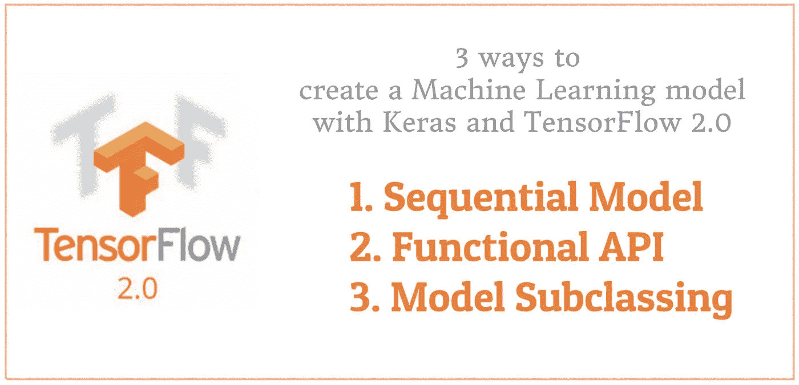

使用 Keras 和 TensorFlow 2.0 创建机器学习模型的 3 种方法

在我之前的文章 [Google 机器学习实践的 7 个步骤:结构化数据的 TensorFlow 示例](/the-googles-7-steps-of-machine-learning-in-practice-a-tensorflow-example-for-structured-data-96ccbb707d77)中，我提到了用 Keras 和 TensorFlow 2.0 实现机器学习模型的 3 种不同方法

*   **顺序模型**是在 TensorFlow 2.0 中启动和运行 Keras 的最简单方法
*   **功能 API** 用于更复杂的模型，尤其是具有多个输入或输出的模型。
*   **模型子类化**是完全可定制的，使我们能够实现我们自己定制的模型前向传递

在本文中，我们将学习如何用三种不同的方法建立一个机器学习模型，以及如何为我们的项目选择正确的方法。

# 环境设置、源代码和数据集准备

为了运行本教程，您需要安装

> TensorFlow 2，numpy，pandas，sklean，matplotlib

它们都可以直接安装在 vis PyPI 上，我强烈建议创建一个新的虚拟环境。最佳实践是避免使用 ***base(root)*** ，因为这可能会破坏您的系统。

有关创建 Python 虚拟环境的教程，您可以在这里查看:

[](/create-virtual-environment-using-virtualenv-and-add-it-to-jupyter-notebook-6e1bf4e03415) [## 使用“virtualenv”创建虚拟环境，并将其添加到 Jupyter 笔记本中

### 你是机器学习工程师，正在使用 Python 和 Jupyter Notebook 吗？在这篇文章中，你会看到为什么…

towardsdatascience.com](/create-virtual-environment-using-virtualenv-and-add-it-to-jupyter-notebook-6e1bf4e03415) [](https://medium.com/analytics-vidhya/create-virtual-environment-using-conda-and-add-it-to-jupyter-notebook-d319a81dfd1) [## 使用“conda”创建虚拟环境，并将其添加到 Jupyter 笔记本中

### 你正在使用 anaconda 和使用 Jupyter Notebook 和 Python 吗？在这篇文章中，你将看到如何创建虚拟的…

medium.com](https://medium.com/analytics-vidhya/create-virtual-environment-using-conda-and-add-it-to-jupyter-notebook-d319a81dfd1) 

## 源代码

这是一个循序渐进的教程，所有的说明都在这篇文章中。我已经把笔记本开源了，请查看最后的 Github 链接。

## 数据集准备

本教程使用[安德森鸢尾花(iris)](https://en.wikipedia.org/wiki/Iris_flower_data_set) 数据集进行演示。该数据集包含五个属性下的一组 150 条记录:*萼片长度*、*萼片宽度*、*花瓣长度*、*花瓣宽度、*和*类*(从 sklearn 数据集称为*目标*)。

首先，让我们导入库并从 ***scikit-learn*** 库中获取虹膜数据集。你也可以从 [UCI 虹膜数据集](https://archive.ics.uci.edu/ml/datasets/iris)下载。

```
import tensorflow as tf
import pandas as pd
import numpy as np
import matplotlib.pyplot as plt
from sklearn.datasets import load_iris
from sklearn.model_selection import train_test_split**iris = load_iris()**
```

为了研究数据，让我们将数据加载到一个数据帧中

```
# Load data into a DataFrame
**df = pd.DataFrame(iris.data, columns=iris.feature_names)** # Convert datatype to float
**df = df.astype(float)** # append "target" and name it "label"
**df['label'] = iris.target** # Use string label instead
**df['label'] = df.label.replace(dict(enumerate(iris.target_names)))**
```

并且`df`应该如下所示:


运行`df.head()`预览虹膜数据

我们注意到 ***标签*** 列是一个分类特征，需要将其转换成一个热编码。否则，我们的机器学习算法将无法直接将其作为输入。

```
# label -> one-hot encoding
**label = pd.get_dummies(df['label'])
label.columns = ['label_' + str(x) for x in label.columns]**
**df = pd.concat([df, label], axis=1)**# drop old label
df.drop(['label'], axis=1, inplace=True)
```

现在，`df`应该是这样的:

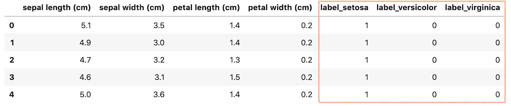

接下来，让我们创建`X`和`y`。Keras 和 TensorFlow 2.0 只接受 Numpy 数组作为输入，所以我们必须将 DataFrame 转换回 Numpy 数组。

```
# Creating X and y**X = df[['sepal length (cm)', 'sepal width (cm)', 'petal length (cm)', 'petal width (cm)']]**
# Convert DataFrame into np array
**X = np.asarray(X)****y = df[['label_setosa', 'label_versicolor', 'label_virginica']]** # Convert DataFrame into np array
**y = np.asarray(y)**
```

最后，让我们使用来自 **sklearn** 库的`**train_test_split()**` 将数据集拆分成训练集(75%)和测试集(25%)。

```
X_train, X_test, y_train, y_test **= train_test_split(
  X,
  Y,
  test_size=0.25
)**
```

太好了！我们的数据已经准备好建立一个机器学习模型。

# 1.顺序模型

顺序模型是层的线性堆叠。创建顺序模型有两种方法

*   将层列表传递给构造函数
*   只需通过`.add()`方法添加图层:

让我们继续建立一个具有 3 个密集层的神经网络。

```
from tensorflow.keras.models import Sequential
from tensorflow.keras.layers import Dense# Passing a list of layers to the constructor
model = Sequential(**[
    Dense(5, activation='relu', input_shape=(4,)),
    Dense(10, activation='relu'),
    Dense(3, activation='softmax'),
]**)model.summary()
```

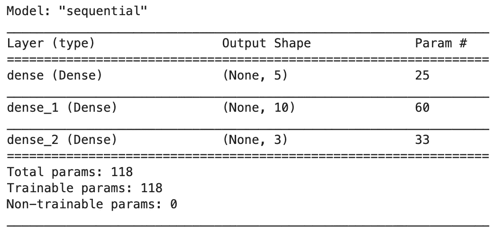

通过`.add()`方法，以上与以下相同

```
# Adding layer via add() method
model = Sequential()
model.**add(Dense(5, activation='relu', input_shape=(4,)))**
model.**add(Dense(10, activation='relu'))**
model.**add(Dense(3, activation='softmax'))**model.summary()
```

顺序模型需要知道它应该期望什么样的输入形状。因此，顺序模型中的第一层需要接收关于其输入形状的信息，这通常通过指定`input_shape`参数来完成。

## **1.1 训练一个序列模型**

为了训练一个序列模型，我们首先必须使用`model.compile()`配置我们的模型，参数如下:

*   使用优化器 RMSProps ( `rmsprop`)
*   对于我们的 ***多类分类*** 问题，使用分类交叉熵损失函数(`categorical_crossentropy`
*   为简单起见，使用`accuracy`作为我们在训练和测试期间评估模型的评估指标。

```
model.compile(
    **optimizer='rmsprop',**
    **loss='categorical_crossentropy',**
    **metrics=['accuracy']**
)
```

之后，我们可以调用`model.fit()`来训练我们的模型

```
history = **model.fit**(X_train, y_train,
                    batch_size= 64,
                    epochs= 30,
                    validation_split=0.2
                   )
```

如果一切顺利，我们应该得到如下输出

```
Train on 89 samples, validate on 23 samples
Epoch 1/30
89/89 [==============================] - 1s 13ms/sample - loss: 1.4717 - accuracy: 0.3258 - val_loss: 1.1884 - val_accuracy: 0.3478
Epoch 2/30
89/89 [==============================] - 0s 465us/sample - loss: 1.4152 - accuracy: 0.3258 - val_loss: 1.1683 - val_accuracy: 0.3478
Epoch 3/30
89/89 [==============================] - 0s 463us/sample - loss: 1.3836 - accuracy: 0.3258 - val_loss: 1.1503 - val_accuracy: 0.3478
......
......
Epoch 30/30
89/89 [==============================] - 0s 488us/sample - loss: 1.0734 - accuracy: 0.3258 - val_loss: 1.0290 - val_accuracy: 0.3478
```

## 1.2 模型评估

一旦训练完成，就该看看模型是否适合模型评估了。模型评估通常包括

1.  绘制**损失**和**准确度**指标的进度
2.  用从未用于训练的数据来测试我们的模型。这就是我们之前搁置的测试数据集`X_test`发挥作用的地方。

让我们创建一个函数`plot_metric()`来绘制指标。

```
%matplotlib inline
%config InlineBackend.figure_format = 'svg'
def plot_metric(history, metric):
    train_metrics = history.history[metric]
    val_metrics = history.history['val_'+metric]
    epochs = range(1, len(train_metrics) + 1)
    plt.plot(epochs, train_metrics, 'bo--')
    plt.plot(epochs, val_metrics, 'ro-')
    plt.title('Training and validation '+ metric)
    plt.xlabel("Epochs")
    plt.ylabel(metric)
    plt.legend(["train_"+metric, 'val_'+metric])
    plt.show()
```

通过运行`plot_metric(history, 'loss')`来绘制损失进度。

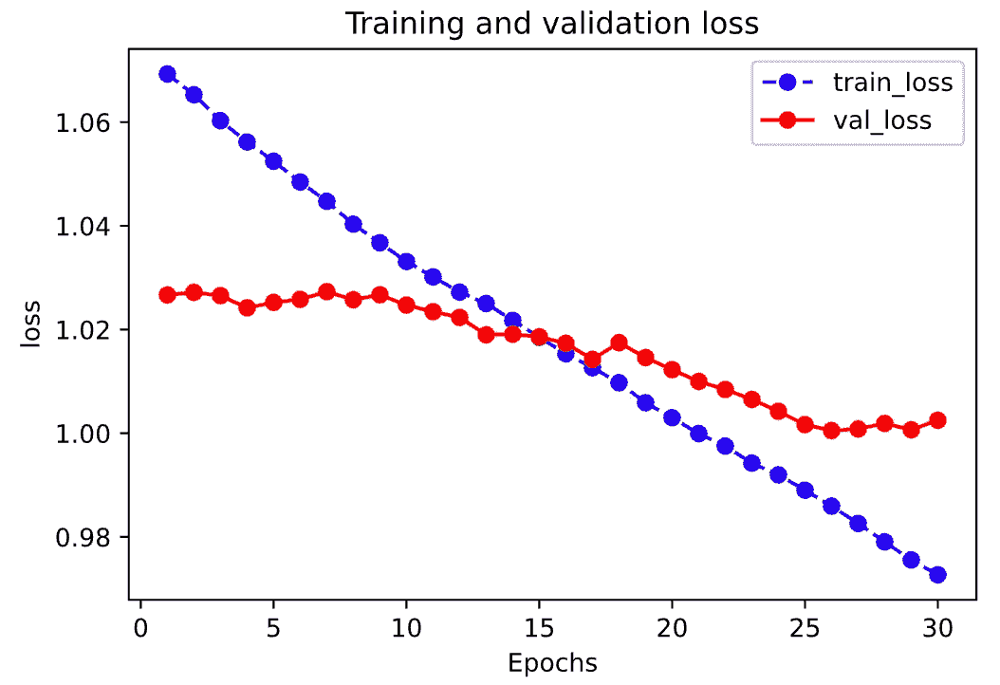

通过运行`plot_metric(history, 'accuracy')`绘制精度进度。

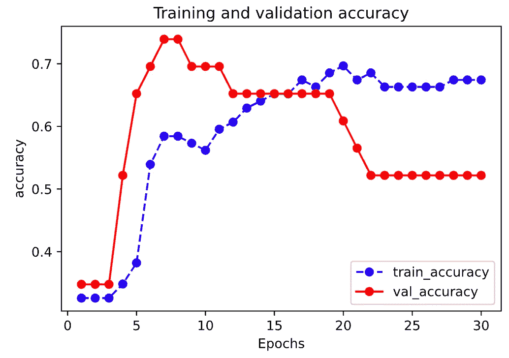

根据测试数据集测试我们的模型

```
model.**evaluate**(x = **X_test**,y = **y_test**)
```

我们应该得到一个具有损耗和精度的输出，如下所示:

```
38/1 [===] - 0s 139us/sample - **loss: 0.9356** - **accuracy: 0.7105**[0.9538187102267617, 0.7105263]
```

## 1.3 何时使用顺序模型

顺序模型适用于**简单的层堆叠**，其中每层都有**一个输入和一个输出**。

一个顺序模型是**不合适**当[1]:

*   您的模型有多个输入或多个输出
*   您的任何图层都有多个输入或多个输出
*   您需要进行图层共享
*   您需要非线性拓扑(例如，剩余连接、多分支模型)

# 2.功能 API

Keras functional API 提供了一种更加灵活的定义模型的方式。特别是，它允许我们定义多个输入或输出模型以及共享层的模型。

让我们使用函数式 API 创建相同的神经网络

```
from tensorflow.keras.models import Model
from tensorflow.keras.layers import Input, Dense# This returns a tensor
**inputs = Input(shape=(4,))**# A layer instance is callable on a tensor, and returns a tensor
**x = Dense(5, activation='relu')(inputs)
x = Dense(10, activation='relu')(x)
outputs = Dense(3, activation='softmax')(x)**# This creates a model that includes
# the Input layer and three Dense layers
**model = Model(inputs=inputs, outputs=outputs)**model.summary()
```

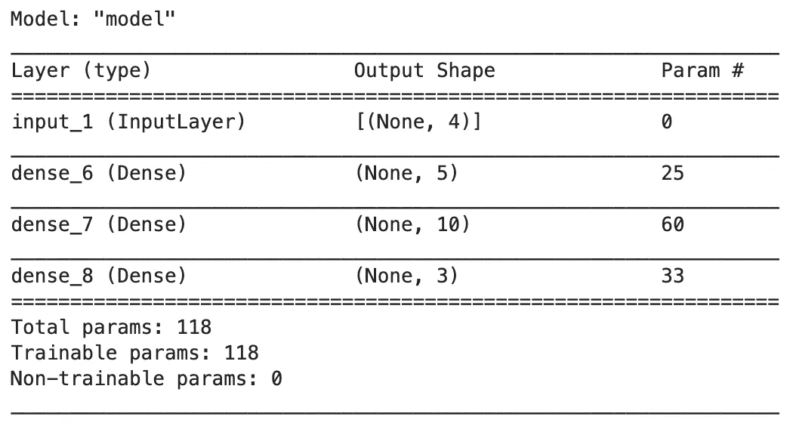

在函数式 API 中:

*   每一层实例都是 ***上一个可调用的张量*** ，而 ***则返回一个张量***
*   `Input()`用于定义以输入形状为自变量的输入层`**shape=(4,)**`
*   在`Model()`中我们只需要引用`inputs`和`outputs`张量

## **2.1 训练一个功能 API 模型**

功能 API 模型可以像顺序模型一样被训练。

```
# First configure model using model.compile()
model.compile(
    optimizer='rmsprop',
    loss='categorical_crossentropy',
    metrics=['accuracy']
)# Then, train the model with fit()
history = model.fit(X_train, y_train,
                    batch_size= 64,
                    epochs= 30,
                    validation_split=0.2
                   )
```

如果一切顺利，我们应该得到如下输出

```
Train on 89 samples, validate on 23 samples
Epoch 1/30
89/89 [==============================] - 1s 10ms/sample - loss: 1.5887 - accuracy: 0.3596 - val_loss: 2.0215 - val_accuracy: 0.1739
Epoch 2/30
89/89 [==============================] - 0s 475us/sample - loss: 1.4872 - accuracy: 0.3596 - val_loss: 1.9218 - val_accuracy: 0.1739
Epoch 3/30
89/89 [==============================] - 0s 470us/sample - loss: 1.4204 - accuracy: 0.3596 - val_loss: 1.8256 - val_accuracy: 0.1739
Epoch 4/30
89/89 [==============================] - 0s 486us/sample - loss: 1.3627 - accuracy: 0.3596 - val_loss: 1.7535 - val_accuracy: 0.1739
......
......
Epoch 30/30
89/89 [==============================] - 0s 477us/sample - loss: 0.8373 - accuracy: 0.4719 - val_loss: 0.9029 - val_accuracy: 0.3043
```

## 2.2 模型评估

这个模型可以像我们在序列模型中所做的那样进行评估

通过运行`plot_metric(history, 'loss')`绘制损失进度。

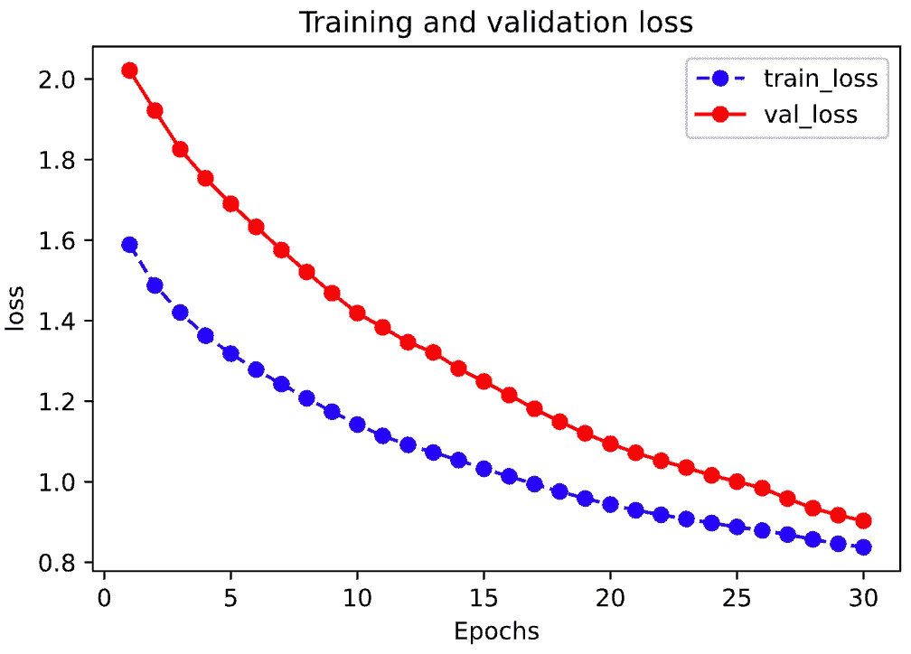

通过运行`plot_metric(history, 'accuracy')`绘制精度进度。

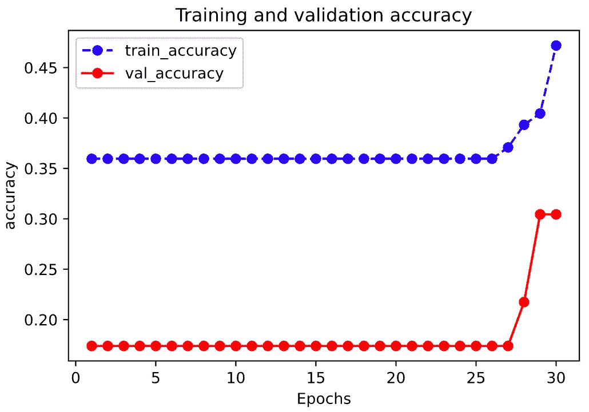

根据测试数据集测试我们的模型

```
model.**evaluate**(x = **X_test**,y = **y_test**)
```

我们应该得到一个具有损耗和精度的输出，如下所示:

```
38/1 [===] - 0s 139us/sample - **loss: 0.7776** - **accuracy: 0.6053**[0.8011450893000552, 0.6052632]
```

## 2.3 多输入多输出模型

具有多输入或多输出的模型是函数式 API 的良好用例。这里，我展示了 3 种不同的场景:

*   具有 2 个输入和 1 个输出的模型
*   具有 1 个输入和 2 个输出的模型
*   具有两个输入和两个输出的模型

**对于有 2 个输入和 1 个输出的模型。**假设我们有用于鸢尾花分类的图像数据和结构化数据。我们想建立一个机器学习模型，如下所示:

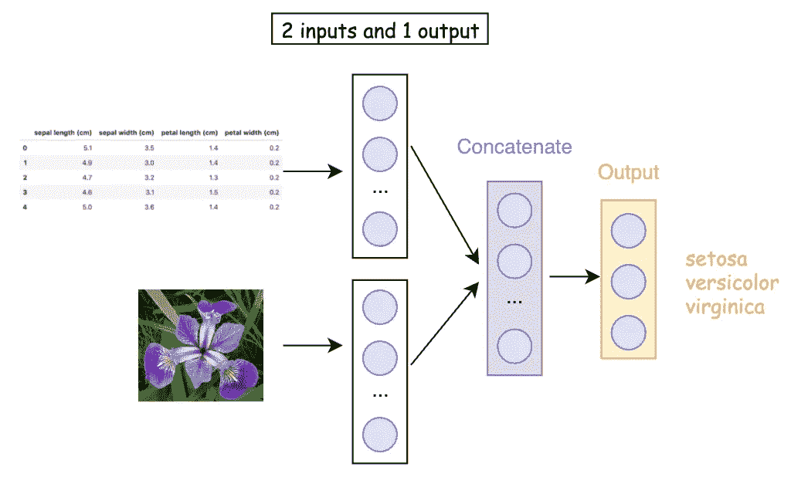

2 输入 1 输出神经网络

函数式 API 使得构建它变得很容易

```
from tensorflow.keras.layers import concatenate# 2 inputs, one structure data, the other image data
**input_structure = Input(shape=(4,), name='input_structure')
input_image = Input(shape=(256,), name='input_image')**# middle layers
x_1 = Dense(10, activation='relu')(input_structure)
x_2 = Dense(100, activation='relu')(input_image)**c = concatenate([x_1, x_2])**outputs = Dense(3, activation='sigmoid', name='outputs')(c)model = Model(**inputs=[input_structure, input_image], outputs=outputs**)model.summary()
```

为了获得 2 个不同的输入，我们需要使用`**concatenate([x_1, x_2])**`将它们连接起来。要定义一个有多个输入的模型，我们只需要指定一个输入列表`**inputs=[input_structure, input_image]**`。

如果全部运行成功，我们应该得到如下摘要:

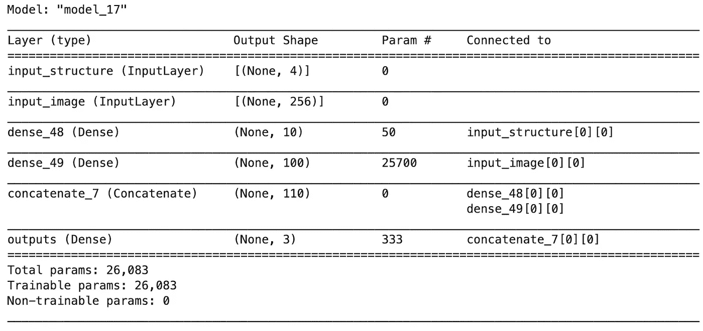

**对于有 1 个输入和 2 个输出的模型。**假设我们只有图像数据，任务是识别给定图像是否是花，如果是，是什么类型的鸢尾花？

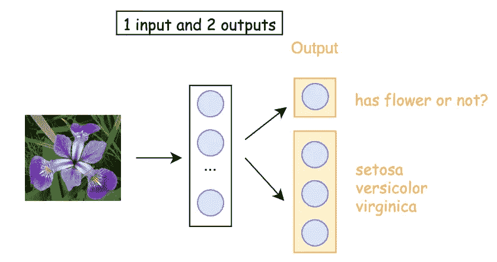

并用功能 API 来构建它

```
from tensorflow.keras.layers import concatenate# only one input
**input_image = Input(shape=(256,), name='input_image')**# middle layer
x = Dense(300, activation='relu')(input_image)# output layser
output_1 = Dense(1, activation='sigmoid', name='output_1')(x)
output_2 = Dense(3, activation='softmax', name='output_2')(x)model = Model(inputs=input_image, **outputs=[output_1, output_2]**)model.summary()
```

为了定义一个有多个输出的模型，我们只需要指定一个输出列表`**outputs=[output_1, output_2]**` **。**

如果一切顺利，我们应该会得到如下摘要。

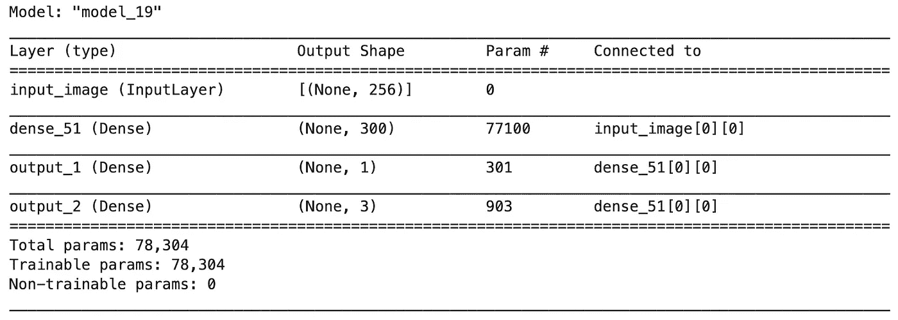

**对于有 2 个输入和 2 个输出的模型。**假设我们有结构化数据和图像数据。任务是识别图像中是否有鸢尾花，以及它是什么类型的鸢尾花。

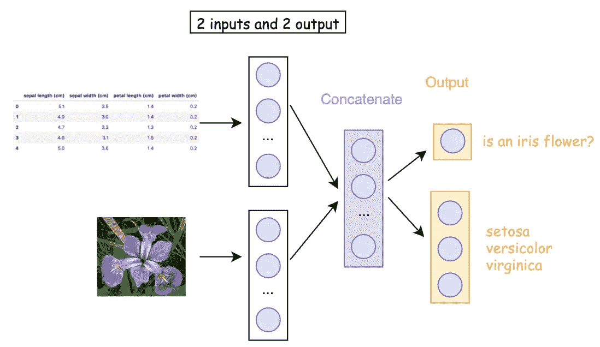

2 个输入和 2 个输出

有了函数式 API，构建它相当容易

```
from tensorflow.keras.layers import concatenate# 2 inputs, one structured data, the other image data
**input_structured = Input(shape=(4,), name='input_structured')
input_image = Input(shape=(256,), name='input_image')**# middle layers
x_1 = Dense(10, activation='relu')(input_structure)
x_2 = Dense(300, activation='relu')(input_image)**c = concatenate([x_1, x_2])**# output layser
**output_1 = Dense(1, activation='sigmoid', name='output_1')(c)
output_2 = Dense(3, activation='softmax', name='output_2')(c)**model = Model(**inputs=[input_structured, input_image], outputs=[output_1, output_2]**)model.summary()
```

要定义一个有多个输入和多个输出的模型，我们只需要使用`**concatenate([x_1, x_2])**`连接输入，并指定输入和输出列表来建模`Model(**inputs=[input_structured, input_image], outputs=[output_1, output_2]**)`。

如果一切顺利，我们应该会得到如下摘要。

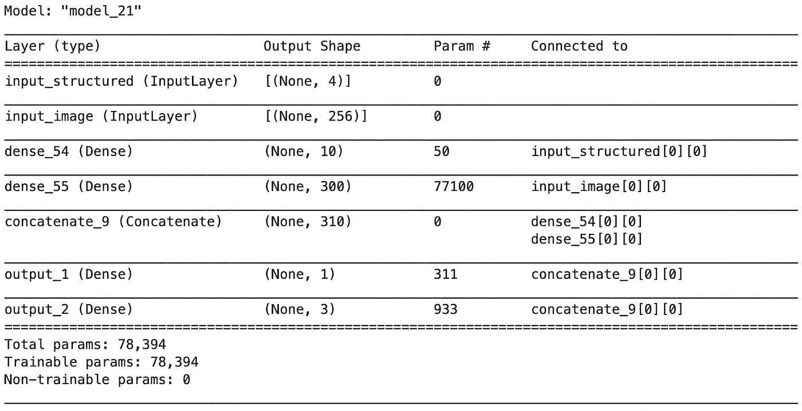

## 2.4 功能 API 中的共享层

函数式 API 的另一个好用途是使用共享层的模型。让我们来看看共享图层。

```
inputs = Input(shape=(4,))# a layer instance is callable on a tensor, and returns a tensor
**shared_layer = Dense(4, activation='relu')**# Now we apply the layer three times
x = **shared_layer**(inputs)
x = **shared_layer**(x)
x = **shared_layer**(x)
x = **shared_layer**(x)predictions = Dense(3, activation='softmax')(x)model = Model(inputs=inputs, outputs=predictions)model.summary()
```

一个层实例在张量上是可调用的，并返回一个张量，这就是我们如何创建一个共享层。

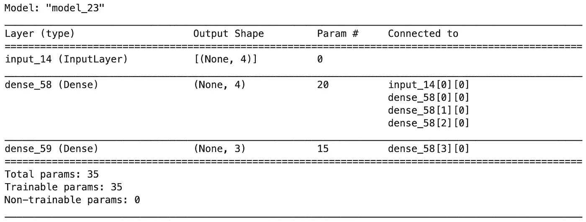

# 3.模型子类化

最后一种用 Keras 和 TensorFlow 2.0 实现机器学习模型的方法叫做**模型子类化**。这种构建模型的方式为您提供了对模型的构造和操作的低级控制。

让我们看看如何使用它来建立我们的虹膜流量分类器。

```
from tensorflow.keras.models import Model
from tensorflow.keras.layers import Denseclass **CustomModel(Model)**:

    def __init__(self, **kwargs):
        super(CustomModel, self).__init__(**kwargs)
        **self.dense1 = Dense(5, activation='relu', )
        self.dense2 = Dense(10, activation='relu')
        self.dense3 = Dense(3, activation='softmax')**

    def call(self, **inputs**):
        **x = self.dense1(inputs)
        x = self.dense2(x)
        return self.dense3(x)**my_custom_model = CustomModel(name='my_custom_model')
```

这个模型类`CustomModel`与我们使用顺序模型和函数式 API 制作的模型相同。事实上，顺序模型和函数 API 都继承自`Model`类。

如您所见，`CustomModel`继承自模型类。当模型子类化时要记住的基本结构是，我们在初始化器`__init__()`中创建层，并在`call()`方法中定义向前传递。

## 3.1 训练模型子类化模型

可以像顺序模型和函数 API 一样训练模型子类模型。

```
my_custom_model.compile(optimizer='rmsprop',
              loss='categorical_crossentropy',
              metrics=['accuracy'])history = my_custom_model.fit(X_train, y_train,
                    batch_size= 64,
                    epochs= 30,
                    validation_split=0.2)
```

如果一切运行顺利，您应该得到如下输出:

```
Train on 89 samples, validate on 23 samples
Epoch 1/30
89/89 [==============================] - 1s 13ms/sample - loss: 1.5281 - accuracy: 0.3596 - val_loss: 1.6140 - val_accuracy: 0.1739
Epoch 2/30
89/89 [==============================] - 0s 571us/sample - loss: 1.3818 - accuracy: 0.3596 - val_loss: 1.4869 - val_accuracy: 0.1739
Epoch 3/30
89/89 [==============================] - 0s 711us/sample - loss: 1.3231 - accuracy: 0.3596 - val_loss: 1.4209 - val_accuracy: 0.1739
Epoch 4/30
89/89 [==============================] - 0s 598us/sample - loss: 1.2934 - accuracy: 0.3596 - val_loss: 1.3799 - val_accuracy: 0.1739
......
......
Epoch 30/30
89/89 [==============================] - 0s 555us/sample - loss: 1.1350 - accuracy: 0.4831 - val_loss: 1.1362 - val_accuracy: 0.6087
```

我们也可以调用`my_custom_model.summary()`来显示它的内容:

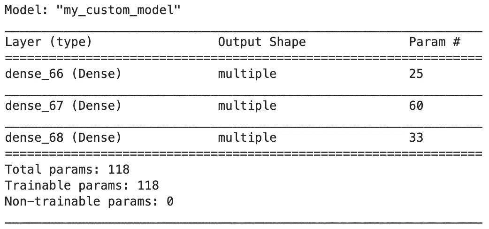

模型子类化摘要的输出

## 3.2 模型评估

这个模型可以像我们在顺序模型和函数式 API 中那样进行评估。

通过运行`plot_metric(history, 'loss')`来绘制损失进度。

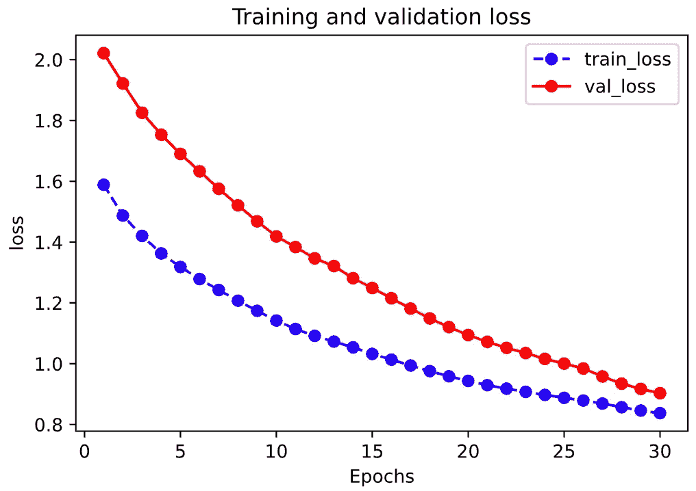

通过运行`plot_metric(history, 'accuracy')`绘制精度进度。

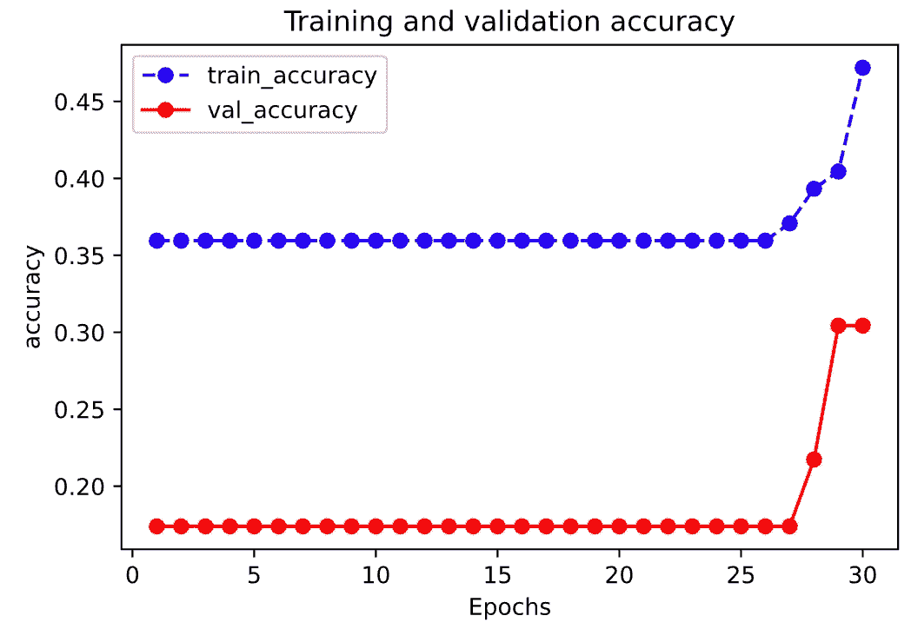

根据测试数据集测试我们的模型

```
my_custom_model.**evaluate**(x = **X_test**,y = **y_test**)
```

我们应该得到一个具有损耗和精度的输出，如下所示:

```
38/1 [===] - 0s 139us/sample - **loss: 1.1417** - **accuracy: 0.4737**[1.1410379598015232, 0.47368422]
```

## 3.3 什么时候使用模型子类化？

模型子类化为我们提供了对模型的构造和操作的低级控制。然而，它的灵活性给 bug 带来了更多的机会，而且比顺序模型和函数式 API 更难利用。模型子类化主要由研究人员用来实现奇异的架构或定制的层/模型，这是使用顺序模型和功能 API 不可能实现的。

因此，尽管模型子类化使我们能够做任何事情，我还是建议只在你真正需要的时候才使用这种方法。

# 就这样，接下来呢？

本文是快速介绍，主要是给大家展示用 Keras 和 TensorFlow 2 实现一个机器学习模型的三种不同方式。我已经尽量避免了很多机器学习的概念和配置，让这个教程对于初学者来说尽可能的简单。

请在我的 Github 上查看[笔记本的源代码。](https://github.com/BindiChen/machine-learning)

在实际项目中，使用 Keras 和 TensorFlow 2 构建模型时，需要考虑更多的配置。例如，优化器、损失函数、评估指标、批量、验证分割等。另外，本教程只使用了`Dense()`层，还没有提到任何关于深度学习的内容。

下一步是什么？既然有几个人问我超参数调优的问题，那我们下次就用网格搜索，随机搜索，超带算法做个教程吧。

如果你对机器学习的实用方面感兴趣，请继续关注。

# 参考

*   [1] [Keras 官方文档:何时使用顺序模型](https://keras.io/guides/sequential_model/#when-to-use-a-sequential-model)
*   [2] [Keras 官方文档:功能 API](https://keras.io/guides/functional_api/)