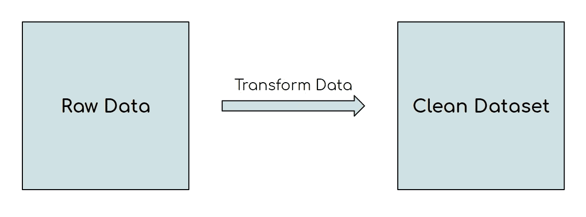

# 第一份工作前获得 SQL 实战经验的 3 种方法

> 原文：<https://towardsdatascience.com/3-ways-to-get-real-life-sql-experience-before-your-first-job-508c7346f9ca?source=collection_archive---------9----------------------->

## 如何在实际项目中发展您的 SQL 技能

由 fullvector 创建的技术向量—[www.freepik.com](http://www.freepik.com)

# 介绍

> “如果我没有任何 SQL 经验，如何获得数据分析师/数据科学工作？”

当我开始我的数据科学之旅时，我注意到能够获得实际的 SQL 经验是多么重要，如果你仍在努力获得第一份工作，或者如果你正在进行重大的职业转换，这可能会非常困难。

本文旨在解决这一问题。

下面是三种获得真实 SQL 体验的**有效**方法。您不仅可以解决实际问题，还可以在 GitHub 上展示这些问题，并将其添加到简历的项目部分！

本文将重点讨论三种类型的问题:

1.  从原始数据创建数据管道
2.  SQL 编码(面试)问题
3.  SQL 案例研究

# 1.从原始数据创建数据管道

询问任何数据科学家、数据分析师或数据工程师，他们都会告诉你将原始数据转化为干净、可用和可靠的数据是多么重要。创建可靠的数据管道的能力将使你在数据职业生涯中走得更远，所以为什么不现在就开始呢？

作者创建的图像

如果你不确定我的意思，看看上面的图片。在许多情况下，您将直接从其来源获得原始数据，并负责将其转换为与您的同事和利益相关者相关的表格。

下面是几个例子，如果你想出点子需要帮助，你可以自己尝试一下。这些例子使用来自 Kaggle 的数据集，所以我将创建一个新的笔记本，并使用 SQLite 直接在其中编写查询。

## 案例 1:苹果公司的乔布斯

假设这个数据集[在这里](https://www.kaggle.com/aesophor/raw-data)是一个存储苹果所有工作列表的活动表，但是你的经理只需要一个显示所有提到的不同技能的表，以及每个提到的技能按州细分的计数。

看看是否可以使用 SQL 操作数据来创建所需的表。

## 案例 2: Kickstarter 项目

这个数据集[在这里](https://www.kaggle.com/kemical/kickstarter-projects)包含了许多 Kickstarter 项目及其细节。

看看您是否可以使用 SQL 操作该表，以便显示每个类别的项目数量、每个类别的平均目标金额、每个类别的平均承诺金额、每个类别达到目标的项目百分比，以及每个类别从启动到截止日期的平均时间。

# 2.SQL 编码问题

Leetcode 和 [Hackerrank](https://www.hackerrank.com/) 是很棒的资源，它们帮助我学会了我从来不认为可能的技能和技巧。这是我在找工作时充分利用的东西，也是我会经常回去查阅的资源。

这类网站最大的好处是它们通常有推荐的解决方案和讨论板，所以你可以了解更有效的解决方案和技术。

不确定从哪里开始？以下是一些你可以尝试的好问题:

1.  [查找重复邮件](https://leetcode.com/problems/duplicate-emails/)
2.  [排名分数](https://leetcode.com/problems/rank-scores/)
3.  [员工收入高于经理](https://leetcode.com/problems/employees-earning-more-than-their-managers/)
4.  [温度上升](https://leetcode.com/problems/rising-temperature/)
5.  [行程和用户](https://leetcode.com/problems/trips-and-users/)

# 3.SQL 案例研究

作为数据分析师/数据科学家，案例研究是模拟现实生活问题的最佳方式。Mode 提供了三个模拟真实业务问题的实用 SQL 案例研究，以及一个在线 SQL 编辑器，您可以在其中编写和运行查询。Mode 提供了 3 个案例研究，我将在下面介绍:

***要打开 Mode 的 SQL 编辑器，请转到*** [***此链接***](https://mode.com/sql-tutorial/intro-to-intermediate-sql/) ***并点击显示“打开另一个模式窗口”的超链接。***

## 案例研究 1:调查用户参与度的下降

[**链接到案例**](https://mode.com/sql-tutorial/a-drop-in-user-engagement/) **。**

本案例的目的是确定 Yammer 项目用户参与度下降的原因。在深入研究这些数据之前，您应该先阅读一下 Yammer 的概述[这里的](https://mode.com/sql-tutorial/sql-business-analytics-training/)。您应该使用 4 张表。

到案例的链接将为您提供关于问题、数据和应该回答的问题的更多细节。

如果您需要指导，请点击此处查看我是如何完成这个案例研究的。

## 案例研究 2:了解搜索功能

[**链接到案例**](https://mode.com/sql-tutorial/understanding-search-functionality/) 。

这个案例更侧重于产品分析。在这里，您需要深入研究数据，确定用户体验是好是坏。这个案例的有趣之处在于，由你来决定什么是“好”和“坏”以及如何评估用户体验。

## 案例研究 3:验证 A/B 测试结果

[**链接到**](https://mode.com/sql-tutorial/validating-ab-test-results/) **。**

最实际的数据科学应用之一是执行 A/B 测试。在本案例研究中，您将深入研究 A/B 测试的结果，其中对照组和治疗组之间存在 50%的差异。在这种情况下，您的任务是在彻底分析后验证或否定结果。

# 感谢阅读！

我相信完成这些项目会给你知识和信心，让你在实践中获得成功。一如既往，我祝你在努力中好运！:)

不确定接下来要读什么？我为你挑选了另一篇文章:

 [## 数据科学面试中你应该知道的十个 SQL 概念

### 学习聪明，不努力。

towardsdatascience.com](/ten-sql-concepts-you-should-know-for-data-science-interviews-7acf3e428185) 

## 特伦斯·申

*   *如果你喜欢这个，* [*在 Medium 上关注我*](https://medium.com/@terenceshin) *了解更多*
*   *关注我关于*[*Kaggle*](https://www.kaggle.com/terenceshin)*了解更多内容！*
*   *我们连线上*[*LinkedIn*](https://www.linkedin.com/in/terenceshin/)
*   *有兴趣合作吗？查看我的* [*网站*](http://Want to collaborate?) *。*
*   *查看* [*我的免费数据科学资源*](https://docs.google.com/document/d/1UV6pvCi9du37cYAcKNtuj-2rkCfbt7kBJieYhSRuwHw/edit#heading=h.m63uwvt9w358) *每周都有新素材！*