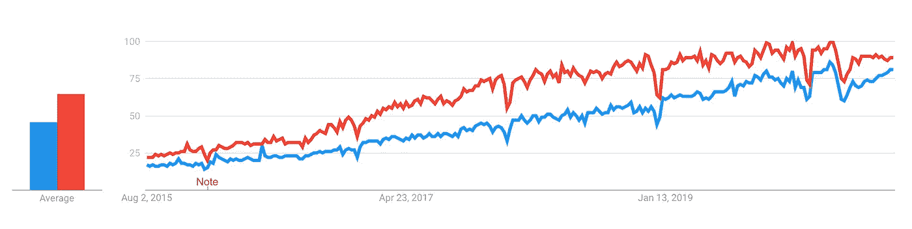

# 作为数据科学家赚取额外收入的 3 种方法

> 原文：<https://towardsdatascience.com/3-ways-to-make-extra-income-as-a-data-scientist-eed02749208c?source=collection_archive---------4----------------------->

## 建立收入来源来补充或取代你朝九晚五的工作。

毫无疑问，数据科学是一个利润丰厚的职业。来自 [Glassdoor](https://www.glassdoor.com/Salaries/data-scientist-salary-SRCH_KO0,14.htm) 的最新报告称，美国数据科学家——所有行业、所有公司类型，与工作经验无关——的平均年薪为 11.33 万美元。相比之下，2020 年第一季度美国的薪酬中值为[4.97 万美元](https://www.thebalancecareers.com/average-salary-information-for-us-workers-2060808)。

照片由[莎伦·麦卡琴](https://unsplash.com/@sharonmccutcheon?utm_source=medium&utm_medium=referral)在 [Unsplash](https://unsplash.com?utm_source=medium&utm_medium=referral) 拍摄

这只是美国的情况，实际数字因国家而异，但让我们假设比率大致相同——平均而言，数据科学家的平均收入大约是世界任何地方普通居民的两倍。

但是，做同样的工作，怎么可能从 11.3 万美元涨到 20 万美元呢？
这就是副业收入的威力发挥的地方。作为一名数据科学家，你有潜力赚很多钱。

原因有很多。让我们通过[谷歌趋势](https://trends.google.com/)来探索*数据科学*和*机器学习*的趋势:

蓝色:数据科学；红色:机器学习

这是 5 年的数据，这两个术语之间似乎有很强的关系(如预期的那样)。此外，我们可以清楚地看到趋势是积极的。我怀疑我们可以期待任何时间很快会有任何剧烈的变化。

另一个显而易见的原因是你技能的价值。我在各种脸书小组中看到许多初学者问一些任何有 6 个月经验的人都能毫不费力回答的问题。向完全的初学者教授基础知识可能是一个可行的方法，但稍后会有更多的介绍。

在今天的文章中，我将与你分享我每天使用的赚取额外收入的三大方法。这三个因素使我在不到一年的时间里收入增加了 2.5 倍。大部分额外收入来自第一条建议，所以让我们直接跳到它。

# #1:写博客

拥有一个博客会影响你职业生活的方方面面。我将整篇文章都献给了这个主题，所以可以随意阅读:

 [## 拥有一个博客如何推进你作为数据科学家的职业生涯

### 提示:这也适用于其他职业

towardsdatascience.com](/how-having-a-blog-can-advance-your-career-as-a-data-scientist-245270cc281e) 

概括一下，以下是写博客的最大好处:

*   你可以更深入地学习事物
*   出色的声誉建立者——带来更多的工作机会
*   惊人的收入潜力

我建议你通读这篇文章以获得深入的解释，因为它只有 5 分钟的阅读时间。撰写数据科学文章或任何技术主题的文章需要首先对主题有很好的理解。成为一个成功的博客需要你用最简单的词语解释复杂的话题，这将进一步帮助你理解。

我知道你现在的想法——在我开始写作之前，我需要多年的经验——这与事实相去甚远。事实是，你只需要比你的目标读者领先**一步**。就是这样。我来详细说明一下。

假设你想写关于[的主成分分析](/principal-component-analysis-pca-from-scratch-in-python-7f3e2a540c51)。要做到这一点，你需要对主题有一个像样的理解，你的目标读者要么是对 PCA 一无所知的人，要么是理解得不够好的人。因此，你只比你的读者领先一步，因为你对 PCA 的了解足以解释它。

另外，写一篇教育性的文章首先是学习某个主题的一个很大的动力。放轻松，不要想太多。没有人会因为你犯了一些错误而怨恨你，即使有人怨恨，那也是他们的问题。

即使你做的每件事都是对的，仍然有很大的可能会有没事可做的人来纠正你的语法，所以要学会忽略它。

# #2:教育视频

我发现教育视频是补充你博客的好方法。以文本和视频的形式报道相同的主题会让你的内容更加清晰可见。

不是每个人都想通读一篇难懂的科技文章。此外，有些主题过于直观，无法用文本进行深入解释。我一直记得来自 [3Blue1Brown](https://www.youtube.com/watch?v=fNk_zzaMoSs&list=PLZHQObOWTQDPD3MizzM2xVFitgF8hE_ab) 的线性代数视频。
*你能想象从课本上学习线性代数这样复杂的题目吗？*这很可能是你最初学习的方式，但你的理解有多好呢？

我敢打赌，你已经记住了如何为了考试而计算东西，但完全错过了事物在视觉层面上如何工作的更大图景。这没什么丢人的，因为我们都经历过。我再说一遍，有些事情通过视频可以更好地解释。

*好吧，那么你有哪些制作数据科学视频的选择？*

嗯，第一个也是最明显的一个是 **YouTube** 。只要不违反他们的内容政策，你基本上可以上传任何东西，但新手很难赚钱。我来解释一下原因。

要想在 YouTube 上赚钱，你需要至少 1000 名订户，并且在去年至少有 4000 小时的公众观看时间。对于初学者来说，这不是一件容易的事情。我的频道还没有上线，但我希望它会很快上线。你需要投入大量的时间才能看到结果，一般来说，制作视频比你想象的要花更多的时间。

我知道在制作了我的第一个视频后，我感到很累，尽管我已经准备好了代码。

## 但是我的母语不是英语

我也不是，而且我对说英语给世界听的想法不是最舒服的。谷歌一下*斯拉夫口音*——你马上就会明白为什么。您可以:

*   不管怎样，忍着点去做吧
*   使用文本到语音转换软件

后一种选择让我受益匪浅，因为随着时间的推移，这些工具变得越来越好。 [IBM 的 Watson TTS](https://www.ibm.com/cloud/watson-text-to-speech) 是一个廉价入门的好方法。

如果你觉得 YouTube 太饱和了，还有其他平台可以考虑。我想到的一个是 *Udemy* ，但是我对它们没有任何经验，所以我会把它留给你去研究。

# #3:联盟营销

时不时地，你会读一本很棒的书或看一堂很棒的课程。如果你认为这是他们可以从中受益的东西，没有理由不与你的观众分享。

你可以用两种方式推荐这本书或一门课程:

*   通过正常的链接
*   通过附属链接

唯一的区别是联盟链接会为你的每次购买/订阅赚取一些钱，而正常的不会。如果有人决定购买一本书或一门课程，链接的类型对他们来说并不重要。此外，如果他们喜欢你的内容，他们很有可能会支持你。

我最近的一篇文章是这种想法的一个很好的例子:

 [## 数据科学的最佳入门统计学书籍

### 了解数据科学最重要的支柱

towardsdatascience.com](/the-single-best-introductory-statistics-book-for-data-science-a2601ea7c0be) 

所以，简单地说，我读了一本很棒的书。我 100%确定至少我的观众中有人能从中受益，所以我写了一篇简短的评论并放了一个联盟链接。这是双赢的局面。

然而，你应该小心联盟营销。我永远不会推荐我没有亲自读过或看过，也不是 100%满意的东西。这是联盟营销的一大禁忌，因为当你不知道自己在说什么时，读者很容易感觉到。

*那么，从哪里开始呢？*

亚马逊有一个惊人的联盟计划，我用它来推荐高质量的书籍。
[Udemy](https://www.udemy.com/affiliate/) 有一个很棒的程序，我用它来推荐在线课程。

# 在你走之前

作为一名数据科学家，你有很大的收入潜力，这不应该仅限于你工作的公司愿意付给你多少钱。随着时间的推移，你的收入会翻倍——这是有保证的。这取决于你努力工作，直到它发生，但它将不可避免地发生。

然后你可以自由选择是否朝九晚五真的值得，因为你的大部分额外收入将是被动的，这意味着你不需要真的为之工作。

只要投入时间并相信这个过程。你会成功的。

*喜欢这篇文章吗？成为* [*中等会员*](https://medium.com/@radecicdario/membership) *继续无限制学习。如果你使用下面的链接，我会收到你的一部分会员费，不需要你额外付费。*

 [## 通过我的推荐链接加入 Medium-Dario rade ci

### 作为一个媒体会员，你的会员费的一部分会给你阅读的作家，你可以完全接触到每一个故事…

medium.com](https://medium.com/@radecicdario/membership) 

[**加入我的私人邮件列表，获取更多有用的见解。**](https://mailchi.mp/46a3d2989d9b/bdssubscribe)