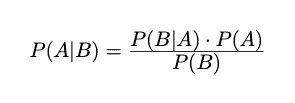
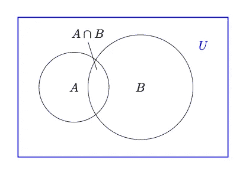
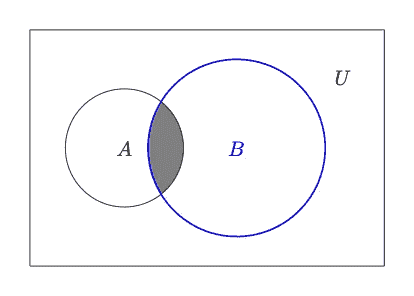
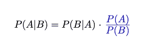
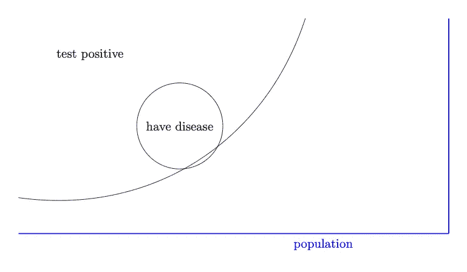
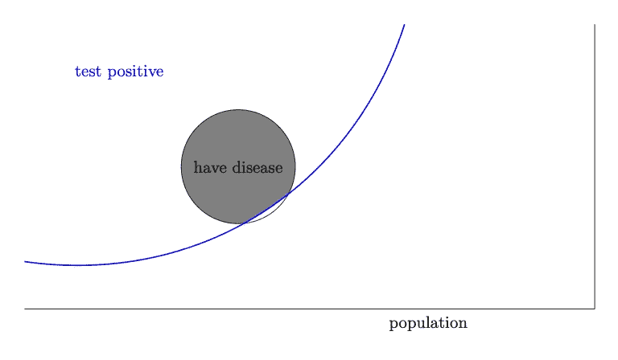

# 思考贝叶斯法则的三种方式

> 原文：<https://towardsdatascience.com/3-ways-to-think-about-bayes-rule-b6f5b4ef87d6?source=collection_archive---------8----------------------->

## 对“引擎盖下”真正发生的事情发展直觉

贝叶斯法则是数据科学的核心。它也是所有科学的基础和批判性思维的关键工具。不幸的是，它经常被教成只是一个要记忆的公式，花在真正探究正在发生的事情上的时间太少。当第一次有人教我这个的时候，我真的很难接受，这是我希望当时有人告诉我的。

## 预赛

贝叶斯法则相对简单:

英语中，**“给定 B 的条件概率等于给定 A 的 B 的条件概率乘以 A 的概率再除以 B 的概率”**如果这看起来很拗口，不用担心；视觉上会更有感觉。

证明也很简单:
根据定义， **P(X|Y) = P(X ⋂ Y) / P(Y)** ，所以 **P(X ⋂ Y) = P(X|Y) P(Y)。**
**p(a⋂b)= p(b⋂a)**
**p(a | b)p(b)= p(b | a)p(a)
p(a | b)= p(b | a)p(a)/p(b)**

到目前为止，这只是一个有证明的公式，一些需要记忆和应用的东西。幸运的是，有一些思考方式让它感觉更自然，并提供一些关于真实发生的事情的见解。

## 1.重新构建宇宙

第一种是可视化方法，将公式的右侧分解为 3 个步骤，每个步骤都有清晰的图形解释。把宇宙想象成一个实验所有可能结果的集合。例如，掷骰子的宇宙 U 是{1，2，3，4，5，6}。但是如果我告诉你我掷出了一个偶数，而你不知道是哪一个，那就把 U 缩小到{2，4，6}。我们在这里做同样的事情，但是用图形来说明。

首先，我们的基本设置:

我们有两个事件，A 和 B，它们有时会一起发生:A ∩ B .我们的宇宙 U 是一切可能发生的事情，面积代表概率。因为它是我们现在所有其他事情的参考框架，我们用蓝色突出显示它。

**第一步:P(B|A)**

这是我们的起点——一个条件概率，但不是我们真正想要的。在某种意义上，这给了我们一个新的、更小的宇宙:A(用蓝色突出显示)。我们感兴趣的事件是灰色区域 a**⋂**b。area(a**⋂**b)/area(a)回答问题，“如果我们已经知道 a 已经发生了，b 的可能性有多大？”

**第二步:p(b | a)****p(a)**=**p(a⋂b)**

这是我们将画面拉回到原始宇宙的方式。感兴趣的事件 A **⋂** B 保持不变，但是宇宙(我们概率分数的分母，如果你愿意的话)变大了。

**第三步:****P(B | A)****P(A)**/**P(B)= P(A | B)**

最后，我们通过除以 P(B)把宇宙缩小到 B。感兴趣的事件仍然没有改变。现在我们有了 P(A|B)，我们感兴趣的贝叶斯法则的左边。

对于以视觉为导向的学习者(大多数人)，这是一种令人满意且直观的思考概率的方式。只要你能描绘出“框架”移动来收缩或拉伸我们的宇宙，你就能描绘出贝叶斯法则到底发生了什么，希望这能帮助你理解为什么它总是正确的。它甚至可以帮助你记住公式。

## 2.更新我们的先验 P(A):

这是真正的统计学家谈论贝叶斯法则时最常用的词汇。“贝叶斯更新”是每个科学分支中的一个重要概念。它的基本主旨是，虽然我们最终想知道 P(A|B ),但我们从我们的先验概率 P(A ),即 A 的无条件概率开始。在此基础上，我们使用 P(B|A)和 P(B)将 P(A)调整到它应该在的位置——这是我们在考虑所有相关信息后现在知道的。

我喜欢把 P(B|A)/P(B)想象成一个比例因子，我们用它来更新 P(A)。本质上，我们用 P(B|A)/P(B)来加权 P(A ),以确定我们应该根据新信息改变我们的先验多少。

我们可以认为我们的比例因子是“A 产生 B 的可能性有多大”。如果 A 和 B 是独立的，这将是 1。如果不相交，则为 0。如果是同一事件，则为 1/ **P(B)** =1/ **P(A)** 。如果 A 的发生使 B 发生的概率增加了λ倍，那么给定 B 的条件概率应该比 P(A)大λ倍。

如果你仍然不知道为什么这是真的，就用等式
**P(A | B)**/**P(A)**=**P(B | A)**/**P(B)**把它想成: ***“多了多少可能性* B *使得*A*“=”多了多少可能性*A 右边是我们的比例因子，而左边包含我们的起点和终点。**

万一你不明白为什么*必须*是真的，A 增加 B 的概率正好等于 B 增加 A 的概率，看看下面明显是真的等式，尤其是第二个。(提示:取消什么？每个分数代表哪个概率？分数的每个乘积代表什么？)这是很好的锻炼。如果你愿意，让 Area(U)=1。

贝叶斯法则的高明之处在于，它将我们在日常生活中如何做决定的关键观点形式化了。我们从关于现实的基线信息开始，通常是假设。每一点点新信息都会导致我们更新我们的信念，当然，除非它完美地证实了我们的信念(不幸的是，我们经常发现新信息比我们应该的更加确定——工作中的确认偏差)。或者至少新的证据*应该*促使我们更新信念，因为这是理性的一个重要组成部分。

如果我们已经很自然地做到了这一点，为什么我们还需要贝叶斯法则？好问题。问题是，在一些情况下，包括一些非常高风险和重要的情况，我们的猴脑直觉会崩溃，将这种信念更新的过程形式化可以帮助我们避免错误。我们稍后将考虑一个这样的例子。

## 3.调整“其他”条件概率 P(B|A)

如果已知给定 A 的 B 的条件概率，但想得到另一个条件概率 P(A|B)，我们只需要知道两个事件的无条件概率。从一个条件概率到另一个条件概率，我们需要做的就是乘以无条件概率的比率。以这种方式陈述，这种关系可能看起来令人惊讶或随机，但形象地思考它可以帮助你明白为什么它一定是真的。

事实上，这可能看起来只是视觉解释的一种不太有用的重述，但事实证明，作为一名数据科学家，这是一种特别好的思考方式。这是因为它允许我们从回忆到精确，反之亦然。一旦我们看到了一个例子，我们将详细讨论这个问题，这样会更有意义。

需要注意的是，这些都是思考贝叶斯法则的等价方式。你不需要在脑子里把它们都变戏法。如果有一个真的合你意，那就用那个。我发现通常在不同的情况下，一个比另一个更有意义。

# 经典贝叶斯例子

让我们来看看这三种解释中的每一种在现实世界中的应用。考虑以下场景:

*   有一种罕见的疾病困扰着 0.01%的人口
*   有一种检测这种疾病的方法可以检测出 98%的病例
*   只有 1%的人检测出该疾病呈阳性

(注:具体数字没太大关系。我们可以选择不同的数字。一个有趣的练习是一次改变一个数字，看看每次改变对结果有什么影响。)

为了简单起见，我们可以重命名我们的事件，并确定哪个概率在公式中的位置:

*   A = {你有这种病}
*   ā= {你没有病}
*   B = {你测试呈阳性}
*   b̅= {你测试阴性}
*   P(A) = 0.0001
*   p(ā)= 0.9999
*   P(B) = 0.01
*   P(B̅) = 0.99
*   P(B|A) = 0.98
*   P(A|B) =？

注意，这里我们没有明确给出 **P(A ⋂ B)** 。不过，这是隐含的，如果必要的话，计算起来并不困难。

现在，我们准备将这三种解释应用到我们的数字中。

## 解释#1(视觉)

由于患有这种疾病的人群非常少，我们只能放大到我们宇宙的一个小角落。这不是完全按比例绘制的，但对我们的目的来说已经足够接近了。

**第一步:P(B | A)** 从我们知道的条件概率开始:如果你确实患有疾病，正确诊断的概率。

**第二步:P(B | A) P(A) = P(A ⋂ B)** 乘以 P(A)得到交集的概率。我们也可以认为这是对条件概率的“去条件化”。

**第三步:P(B | A)P(A)****/****P(B)= P(A | B)** 现在我们再放大，但是到一个不同的宇宙(B)，给我们真正关心的条件概率。

这个故事的寓意是什么？测试非常罕见的疾病是非常困难的。这并不是说考试本身很糟糕；只是当这么少的人患有这种疾病时，不可能有很多假阳性，而不会使测试对那些测试阳性的人非常不可靠。这是医生使用多种测试的一个原因，像这种假设的测试被用来筛选谁应该接受进一步的(通常更昂贵的)测试。毕竟，它的召回率真的相当高——在患有疾病的人中，它检测到了绝大多数人(代价是警告了更多健康的人→低精度)。

## 解释#2(更新信念)

在这个框架下，你去看医生，假设你得这种病的概率是 0.01%，或者 0.0001。然后，你将利用测试结果来更新你对自己是否患有这种疾病的信念。

结果是，你的测试呈阳性。所以你需要用
P(B|A) / P(B) = 0.98/0.01 = 98 来衡量你的信念。这听起来很多——你有 98 倍以上的把握确定自己患有这种疾病。这里的好消息当然是你更新后的概率 P(A|B) = 98 P(A) = 98 0.0001 = 0.0098，即 0.98%。换句话说，你仍然有不到 1%的机会真正患上这种疾病。

在这个上下文中，比例因子到底是什么意思？它本质上告诉我们，相对于在人群中随机选择的任何人[=P(B)]，当你患有疾病时，你得到阳性的可能性有多大。这个比例很大的事实告诉我们，我们应该通过增加我们对自己患有疾病的相信程度来相应地更新。在这种情况下，如果我们患有这种疾病，我们检测阳性的可能性是 98 倍，所以我们采用 0.01%的事前比率，并将其放大 98 倍。换句话说，1/10，000 的人患有这种疾病，但 1/10，000 的测试阳性者中有 98 人确实患有这种疾病，所以阳性诊断会让你相应地更新你的信念。

练习:为了看到这个测试的好处，考虑一下如果测试结果是阴性的话，比例因子会是多少。

## 解释#3(回忆的精确性)

在这种解释中，你从“其他”条件概率开始，用无条件概率的比率来衡量它，以获得我们对你患有该疾病的最终相信程度。

“如果我真的患有这种疾病，我检测呈阳性的概率有多大？”这个问题我们已经有了答案如果你已经检测为阳性，现在你想从那里得到你患这种疾病的概率。就像在第二个范例中一样，我们对它进行缩放，以获得我们最终的信任度。

在这种方法中，比例因子为 P(A) / P(B) = 0.0001/0.01 = 0.01。
所以 P(A | B)= 0.01 P(B | A)= 0.01 0.98 = 0.0098。

当然，我们得到了与上面相同的答案，但有趣的部分是我们如何到达那里的不同。

有趣的是，我们可以从精确度和召回率的角度来看这个问题。高精度意味着很少的假阳性，高召回意味着很少的假阴性。我们知道，测试中的高召回率(99%)意味着更高的精确度，保持所有其他因素不变(因为两个公式的 TP 都在增加)。但是我们需要把其他因素考虑进去，才能知道高召回率是否真的转化为高精确度，在这种情况下，它不是。

这是为什么呢？我们的比例因子 P(A)/P(B)告诉我们，对于我们人口中随机选择的个体，实际患有该疾病的概率远低于检测为阳性的概率。事实上，它告诉我们，你测试呈阳性的可能性是你患病的 100 倍。因此，尽管绝大多数患病者都能被准确检测出来，但他们仍将是所有检测呈阳性者中的少数。

换句话说，我们的比例因子将假阴性的数量与假阳性的数量进行比较。这并不完全是它们的比率，而是每一个与真阳性数量相加的比率。

简而言之:从回忆开始，然后通过“与得到阳性诊断相比，患这种疾病的可能性有多大”来衡量，以获得精确度。在下一节，也是最后一节，我们将详细介绍这一点。

## 额外收获:根据精确度和召回率重新陈述贝叶斯法则

作为一个临时演员，让我们深入研究这个问题，并展示贝叶斯法则与精确度和召回率之间的关系。

设置:

*   TP，TN，FP，FN 是真/假阳性/阴性
*   A = TP + FN(所有实际患病的人)
*   B = TP + FP(所有疾病检测呈阳性的人)
*   A **⋂** B = TP
*   P(A ⋂ B) = TP / (TP + TN + FP + FN)
*   P(A) = (TP + FN) / (TP + TN + FP + FN)
*   P(B) = (TP + FP) / (TP + TN + FP + FN)
*   prec = TP/(TP+FP)= p(a⋂b)/p(b)= p(a | b)
*   rec = TP/(TP+fn)= p(a⋂b)/p(a)= p(b | a)

派生:

*   P(A|B) = P(B|A) P(A) / P(B)
*   Prec = Rec P(A) / P(B)
*   prec = Rec((TP+FN)/(TP+TN+FP+FN))/((TP+FP)/(TP+TN+FP+FN))
*   **Prec = Rec (TP + FN) / (TP + FP)**

当我们这样陈述时，它似乎是微不足道的。“精确就是回忆，只不过你取消了让它回忆起来的那部分，加上了让它精确的那部分。”我们可以更进一步

*   Prec = Rec Prec / Rec

这是显而易见的，一点帮助都没有。不过，这种方法的真正价值在于，我们现在有办法将两个不同的概念联系在一起，这两个概念有时被视为完全不同，但实际上密切相关。