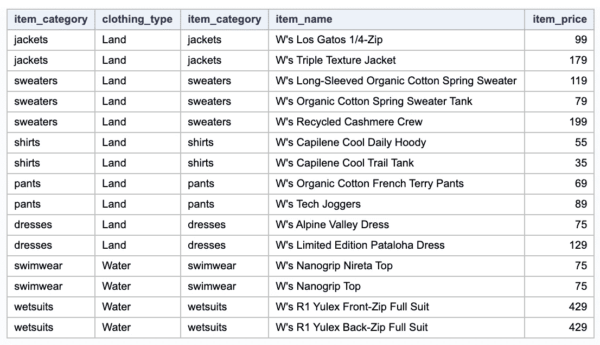

# 使用 SAS-SQL 转变您的 SAS 数据工作流的 3 种方式

> 原文：<https://towardsdatascience.com/3-ways-to-transform-your-sas-workflow-with-sas-sql-e121968b2029?source=collection_archive---------58----------------------->

## 用 SAS？利用 SQL 来简化您的工作。


照片由 [Roma Ryabchenko](https://unsplash.com/photos/f9qtLeroLNQ) 在 Unsplash 上拍摄

1.  介绍
2.  在 SAS 中使用 SQL 的好处
3.  示例数据集
4.  示例 1:连接数据集
5.  示例#2:向新列添加值
6.  示例#3:选择列中的唯一值
7.  结论

**1。简介**

作为一个必须在新的工作场所快速掌握 SAS 的人，我很高兴看到我可以使用我现有的 SQL 知识来补充我公司主要使用 SAS 的分析团队。一般来说，我发现在 MySQL 和 PostgreSQL 等其他 SQL 平台上可以做的大多数事情都是适用的，尽管语法可能会有所不同。

在对我们现有的 SAS 代码进行了一些故障排除之后，我能够向我的同事展示 SQL 可以改进我们工作流的一些方便的方法。下面我用三个例子来演示其中的一些方法。

**2。在 SAS 中使用 SQL 的一些好处**

1.  **可读性** — SQL 可读性强，学习直观。
2.  SQL 可以一步完成**操作、汇总、排序等多种功能。**
3.  如果您已经了解 SQL，并且是 SAS 新手，您可以**立即开始为您的团队做出贡献。**
4.  结合 SQL 和 SAS 数据步骤可以简化工作流程。
5.  SQL 是大多数数据库使用的 ANSI 标准语言。

**3。我们的示例数据集**

我们在示例中使用的两个表来自 Beth Morrison 创建的[巴塔哥尼亚服装数据集。注意，对于这些例子，我使用的是 SAS Studio](https://www.kaggle.com/kerneler/starter-patagonia-clothing-ded30fa1-c) ，尽管同样的语法也可以用在其他 SAS 平台上，比如 SAS Viya 或 SAS Enterprise。


“服装 _ 类别”表。图片作者。


“服装 _ 列表”表。图片由作者提供。

**4。示例 1:连接数据集**

假设您想找出“服装列表”表中哪些服装适合陆地或水域。在这种情况下，您需要使用公共列“item_category”将“clothing_category”表连接到“clothing_list”表。

SAS: 在 SAS 中将表连接或合并在一起的等效操作可能是一个多步骤的过程。[请在此参考 SAS 文档](https://documentation.sas.com/?docsetId=lrcon&docsetTarget=n1tgk0uanvisvon1r26lc036k0w7.htm&docsetVersion=9.4&locale=en#p1ozz99fzn4gtan1hohd44leeod1)。

**SQL:** 用 SQL-SAS 连接表很简单，可以节省时间。注意，SQL-SAS 中的“JOIN”和“LEFT JOIN”是相同的。

```
PROC SQL;
SELECT *
FROM clothing_category
JOIN clothing_list
    ON
clothing_category.item_category = clothing_list.item_category;
QUIT;
```



上述连接产生的输出表。现在，您可以看到“服装列表”表中的“物品类别”与“服装类别”表中的“土地”或“水”值相匹配。图片由作者提供。

**5。示例 2:向新列添加值**

假设您希望根据另一列的值为新列赋值。这里，我们将添加一个列，该列的值将指定“clothing_list”中的每件商品的价格是低于 100 美元还是高于 100 美元。

**SAS:** 在 SAS 中，您可以运行一个数据步骤，使用 LENGTH 函数创建一个新列“price_category”，然后使用“IF-THEN-ELSE”语句为该列中的行赋值。

```
DATA work.output_table;
SET work.clothing_list;
LENGTH price_category $50.; 
    IF item_price < 100 THEN price_category = 'Less than $100';
    ELSE IF item_price > 100 THEN price_category = 'More than $100';
    ELSE price_category = 'Not available';
RUN;
```

**SQL:** 您可以在 SQL-SAS 中使用 CASE WHEN 语句，而不是使用带有多个 IF 语句的 SAS 来运行数据步骤。这也为您提供了在**单步**中进行聚合(分组依据)、排序(排序依据)等操作的灵活性。

```
PROC SQL;
SELECT item_category, item_name, item_price,
 (CASE
        WHEN item_price < 100 THEN 'Less than $100'
        WHEN item_price > 100 THEN 'More than $100'
        ELSE 'Not available'
  END) AS price_category
FROM work.clothing_list
;
QUIT;
```

运行上述任一代码块都将输出下表:


请注意“价格类别”列。图片由作者提供。

**6。示例#3:选择列中的唯一值**

假设您想在一个列中查找唯一值，例如商店中服装的唯一商品价格的数量。这就是 SAS-SQL 中的 **SELECT DISTINCT** 大放异彩的地方。

**SAS:** 在 SAS 中，您可以使用 PROC SORT 找到唯一值:

```
PROC SORT DATA = work.clothing_list
          OUT = work.unique_values
          (KEEP = item_price) 
          DUPOUT = work.duplicate_table
          (KEEP = item_price) 
          NODUPKEY
          ;
    BY item_price; /*this is the column of interest*/
RUN;
```

在这种情况下，SAS 的优点在于,“DUPOUT”选项除了输出包含唯一商品价格列表的“work.unique_values”表之外，还输出“work.duplicate_table”表中额外重复值的表。您还可以选择输出整个匹配行。

“NODUPKEY”告诉 SAS 只保留输出表中 BY 语句中列出的列的每个唯一值的第一个匹配项。


工作中的重复项目价格。重复 _ 表格。图片作者。


作品中独特的物品价格。唯一值表。这里可以看到“75”和 429”也在这个表中。图片由作者提供。

**SQL:** 在 SQL 中，只需编写如下几行代码，就可以获得与上面的表相同的输出，其中包含唯一的值。注意:这不会输出带有额外重复行的表。

```
PROC SQL;
SELECT DISTINCT item_price
FROM clothing_list;
QUIT;
```

7。结论

我希望这能帮助您更多地了解在 SAS 中使用 SQL 的潜力！在实践中，我发现使用 SAS 数据步骤和 SQL 代码块最适合我的数据准备工作。

您如何在 SAS 中使用 SQL 来改进您的工作流程？想了解 SQL-SAS 如何节省您的时间并简化您的代码吗？请在下面的评论中告诉我！

—吉米