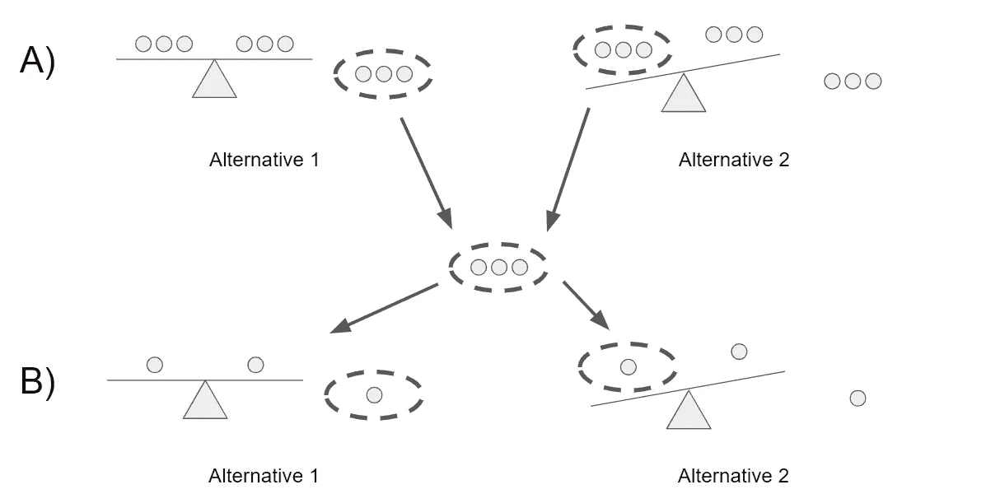
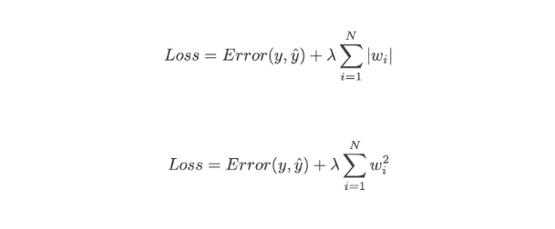
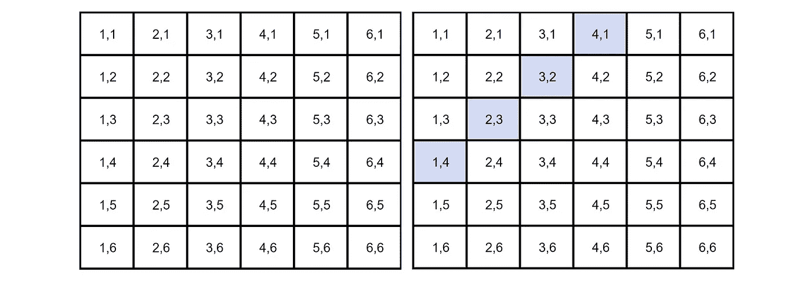

# FAANG 科技巨头的 30 多个数据科学面试问题

> 原文：<https://towardsdatascience.com/30-data-science-interview-questions-from-faang-tech-giants-1eea134db7c7?source=collection_archive---------11----------------------->

## 来自脸书、亚马逊、苹果、网飞和谷歌的深度访谈问答

图片由[皮克斯拜](https://pixabay.com/?utm_source=link-attribution&utm_medium=referral&utm_campaign=image&utm_content=1087845)的 Gerd Altmann 提供

本文汇集了来自顶级科技巨头(也称为 FAANG 公司，如脸书、亚马逊、苹果、网飞、谷歌)的三十多个数据科学面试问题和答案。随意用这个来准备面试，看看哪里需要多学习，甚至你只是想看看顶级公司都问些什么！

# 脸谱网

## 问:你从 100 枚硬币中随机抽取一枚——1 枚不公平硬币(正面朝上)，99 枚公平硬币(正面朝下)，然后掷 10 次。如果结果是 10 头，硬币不公平的概率是多少？

这可以用贝叶斯定理来回答。贝叶斯定理的扩展方程如下:

假设选到不公平硬币的概率表示为 P(A)，连续翻转 10 个头像的概率表示为 P(B)。那么 P(B|A)等于 1，P(B∣ A)等于 0。⁵ ⁰，P( A)等于 0.99。

如果填入等式，那么 P(A|B) = 0.9118 或者 91.18%。

## 问:有一栋楼有 100 层。你有两个相同的鸡蛋。如何用 2 个鸡蛋找到门槛楼层，在这里鸡蛋肯定会从 N 层以上的任何一层破开，包括 N 层本身。

更具体地说，问题是在给定两个鸡蛋的情况下，寻找阈值下限的**最优**方法。

为了更好地理解这个问题，我们假设你只有一个鸡蛋。要找到门槛楼层，你可以简单地从第一层开始，放下鸡蛋，然后一层一层往上爬，直到鸡蛋裂开。

现在想象我们有无限的鸡蛋。寻找最低门槛的最佳方法是通过二分搜索法。首先，你会从 50 楼开始。如果鸡蛋裂开了，你就在 25 楼扔一个鸡蛋，如果鸡蛋没有裂开，你就在 75 楼扔一个鸡蛋，重复这个过程，直到你找到门槛楼层。

对于两个鸡蛋，寻找阈值下限的最佳方法是上述两种解决方案的混合…

例如，你可以每隔 5 层扔第一个鸡蛋，直到它破了，然后用第二个鸡蛋找出在 5 个增量之间的哪一层是门槛层。在最坏的情况下，这将需要 24 滴。

如果你每隔 10 层楼丢下第一个鸡蛋，直到它破掉，在最坏的情况下需要 19 次，这比每隔 5 层楼丢下第一个鸡蛋要好得多。但是如果你想做得更好呢？

这就是最大遗憾最小化这个概念发挥作用的地方。基本上，这意味着当你以给定的增量完成更多的下降(你跳过多少层)时，你希望每次都缓慢地减少增量，因为阈值楼层的可能楼层会更少。这意味着如果你的第一次下落是在 n 层，那么你的第二次下落应该是在 n + (n-1)层，假设它没有破裂。这可以写成下面的等式:

更进一步，这可以简化为:

求解 n，你得到大约 14。因此，你的策略将是从第 14 层开始，然后 14+13，然后 14+13+12，等等，直到它打破，然后使用第二个蛋一次一层地找到门槛层！

## 问:我们有两种在 Newsfeed 中投放广告的选择。方案一:每 25 个故事中，就有一个是 ad。方案二:每个故事都有 4%的几率成为广告。对于每个选项，100 个新闻故事中显示的广告的预期数量是多少？

两种选择的预期赔率都是 4/100。

对于选项 1，1/25 相当于 4/100。
对于选项 2，100 的 4%是 4/100。

*如果我遗漏了什么，请随时告诉我，因为这个问题似乎太直截了当了！*

## 问:只知道性别身高，你如何证明男性平均比女性高？

你可以用假设检验来证明男性平均比女性高。

零假设是男性和女性平均身高相同，而另一个假设是男性的平均身高高于女性的平均身高。

然后，您将收集男性和女性身高的随机样本，并使用 t 检验来确定您是否拒绝空值。

## 问:如果 iOS 上 70%的脸书用户使用 Instagram，但 Android 上只有 35%的脸书用户使用 Instagram，你会如何调查这种差异？

有许多可能的变量会导致这种差异，我将检查一下:

*   iOS 和 Android 用户的人口统计数据可能会有很大差异。例如，根据 Hootsuite 的调查，43%的女性使用 Instagram，而男性只有 31%。如果 iOS 的女性用户比例明显高于 Android，那么这可以解释这种差异(或者至少是部分差异)。这也适用于年龄、种族、民族、地点等
*   行为因素也会对差异产生影响。如果 iOS 用户比 Android 用户更频繁地使用手机，他们更有可能沉迷于 Instagram 和其他应用程序，而不是那些在手机上花费时间少得多的人。
*   另一个需要考虑的因素是 Google Play 和 App Store 有什么不同。例如，如果 Android 用户有明显更多的应用程序(和社交媒体应用程序)可供选择，这可能会导致用户的更大稀释。
*   最后，与 iOS 用户相比，用户体验的任何差异都会阻止 Android 用户使用 Instagram。如果这款应用对安卓用户来说比 iOS 用户更容易出错，他们就不太可能在这款应用上活跃。

## 问:每个用户的点赞数和在一个平台上花费的时间在增加，但用户总数在减少。它的根本原因是什么？

一般来说，你会想从面试官那里获得更多的信息，但是让我们假设这是他/她唯一愿意提供的信息。

关注每个用户的点赞数，有两个原因可以解释为什么这个数字会上升。第一个原因是，随着时间的推移，用户的平均参与度普遍提高了——这是有道理的，因为随着使用该平台成为一种习惯性做法，久而久之的活跃用户更有可能成为忠实用户。每个用户点赞数会增加的另一个原因是分母，即用户总数，在减少。假设停止使用该平台的用户是不活跃的用户，也就是参与度和点赞数低于平均水平的用户，这将增加每个用户的平均点赞数。

上面的解释也适用于在平台上花费的时间。随着时间的推移，活跃用户变得越来越活跃，而很少使用的用户变得不活跃。总体而言，参与度的增加超过了参与度很低的用户。

更进一步说，有可能“参与度低的用户”是脸书能够检测到的机器人。但随着时间的推移，脸书已经能够开发出识别和删除机器人的算法。如果以前有大量的机器人，这可能是这种现象的根本原因。

## 问:脸书发现赞数每年增长 10%，为什么会这样？

给定年份的总赞数是用户总数和每个用户的平均赞数的函数(我称之为参与度)。

用户总数增加的一些潜在原因如下:由于国际扩张而获得的用户以及随着年龄增长而注册脸书的年轻群体。

参与度增加的一些潜在原因是用户对应用程序的使用增加，用户变得越来越忠诚，新的特性和功能以及用户体验的改善。

## 问:如果一个项目经理说他们想把新闻订阅的广告数量增加一倍，你如何判断这是不是一个好主意？

您可以通过将用户分成两组来执行 A/B 测试:一组是广告数量正常的对照组，一组是广告数量翻倍的测试组。然后，您将选择指标来定义什么是“好主意”。例如，我们可以说零假设是广告数量翻倍会减少花在脸书上的时间，另一个假设是广告数量翻倍不会对花在脸书上的时间有任何影响。但是，您可以选择不同的指标，如活跃用户数或流失率。然后，您将进行测试，并确定拒绝或不拒绝 null 的测试的统计显著性。

## 问:有一个游戏，给你两个公平的六面骰子，让你掷骰子。如果骰子上的数值之和等于 7，那么您将赢得 21 美元。但是，每次掷出两个骰子，你都必须支付 5 美元。你玩这个游戏吗？

掷出 7 的几率是 1/6。
这意味着**期望**支付 30 美元(5*6)赢得 21 美元。
取这两个数字，预期支付额为-$ 9(21–30)。
由于预期付款为负，你不会想要支付此游戏。

# 亚马孙

## 问:如果有 8 个重量相等的弹珠和 1 个稍重的弹珠(总共 9 个弹珠)，需要称重多少次才能确定哪个弹珠最重？

作者创建的图像

需要称重两次(见上文 A 和 B 部分):

1.  你将九个弹珠分成三组，每组三个，称其中两组的重量。如果天平平衡(选择 1)，你知道重的弹球在第三组弹球中。否则，您将选择权重更大的组(选项 2)。
2.  然后你将练习同样的步骤，但是你将有三组一个弹球，而不是三组三个。

## 问:凸与非凸代价函数的区别；当一个代价函数是非凸的时候意味着什么？

**凸函数**是指在图上任意两点之间画的一条线位于图上或图上。它有一个最小值。

**非凸函数**是在图上任意两点之间画的线可能与图上其他点相交的函数。它的特征是“波浪形”。

当成本函数是非凸的时，这意味着该函数有可能找到局部最小值而不是全局最小值，从优化的角度来看，这在机器学习模型中通常是不期望的。

## 问:什么是过度拟合？

过度拟合是一种错误，即模型“拟合”数据太好，导致模型具有高方差和低偏差。因此，过度拟合模型将会不准确地预测新的数据点，即使它对训练数据具有高的准确性。

## 问:改变基本会员费会对市场产生什么影响？

我对这个问题的答案没有 100%的把握，但我会尽力而为！

让我们举一个主要会员费上涨的例子——有两方参与，买方和卖方。

对于买家来说，提高会员费的影响最终取决于买家需求的价格弹性。如果价格弹性很高，那么给定的价格上涨将导致需求大幅下降，反之亦然。继续购买会员费的买家可能是亚马逊最忠诚和最活跃的客户——他们也可能更加重视 prime 产品。

卖家将受到打击，因为现在购买亚马逊一篮子产品的成本更高了。也就是说，一些产品将受到更严重的打击，而其他产品可能不会受到影响。亚马逊最忠实的顾客购买的高端产品可能不会受到太大影响，比如电子产品。

## 问:描述决策树、支持向量机和随机森林。谈论他们的优点和缺点。

决策树:一种树状模型，用于根据一个或多个条件对决策进行建模。

*   优点:易于实现，直观，处理缺失值
*   缺点:高方差，不准确

支持向量机(Support Vector Machines):一种分类技术，可以找到一个**超平面**或两类数据之间的边界，从而最大化两类数据之间的差距。有许多平面可以分隔这两个类别，但只有一个平面可以最大化类别之间的边距或距离。

*   优点:高维精确
*   缺点:容易过度拟合，不能直接提供概率估计

随机森林:一种基于决策树的[集成学习](https://en.wikipedia.org/wiki/Ensemble_learning)技术。随机森林包括使用原始数据的[自举数据集](https://machinelearningmastery.com/a-gentle-introduction-to-the-bootstrap-method/)创建多个决策树，并在决策树的每一步随机选择一个变量子集。然后，该模型选择每个决策树的所有预测的模式。

*   优点:可以实现更高的准确性，处理缺失值，不需要特征缩放，可以确定特征重要性。
*   缺点:黑盒，计算量大

## 问:为什么降维很重要？

降维是减少数据集中要素数量的过程。这主要在您想要减少模型中的方差(过度拟合)的情况下很重要。

维基百科陈述了降维的四大优势([见此处](https://en.wikipedia.org/wiki/Dimensionality_reduction#Advantages_of_dimensionality_reduction)):

1.  *它减少了所需的时间和存储空间*
2.  *多重共线性的消除改善了机器学习模型参数的解释*
3.  *当数据降低到非常低的维度时，如 2D 或 3D，就变得更容易可视化*
4.  *它避免了维数灾难*

## 问:商品在位置 A 的概率是 0.6，在位置 b 的概率是 0.8。在亚马逊网站上找到该商品的概率是多少？

我们需要对这个问题做一些假设才能回答。**让我们假设在亚马逊上有两个可能的地方购买一件特定的商品，在位置 A 找到它的概率是 0.6，在位置 B 找到它的概率是 0.8。在亚马逊上找到该商品的概率可以这么解释**:

我们可以把上面的话重新措辞为 P(A) = 0.6，P(B) = 0.8。此外，让我们假设这些是独立的事件，这意味着一个事件的概率不受另一个事件的影响。然后我们可以使用公式…

P(A 或 B) = P(A) + P(B) — P(A 和 B)
P(A 或 B) = 0.6 + 0.8 — (0.6*0.8)
P(A 或 B) = 0.92

## 问:什么是助推？

Boosting 是一种集成方法，通过减少模型的偏差和方差来改进模型，最终将弱学习者转换为强学习者。总体思路是训练一个弱学习器，通过对前一个学习器的学习，依次迭代改进模型。*这里* 可以了解更多 [*。*](https://medium.com/greyatom/a-quick-guide-to-boosting-in-ml-acf7c1585cb5)

# 苹果

## 问:描述 L1 和 L2 正则化之间的区别，特别是关于它们对模型训练过程的影响的区别。

L1 和 L2 正则化都是用于减少训练数据过拟合的方法。最小二乘法使残差平方和最小，这可能导致低偏差但高方差。

L2 正则化，也称为岭回归，最小化残差平方和**加上λ乘以斜率平方**。这个附加项被称为**岭回归损失**。这增加了模型的偏差，使得对训练数据的拟合更差，但是也减少了方差。

如果您采用岭回归罚分并用斜率的绝对值替换它，那么您将得到套索回归或 L1 正则化。

L2 不太稳健，但有一个稳定的解决方案，而且总是一个解决方案。L1 更稳健，但是具有不稳定的解，并且可能具有多个解。

## 问:ACF 和 PACF 的含义是什么？

要了解 ACF 和 PACF，首先需要知道什么是**自相关**或**序列相关**。自相关着眼于给定时间序列与其自身滞后版本之间的相似程度。

因此，**自相关函数(ACF)** 是一种工具，用于发现数据中的模式，具体而言，是指由各种时间滞后分隔的点之间的相关性。例如，ACF(0)=1 意味着所有数据点都与自身完美相关，ACF(1)=0.9 意味着一个点与下一个点之间的相关性为 0.9。

**PACF** 是**偏自相关函数**的简称。引用 StackExchange 中的一段文字，“它可以被认为是由若干个周期 n 分隔的两个点之间的相关性，但中间相关性的影响已被消除。”比如说。如果 T1 与 T2 直接相关，而 T2 与 T3 直接相关，则似乎 T1 与 T3 相关。PACF 将消除与 T2 之间的关联。

*这里很棒的解释了 ACF 和 PACF* [*这里*](https://stats.stackexchange.com/questions/77248/what-is-autocorrelation-function) *。*

## 问:什么是偏差-方差权衡？

估计值的**偏差**是期望值和真实值之间的差值。具有高偏差的模型往往过于简单，导致拟合不足。方差表示模型对数据和噪声的敏感度。具有高**方差**的模型导致过度拟合。

因此，**偏差-方差权衡**是机器学习模型的一个属性，其中较低的方差导致较高的偏差，反之亦然。一般来说，可以找到两者的最佳平衡，使误差最小化。

作者创建的图像

## 问:XGBoost 如何处理偏差-方差权衡？

作者创建的图像

[XGBoost](https://xgboost.ai/) 是一种利用梯度推进算法的集成机器学习算法。本质上，XGBoost 就像是类固醇上的**装袋**和**助推**技术。因此，可以说 XGBoost 处理偏差和方差的方式类似于任何 boosting 技术。Boosting 是一种集成元算法，通过对许多弱模型进行加权平均来减少偏差和方差。通过关注弱预测和迭代模型，误差(从而偏差)减少了。类似地，因为它对许多弱模型进行加权平均，所以最终的模型比每个弱模型本身具有更低的方差。

## 问:什么是随机森林？为什么朴素贝叶斯更好？

随机森林是一种建立在决策树基础上的[集成学习](https://en.wikipedia.org/wiki/Ensemble_learning)技术。随机森林包括使用原始数据的[自举数据集](https://machinelearningmastery.com/a-gentle-introduction-to-the-bootstrap-method/)创建多个决策树，并在决策树的每一步随机选择一个变量子集。然后，该模型选择每个决策树的所有预测的模式。依靠“多数获胜”模型，它降低了单个树出错的风险。

作者创建的图像

例如，如果我们创建一个决策树，第三个，它会预测 0。但是如果我们依赖所有 4 个决策树的模式，预测值将是 1。这就是随机森林的力量。

随机森林提供了其他几个好处，包括强大的性能，可以模拟非线性边界，不需要交叉验证，并赋予功能重要性。

从过程和结果易于训练和理解的意义上来说，朴素贝叶斯更好。一个随机的森林看起来就像一个黑盒。因此，在实现和理解方面，朴素贝叶斯算法可能更好。但是，就性能而言，随机森林通常更强，因为它是一种集合技术。

# 网飞

## 问:为什么整流线性单位是一个很好的激活函数？

由作者创建

整流线性单元，也称为 ReLU 函数，已知是比 sigmoid 函数和 tanh 函数更好的激活函数，因为它执行梯度下降更快。请注意，在左侧的图像中，当 x(或 z)非常大时，斜率非常小，这会显著降低梯度下降的速度。然而，这不是 ReLU 函数的情况。

## 问:正规化有什么用？L1 正则化和 L2 正则化有什么区别？

L1 和 L2 正则化都是用于减少训练数据过拟合的方法。最小二乘法使残差平方和最小，这可能导致低偏差但高方差。

L1 vs L2 正规化

**L2 正则化**，也称为**岭回归**，最小化残差平方和加上λ乘以斜率平方。这个附加项被称为岭回归损失。这增加了模型的偏差，使得对训练数据的拟合更差，但是也减少了方差。
如果取岭回归罚分，用斜率的绝对值代替，那么就得到**套索回归**或 **L1 正则化**。
L2 不太稳健，但有一个稳定的解决方案，并且总是有一个解决方案。L1 更稳健，但是具有不稳定的解，并且可能具有多个解。

## 问:在线学习和批量学习有什么区别？

**批量学习**，也称为离线学习，就是你对一组组的模式进行学习。这是大多数人都熟悉的学习类型，在这种情况下，您可以获取一个数据集，然后一次性在整个数据集上构建一个模型。

**另一方面，在线学习**是一种一次吸收一个观察数据的方法。在线学习是数据高效的，因为数据一旦被消费就不再需要，这在技术上意味着你不必存储你的数据。

## 问:在查询数据集时，如何处理空值？还有其他方法吗？

有多种方法可以处理空值，包括:

*   您可以完全忽略空值行
*   您可以用集中趋势的度量值(平均值、中值、众数)替换空值，或者用新的类别替换空值(如“无”)
*   您可以根据其他变量预测空值。例如，如果某一行的 weight 值为空，但它的 height 值为空，则可以用该给定高度的平均重量替换该空值。
*   最后，如果您正在使用自动处理空值的机器学习模型，则可以保留空值。

## 问:如何防止模型的过度拟合和复杂性？

对于那些不知道的人来说，**过度拟合**是一种建模错误，当一个函数与数据过于接近时，会导致新数据引入模型时出现高水平的错误。

有多种方法可以防止模型过度拟合:

*   **交叉验证**:交叉验证是一种用于评估模型在新的独立数据集上表现如何的技术。交叉验证最简单的例子是将数据分成两组:定型数据和测试数据，其中定型数据用于构建模型，测试数据用于测试模型。
*   **正则化**:当模型具有更高次的多项式时，会发生过度拟合。因此，**正则化**通过惩罚高次多项式来减少过拟合。
*   **减少特征数量**:你也可以通过减少输入特征的数量来减少过度拟合。您可以通过手动移除特征来实现这一点，或者您可以使用一种称为主成分分析的技术，该技术将高维数据(例如 3 维)投影到较小的空间(例如 2 维)。
*   **集成学习技术**:集成技术通过 bagging 和 boosting 将许多弱学习者转化为强学习者。通过装袋和增压，这些技术比它们的替代技术更容易过度适应。

## 问:对于我们正在考虑的新功能，你会如何设计实验？什么样的指标是重要的？

作者创建的图像

我会进行 A/B 测试，以确定新特性的引入是否会在我们关心的给定指标上带来统计上的显著改进。度量标准的选择取决于功能的目标。例如，可以引入一个功能来提高转换率、web 流量或保留率。

首先，我会制定我的零假设(特征 X 不会改善度量 A)和我的替代假设(特征 X 会改善度量 A)。

接下来，我会通过随机抽样来创建我的控制组和测试组。因为 t 检验天生就考虑样本量，所以我不打算指定一个必要的样本量，虽然越大越好。

一旦我收集了我的数据，根据我的数据的特点，我会进行 t 检验，韦尔奇的 t 检验，卡方检验，或贝叶斯 A/B 检验，以确定我的控制组和测试组之间的差异是否有统计学意义。

# 谷歌

## 问:一个盒子里有 12 张红卡和 12 张黑卡。另一个盒子里有 24 张红牌和 24 张黑牌。你想从两个盒子中的一个里随机抽取两张卡片，一次抽取一张。哪个盒子得到同色卡片的概率更大，为什么？

有 24 张红卡和 24 张黑卡的盒子获得两张同色卡片的概率更大。让我们走过每一步。

假设你从每副牌中抽出的第一张牌是红色的 a。

这意味着在有 12 个红和 12 个黑的牌组中，现在有 11 个红和 12 个黑。因此，你再抽一张红色的几率等于 11/(11+12)或 11/23。

一副牌中有 24 个红和 24 个黑，那么就有 23 个红和 24 个黑。因此，你再抽一张红色的几率等于 23/(23+24)或 23/47。

由于 23/47 > 11/23，所以卡数较多的第二副牌有较大概率得到相同的两张牌。

## 问:你在赌场，有两个骰子可以玩。你每掷一次 5 就赢 10 美元。如果你一直玩到你赢了然后停止，预期的回报是多少？

*   我们假设每次你想玩的时候要花 5 美元。
*   两个骰子有 36 种可能的组合。
*   在 36 种组合中，有 4 种组合会掷出 5(*见蓝色*)。这意味着有 4/36 或 1/9 的机会掷出 5。
*   1/9 的胜算意味着你会输八次，赢一次(理论上)。
*   因此，您的预期支出等于$ 10.00 * 1-$ 5.00 * 9 =-35.00。

*编辑:谢谢各位的评论和指出，应该是——35 美元！*

## 问:如何判断给定的硬币是否有偏差？

这不是一个难题。答案很简单，就是进行假设检验:

1.  零假设是硬币没有偏向，翻转头的概率应该等于 50% (p=0.5)。另一个假设是硬币有偏差，p！= 0.5.
2.  抛硬币 500 次。
3.  计算 Z 得分(如果样本小于 30，则需要计算 t 统计量)。
4.  对比 alpha(双尾检验所以 0.05/2 = 0.025)。
5.  如果 p 值>α，则不拒绝 null，硬币不偏。
    如果 p 值< alpha，则拒绝 null，硬币有偏。

*了解更多假设检验* [*这里*](https://www.statisticshowto.datasciencecentral.com/probability-and-statistics/hypothesis-testing/) *。*

## 让不公平的硬币变得公平

由于抛硬币是二进制的结果，你可以通过抛两次硬币来使不公平的硬币变得公平。如果你掷两次，有两种结果可以赌:正面跟着反面或者反面跟着正面。

> P(正面)* P(反面)= P(反面)* P(正面)

这是有意义的，因为每一次抛硬币都是一个独立的事件。这意味着如果你得到正面→正面或反面→反面，你需要重新抛硬币。

## 问:你即将登上去伦敦的飞机，你想知道你是否需要带雨伞。你随便打电话给三个朋友，问他们是否在下雨。你的朋友说实话的概率是 2/3，他们通过撒谎对你恶作剧的概率是 1/3。如果他们三个都说在下雨，那么伦敦下雨的概率是多少。

你可以看出这个问题与贝叶斯理论有关，因为最后一个陈述本质上遵循这样的结构，“假设 B 为真，A 为真的概率是多少？”因此，我们需要知道某一天伦敦下雨的概率。假设是 25%。

P(A) =下雨的概率= 25%
P(B) =三个朋友都说在下雨的概率
P(A|B)假定他们说在下雨的概率
P(B|A)假定在下雨的情况下三个朋友都说在下雨的概率= (2/3) = 8/27

*第一步:求解 P(B)*
P(A | B)= P(B | A) * P(A)/P(B)，可以改写为
P(B)= P(B | A)* P(A)+P(B |非 A)* P(非 A)
P(B)=(2/3)* 0.25+(1/3)* 0.75 = 0.25 * 8/27+0.75 * 1

*第二步:求解 P(A | B)*
P(A | B)= 0.25 *(8/27)/(0.25 * 8/27+0.75 * 1/27)
P(A | B)= 8/(8+3)= 8/11

因此，如果三个朋友都说在下雨，那么有 8/11 的几率是真的在下雨。

## 问:给你 40 张四种不同颜色的卡片——10 张绿卡、10 张红牌、10 张蓝卡和 10 张黄牌。每种颜色的卡片都从一到十编号。随机抽取两张牌。找出所选卡片不是相同号码和相同颜色的概率。

由于这些事件不是独立的，我们可以使用规则:
P(A 和 B) = P(A) * P(B|A)，也等于
P(非 A 非 B) = P(非 A) * P(非 B |非 A)

例如:

P(非 4 非黄)= P(非 4) * P(非黄|非 4)
P(非 4 非黄)= (36/39) * (27/36)
P(非 4 非黄)= 0.692

所以，挑出来的牌不是同号同色的概率是 69.2%。

# 感谢阅读！

如果你喜欢我的工作并想支持我，我会非常感谢你在我的社交媒体频道上关注我:

1.  支持我的最好方式就是在**媒体** [这里](https://medium.com/@terenceshin)关注我。
2.  在 **LinkedIn** [这里](https://www.linkedin.com/in/terenceshin/)关注我。
3.  在**推特**关注我[这里](https://twitter.com/terence_shin)。
4.  点击这里订阅我的新 **YouTube 频道** [。](https://www.youtube.com/channel/UCmy1ox7bo7zsLlDo8pOEEhA?view_as=subscriber)

> **有兴趣合作？查看我的写作机构，**[**ShinTwin**](https://shintwin.com/)**，我们来连线吧！**