# 一篇文章中的熊猫 30 天

> 原文：<https://towardsdatascience.com/30-days-of-pandas-in-an-article-b328cfb83d50?source=collection_archive---------53----------------------->

## 总结了 30 种有用的熊猫功能和方法


照片由[法比奥](https://unsplash.com/@fabioha?utm_source=medium&utm_medium=referral)在 [Unsplash](https://unsplash.com?utm_source=medium&utm_medium=referral) 上拍摄

Pandas 是一个专门用于数据操作的 Python 包。这个包是数据科学家生活中不可分割的一部分，了解它不会给你带来任何伤害。

之前，在我的 LinkedIn [帖子](https://www.linkedin.com/feed/hashtag/?keywords=30daysofpandas)中，我在**三十天**中每天**发布我认为有用的熊猫包**中的新函数和方法。有些人要求我做一个总结，正因为如此，我会在这里写一篇关于它的文章。

继续读！

# 第一天:style.bar

我想展示一个名为`style.bar`的 Pandas 数据框对象的方法，它允许你在数据框中创建一个数值列的柱状图。您只需在数据框对象后使用. style.bar 来调用此方法。

如果你想让你的数据展示更有冲击力，更清楚地说明你的观点，这种方法很有用

```
#Day 1 style.barimport pandas as pd
import seaborn as snsplanets = sns.load_dataset('planets')planets.head(10)[['method','year', 'distance']].sort_values(by = 'distance').style.bar(color = 'lightblue',                                                                                  subset = 'distance').hide_index()
```

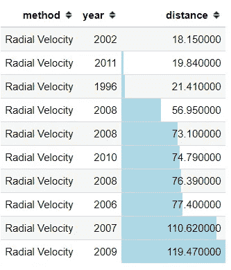

# 第二天:qcut

今天我要给大家展示一个从熊猫到划分你的数据的有用函数叫做`qcut`。

熊猫的功能`qcut`是什么？`qcut`函数将对连续变量进行分箱，其中基于等级或基于样本分位数，分箱大小相等。

那么什么是分位数呢？分位数基本上是一种以相等方式划分连续值的除法技术。例如，如果我们将连续值分为 4 部分；它被称为四分位，如图所示。

```
#Day 2 qcutimport seaborn as sns
import pandas as pd
mpg = sns.load_dataset('mpg')pd.qcut(x = mpg['mpg'], q = 4, labels = [1,2,3,4])
```

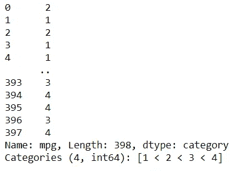

# 第三天:数据透视表

在这篇文章中，我想向你介绍一种最强大的方法，叫做 pivot_table。

通过调用方法，可以在数据框对象中访问此方法。数据框对象后的 pivot_table。

那么这个方法是干什么的呢？它根据我们传递给 columns 参数的 categorical 对象创建一个数据透视表，values 参数接受数值。

pivot_table 的特殊之处在于，结果不仅仅是值，还有传递给参数的聚合函数。

您可以查看示例图片了解更多信息。希望有帮助！

```
#Day 3 pivot_tableimport pandas as pd
import seaborn as sns
tips = sns.load_dataset('tips')tips.pivot_table(columns = 'sex', values = 'total_bill', aggfunc = 'mean', index = 'size', margins = True)
```

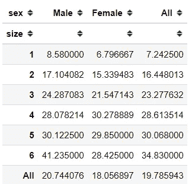

# 第四天:agg

今天先说一个比较简单的方法。在这里，我要介绍一个来自数据框对象的方法，叫做 agg。

就像名字一样，这个方法创建一个聚合表。也就是说，我们将预期的聚合放在。agg 方法和所有数字列都由创建表的聚合函数处理。

这个函数的伟大之处在于，我们可以通过创建自己的函数来放置我们想要的聚合，并且结果表会像示例图片中一样显示出来。

```
#Day 4 aggimport pandas as pd
import seaborn as snsmpg = sns.load_dataset('mpg')def mean_divided_by_2(col):
    return (col.mean())/2mpg.agg(['mean', 'std',mean_divided_by_2])
```

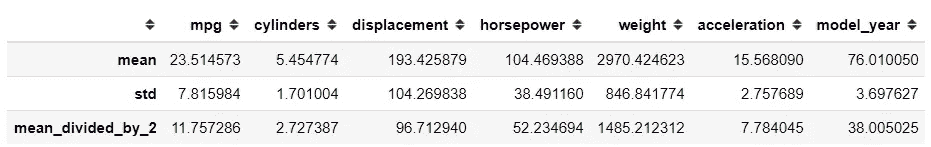

# 第五天:融化

我想给你介绍一种来自熊猫数据帧的奇特方法，叫做融化。

当我们将每个值和变量分解到另一个表中时，这种方法与 pivot 方法相反。

请看下面的例子，这次我将 id_vars 指定为 tip 列，值为 sex 列。我们得到的是 tip 列中的每个值和 sex 列中的每个值都是成对的。

```
#Day 5 meltimport pandas as pd
import seaborn as sns
tips = sns.load_dataset('tips')tips.melt(id_vars = 'tip', value_vars = 'sex')
```

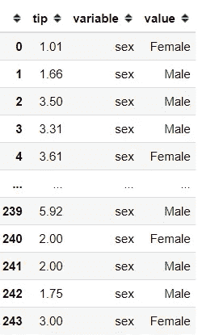

# 第六天:style.applymap

今天我要给大家介绍一个来自熊猫 Dataframe 的令人兴奋的方法，叫做`style.applymap`。

那么这个方法是干什么的呢？看一下这个例子，你可以看到一些数字是红色的，而另一些是黑色的。这是因为我们使用了 style.applymap 方法。

这个方法所做的是接受一个函数来修改我们 Jupyter 笔记本中的 CSS，并应用于我们数据框中的每一个值。

例如，在我的示例中，该函数将对小于等于 20 的数值进行着色。该函数需要为每个改变颜色的值返回的是一个带有颜色规范的字符串；例如'【T1 ')。

```
#Day 6 style.applymapimport pandas as pd
import seaborn as snsmpg = sns.load_dataset('mpg')def mean_divided_by_2(col):
    return (col.mean())/2mpg.agg(['mean', 'std',mean_divided_by_2])
```

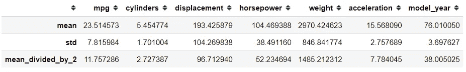

# 第 7 天:选择类型

我想分享一个来自熊猫数据框架的简单而强大的方法，叫做`.select_dtypes`。

在数据清理和工程过程中，我经常使用这种方法，如果没有`.select_dtypes`方法，我会很难受。

那么，这是什么方法呢？很简单，这个方法用于根据特定的数据类型选择数据框中的列。例如“数字”或“对象”。

在示例中，我向您展示了我将“数字”数据类型传递给该方法；这意味着我只选择数字列(浮点数或整数)。我使用的另一个例子是“object ”,这意味着我只选择对象列。

```
#Day 7 select_dtypesimport seaborn as sns
import pandas as pd
mpg = sns.load_dataset('mpg')#Selecting the number data type
mpg.select_dtypes('number')#Selecting the object data type
mpg.select_dtypes('object')
```

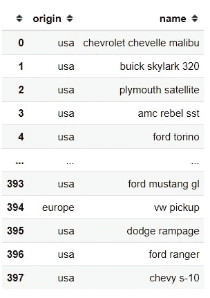

# 第八天:style.hide_

今天我想向你介绍一个简单而有用的方法，尤其是在演讲中。这些方法是 style.hide_index 和 style.hide_columns。

所以，仅仅通过方法名，我想你可以猜到这个函数是用来隐藏索引和/或列的。

从示例中，您可以看到我隐藏了数据框索引和数据框列(通过传递列名)。

希望有帮助！

```
#Day 8 style.hide_import seaborn as sns
import pandas as pd
mpg = sns.load_dataset('mpg')mpg.head(10).style.hide_index().hide_columns(['mpg', 'name', 'model_year'])
```

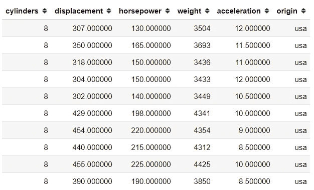

# 第九天:更正

好吧，我很肯定很多人都知道。来自数据框对象的 corr 方法。

好吧，如果你不知道它是什么；。corr 是一种自动计算两个数值变量之间的相关性并将结果显示为矩阵图的方法。

默认情况下。corr 法有三种相关法计算；皮尔森，斯皮尔曼和肯德尔。但是，您知道您可以使用自己的相关函数计算吗？

在这个例子中，我从 [scipy.stats](http://scipy.stats/) weightedtau 创建了自己的函数来创建一个 weighted_tau 相关计算。我们需要的是。工作的 corr 方法是一个接受双参数并返回一个浮点对象的函数。

希望有帮助！

```
#Day 9 corrimport pandas as pd
import seaborn as sns
from scipy.stats import weightedtaudef weight_tau(x, y):
    return weightedtau(x, y)[0]tips= sns.load_dataset('tips')
tips.corr(weight_tau)
```

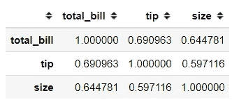

# 第 10 天:更换

今天我要给大家介绍的数据框对象方法叫做. replace。

所以，这个方法顾名思义；它曾经取代了一些东西，但是什么呢？

这个方法做的主要事情是替换值；是的，列中的值。

从这个例子中，您可以看到我通过在方法中传递一个 dictionary 对象来替换这个值。所以我例子中的逻辑是: `{columns name: {values you want to replace: values to replace}}`。

```
#Day 10 replaceimport pandas as pd
import seaborn as snsmpg = sns.load_dataset('mpg')
mpg.replace({'cylinders' : {3: 'Three', 4: 'Four', 5: 'Five', 6: 'Six', 8 : 'Eight'}}, inplace = True)
mpg.head()
```

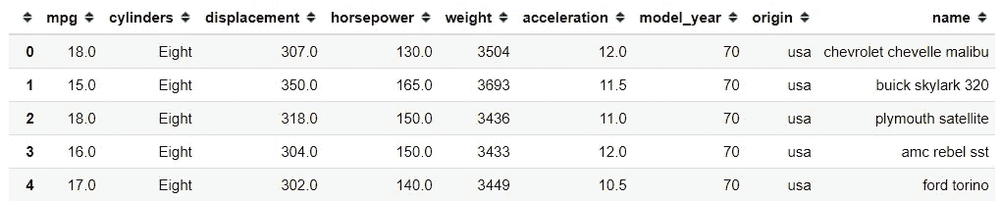

# 第 11 天:历史

嗯，我想给你介绍一个来自熊猫系列对象的很酷的方法，叫做. hist。

所以，这种方法工作简单；它从您的数字系列对象创建一个直方图。简单吧？

你只需要调用它，它会自动创建你的直方图，就像例子一样。

```
#Day 11 histimport seaborn as sns
import pandas as pd
mpg = sns.load_dataset('mpg')mpg['mpg'].hist()
```

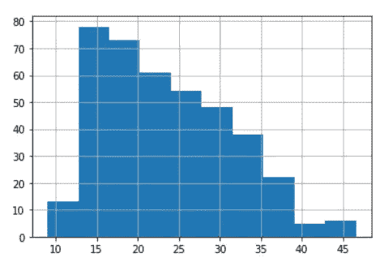

# 第 12 天:拿假人

我想给你介绍一个熊猫的特殊功能，叫做 get_dummies。

从这个例子中，你可能得到它所做的，但对你来说没有；这种方法被称为一个热编码或 OHE。

get_dummies 函数用于基于一个变量中的分类类创建新要素，新要素的值为 0 或 1；0 表示不存在，1 表示存在。

当您需要将分类数据转换为数字数据时，最常用的一种编码方式。

```
#Day 12 get_dummiesimport pandas as pd
import seaborn as snsmpg = sns.load_dataset('mpg')
pd.get_dummies(mpg['origin'])
```

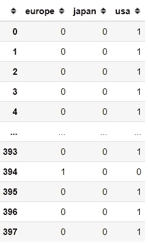

# 第 13 天:查询

我想给大家介绍一种很酷的数据帧方法，叫做`.query`。

那么，这个方法是干什么的呢？这个方法允许使用字符串表达式进行选择。这是什么意思？

看例子图片，它就像一些有条件的选择，对不对？这是一种基于布尔的选择方法。毕竟。

在示例表中，我们经常需要像`mpg[(mpg['mpg'] <=11) & (mpg['origin] == 'usa')]`那样为选择指定条件，但是使用 query 这一切都被简化了。只要向方法传递一个字符串条件，我们就会得到相同的选择结果。

```
#Day 13 queryimport pandas as pd
import seaborn as snsmpg = sns.load_dataset('mpg')
mpg.query("mpg <= 11 & origin == 'usa'")
```

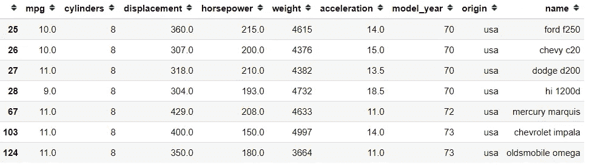

# 第 14 天:面膜

我想给大家介绍一个 if-then 方法，叫做. mask。

那么这个方法是干什么的呢？它用于将特定值替换为满足给定条件的另一个值。

在我的例子中，我传递了一个 mpg 值小于 20 的条件，然后用“大于 20”替换它。多酷啊！

```
#Day 14 maskimport pandas as pd
import seaborn as snsmpg = sns.load_dataset('mpg')
mpg['mpg'].mask(mpg['mpg'] < 20, 'More than Twenty' )
```

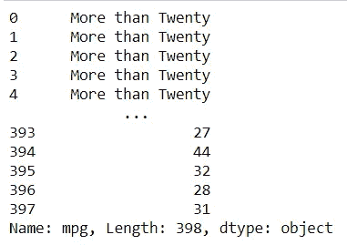

# 第 15 天:交叉表

已经完成一半了，所以今天我想向大家介绍一个叫做 crosstab 的表格格式化函数。

那么，这个函数是做什么的呢？这个函数将帮助我们创建一个分类类的数据透视表，使用一个数值列的聚合函数作为值，尽管您也可以创建分类类之间的计数。

看看这个例子，你可以看到我指定了 origin 和 model_year(两者都是分类的)分别作为索引和列。此外，我将 mpg 列作为数值，并使用平均值作为聚合函数。

```
#Day 15 crosstabimport pandas as pd
import seaborn as snsmpg = sns.load_dataset('mpg')
pd.crosstab(index = mpg['origin'], columns = mpg['model_year'], values = mpg['mpg'], aggfunc = 'mean' )
```

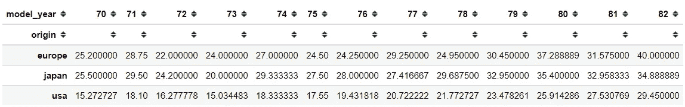

# 第 16 天:申请

熊猫法是我在分析时经常使用的一种方法，我已经习惯了它的简洁。熊猫数据框方法是适用的。

这种方法接受一个函数，并将其应用于整个数据(以行的方式或列的方式)。函数返回的是结果。

看看这个例子，我应用了一个 lambda 函数，它返回每个数据值的长度。

```
#Day 16 applyimport pandas as pd
import seaborn as snsmpg = sns.load_dataset('mpg')
mpg['name'].apply(lambda x: len(str(x)))
```

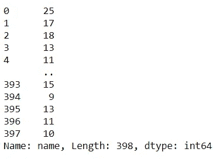

# 第 17 天:设置选项

今天我想给你介绍熊猫的一个特殊功能。这个函数被称为。设置选项。

这个功能是什么？所以，这个函数不是直接应用到你的数据上，而是影响到对象本身。

让我们看看下面的例子，我传递字符串来设置笔记本中显示的最大列数和最大行数。你可以在这里阅读所有选项。

希望有帮助！

```
#Day 17 set_optionimport pandas as pd
import seaborn as sns
pd.set_option('display.max_columns', None)
pd.set_option('display.max_rows', 50)mpg = sns.load_dataset('mpg')
mpg
```

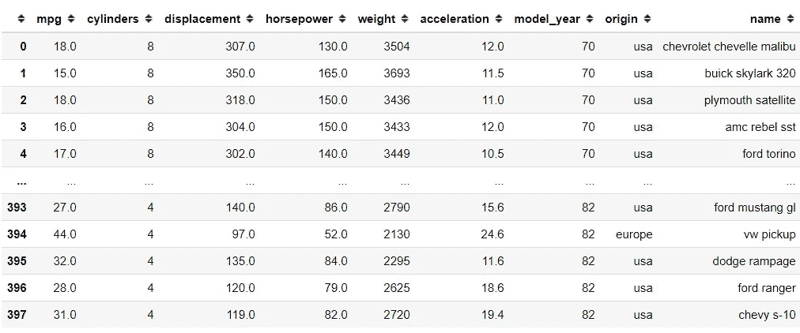

# 第 18 天:描述

我只想向你展示一个来自 Pandas 数据帧对象的最广为人知的方法，叫做`.describe`。

我敢打赌，大多数用 Python 开始数据科学之旅的人都知道这种方法。对于不了解的人来说，这种方法可以生成包含所有基本统计数据的数据框。

虽然，这个 API 里有个小技巧。默认情况下，describe 只计算所有数字列，这些数字列依次为您提供平均值、标准差、百分位数等信息。

但是，如果像示例中那样排除数字列，最终会得到不同的数据框。这一次，将计算非数字列。在这里，我们得到的是频率和顶级类。

```
#Day 18 describeimport pandas as pd
import seaborn as snsmpg = sns.load_dataset('mpg')#Describe numerical columns
mpg.describe()#Describe non-numerical columns
mpg.describe(exclude = 'number')
```

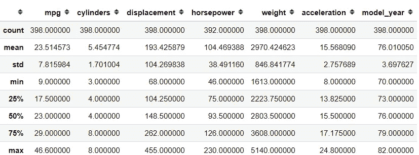

数字描述

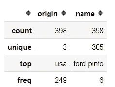

分类描述

# 第 19 天:因子分解

我想给你介绍一个有用的熊猫函数和称为因式分解的级数方法。

首先看一下这个例子，这里我取了分类变量 origin，并对它使用了因式分解方法。结果如何呢？有两件事，数字数组和独特的类。

那么这种方法有什么特别之处呢？您刚才看到的数字数组是编码为数值的分类变量中的类。如何知道哪个数字代表哪个阶级？这就是为什么我们也有独特的类。

在下面的示例中，0 代表美国，1 代表日本，2 代表欧洲。就像独一无二的位置。

当您需要将分类编码成数值时，这个函数是最有用的，但是其中有一个序数假设。

```
#Day 19 factorizeimport pandas as pd
import seaborn as snsmpg = sns.load_dataset('mpg')
mpg['origin'].factorize()
```

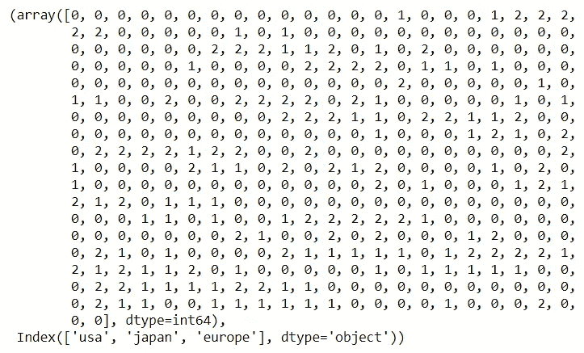

# 第 20 天:绘图

第 20 天，我要介绍一个来自熊猫的绘图功能，叫做 pd.plotting.radviz。

那么，这个函数是做什么的呢？据 Pandas 称，radviz 允许我们将一个 N 维数据集投影到一个 2D 空间，其中每个维度的影响都可以被解释为所有维度影响之间的平衡。

简单来说，这意味着我们可以用原始的方式将多维数据投影到 2D 空间。

数据帧中的每个系列都表示为一个圆形上均匀分布的切片。只看例子，有一个带系列名称的圆圈。

每个数据点都根据每个系列的值呈现在圆圈中。数据框中高度相关的系列更靠近单位圆。

要使用`pd.plotting.radviz`，您需要一个多维数据集，其中除了 class 列(应该是 categorical)之外，其他都是数字列。

```
#Day 20 plotting.radvizimport pandas as pd
import seaborn as snsmpg = sns.load_dataset('mpg')
pd.plotting.radviz(mpg.drop(['name'], axis =1), 'origin')
```

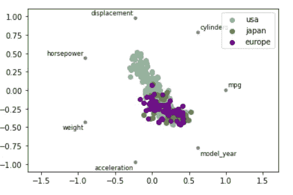

# 第 21 天:散点矩阵

今天我要介绍的是熊猫的另一个绘图功能。这一次，该函数被称为 plotting.scatter_matrix。

这是一个简单的函数，但在我们的数据分析生活中非常有用。主要的事情很简单，它在数据框中的所有数值变量之间创建了一个散点图。

对于对角线位置的图(变量本身)将是一个分布图(直方图或 KDE)。

如何使用该函数很简单，你只需要将数据框变量传递给该函数，它就会自动检测数值列。

```
#Day 21 scatter_matrix
import pandas as pd
import seaborn as sns
import matplotlib.pyplot as pltmpg = sns.load_dataset('mpg')
pd.plotting.scatter_matrix(mpg, figsize = (8,8))
plt.show()
```

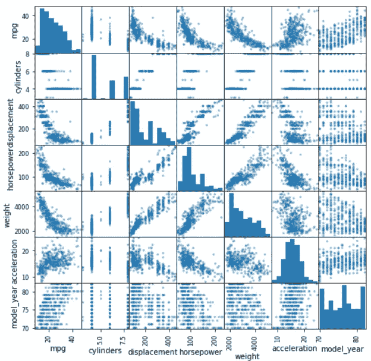

# 第 22 天:绘图

我想介绍一个简单的方法，从名为 plotting.boxplot 的 series 对象创建一个 boxplot。

如果你不知道箱线图是什么，引用熊猫指南箱线图是“一种通过四分位数图形化描述数字数据组的方法”。该方框从数据的 Q1 值延伸到第三季度的四分位值，中间有一条线(Q2)。触须从框的边缘延伸出来，以显示数据的范围。默认情况下，它们从盒子的边缘延伸不超过 1.5 * IQR(IQR = Q3-Q1)，在该间隔内最远的数据点结束。离群值标为单独的点”。

您只需要传递系列或数据框，数字列就会自动绘制出来。

```
#Day 22 plotting.boxplotimport pandas as pd
import seaborn as sns
import matplotlib.pyplot as pltmpg = sns.load_dataset('mpg')
pd.plotting.boxplot(mpg['mpg'])
```

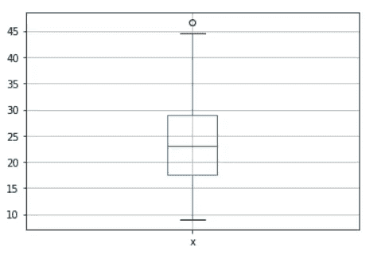

# 第 23 天:任何

我将向您介绍一个简单而有用的 Series 和 DataFrame 方法。

这是什么方法呢？所以，。any 将返回布尔值，如果任何元素为 True，则返回 True；如果系列或列中没有 True 布尔值，则返回 False。

当我们想检查数据集中是否有缺失值时，这是最有用的。看看这个例子，我们被锁住了。isna with .any。只有马力返回 True，因为此列中缺少数据。

```
#Day 23 anyimport pandas as pd
import seaborn as sns
import matplotlib.pyplot as pltmpg = sns.load_dataset('mpg')
mpg.isna().any()
```

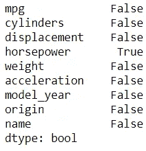

# 第 24 天:哪里

我想向您介绍一个 DataFrame 方法，类似于我之前发布的方法。

因此，与。我之前贴的蒙版方法。基本上，这是一种接受条件的方法，不满足条件的值将被替换。

看看这个例子，我给出了寻找低于 20 的值的标准，任何低于 20 的值都将保持它们的值，否则，它将被替换为“大于 20”。

```
#Day 24 whereimport pandas as pd
import seaborn as snsmpg = sns.load_dataset('mpg')
mpg['mpg'].where(mpg['mpg'] < 20, 'More than Twenty' )
```

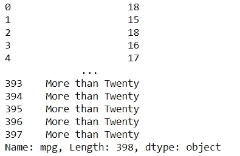

# 第 25 天:换位

今天我将向你展示一个简单而有用的方法。转置或. t。

这个方法很简单，通过执行。转置方法我们将切换数据帧列成为索引，而索引将成为数据帧列。

看看这个例子，我们有一个数据框，所有的位置都被调换了。当我们希望我们的行变成列时，这个函数很有用，反之亦然。

希望有帮助！

```
#Day 25 transposeimport pandas as pd
import seaborn as snsmpg = sns.load_dataset('mpg')
mpg.transpose() 
#or mpg.T
```

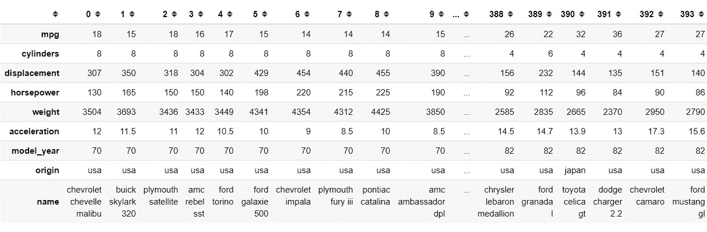

# 第 26 天:阴谋.散布

今天我想介绍一个熊猫数据帧对象的快速绘图方法，名为 plot.scatter。

我相信很多人都知道散点图是什么，虽然对你来说谁也不知道；它基本上是一个图，我们在 2 个不同的数字列中绘制每个数据，其中的值在图中是可视化的。

我们可以通过在数据框对象中使用. plot.scatter 创建一个快速散点图，并传递您想要的 2 列名称。

```
#Day 26 plot.scatterimport pandas as pd
import seaborn as snsmpg = sns.load_dataset('mpg')
mpg.plot.scatter('mpg', 'weight')
```

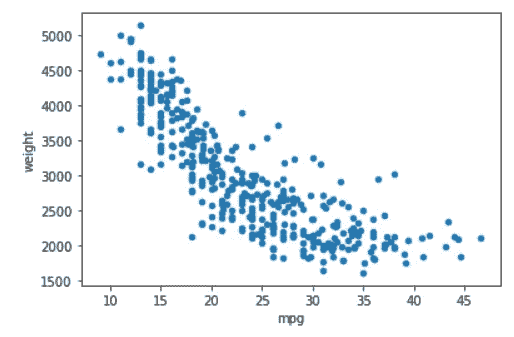

# 第 27 天:转变

今天要介绍一个来自 Series 和 Data Frame 对象的方法，叫做`.transform`。

这是一个简单的功能，但功能强大。此函数的主要前提是我们传递一个函数或聚合字符串名称，并且该函数应用于所有的值。

如果在 DataFrame 对象中使用它，该函数将应用于每列中的每个值。

```
#Day 27 transformimport pandas as pd
import seaborn as snsmpg = sns.load_dataset('mpg')
mpg['mpg'].transform(lambda x: x/2)
```

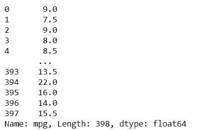

# 第 28 天:自举 _ 情节

今天我要介绍一个熊猫独有的绘图功能，叫做`.bootstrap_plot`。

根据 Pandas 的说法，bootstrap 图用于通过依赖带有替换的随机抽样来估计统计的不确定性。

简而言之，它用于通过替换重新采样数据(您可以多次采样相同的数据)来尝试确定基本统计数据(如平均值和中值)中的不确定性。

`boostrap_plot`函数将为给定数量和给定大小的样本生成均值、中值和中间值统计的自举图。就像下面的例子一样。

```
#Day 28 bootstrap_plot
import pandas as pd
import seaborn as snsmpg = sns.load_dataset('mpg')
pd.plotting.bootstrap_plot(mpg['mpg'], size = 50, samples = 500)
plt.show()
```

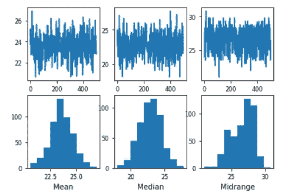

# 第 29 天:烟斗

在今天的熊猫贴子里，我想介绍一个我鼓励大家多使用的方法。方法是. pipe。

所以，熊猫鼓励我们使用方法链来操作我们的数据。通常我们会通过在函数或方法后面传递函数来链接方法。

与。管道函数，Pandas DataFrame 中的链接方法可以减少我们编写的行数并更快地执行函数。

的示例。管道方法如下图。我创建了两个不同的函数，并通过执行。管两次。这是为了创建一个链方法和更快的执行。

```
#Day 29 pipeimport pandas as pd
import seaborn as snsmpg = sns.load_dataset('mpg')#Function to extract the car first name and create a new column called car_first_name
def extract_car_first_name(df):
    df['car_first_name'] = df['name'].str.split(' ').str.get(0)
    return df#Function to add my_name after the car_first_name and create a new column called car_and_name
def add_car_my_name(df, my_name = None):
    df['car_and_name'] = df['car_first_name'] + my_name

mpg.pipe(extract_car_first_name).pipe(add_car_my_name, my_name = 'Cornellius')mpg.head()
```

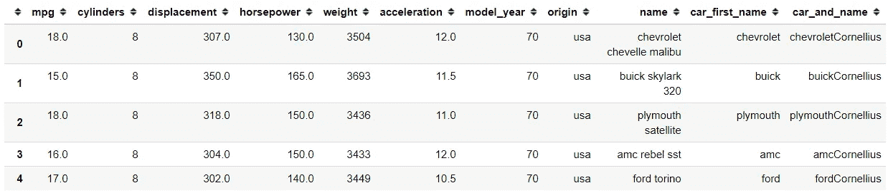

# 第 30 天:显示版本

在最后一天，我想向你们展示熊猫的一个特殊功能，叫做。显示版本。这个函数是做什么的？

这个函数给我们提供关于主机操作系统，熊猫版本，以及其他相关软件包版本的信息。它提供了有用的信息，尤其是当您处理相关的包时，并且对于 bug 报告也很重要。

```
#Day 30 show_versionsimport pandas as pdpd.show_versions(True)
```

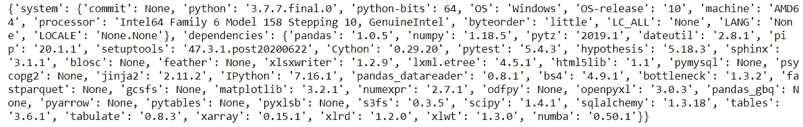

# 结论

所以。这就是我的熊猫 30 天帖子。对我来说，这是一个非常有趣和有见地的活动。我喜欢为人们创造这样的内容，我希望它对我接触到的任何人都有用。

# 如果您喜欢我的内容，并希望获得更多关于数据或数据科学家日常生活的深入知识，请考虑在此订阅我的[简讯。](https://cornellius.substack.com/welcome)

> 如果您没有订阅为中等会员，请考虑通过[我的介绍](https://cornelliusyudhawijaya.medium.com/membership)订阅。