# 掌握熊猫的 30 个例子

> 原文：<https://towardsdatascience.com/30-examples-to-master-pandas-f8a2da751fa4?source=collection_archive---------2----------------------->

## 学习熊猫的综合实践指南


照片由[恒电影](https://unsplash.com/@hengfilms?utm_source=unsplash&utm_medium=referral&utm_content=creditCopyText)在 [Unsplash](https://unsplash.com/@hengfilms?utm_source=unsplash&utm_medium=referral&utm_content=creditCopyText) 拍摄

Pandas 是一个广泛使用的 Python 数据分析和操作库。它提供了许多加快数据分析和预处理步骤的功能和方法。

由于它的流行，有许多关于熊猫的文章和教程。这一个将会是其中之一，但是非常注重实际的一面。我将在 Kaggle 上的[客户流失数据集](https://www.kaggle.com/shubh0799/churn-modelling)上做例子。

这些示例将涵盖您可能在典型的数据分析过程中使用的几乎所有函数和方法。

让我们从将 csv 文件读入熊猫数据帧开始。

```
import numpy as np
import pandas as pddf = pd.read_csv("/content/churn.csv")df.shape
(10000,14)df.columns
Index(['RowNumber', 'CustomerId', 'Surname', 'CreditScore', 'Geography', 'Gender', 'Age', 'Tenure', 'Balance', 'NumOfProducts', 'HasCrCard','IsActiveMember','EstimatedSalary', 'Exited'], dtype='object')
```

## **1。删除列**

drop 函数用于删除列和行。我们传递要删除的行或列的标签。

```
df.drop(['RowNumber', 'CustomerId', 'Surname', 'CreditScore'], axis=1, inplace=True)df.shape
(10000,10)
```

axis 参数设置为 1 表示删除列，设置为 0 表示删除行。将 inplace 参数设置为 True 以保存更改。我们删除了 4 列，所以列数从 14 列减少到了 10 列。

## 2.阅读时选择特定的列

我们只能从 csv 文件中读取一些列。读取时，列的列表被传递给 usecols 参数。如果您事先知道列名，这比以后再删除要好。

```
df_spec = pd.read_csv("/content/churn.csv", usecols=['Gender', 'Age', 'Tenure', 'Balance'])df_spec.head()
```

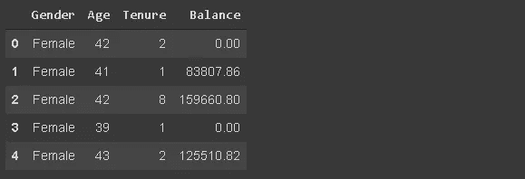

(图片由作者提供)

## 3.读取数据帧的一部分

read_csv 函数允许按照行读取数据帧的一部分。有两个选择。第一个是读取前 n 行。

```
df_partial = pd.read_csv("/content/churn.csv", nrows=5000)df_partial.shape
(5000,14)
```

使用 nrows 参数，我们创建了一个包含 csv 文件前 5000 行的数据帧。

我们还可以使用 skiprows 参数从文件的末尾选择行。Skiprows=5000 意味着我们在读取 csv 文件时将跳过前 5000 行。

## 4.样品

创建数据帧后，我们可能想要绘制一个小样本来工作。我们可以使用 n 参数或 frac 参数来确定样本大小。

*   n:样本中的行数
*   frac:样本大小与整个数据框架大小的比率

```
df_sample = df.sample(n=1000)
df_sample.shape
(1000,10)df_sample2 = df.sample(frac=0.1)
df_sample2.shape
(1000,10)
```

## 5.检查缺少的值

isna 函数确定数据帧中缺失的值。通过将 isna 与 sum 函数结合使用，我们可以看到每一列中缺失值的数量。

```
df.isna().sum()
```

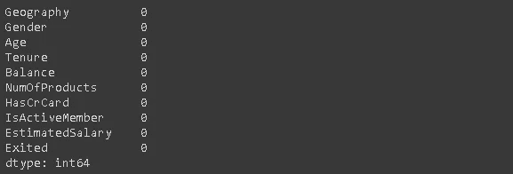

(图片由作者提供)

没有丢失的值。

## 6.使用 loc 和 iloc 添加缺失值

我做这个例子是为了练习“loc”和“iloc”。这些方法基于索引或标签选择行和列。

*   loc:使用标签选择
*   iloc:带索引选择

让我们首先创建 20 个随机指数来选择。

```
missing_index = np.random.randint(10000, size=20)
```

我们将使用这些索引将一些值更改为 np.nan(缺失值)。

```
df.loc[missing_index, ['Balance','Geography']] = np.nan
```

“余额”和“地理位置”列中缺少 20 个值。让我们用索引代替标签来做另一个例子。

```
df.iloc[missing_index, -1] = np.nan
```

“-1”是“已退出”的最后一列的索引。

尽管我们对 loc 和 iloc 使用了不同的列表示，但是行值没有改变。原因是我们正在使用数字索引标签。因此，行的标签和索引是相同的。

丢失值的数量已更改:

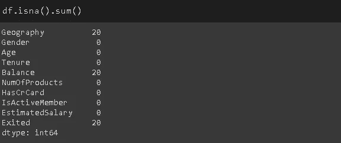

(图片由作者提供)

## 7.填充缺失值

fillna 函数用于填充缺失的值。它提供了许多选项。我们可以使用特定的值、聚合函数(例如平均值)，或者前一个或下一个值。

对于 geography 列，我将使用最常见的值。

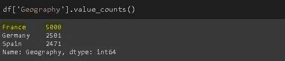

(图片由作者提供)

```
mode = df['Geography'].value_counts().index[0]
df['Geography'].fillna(value=mode, inplace=True)
```

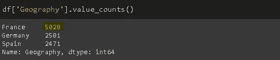

(图片由作者提供)

同样，对于 balance 列，我将使用该列的平均值来替换缺失的值。

```
avg = df['Balance'].mean()
df['Balance'].fillna(value=avg, inplace=True)
```

fillna 函数的 method 参数可用于根据列中的上一个或下一个值填充缺失值(例如 method='ffill ')。这对于序列数据(例如时间序列)非常有用。

## 8.删除丢失的值

处理缺失值的另一种方法是删除它们。“已退出”列中仍有缺失值。下面的代码将删除任何缺少值的行。

```
df.dropna(axis=0, how='any', inplace=True)
```

轴=1 用于删除缺少值的列。我们还可以为一列或一行所需的非缺失值的数量设置一个阈值。例如，thresh=5 意味着一行必须至少有 5 个非缺失值才不会被删除。缺少 4 个或更少值的行将被删除。

dataframe 现在没有任何缺失值。

```
df.isna().sum().sum()
0
```

## 9.基于条件选择行

在某些情况下，我们需要符合某些条件的观察值(即行)。例如，下面的代码将选择居住在法国的客户。

```
france_churn = df[(df.Geography == 'France') & (df.Exited == 1)]france_churn.Geography.value_counts()
France    808
```

## 10.用查询描述条件

查询函数提供了一种更灵活的传递条件的方式。我们可以用字符串来描述它们。

```
df2 = df.query('80000 < Balance < 100000')
```

让我们通过绘制余额柱的直方图来确认结果。

```
df2['Balance'].plot(kind='hist', figsize=(8,5))
```

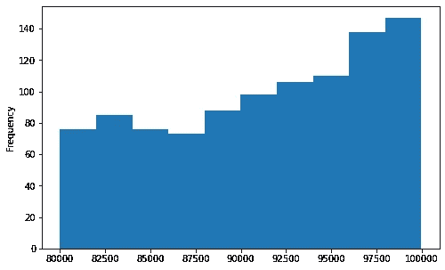

(图片由作者提供)

## 11.用 isin 描述条件

条件可能有几个值。在这种情况下，最好使用 isin 方法，而不是单独写入值。

我们只是传递一个所需值的列表。

```
df[df['Tenure'].isin([4,6,9,10])][:3]
```

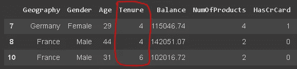

(图片由作者提供)

## 12.groupby 函数

Pandas **Groupby** 函数是一个多功能且易于使用的函数，有助于获得数据的概览。这使得探索数据集和揭示变量之间的潜在关系变得更加容易。

我们将做几个 groupby 函数的例子。先说一个简单的。下面的代码将根据地理-性别组合对行进行分组，然后给出每组的平均流失率。

```
df[['Geography','Gender','Exited']].groupby(['Geography','Gender']).mean()
```


(图片由作者提供)

## 13.通过 groupby 应用多个聚合函数

agg 函数允许对组应用多个聚合函数。函数列表作为参数传递。

```
df[['Geography','Gender','Exited']].groupby(['Geography','Gender']).agg(['mean','count'])
```


(图片由作者提供)

我们可以看到每个组中的观察计数(行)和平均流失率。

## 14.对不同的组应用不同的聚合函数

我们不必对所有列应用相同的函数。例如，我们可能希望看到每个国家的平均余额和客户总数。

我们将传递一个字典，指示哪些函数将应用于哪些列。

```
df_summary = df[['Geography','Exited','Balance']].groupby('Geography')\
.agg({'Exited':'sum', 'Balance':'mean'})df_summary.rename(columns={'Exited':'# of churned customers', 'Balance':'Average Balance of Customers'},inplace=True)df_summary
```

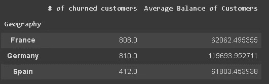

(图片由作者提供)

我还重命名了这些列。

***编辑*** :感谢罗恩在评论区的提醒。NamedAgg 函数允许重命名聚合中的列。语法如下:

```
df_summary = df[['Geography','Exited','Balance']].groupby('Geography')\
.agg(
 Number_of_churned_customers = pd.NamedAgg('Exited', 'Sum'),
 Average_balance_of_customers = pd.NamedAgg('Balance', 'Mean')
)
```

## 15.重置索引

您可能已经注意到，groupby 返回的数据帧的索引由组名组成。我们可以通过重置索引来改变它。

```
df_new = df[['Geography','Exited','Balance']]\
.groupby(['Geography','Exited']).mean().reset_index()df_new
```


(图片由作者提供)

***编辑*** :感谢罗恩在评论区的提醒。如果我们将 groupby 函数的 as_index 参数设置为 False，那么组名将不会用作索引。

## 16.用 drop 重置索引

在某些情况下，我们需要重置索引，同时删除原始索引。考虑从数据帧中抽取样本的情况。该示例将保留原始数据帧的索引，因此我们希望重置它。

```
df[['Geography','Exited','Balance']].sample(n=6).reset_index()
```

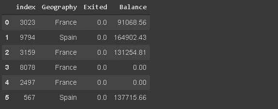

(图片由作者提供)

索引被重置，但原始索引作为新列保留。我们可以在重置索引时删除它。

```
df[['Geography','Exited','Balance']]\
.sample(n=6).reset_index(drop=True)
```

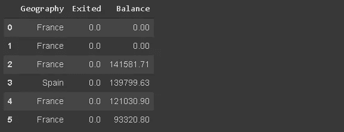

(图片由作者提供)

## 17.将特定列设置为索引

我们可以将数据帧中的任何一列设置为索引。

```
df_new.set_index('Geography')
```


(图片由作者提供)

## 18.插入新列

我们可以向数据帧添加一个新列，如下所示:

```
group = np.random.randint(10, size=6)
df_new['Group'] = groupdf_new
```

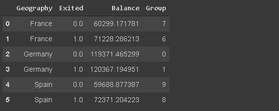

(图片由作者提供)

但是新列被添加在末尾。如果想把新列放在特定的位置，可以使用 insert 函数。

```
df_new.insert(0, 'Group', group)df_new
```


(图片由作者提供)

第一个参数是位置的索引，第二个是列的名称，第三个是值。

## 19.where 函数

它用于根据条件替换行或列中的值。默认的替换值是 NaN，但是我们也可以指定替换值。

考虑上一步中的数据帧(df_new)。对于属于小于 6 的组的客户，我们希望将余额设置为 0。

```
df_new['Balance'] = df_new['Balance'].where(df_new['Group'] >= 6, 0)df_new
```


(图片由作者提供)

符合指定条件的值保持不变，其他值被指定的值替换。

**20。排名函数**

它给这些值分配一个等级。让我们创建一个根据客户余额对客户进行排名的列。

```
df_new['rank'] = df_new['Balance'].rank(method='first', ascending=False).astype('int')df_new
```

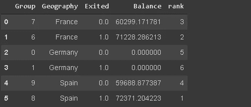

(图片由作者提供)

method 参数指定如何处理具有相同值的行。“第一个”意味着根据它们在数组(即列)中的顺序对它们进行排序。

## 21.列中唯一值的数量

在处理分类变量时，这很方便。我们可能需要检查唯一类别的数量。

我们可以检查由 value counts 函数返回的序列的大小，或者使用 nunique 函数。

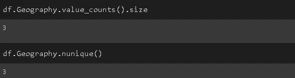

(图片由作者提供)

## 22.内存使用

这是由 memory_usage 函数简单完成的。

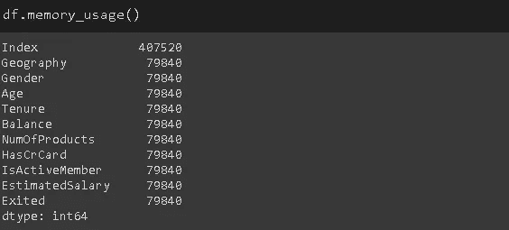

(图片由作者提供)

这些值以字节为单位显示使用了多少内存。

## 23.类别数据类型

默认情况下，分类数据与对象数据类型一起存储。但是，这可能会导致不必要的内存使用，尤其是当分类变量的基数较低时。

低基数意味着与行数相比，一列只有很少的唯一值。例如，geography 列有 3 个唯一值和 10000 行。

我们可以通过将它的数据类型改为“类别”来节省内存。

```
df['Geography'] = df['Geography'].astype('category')
```

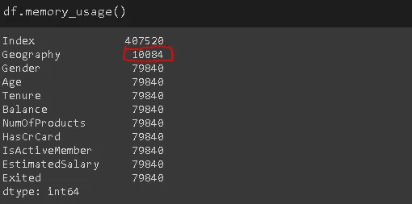

(图片由作者提供)

地理列的内存消耗减少了近 8 倍。

## 24.替换值

replace 函数可用于替换数据帧中的值。

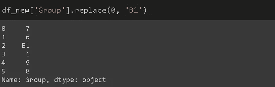

(图片由作者提供)

第一个参数是要替换的值，第二个参数是新值。

我们可以用字典做多次替换。

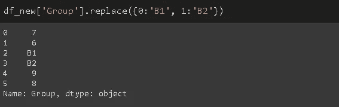

(图片由作者提供)

## 25.绘制直方图

Pandas 不是一个数据可视化库，但它使创建基本绘图变得非常简单。

我发现用熊猫创建基本图比使用额外的数据可视化库更容易。

让我们创建一个余额柱状图。

```
df['Balance'].plot(kind='hist', figsize=(10,6), 
title='Customer Balance')
```

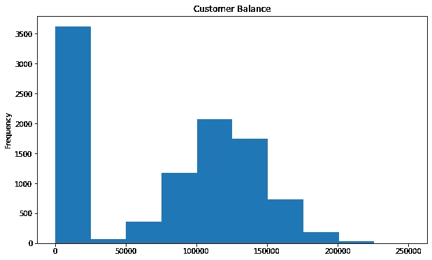

(图片由作者提供)

由于 pandas 不是一个数据可视化库，所以我不想详细介绍绘图。然而，[图](https://pandas.pydata.org/pandas-docs/stable/reference/api/pandas.DataFrame.plot.html)函数能够创建许多不同的图，如折线图、条形图、kde 图、面积图、散点图等。

## 26.减少浮点数的小数点

熊猫可能会为浮动显示过多的小数点。我们可以使用 round 函数轻松调整它。

```
df_new.round(1) #number of desired decimal points
```

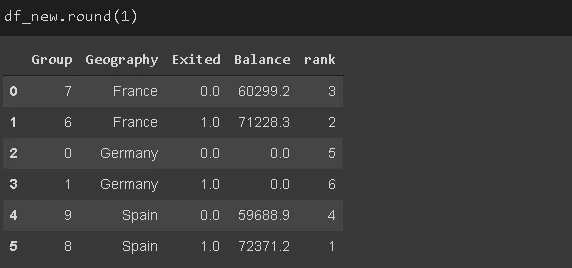

(图片由作者提供)

## 27.更改显示选项

我们可以更改各种参数的默认显示选项，而不是每次都手动调整显示选项。

*   get_option:返回当前选项
*   set_option:更改选项

让我们将小数点的显示选项改为 2。

```
pd.set_option("display.precision", 2)
```

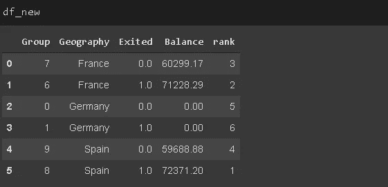

(图片由作者提供)

您可能希望更改的其他一些选项有:

*   max_colwidth:列中显示的最大字符数
*   max_columns:要显示的最大列数
*   max_rows:要显示的最大行数

## 28.通过列计算百分比变化

pct_change 用于通过系列中的值计算百分比变化。它在计算时间序列或连续元素数组中的变化百分比时非常有用。

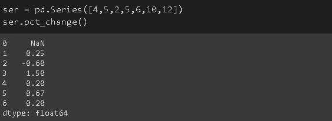

(图片由作者提供)

从第一个元素(4)到第二个元素(5)的变化是%25，因此第二个值是 0.25。

## 29.基于字符串的过滤

我们可能需要根据文本数据(如客户姓名)过滤观察结果(行)。我已经向 df_new 数据帧添加了虚构的名称。

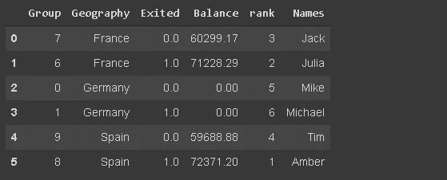

(图片由作者提供)

让我们选择客户名称以“Mi”开头的行。

我们将使用 str 访问器的 startswith 方法。

```
df_new[df_new.Names.str.startswith('Mi')]
```


(图片由作者提供)

endswith 函数根据字符串末尾的字符进行同样的过滤。

熊猫可以用绳子做很多操作。如果你想进一步阅读，我有一篇关于这个主题的单独文章。

[](/5-must-know-pandas-operations-on-strings-4f88ca6b8e25) [## 熊猫 5 个必知的串线操作

### 熊猫让字符串操作变得简单

towardsdatascience.com](/5-must-know-pandas-operations-on-strings-4f88ca6b8e25) 

## 30.设计数据框架的样式

我们可以通过使用返回一个 **styler** 对象的 **Style** 属性来实现这一点，它为格式化和显示数据帧提供了许多选项。例如，我们可以突出显示最小值或最大值。

它还允许应用自定义样式功能。

```
df_new.style.highlight_max(axis=0, color='darkgreen')
```


(图片由作者提供)

如果你想进一步阅读的话，我有一篇关于设计熊猫数据框架的详细文章。

[](/style-your-pandas-dataframes-814e6a078c6d) [## 设计你的熊猫数据框

### 让我们创造出比简单数字更多的东西。

towardsdatascience.com](/style-your-pandas-dataframes-814e6a078c6d) 

## 结论

我们已经介绍了大量的数据分析功能和方法。当然，熊猫提供的还有很多，但不可能在一篇文章中涵盖所有内容。

随着您继续使用 pandas 进行数据分析任务，您可能会发现新的功能和方法。如同任何其他科目一样，熟能生巧。

我想分享另外两个帖子，它们涵盖了与这篇帖子不同的操作。

*   [20 分掌握熊猫时间序列分析](/20-points-to-master-pandas-time-series-analysis-f90155ee0e8a)
*   [Pandas 特定于类型的操作:访问器](/pandas-dtype-specific-operations-accessors-c749bafb30a4)

感谢您的阅读。如果您有任何反馈，请告诉我。