# 面试准备的数据科学问题(机器学习概念)——第一部分

> 原文：<https://towardsdatascience.com/33-data-science-questions-for-interview-prep-machine-learning-concepts-6b1718397431?source=collection_archive---------47----------------------->

## 这两部分系列的这一部分包括模型评估技术、正则化技术、逻辑回归和偏差方差权衡。

我最近在 Youtube 上看完了这个机器学习播放列表[(Josh Starmer 的 stat quest)](https://www.youtube.com/watch?v=Gv9_4yMHFhI&list=PLblh5JKOoLUICTaGLRoHQDuF_7q2GfuJF&index=1)，并想到将每个概念总结成一个 Q/A。随着我为更多的数据科学面试做准备，我认为这将是一个很好的练习，以确保我在面试中清晰简洁地交流我的想法。如果我没有很好地解释任何概念，请在评论中告诉我。

注意:本文的目的不是向初学者教授一个概念。它假设读者在数据科学概念方面有足够的背景知识。如果你刚刚开始学习 ML，我强烈推荐你去 Youtube 上看看 StatQuest，这是我的最爱之一。

# 1.什么是交叉验证？什么时候用？我们可以使用交叉验证来调整模型参数吗？交叉验证有哪些类型？

交叉验证是一种模型评估技术，我们将给定的数据集分成不同的折叠，比如说 5 个，然后迭代地使用 4 个折叠进行训练，1 个折叠进行验证。使用这种技术的目的是检查模型对不同的训练集和测试集组合的稳健性。它还用于比较两个模型，看哪一个整体性能更好。

是的，我们可以使用交叉验证来调整模型参数。还有一种更常用的 N 重交叉验证，去掉一个交叉验证，取一个样本作为测试集，其余的作为训练集。

# 2.什么是混淆矩阵？

混淆矩阵是我们用于分类问题的另一种模型评估技术。在这种技术中，我们制作一个 NxN 矩阵，其中 N 是要预测的不同类别的数量，因此对于二进制分类问题，N=2。我们在 X 轴上有实际值，在 Y 轴上有预测值。模型评估是基于由此产生的一些指标完成的，如特异性、敏感性、精确度和召回率。

[来源](https://miro.medium.com/max/712/1*Z54JgbS4DUwWSknhDCvNTQ.png)

# 3.我们如何定义灵敏度、特异性和精确度？

灵敏度、回忆、功效或真阳性率是真阳性与阳性总数的比率。对于给定的分类问题，它告诉我们从所有阳性中正确分类的阳性的比例。

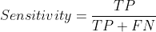

特异性或真阴性率是真阴性与总阴性的比率。它告诉我们正确分类的否定在所有否定中所占的比例。

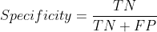

精确度是真阳性与所有预测为阳性的病例的比例

# 4.什么是 F 分数？

f 分数是测试二元分类准确性的一种度量。这是精确和回忆的调和平均值。F 值取 0 到 1 之间的值，F 值越高，分类模型的能力越强。

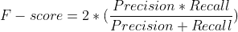

# 5.我们什么时候用 ROC 和 AUC？它们代表什么？为什么我们要用 ROC 曲线？

ROC 曲线绘制了真阳性率(灵敏度)对假阳性率(1-特异性)。ROC 曲线用于参数调整。假设我们有一个逻辑回归模型，我们不知道使用什么阈值来分类真阳性和真阴性，那么在这种情况下，为每个阈值生成混淆矩阵可能是一个繁琐的过程，以决定使用哪个阈值。因此，我们制作 ROC 曲线，根据最适合我们的真阳性率和假阳性率来决定使用哪个阈值。我们用 AUC 来决定哪个模型更好。具有最大曲线下面积的模型是最佳模型。

# 6.偏差-方差权衡是什么？

在理解偏差和方差之间的权衡之前，让我们试着理解偏差和方差的含义:

*偏差是指通过一个简单得多的模型[1]* 来近似一个可能极其复杂的现实生活问题而引入的误差

*另一方面，方差是如果我们使用不同的训练集对预测值 y-hat 进行估计，预测值 y-hat 将会改变的量[2]*

偏差方差权衡有助于我们决定模型与训练集和测试集的匹配程度。完全符合训练集但在测试集上表现很差的模型被称为具有高方差，而符合测试集但不符合训练集的模型被称为具有高偏差。

# 7.赔率和概率有什么区别？各自是如何定义的？对数与逻辑回归有什么关系？

几率是某事发生与某事不发生的比率，而概率是某事发生与可能性总数的比率。

逻辑回归中的概率建模为

如果我们变换这个方程，使它在 X 轴上是线性的，我们会得到这样的结果

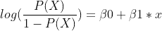

其中左边代表对数(赔率)

# 8.什么是逻辑回归？解释逻辑回归和线性回归的区别？

逻辑回归是一种机器学习技术，它根据一组观察到的 X 变量对响应 Y 属于特定类别的概率进行建模。概率由逻辑函数建模，其写作如下

线性回归用于预测持续反应，而逻辑回归用于分类。

# 9.比较线性回归和逻辑回归的系数。

简单线性回归的等式可以写成 Y = b0 + b1*X，其中 b1 表示 X 增加 1 个单位时 Y 的平均增加量，b0 是 Y 截距。

逻辑回归的方程式可以写成

这个方程表示一条 S 形曲线，为了将这个方程形象化为一条直线，我们可以对逻辑函数进行一些处理，得到

左边的函数表示对数(赔率),右边的方程现在是 x 的线性方程。因此，在逻辑回归的情况下，x 增加 1 个单位，对数(赔率)增加β1，或者相当于赔率乘以 e^β1.

然而，在线性回归和逻辑回归两种情况下，β1 的正值与 Y 的增加相关，在线性回归的情况下与 log(odds)相关，在逻辑回归的情况下与 Y 的增加相关。

# 10.解释最大似然法？为什么我们使用最大似然法而不是最小二乘法来计算逻辑回归的系数？

这是一种技术，用于估计最佳描述给定数据的分布的未知参数。可能性的等式是

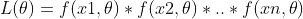

其中θ是未知参数，x1，x2，…，xn 是数据点

逻辑函数是非线性函数，用 S 形曲线表示。现在，为了计算最小二乘，我们需要拟合一条线，使每个数据点到这条线的平方距离之和最小。因为计算 S 形曲线的残差更加复杂，所以最适合的方法是似然法，这是一种参数估计技术。

# 11.概率和似然的区别是什么？

概率和可能性虽然经常互换使用，但在某些情况下是不同的。在离散的情况下，它们代表相同的东西，但在连续分布的情况下，它们的意义完全不同。

在连续场景中，概率为**(数据|分布)**，读作**数据给定分布**，而似然为(**分布|数据)，**读作**分布给定数据。**

让我们从概率开始，每当我们被问到连续分布的概率时，它就是曲线下的面积。简而言之，给我们一个分布，曲线下的面积帮助我们找到在某个范围内观察到某个值的概率，即 **P(数据|分布)**。下图显示了代表篮球运动员身高的正态分布，平均值= 6.583，标准差= 0.3。曲线下的面积给出了 **P(身高介于 6.7 & 6.9 |平均值= 6.583 &标准差= 0.3)**

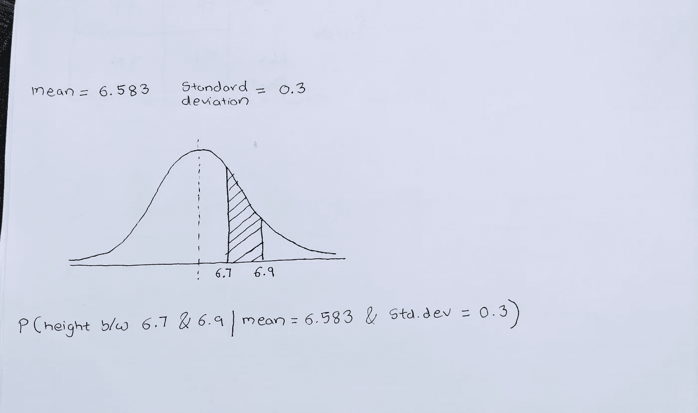

然而，在可能性的情况下，我们被给定一个数据集，我们的工作是找到最佳描述给定数据集的分布的参数，即 **L(分布|数据)**。我们通过对每个参数(平均值、标准偏差)取似然函数的导数来做到这一点，直到我们找到最大化似然函数的参数。在下图中，橙色分布底部的 x 表示我们要估计其平均值和标准差的给定样本集。因此，我们首先假设均值和标准差的值，并继续这一过程，直到我们找到一个分布，在这种情况下是橙色分布，它最大化了似然函数 **L(均值，标准差)**或最好地描述了数据。

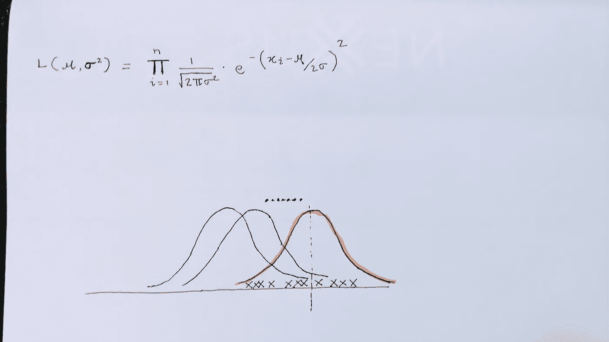

# 12.我们为什么要使用正则化？

正则化技术用于减少模型过拟合。有两种常用的正则化方法，L1 正则化或套索和 L2 或岭回归。我们通过引入少量的偏差(或惩罚项)来做到这一点，使模型对训练数据不太敏感，从而避免过度拟合并减少测试数据的差异。正则化技术的目标是最小化下列山脊方程

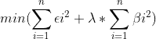

接着是套索

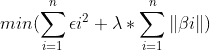

λ决定斜率的惩罚，ε项是残差，β项是斜率。λ越高，惩罚越高。

# 13.套索和山脊有什么区别？我们如何选择调谐参数λ？

Lasso 和 Ridge 的最大区别在于，Ridge 回归可以将斜率渐近收缩到接近 0，而 Lasso 回归可以将斜率一直收缩到 0。当有许多无用的变量时，套索是有用的，而当大多数变量都有用时，山脊是有用的。

Lambda 可以取从 0 到无穷大的任何值。如果λ= 0，我们有最小二乘直线。我们可以通过交叉验证来选择 lambda 的值。λ越大，模型系数的变化越大。

# 14.拟合最小二乘回归线时，变量个数和样本个数之间的关系是什么？

n 应该总是至少等于 p，其中 n 是样本大小，p 是变量的数量。假设 n = 1，p = 2，不拟合任何线，我们至少需要 2 个数据点，对于一个数据点，我们可以有无限多条线通过该点。

# 15.有哪些方法可以替换丢失的数据？

有很多方法可以处理这种情况。

1.  如果丢失值的实例数量只占整个数据集的一小部分，那么它们可以被安全地删除。
2.  用平均值、中值或众数估算缺失值。这项技术的唯一警告是，如果数据有偏差，估算可能会导致错误的表示。例如，假设我们的数据集有两列，一列是个人的年龄，另一列是衡量个人健康状况的指数。现在，如果我们的数据集有健康指数的缺失值，并且如果数据偏向年轻人群，那么如果有老年人的缺失值，我们可能会用代表年轻人群的健康指数来替代它。
3.  第三种方法是，我们可以找到与缺失值的变量高度相关的变量，并进行回归拟合。

# 16.解释朴素贝叶斯算法

“朴素贝叶斯”是一种分类算法，它使用贝叶斯定理将实例分类到特定类别。它假设预测值之间是独立的，这是一个主要的假设，因为一组预测值几乎不可能完全独立。当预测器是明确的时，它工作得很好。

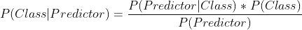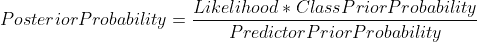

这应该是一个停下来的好地方。在第二部分中，我们将讨论一些最常见的关于不同 ML 算法的面试问题。

[面试准备的数据科学问题(机器学习概念)—第二部分](/data-science-questions-for-interview-prep-machine-learning-concepts-part-ii-b7b58e74a1b7)

## 参考:

[1]统计学习介绍— Gareth James，Daniela Witten，Trevor Hastie，Robert Tibshirani

[2]《统计学习导论》——加雷斯·詹姆斯、丹妮拉·威滕、特雷弗·哈斯蒂、罗伯特·蒂布拉尼

[乔希·斯塔默的 stat quest](https://www.youtube.com/watch?v=Gv9_4yMHFhI&list=PLblh5JKOoLUICTaGLRoHQDuF_7q2GfuJF&index=1)