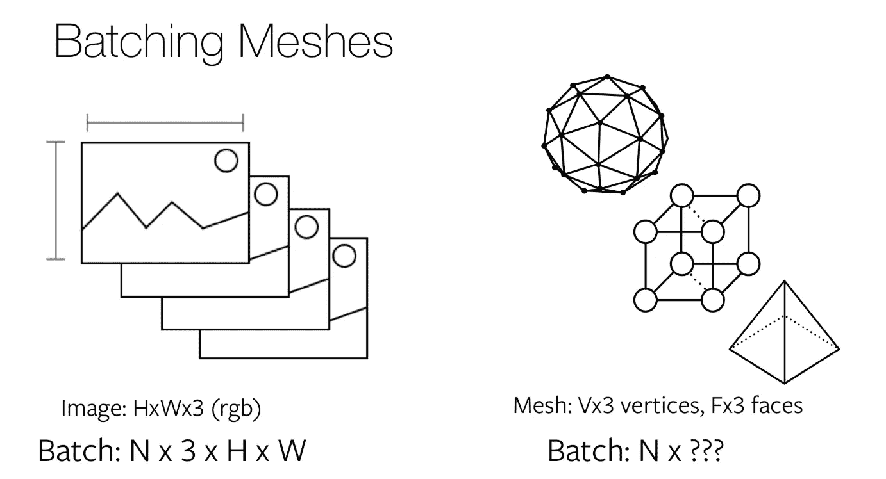
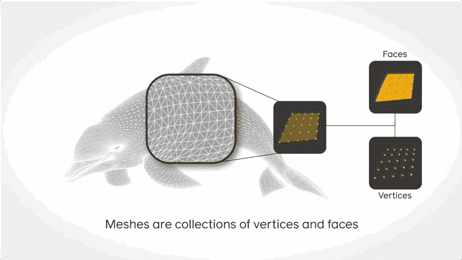
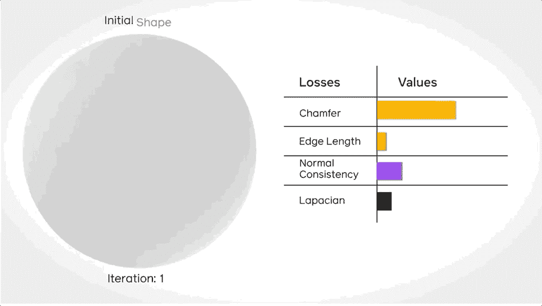
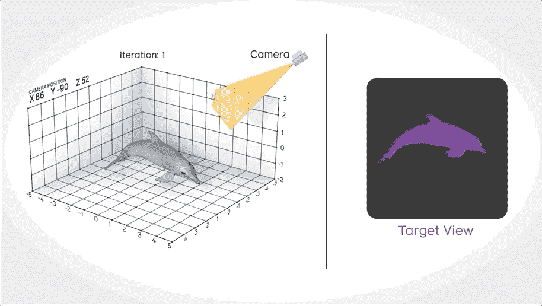
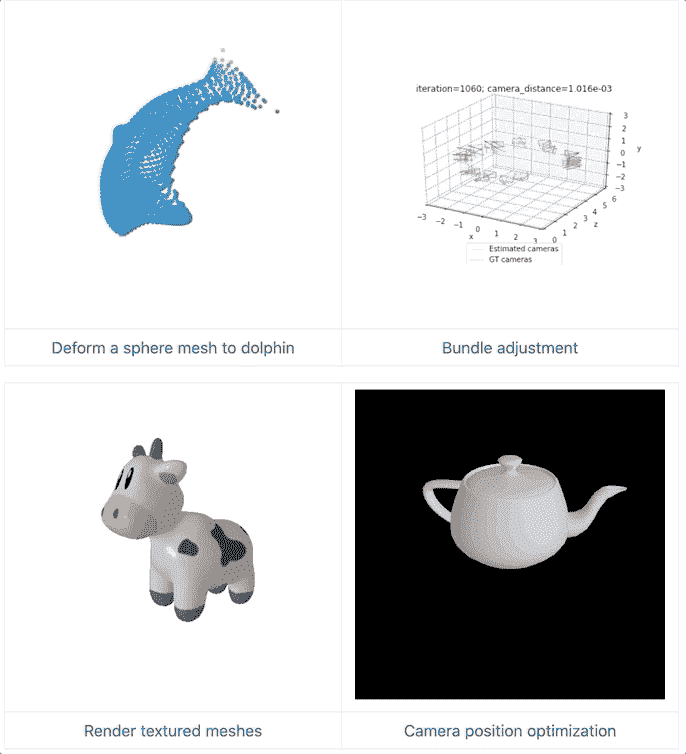

# 3D 深度学习变得更简单——脸书 PyTorch3D 框架简介

> 原文：<https://towardsdatascience.com/3d-deep-learning-made-easier-a-brief-introduction-to-facebooks-pytorch3d-framework-9fe3075f388a?source=collection_archive---------24----------------------->

来源:[脸书研究 GitHub 页面](https://github.com/facebookresearch/pytorch3d)

## 脸书发布了支持 3D 环境中深度学习的 PyTorch3D 框架。找出它是什么。

## 介绍

作为一个开源的机器学习库，PyTorch 越来越受到人工智能(AI)研究人员的欢迎，用于各种应用，包括计算机视觉和自然语言处理。作为其主要开发者，脸书人工智能研究中心(FAIR)已经注意到 PyTorch 和其他可用工具包中处理 3D(即 3 维)数据的有限功能，因此他们开发了 PyTorch3D 框架，旨在促进 3D 深度学习领域的创新研究。

该框架有三个关键特性，包括使用网格的数据结构、这些网格的操作和可区分的渲染器。下面介绍这些功能。

## 使用三角形网格的数据结构

对于 2D 图像输入，批处理很简单，包括生成一个形状为`N X 3 X H X W`的四维张量，如下所示。然而，3D 图像输入不是平坦的(即 2D)，并且这种对 2D 图像输入的批处理将不起作用。

图像批处理 2D vs. 3D(来源: [PyTorch3D](https://pytorch3d.org/docs/batching)

为了解决 PyTorch3D 中的这个问题，FAIR team 使用网格作为数据结构来处理 3D 图像输入。具体来说，3D 图像输入将被处理为多个顶点和面，从这些顶点和面可以形成三角形网格。如下面的动画图像所示，要批处理异构网格，网格数据结构可以是张量列表、打包张量和填充张量。更多细节可以参考这个[链接](https://pytorch3d.org/docs/batching)。

PyTorch3D 中作为数据结构的网格(来源:[脸书](https://ai.facebook.com/blog/-introducing-pytorch3d-an-open-source-library-for-3d-deep-learning/))

## 三角形网格上的操作

除了上面提到的对异构批处理输入的支持之外，PyTorch3D 还优化了几种常见运算符和损失函数的实现，如 Chamfer 和 Lapacian，前者是一种比较两组 3D 数据点云的方法。这些内置操作允许研究人员训练他们的模型，而不需要自己实现这些操作。

三角形网格上的操作(来源:[脸书](https://ai.facebook.com/blog/-introducing-pytorch3d-an-open-source-library-for-3d-deep-learning/))

## 可微分网格渲染器

PyTorch3D 提供了一个高效的模块化可区分渲染器，允许研究人员将他们的 3D 模型转换为 2D 图像。这种模块化的可区分渲染器是创新的，因为传统的渲染引擎由于不可区分而无法融入深度学习。下面的动画图像显示了渲染器如何作为相机扫描工作。

可微分网格渲染器(来源:[脸书](https://ai.facebook.com/blog/-introducing-pytorch3d-an-open-source-library-for-3d-deep-learning/)

## 外卖和后续步骤

感谢 FAIR 开发这一强大工具包的工作以及作为开源项目的慷慨共享，这使得 3D 深度学习对许多人工智能研究人员来说更容易。如果你想探索这个工具包，在它的 [GitHub](https://github.com/facebookresearch/pytorch3d) 上有几个入门教程。

PyTorch3D 教程

## 参考

[脸书在 PyTorch3D 上的博客](https://ai.facebook.com/blog/-introducing-pytorch3d-an-open-source-library-for-3d-deep-learning/)

[PyTorch3D 官网](https://pytorch3d.org/)

[PyTorch3D GitHub 页面](https://github.com/facebookresearch/pytorch3d)