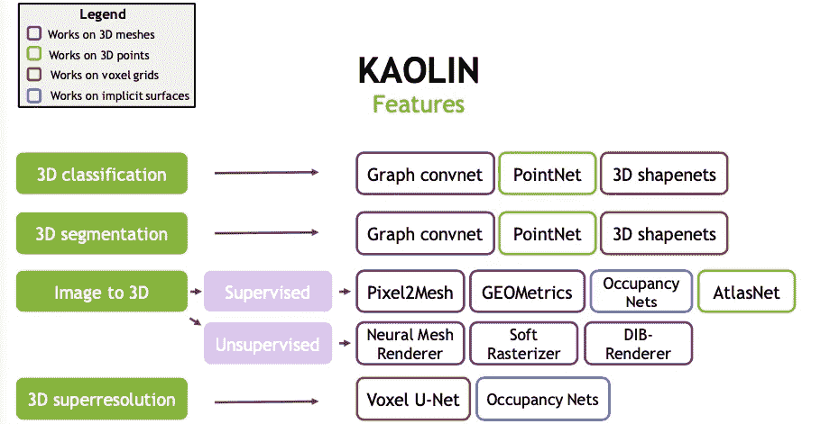

# 使用高岭土和 Colab 的 6 步 3D 对象检测分类器

> 原文：<https://towardsdatascience.com/3d-object-classification-in-6-steps-using-kaolin-and-colab-9ecb079143a8?source=collection_archive---------26----------------------->

## 一步一步的实际操作的 3D 对象检测分类器，没有 Linux 机器或 GPU 的先决条件

三维物体检测分类器

在本文中，您将学习开发 3D 对象检测分类器，而无需预先准备 Linux 机器或手中的 GPU。

3D 对象检测是解决诸如自动驾驶汽车、机器人和 AR/VR 应用等现实世界应用的一个重要方面。3D 数据提供可靠的深度信息，可用于精确定位物体/车辆。

# 3D 表示

以下是 3D 表示的一些类型

3D 表示

**点云**是 3D 空间中的点的集合，每个点由一个(XYZ)坐标指定，可选地还有其他属性(如 RGB 颜色)。点云被称为从诸如激光雷达的传感器获得的原始数据。在进一步处理之前，这些被转换成其他表示，例如多边形网格、体素网格。

点云(PC)表示更为可取，因为 PC 到其他格式的转换很容易，反之亦然。点表示保留了 3D 空间中原始的几何信息，没有任何离散化。

**多边形网格**由组多边形面组成，这些多边形面具有近似几何表面的共享顶点。

**体积**表示规则间隔的 3D 网格上的单个样本或数据点，体素网格是 3D 网格，其中每个单元或“体素”具有固定的大小和离散的坐标。

**投影视图 RGB(D)** 将 3D 对象投影到多个视图中，并提取相应的视图特征，然后融合这些特征以进行精确的对象检测。

# Google Colab -简介

Google colaboratory 又名 colab，是一款免费使用 GPU 的 jupyter 笔记本电脑。当您在 colaboratory 上训练您的模型时，您可以使用基于 GPU 的虚拟机，每次最多给你 12 个小时。之后失去对该特定虚拟机实例的访问，并在 12 小时后连接到不同的虚拟机实例。所以请定期保存数据或检查点。可乐是完全免费的。

选择 GPU

要选择用于训练的 GPU，请选择**运行时** > **更改运行时类型**选择硬件加速器(无更改为 GPU)。

colab 预装了各大库(NumPy，matplotlib)和框架(TensorFlow，PyTorch)并进行定制安装尝试(**！pip 安装**。

探索谷歌实验室[这里](https://colab.research.google.com/)

# 高岭土- 3D 深度学习研究框架

Kaolin 是由 NVIDIA 的一个团队开发的开源 PyTorch 库，旨在加速 3D 深度学习研究。高岭土框架用几行代码将 3D 模型转换成深度学习数据集。高岭土为加载和预处理流行的 3D 数据集提供了便捷的途径。

Kaolin 框架将复杂的 3D 算法归结为简单的步骤，如点云数据到体素网格的转换，三角形网格表示。

高岭土框架使机器人、自动驾驶汽车、增强和虚拟现实等领域的研究人员受益。

现在，对于 3D 对象检测分类器，我们将使用**高岭土框架**。git 回购可以在[这里](https://github.com/NVIDIAGameWorks/kaolin)找到

总之，这是我们一直在寻找的高岭土特性。

高岭土特征

# 资料组

该数据集可从普林斯顿模型网获得。[**model net 10 . ZIP**](http://3dvision.princeton.edu/projects/2014/3DShapeNets/ModelNet10.zip)**ZIP 文件包含来自 10 个类别的 CAD 模型，用于在我们的 **3D 对象检测分类器**中训练深度网络。培训和测试分割包含在文件中。CAD 模型在内部被完全清理，模型的方向(非比例)由我们自己手动调整。**

**MODELNET 10 有下面提到的 10 个类别:**

> **浴缸，床，椅子，书桌，梳妆台，显示器，床头柜，沙发，桌子，卫生间**

**让我们开始吧…**

# **3D 对象检测分类器**

## **第一步:打开 google colab [这里](https://colab.research.google.com/)，将运行时间改为 GPU(大约 4-5 分钟)**

**安装软件包**

**安装软件包**

## **步骤 2:下载 MODELNET10 数据集**

**通过 X、Y、Z 移动可视化 3D 模型**

## **步骤 3:数据加载**

**Kaolin 提供了方便的功能来加载流行的 3D 数据集(ModelNet10)。首先，我们将定义几个重要参数:**

**`model_path`该变量将保存 ModelNet10 数据集的路径。`categories`变量来指定我们要学习分类哪些类。`num_points`是我们将网格转换为点云时从网格中采样的点数。**

**最后，如果我们使用 CUDA 进行转换操作，我们将禁用多处理和内存锁定。**

**该命令定义了一个`transform`，它首先将一个网格表示转换为一个点云，然后*将*标准化为以原点为中心，标准偏差为 1。与图像非常相似，点云等 3D 数据需要进行归一化处理，以获得更好的分类性能。**

**`split='train'`参数表明我们正在装载“火车”拆分。`rep='pointcloud'`加载网格并转换成点云。`transform=norm`对每个点云应用标准化变换。**

## **步骤 4:建立我们的模型、优化器和损失标准**

## **步骤 5:训练点云分类器(大约 15-20 分钟)**

**以下代码行将训练和验证一个 *PointNet* 分类器**

****

**划时代训练**

**万岁！！！，就这样，你已经用高岭土训练了你的第一个 3D 物体检测分类器！！**

## **步骤 6:在测试数据上评估训练的 3D 对象检测模型**

**我们将创建一个新的数据加载器，它将加载与我们以前的 val_loader 相同的数据，但是会进行混排，并获取一个样本批次。**

**接下来，我们使用一个小的**可视化**函数设置一个图形来可视化点云、地面实况标签和我们的预测。**

**对结果进行颜色编码，绿色**表示正确，红色**表示不正确。******

## **可视化结果**

**地面真相，Pred 预测。**

****

**拍拍背，完成 3D 对象检测分类器。**

**感谢阅读…**

**Jupyter 笔记本可以在[这里](https://github.com/gkadusumilli/3D_pointcloud_classifier/blob/master/3D_object_classifier_updated.ipynb)找到**

**文章更新:2021 年 10 月 31 日**

**引用 URL**

1.  **[Krishna mur thy Jatavallabhula](https://arxiv.org/search/cs?searchtype=author&query=Jatavallabhula%2C+K+M)等《高岭土:加速 3D 深度学习研究的 PyTorch 库》[arXiv:1911.05063 v2](https://arxiv.org/abs/1911.05063v2)[论文](https://arxiv.org/abs/1911.05063)**
2.  **[https://github.com/NVIDIAGameWorks/kaolin](https://github.com/NVIDIAGameWorks/kaolin)**
3.  **[普林斯顿模型网](https://modelnet.cs.princeton.edu/#)**

**4.Google colab 指南**