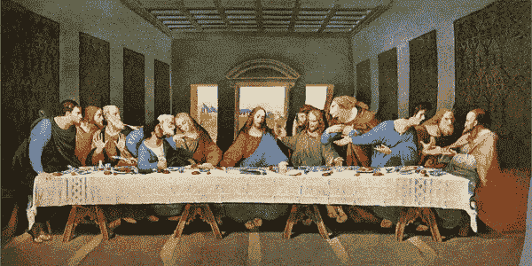
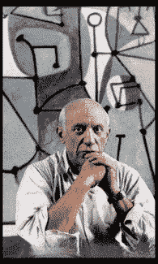

# 用人工智能探索艺术。

> 原文：<https://towardsdatascience.com/3d-photography-inpainting-exploring-art-with-ai-adb390a09810?source=collection_archive---------28----------------------->

## 新模型的用法，有例子和 Colab 笔记本。



达芬奇《最后的晚餐》。通过 Merzmensch 的 3D 照片修复进行转换

我们生活在一个**实验的大时代**。嗯，科学、社会和文化一直在经历新的故事。想想文艺复兴或达达主义运动。但是数据科学，在计算边缘的当前状态下，允许我们做一些超出我们想象的事情。机器学习是通往未知的新旅程的最初起点。深度(无监督)学习则更进一步。

经过特定数据集的训练，人工智能可以可视化其对现实的感知——或增强现有的概念。当然，这取决于培训来源和能力。但我们人类也是如此——**我们了解我们所知道的。我们知道我们所理解的。**

## 艺术品背后的一瞥。

我一直想知道人工智能在特定情况下解释现实和艺术的能力。还有:用机器探索“幻觉”难道不是一件令人兴奋的事情吗？

就像我们的大脑用**[](https://www.scientificamerican.com/article/brain-adapts-in-a-blink/)****补充了一个[盲点](https://en.wikipedia.org/wiki/Blind_spot_(vision))(又见:[盲点](https://en.wikipedia.org/wiki/Scotoma))中的信息缺失，用它“假设”的东西去补全缺失区域应该有的东西。******

******有时它会朝着令人惊讶的方向发展。一个基于 StyleGAN 的网络应用程序以一种意想不到的方式“纠正”了我上传的图片:******

******NVIDIA AI 的 AI 实验[图像修复](https://www.nvidia.com/research/inpainting/)给了我一些令人毛骨悚然的结果:******

******这是另一个奇妙的修复故障，由乔纳森·弗莱观察到:******

******西蒙·尼克劳斯(Simon Niklaus)等人的 [**3D 本·伯恩斯效应**](/very-spatial-507aa847179d?source=friends_link&sk=dc49882dea2a713647ba0acc4189be95) 为我们提供了一个全新的激动人心的维度——使用单一图像，分析整体的遮挡、深度和几何形状，使我们能够“进入”照片。******

****您可以将历史照片变得栩栩如生:****

****或者你甚至可以更进一步，在图片后面:****

****3D 本·伯恩斯效果非常适合透视清晰的照片或图像。当深度不容易确定时，情况就变得复杂了:****

## ****3D 摄影修复****

****凭借他们的论文“使用上下文感知分层深度修复的 3D 摄影”( [PDF](https://drive.google.com/file/d/17ki_YAL1k5CaHHP3pIBFWvw-ztF4CCPP/view?usp=sharing) )有一个来自*弗吉尼亚理工*、*国立清华大学*、*脸书*的团队将图像的探索带到了另一个层次。****

```
****3D Photography using Context-aware Layered Depth Inpainting:**
[Project Website](https://shihmengli.github.io/3D-Photo-Inpainting/) / [Paper](https://drive.google.com/file/d/17ki_YAL1k5CaHHP3pIBFWvw-ztF4CCPP/view?usp=sharing) / [GitHub](https://github.com/vt-vl-lab/3d-photo-inpainting.git) / [Colab Notebook](https://colab.research.google.com/drive/1706ToQrkIZshRSJSHvZ1RuCiM__YX3Bz)Team: [Meng-Li Shih](https://shihmengli.github.io/) (1,2)
[Shih-Yang Su](https://lemonatsu.github.io/) (1)
[Johannes Kopf](https://johanneskopf.de/) (3)
[Jia-Bin Huang](https://filebox.ece.vt.edu/~jbhuang/) (1)1) Virginia Tech   
2) National Tsing Hua University   
3) Facebook**
```

****在他们的[项目网站](https://shihmengli.github.io/3D-Photo-Inpainting/)上，可以看到各种各样的演示视频。****

****这里是各种现有模型之间的视频比较:****

****多层次深度的新方法给游戏带来了更多的维度。可移动对象后面的背景仍然是用修补填充的，但结果的三维效果令人惊叹。****

****使用基于 CNN 的深度估计和图像预处理，该模型以连接的方式延续不可见的区域:线条和图案的上下文感知延续非常令人信服。****

****将我制作的马格里特的图片与新模型进行比较:****

****或者偷偷溜进萨瓦尔多·达利和弗雷德里科·加西亚·洛卡的肖像照:****

## ****用 3D 照片修复探索艺术****

****如你所见，机器对隐藏层的解释令人着迷。****

****演示视频中的结果非常令人信服，但毕加索修改后的肖像最吸引我的是:****

********

****来自 3D 摄影 Inpaiting 演示视频([来源](https://shihmengli.github.io/3D-Photo-Inpainting/))，摄影师:Herbert List / Magnum Photos****

****这里使用的照片描绘了毕加索在他的大奥古斯丁街工作室的《美食》(1948)前。而艺术家背后的绘画区域则由 AI 填充。****

****那么在机器的大脑里发生了什么呢？我做了一些实验，不知所措。****

****达芬奇《最后的晚餐》中耶稣背后的风景清晰而独特:****

****另一个马格里特——感受超现实梦境中的空间:****

****勒内·马格里特以他的幻觉和玩弄现实层面而闻名。在他的作品“L'Heureux donateur ”中，观者无法辨认，这是一个戴着帽子的男人的轮廓，上面画着夜景——还是一个男人形状的剪影，引导我们看到更远处的风景。****

****3D 照片修复带来了它的解释:****

****安德鲁·怀斯荒凉的世界变得更加生动:****

****皮拉内西乌托邦式的后城市结构有了深度:****

****在这些例子中，你可以清楚地看到深度层，由 CNN 以一种非常复杂和精确的方式生成。几何学和内容感知图像绘画展示了图像探索的未来。****

****该方法还包括图像的 3D 图，其可以在其他实现中使用。****

****目前 Twitter 上充斥着 3D 照片修复的实验。这里由**runner 01**(*btw。一个精彩的必关注推特，最新人工智能模型和实验的来源*):****

****此外，使用这种方法，历史摄影变得更有表现力。**彩色的老爱尔兰**实验用[去彩色化](/deoldify-gan-based-image-colorization-d9592704a57d?source=friends_link&sk=925195b692f4922b90814ff8cc537e1b)(基于人工智能的彩色化)和 3D 本·伯恩斯效果对历史上的爱尔兰摄影。3D 照片修复在这里得到了完美的运用:****

****艺术家和数字探险家 [**马里奥·克林格曼**](http://quasimondo.com/) 在博世**的*尘世快乐花园*中探索:******

****作为上周的总结(随着《3D 照片在绘画中》的出版)，他写道:****

****的确，是时候进行人工智能解读艺术的探索和实验了。****

******更新**。[**Manuel Romero**](https://colab.research.google.com/github/mrm8488/shared_colab_notebooks/blob/master/3D_Photo_Inpainting_multiple_download.ipynb#scrollTo=5o-EIMeaghU0)的这款 Colab 专为将图像转换成视频而设计，无需耗时的 3D 元数据。多文件上传和下载也是可用的。如果你想转换一堆照片，这款 Colab 适合你。****

****亲爱的读者们，你们会发现什么？****