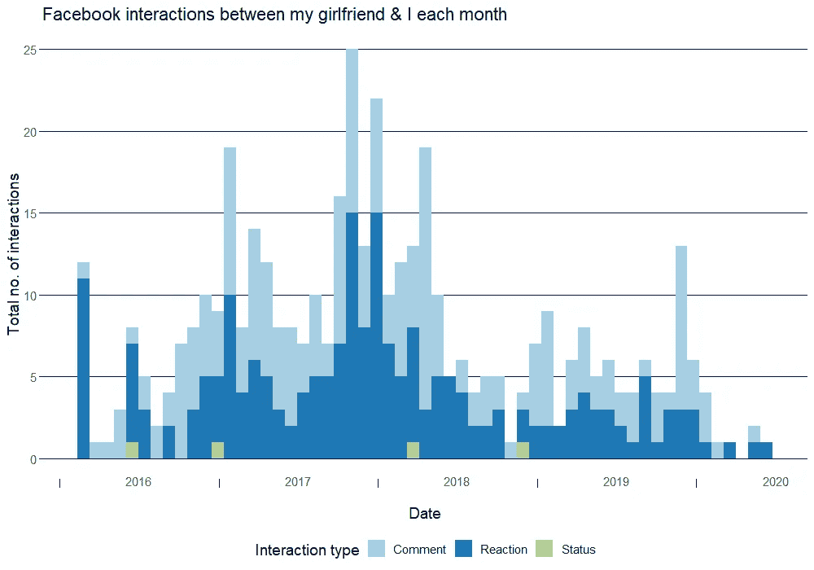
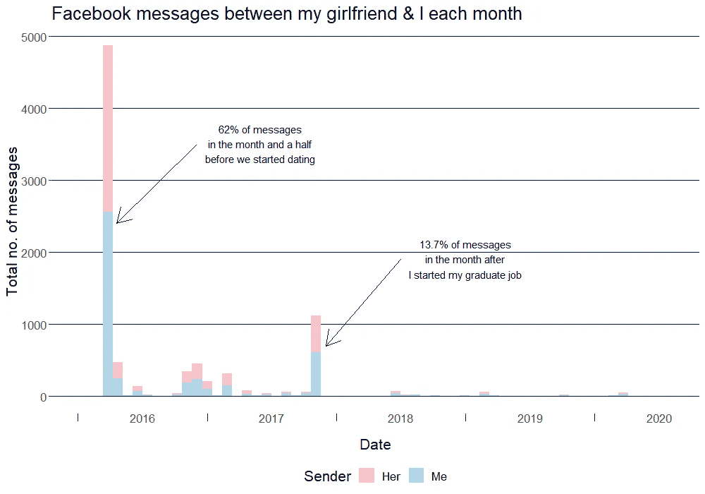
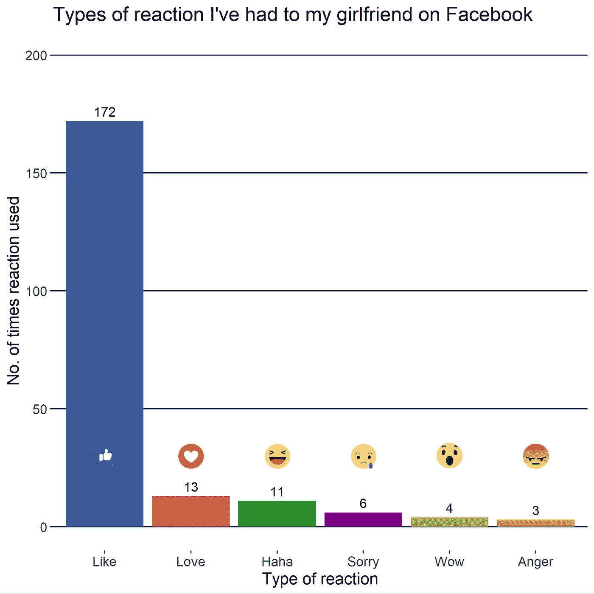
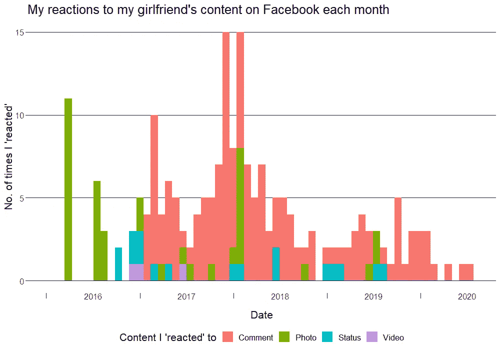
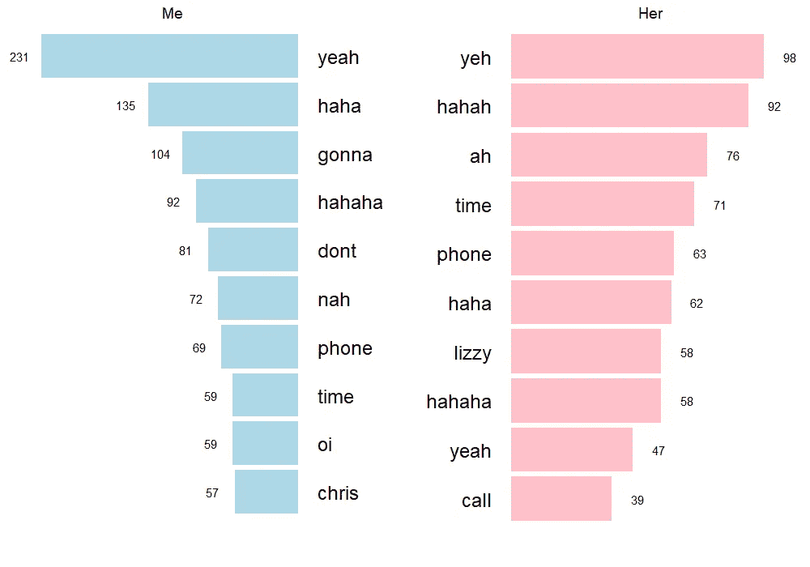

# 4.5 年的恋爱关系，在脸书活动

> 原文：<https://towardsdatascience.com/4-5-years-of-a-relationship-in-facebook-activity-13a8ddfc6a85?source=collection_archive---------50----------------------->

## 分析脸书与我女朋友的互动和信息数据

我最近下载了脸书所有关于我的数据。我发现了许多有趣的事情，但我特别想研究的一个领域是这些数据如何反映了我和我女朋友关系的进展。

在这篇文章中，我将(再次)通过数据科学与世界分享我们 21 世纪的爱情故事。在真正的千禧年时尚中，我将把我们的浪漫减少到我们在社交媒体上互动的总和，然而，看到相似之处将是有趣的——既与现实生活相似，也与我们在其他社交媒体上出现的关系相似。

正如我在本系列中的所有博客文章一样，分析和可视化都是使用 R 创建的。查看 [my Github](https://github.com/chrisbrownlie) 中使用的代码以及帮助分析您自己的脸书数据的 R 包。

## 这可能是一个新的开始

2015 年 12 月 7 日星期一，晚上 7 点 30 分 11 秒整，我和我女朋友成为了脸书的朋友。那时我们已经认识了几个月，在同一个友谊小组，但是以前没有太多的交流。三天后，第一条信息被发送出去，剩下的，正如他们所说，就成为历史了…直到它在一篇博客文章中被分析。

数据集的性质意味着我没有我们在脸书关系的**全貌**，我只有从我这边看得见的东西。就信息而言，这不是问题，因为我可以看到所有的信息，但就喜欢、反应、评论和帖子而言，我只能看到我对我的女朋友采取了什么行动，而不是相反。

所以让我快速的分解一下:

*   正如我所说的，2015 年 12 月 7 日是开始日期，这是近 5 年的活动。作为参考，我们从 2016 年 3 月 31 日开始约会。
*   我在评论中提到她 213 次，在状态中提到她 4 次(我不经常发布状态)。
*   我对她的一些东西(帖子、评论、照片等)做出了“反应”。)209 次。
*   我们已经相互发送了 8598 条信息。虽然没有 Whatsapp 上的多，但还是远远超过了我的预期。和以前一样，我惊讶地发现我发的消息(4539 条)比她发的多(4092 条)。
*   还是像以前一样，我使用的独特词汇(3193 个)比我的女朋友(3049 个)多。
*   我还可以看到，我们使用 messenger 进行通话或视频聊天的时间达到了 125.1 分钟。

## 脸书调情

要显示上面的数字:

自从我们第一次互动以来的每 28 天内，我和我女朋友之间的脸书互动次数。

从我们第一条信息开始的 28 天内，我和女朋友之间发送的脸书信息的数量。

第一张图显示，随着时间的推移，我对脸书的使用越来越少，我们的互动在评论和反应之间平分秋色。

你可以看到我们的信息大多是在我们正式开始约会前的一个半月。我想在这之后，我们只是转移到 Whatsapp/text。由此得出一个有争议的结论: **Messenger 是用来调情的，Whatsapp 是用来谈恋爱的**？

这两个图表显示了我在 2017 年 9 月开始工作后活动增加的相同模式(我希望我的老板没有看到这一点)。对此的解释是，在这之前的几个月，我们住在一起，每天大部分时间都在一起，所以我们的大部分互动都是面对面的，而当我开始工作时，我大部分时间都在办公室，不得不出差，所以我们的社交媒体交流增加了。或者，你可以暗示我在应该工作的时候使用社交媒体。我不知道你怎么想，但我认为前者比后者更有说服力…

## 我喜欢“喜欢”你

除了观察一段时间内的反应，我们还可以根据类型和目标来分解反应。

我在女朋友的帖子、评论、照片或视频上使用了多少次每个反应。

毫不奇怪，喜欢比其他任何东西都要普遍得多。其余的，爱和哈哈是下一个最常用的。我很高兴不是‘愤怒’和‘抱歉’。

上图考虑了我对我女朋友在脸书上发布的每一类内容的所有反应。然而，如果我们考虑到(就像我们现实生活中的关系一样)我们在脸书的关系在过去 5 年里并没有保持不变，就会发现一些有趣的模式。**这反映了*对*的喜欢。**

随着时间的推移，我在脸书上对我女朋友的内容类型做出了反应。

众所周知，21 世纪的调情通常包括喜欢社交媒体上的照片。看看 2016 年上半年，我会觉得我也有这种感觉。

然而，在 2017 年年中之后，所有的照片反应都是在我们一起度假之后直接出现的。现在看来，这是我们俩唯一一次在脸书的个人资料上贴照片了。

我不想引起更多的关注，但在我 2017 年底开始工作后，活动也(再次)激增。你还可以看到前面提到的使用减少的模式，在 2020 年封锁期间，社交媒体互动几乎不存在。

为了与我之前关于 Whatsapp 聊天的文章进行更多的比较，我现在将快速浏览一下我们在脸书互相发送的消息内容…

## 嗯，你看怎么样？

下图显示了我们在 Facebook Messenger 上最常用的词——与所有文本分析一样，常见的停用词(“The”、“and”等)。)已被删除。

我女朋友和我在 Facebook Messenger 上最常用的词。

首先，我向你保证我们不会用第三人称称呼自己…这只是显示我们在 Facebook Messenger 上玩[游戏的时间(例如，“Chris 开始了一个游戏。马上回复！”).](https://www.digitalspy.com/tech/a788495/hidden-facebook-games-how-to-find-play-facebook-messengers-secret-games-basketball-chess/)

可笑的是，我们俩有了和在 Whatsapp 上一样的最常用词。上次我有一些评论，问我们是否已经解决了关于 yeah/yeh 拼写的分歧。这似乎只是火上浇油…

不出所料，所有“哈哈”的变体也很常见——我们都经常发这种消息，即使我们实际上并没有笑(我们不都是这样吗)。也许在“哈哈”和“哈哈哈”和“哈哈哈”的比较背后有一些有趣的心理学意义，但我会让你去想象。

我也认为我欠我的女朋友一个道歉，oi 出现在我最常用的 10 个词中对我来说并不是一种恭维…但是在我的辩护中，我没有辩护。

## 深呼吸

好了，差不多够了。希望你喜欢在社交媒体上看到对一段关系的现实描述，而不仅仅是我们在大多数人的时间线上看到的亮点。尽管一个“有影响力的人”社交媒体账户看起来和你在这里看到的很不一样，但在现实生活中，他们可能会说“哈哈”，尽管听起来很不酷。

我也希望你能借此反思你在社交媒体上的人际关系，以及这与现实世界有何不同。

如果你喜欢读这篇文章，那么请考虑分享并给我或我的出版物数据片一个关注，以便将来有更多的关注！

## 动机

> *本文是两件事的续篇/后续:*
> 
> *1)我之前的一篇文章《* [*3.5 年的一段感情，在 Whatsapp 留言*](https://medium.com/data-slice/3-5-years-of-a-relationship-in-whatsapp-messages-4f4c95073c9d) *》，这是我写作时看得最多的故事。*
> 
> 我最近的系列作品“脸书到底了解我多少？”在那里，我用数据科学分析了脸书收集的 7500 份关于我的资料。请看 [*第一部分第一眼*](https://medium.com/swlh/what-does-facebook-actually-know-about-me-5b0cb8cf609) *，* [*第二部分位置数据可视化*](/what-does-facebook-know-about-my-location-4a6c372e1254) *，* [*第三部分了解我的好恶*](https://medium.com/@chris.brownlie/what-does-facebook-know-about-my-likes-and-dislikes-eb88abeba265) *和* [*第四部分了解我在脸书以外的活动。*](https://medium.com/data-slice/what-does-facebook-know-about-my-off-facebook-activity-47c02006c2f?source=friends_link&sk=356687cad12e439fe026999f44b464f5)