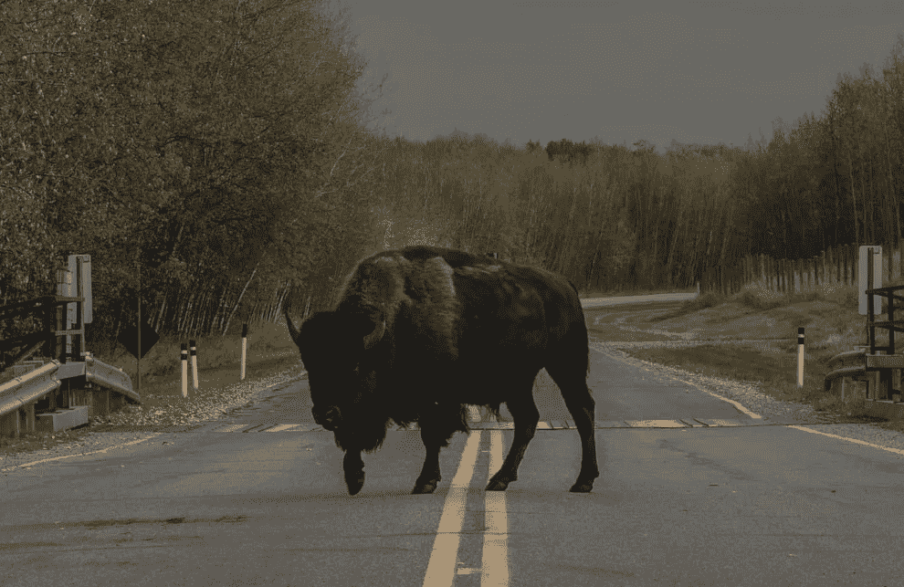

# 成功的机器学习项目的 4 个拦截器和 4 个解锁器

> 原文：<https://towardsdatascience.com/4-blockers-and-4-unlockers-for-successful-machine-learning-projects-86d409b7eb03?source=collection_archive---------57----------------------->

## 如何构建可靠有用的机器学习系统

扬·阿莱格在 [Unsplash](https://unsplash.com/photos/wHOjM1LGi24) 上的照片

众所周知，机器学习项目经常失败，根据 [Gartner](https://www.gartner.com/en/newsroom/press-releases/2018-02-13-gartner-says-nearly-half-of-cios-are-planning-to-deploy-artificial-intelligence) 的数据，85%的人工智能项目失败，甚至 [96%的项目处理问题](https://www.techrepublic.com/article/96-of-organizations-run-into-problems-with-ai-and-machine-learning-projects/)。当谈到新技术时，高学位是正常的，但这些数字是惊人的。这可能是因为没有满足机器学习的要求，没有增加价值，或者由于工程原因，模型没有投入生产。通常有可能提前发现潜在的问题。这篇文章是基于我过去五年在应用机器学习方面的经验来早期识别这些陷阱的。

# 一般要求

机器学习项目应该自动化决策。这可以是任何事情，从最终决定在图像上显示什么(图像分类)，用户得到哪些推荐(推荐系统)或哪台机器需要维护(预测性维护)。

为了使机器学习项目成功，有一些主要的要求，可以事先评估。这四个是潜在的障碍(数量、质量、复杂性、可解释性)

*在这一点上应该提到的是，这篇文章不是关于研究，而是应用机器学习。*

## 量

ML 项目合理性的最重要的方面是必须做出的决策的数量(以及节省了多少时间)。不值得开发一个机器学习系统来自动化罕见的决策甚至频繁的决策，总的来说几乎不花费任何时间。开发成本太高了。训练一个可以每天对物体进行几次视觉检查的图像识别模型是不值得的。机器学习是优化**频繁**和**重复**任务的工具。

## 质量

通常有一些频繁重复的任务，但是没有人的监督是无法完成的。例如，如果一个模型的质量要求很高，以至于总是需要一个人(例如，法规)，机器学习几乎不会优化任何东西。虽然存在所谓的人在回路系统，但这些系统更复杂、成本更高，并且需要 ML 模型来可靠地对不确定性进行分类，这种不确定性目前通常是不可靠的。

对于大多数任务来说，**不可能** **达到** **人类表现**。在完全受控的环境和非常狭窄的任务中，超人的表现甚至很少被期待。要评估一个模型是否能达到这个阈值，看看其他人已经做了什么。通常应用机器学习的会议非常有用。小心研究论文，它们并不总是适用于真实世界的数据。

## 复杂性

人工智能和 ML 是时髦的词，有时它们被使用，在那里一个适应良好的过程和基于规则的系统解决底层的任务。好多这么- [叫 AI 其实不是 AI](https://www.cnbc.com/2019/03/06/40-percent-of-ai-start-ups-in-europe-not-related-to-ai-mmc-report.html) 。通常更明智的做法是首先依赖手工制作的基于规则的系统(基于统计数据),如果它们失败或变得太复杂，只使用 ML。这些基于规则的系统失败的领域有:计算机视觉、自然语言处理、语音识别、序列建模等。

## 可解释性

任何最大似然模型都只能和训练它的数据一样好。人工智能不是可以预测未来的黑魔法，即使媒体经常给人这样的印象。机器学习系统通过示例进行学习，并允许一定程度的泛化。最终，数据总能解释模型是如何做出决定的，即使事情没那么简单。

一个经过训练可以区分猫和狗图像的模型只会识别猫和狗。这样的模型概括了品种、比例、光照条件等。但是如果你让这样一个模型对一个咖啡杯进行分类，它会把它看成一只狗或者一只猫，因为除此之外它什么都不知道。

即使你试图预测股市崩盘，你也可以训练一个模型来识别所有过去的崩盘。关键是，下一次崩盘不太可能像前几次一样，因此所有这些模型在实践中都失败了。

这里的例子可能是显而易见的，但有时不可能知道数据是否包含所需的信息。机器学习模型没有常识或世界知识，这仍然取决于我们。他们应该预测的必须是数据中存在的**，并且必须与算法可以找到的模式相匹配。**

# 运行模型

以上几点比较抽象，概念性强。以下几点与技术和工程更相关。

## 技术复杂性

模型需要的技术基础设施和模型本身的一般复杂性决定了构建这样一个模型的时间。例如，使用像 SVM、KNN 和决策树这样的传统方法要容易得多，因为它们可以通过与周围系统相同的编程语言编写的现有框架和库来轻松集成。如果涉及到一些最先进的神经网络，通常会复杂得多。如果不是关于图像识别、文本或语音(……)，这种改善通常与付出的努力不成比例**。**

## 做预测

一个模型是否必须按需(即“实时”)提供预测，或者该模型是否用于批处理，这两者之间有着巨大的差异。和其他软件系统一样，这里的问题不仅仅是关于**可伸缩性和可用性**，也是关于用例。

如果 ML 模型在本地可用，并且不需要通过 API 访问，则每天使用模型进行数百万次预测的过程可以调度得更快。另一方面，推荐系统是按需激活的，并且必须提供低延迟。微服务并不总是最好的解决方案。

**训练数据量**也起着重要作用。大型深度学习模型喜欢用几万亿字节的数据训练几周。显然，这种模型比直接从数据库中训练的随机森林要复杂得多。或者一个简单的 CSV 文件。

## 维护和监控

监控和可维护性是一个关键概念。一旦模型开始生产并停止工作，如果没有适当的监控，您就会发现这一点，但为时已晚。通过从硬编码规则转移到数据驱动模型，**错误变得不那么明显**。因此，除了生产软件系统的典型指标之外，还需要进一步的特定于 ML 的监控。

## 半衰期

机器学习**模型很少无限有效**。通常数据在一段时间后会发生变化，模型会失效。对于自动重新训练的模型或在线学习系统，这方面实际上是免费的，但所有其他模型都需要不时地重新训练(模型漂移)。

由于要识别新的对象，需要每两周训练一次图像识别系统，但是训练时间为两周的图像识别系统可能不是最佳方法。

# 结论

我希望我能鼓励一些读者思考这些问题。当建立一个人工智能驱动的系统时，在概念上和技术上有许多陷阱和障碍。确保给出了数量、质量、复杂性和可解释性要求，并设置了技术资源，项目成功的可能性最大化。