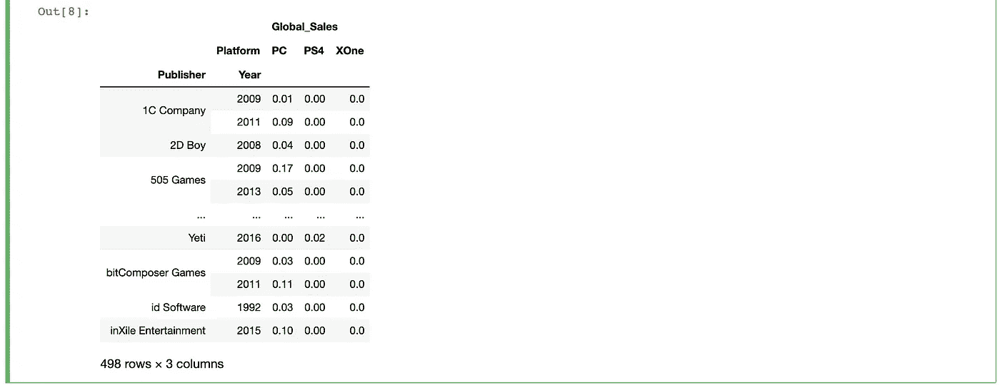
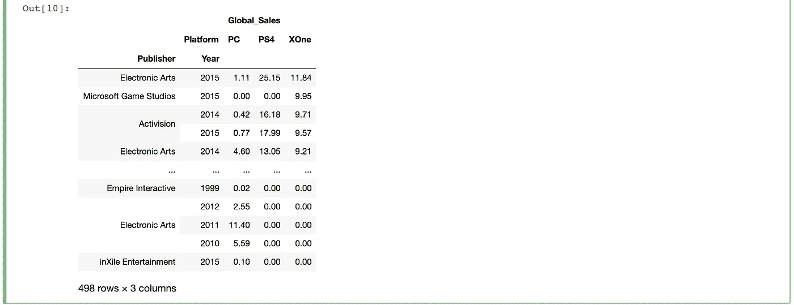

# 4 种不同的方法来有效地排序熊猫数据帧

> 原文：<https://towardsdatascience.com/4-different-ways-to-efficiently-sort-a-pandas-dataframe-9aba423f12db?source=collection_archive---------14----------------------->

## 大蟒

## 正确探索、理解和组织您的数据。


小姐姐塑造的形象

对数据进行适当的分类可以让你更容易理解。

许多人求助于 Pandas 中的高级索引和聚合功能来回答每个分析阶段的问题。当您需要操作数据时，这些特性会非常有用。然而，Pandas 还提供了对数据帧进行排序的不同方式，这可能比其他矢量化解决方案更适合分析数据。

如果您想要对多个列进行排序，或者如果您只需要对一个系列进行排序，Pandas 内置的功能可以帮助您做到这一点。

在这篇文章的最后，使用不同的分类方法，我们将回答以下问题:

*   **哪五款电子游戏在欧洲市场销量最多？** *用:* `.sort_values()`解决
*   **哪款游戏发布最早，当年全球销量最低？** *用:*多重论证`.sort_values()`解决
*   **北美市场销售额最高和最低的四大视频游戏是什么？** *用:* `nsmallest()`和`nlargest()`解决
*   **哪家发行商一年内 Xbox One 销量最高，同年其 PC 和 PS4 销量如何？** *求解用:*多指标`.sort_values()`

我们将使用[这个](https://www.kaggle.com/gregorut/videogamesales)视频游戏销售数据，所以如果你想继续的话，请下载 csv 文件。一如既往，出发前别忘了进口熊猫。

```
import pandas as pd# load data
df = pd.read_csv('vgsales.csv').dropna()
df['Year'] = df['Year'].astype(int)
df.head()
```


来自 [Kaggle](https://www.kaggle.com/gregorut/videogamesales) 的视频游戏销售数据(销量以千计)

# 排序的快速介绍

Pandas 中所有可用的分类方法分为以下三类:

*   按索引标签排序；
*   按列值排序；
*   按索引标签和列值的组合排序。

Pandas 会自动为您创建的每个数据框生成一个索引。索引标签从 0 开始，每行递增 1。您可以在上面的截图中看到，索引标签出现在最左边的列中(没有列名的那一列)。

您可以看到，根据自动生成的索引对数据帧进行排序实际上没有意义。但是，如果我们将“Name”列设置为数据帧的索引，那么我们可以按字母顺序对表进行排序。我们可以通过一行简单的代码来改变索引并对其进行排序:

```
df.set_index('Name').sort_index()
```


在这里，我们可以看到`.sort_index()`函数重新组织了数据，因此以标点符号作为名称第一个字符的游戏位于列表的顶部。

如果你再往下看，它会显示游戏名称的第一个字符是数字，然后是以字母开头的游戏。排序层次结构中的最后一个是特殊符号，就像上表中的最后一个条目。

这是一个根据数据帧的索引进行排序的非常快速的例子。现在让我们进入一些更高级的排序！

# 用不同的熊猫分类方法回答视频游戏销售问题

## 哪五款电子游戏在欧洲市场销量最多？

为了回答这个问题，我们将使用`.sort_values()`函数。代码如下:

```
df.sort_values(by='EU_Sales', ascending=False).head(5)
```

这里，我们输入要排序的列(EU_Sales)并组织我们的数据，使最高值排在最前面(将升序设置为“False”)。您可以在下面看到输出。


已排序的数据框架已经重新组织，因此我们现在可以看到，欧盟销量最多的游戏与全球销量最多的游戏并不完全相同。

## 什么游戏出版最早，当年全球销量最低？

为了回答这个问题，我们对“Year”列和“Global_Sales”列都感兴趣。我们将再次使用`.sort_values()`函数，但略有不同:

```
df.sort_values(by=['Year','Global_Sales']).head(1)
```

在这种情况下，我们希望按多列对数据进行排序。使用这个函数，只需传递一个列名列表，就可以对任意多的列进行排序。在这种情况下，我们首先编写“Year ”,然后编写“Global_Sales ”,这意味着该函数将首先根据数据帧的发布年份对其进行排序，然后根据其销售额进行排序。

默认情况下，该函数将首先对数值最低的数据帧进行排序，因此我们不需要传递`ascending=True`(尽管如果您愿意，您可以传递)。你可以在下面看到结果。


在这里，我们将“Atari”发布的游戏“Checkers”认定为数据集中最早发布(1980 年)的全球销量最低的游戏。

## 北美市场销售额最高和最低的四个视频游戏是什么？

带着这个问题，我们只关心销售值，这意味着我们不需要像“名称”和“平台”这样的视频游戏元数据。我们只关心一列，即“NA_Sales ”,它给出了北美市场的值。这意味着我们正在与一个“系列”一起工作，这是熊猫中的一维数组。

因为我们处理的是一个序列，所以我们可以使用`nsmallest()`和`nlargest()`方法来给出序列中最小或最大的“n”值。要使用这个函数，您只需传递一个值“n ”,它表示您想要查看的结果的数量。为了回答这个问题，我们写出如下内容:

```
df['NA_Sales'].nlargest(4)
```


并且:

```
df['NA_Sales'].nsmallest(4)
```


根据熊猫文档，你可以使用这些方法，因为它们可能比我们目前使用的`.sort_values()`和`head()`方法更快。然而，这似乎更适用于非常大的数据集，因为即使是 16，291 行的数据集也没有什么不同。例如:

```
df['NA_Sales'].sort_values(ascending=False).head(4)
```


您可以看到，我们用不同的代码行获得了相同的值，并且花费了相同的时间(11 毫秒)。然而，我认为使用`nlargest()`和`nsmallest()`会使代码更简洁。函数名不言自明且易于理解，因此您不必为了一个漂亮的函数而牺牲可读性。

## 哪家发行商一年内 Xbox One 销量最高，同年其 PC 和 PS4 销量如何？

为了回答这个问题，我们将创建一个数据透视表。当您希望在一个易读的表格中聚集和呈现数据时，这些功能非常有用。

创建数据透视表的代码如下所示:

```
df_pivot = df.loc[df['Platform'].isin(['PC','XOne','PS4'])]
df_pivot = df_pivot[['Platform','Year','Publisher','Global_Sales']]df_pivot = df_pivot.pivot_table(index = ['Publisher','Year'],
                                columns = 'Platform',
                                aggfunc = 'sum',
                                fill_value = 0)
```

如果你不熟悉数据透视表和多索引的使用，我建议你看看我以前的文章。

[](/how-to-use-multiindex-in-pandas-to-level-up-your-analysis-aeac7f451fce) [## 如何在 Pandas 中使用 MultiIndex 来提升您的分析

### 复杂数据分析中数据帧的层次索引介绍

towardsdatascience.com](/how-to-use-multiindex-in-pandas-to-level-up-your-analysis-aeac7f451fce) 

为了回答我们的问题，我们希望能够比较 PC、PS4 和 Xbox One 的销售情况，因此该数据透视表便于我们查看数据。初始数据透视表如下所示:



现在，在对这些数据进行排序时，我们感兴趣的是“XOne”的最高“Global_Sales”。如果我们看一下这个数据帧中的列，我们会看到有一个多索引。

```
df_pivot.columns
```


当按 MultiIndex 列排序时，需要确保指定相关 MultiIndex 的所有级别。为了对新创建的数据透视表进行排序，我们使用了以下代码:

```
df_pivot.sort_values(by=('Global_Sales','XOne'), ascending=False)
```

在这里，您可以看到我们将一个元组传递给了`.sort_values()`函数。这是因为我们要排序的列名是(' Global_Sales '，' XOne ')。您不能只传递“XOne ”,因为在这种情况下这不是一个有效的列名。因此，在对这种数据帧进行排序时，一定要指定 MultiIndex 的每个级别。生成的表格如下所示:



基于此，我们可以看到电子艺界(EA)2015 年全年 Xbox One 销量最高。我们还可以看到其同年在 PC 和 PS4 细分市场的销量。排序后的数据透视表可以很容易地对不同的列进行并排比较，所以请记住这种方法，因为您可以在许多不同的情况下使用它。

我们完事了。

这只是对熊猫分类的介绍。有许多不同的方法可以找到我们所经历的问题的答案，但我发现排序是进行初步分析的一种快速而简单的方法。

请记住，排序数据帧的方法不止一种。有些方法可能比其他方法更有效，Pandas 提供了内置方法来帮助您编写看起来更整洁的代码。

祝你的分类冒险好运！