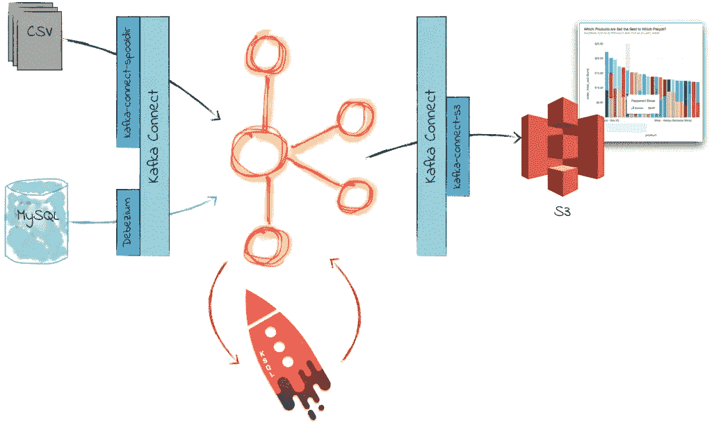
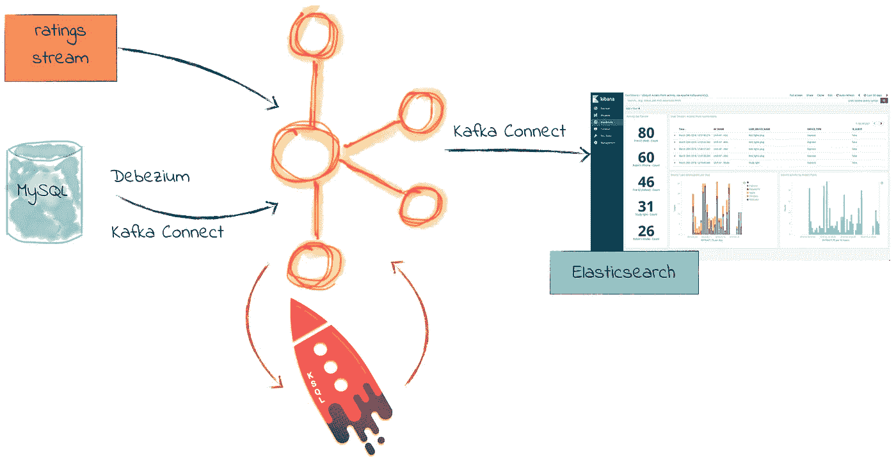
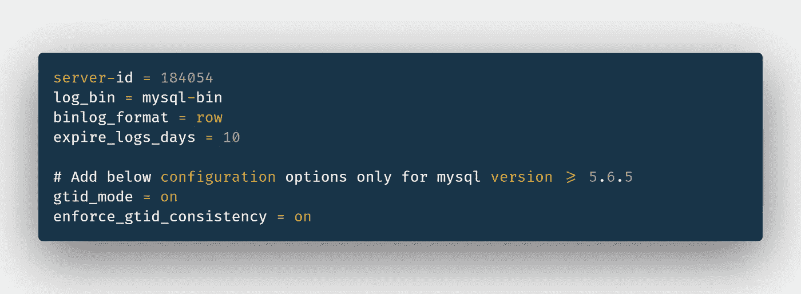

# BigData/ETL:从头开始设置 ETL 数据管道的 4 个简单步骤

> 原文：<https://towardsdatascience.com/4-easy-steps-to-setting-up-an-etl-data-pipeline-from-scratch-a6e67c40b6e1?source=collection_archive---------21----------------------->

## 用几个命令建立 ETL 管道



ETL(提取转换负载)

> 这个博客有什么不可期待的？AWS Glue、AWS 数据迁移服务或 Apache Airflow 等托管 ETL 解决方案。基于云的技术是受管理的，但不是免费的。并且不在本文的讨论范围内。

# 目录

1.  **什么是 ETL 管道？**
2.  **ETL 管道有哪些不同的用例？**
3.  **ETL 先决条件—Docker+Debezium+Kafka+Kafka Connect—鸟瞰图**
4.  **ETL 设置——4 步流程**

# **1:什么是 ETL？**

ETL 代表提取转换加载管道。它用于建立数据仓库或数据湖。

> 注意:数据仓库收集多种结构化数据源，如关系数据库，但是在数据湖中，我们存储结构化和非结构化数据。

# 2: ***一个 ETL 管道的各种用例有哪些？***

ETL 有广泛的用例，如下所示:

*   为非结构化数据赋予结构，因为我们将它存储到数据仓库中，通常我们使用数据仓库来存储来自多个资源的结构化数据。
*   ML 工程师获取模型训练数据的数据管道。并且经常是 ML 工程师/数据科学家(L1)的首要任务。
*   用于制作备份或临时数据源。

> **注意:**在这个例子中，我们将使用源作为 MySQL 数据库，目的地作为 Elasticsearch，它固有地与 Kibana 集成，用于数据可视化和机器学习。

# ***3: ETL 先决条件—Docker+Debezium+Kafka+Kafka Connect—鸟瞰图***



MySQL(源)+Debezium+Kafka/Kafka Connect+elastic search(目的地)+ Kibana

从上图中可以看出，我们将使用以下内容:

*   ***Docker:*** 一个容器管理系统(CMS)。为了简单起见，我们使用 Docker。[https://www.docker.com/](https://www.docker.com/)
*   **Debezium:** Debezium 只不过是一个变更数据捕获(CDC)。它跟踪来自源数据库的每个事件(插入、更新、删除),并使用 Kafka Connect 将事件推送到 Kafka。它使用源数据库日志来读取每个事务，并为特定的事务创建一个事件。

> **注意:**对于 MySQL，我们称之为 binlog，对于 PostgreSQL，我们称之为 wal-logs(预写日志)

*   ***卡夫卡连接:*** 顾名思义，帮助 Debezium 与卡夫卡连接。
*   ***卡夫卡:*** 卡夫卡帮助事件流和实时消费。卡夫卡和动物园管理员一起追踪这些事件。[https://bit.ly/2Gb9Sm7](https://bit.ly/2Gb9Sm7)
*   ***ELK(destination):***我们考虑将 Elasticsearch 作为我们的目标数据源，默认情况下，它与 Kibana 集成在一起，用于数据可视化&机器学习，这就是俗称的 elastic search+Logstash+Kibana(ELK stack)[https://bit.ly/36dmioe](https://bit.ly/36dmioe)

# ***4:让我们开始设置它——一个 4 步流程***

***第一步:*** 更改 Debezium 喜欢的 MySQL binlog 格式:只需进入/etc/my.cnf，基本上在 MySQL 配置文件中添加以下配置即可:



/etc/my.cnf (MySQL 配置文件)

***第二步:*** 启动 Zookeeper，Kafka & Kafka 使用 Docker 连接:

```
$ docker run -it --rm --name zookeeper -p 2181:2181 -p 2888:2888 -p 3888:3888 debezium/zookeeper $ docker run -it --rm --name kafka -p 9092:9092 --link zookeeper:zookeeper debezium/kafka:1.0$ docker run -it --rm --name connect -p 8083:8083 -e GROUP_ID=1 -e CONFIG_STORAGE_TOPIC=my_connect_configs -e OFFSET_STORAGE_TOPIC=my_connect_offsets -e STATUS_STORAGE_TOPIC=my_connect_statuses --link zookeeper:zookeeper --link kafka:kafka --link mysql:mysql debezium/connect:1.0
```

> **注:**熟悉 Docker 的可以用 docker-compose.yaml，可以在这里找到:[https://github . com/debezium/debezium-examples/blob/master/tutorial/](https://github.com/debezium/debezium-examples/blob/master/tutorial/docker-compose-mysql.yaml)

***步骤 3(提取)*** :我们将使用`curl`向我们的 Kafka Connect 服务提交一个 JSON 请求消息，以开始使用 Debezium 从源数据库捕获事件(它需要下面的源数据库凭证):

```
curl -i -X POST 
-H "Accept:application/json" 
-H "Content-Type:application/json" 
localhost:8083/connectors/ -d 
'{ "name": "etl-connector", 
"config": {                                                 "connector.class":      "io.debezium.connector.mysql.MySqlConnector", 
"tasks.max": "1", 
"database.hostname": "<mysql_host>", 
"database.port": "3306", 
"database.user": "<mysql_username>", 
"database.password": "<mysql_password>", 
"database.server.id": "184054", 
"database.server.name": "dbserver1", 
"database.whitelist": "<database_name>", "database.history.kafka.bootstrap.servers": "kafka:9092", "database.history.kafka.topic": "dbhistory.<db_name>" } }'
```

***第四步(变换&加载)*** :最后一步，写一个卡夫卡式的消费者。消费者只不过是一个简单的函数/代码，它将提取 Debezium 事件，对其进行转换，并将其加载到 ELK 目的地。

请在这里找到完整的参考源代码模板:[https://github . com/burhanuddinbhopalwala/ETL-elastic search-app](https://github.com/burhanuddinbhopalwala/etl-elasticsearch-app)

搞定了！在本例中，我们使用批量插入进行弹性搜索。你可以从上面的源代码中看到下面的日志。

```
...
2017-09-21 07:38:48,385 INFO   MySQL|dbserver1|task  Kafka version : 0.11.0.0   [org.apache.kafka.common.utils.AppInfoParser]
2org.apache.kafka.clients.consumer.internals.AbstractCoordinator]
2017-09-21 07:38:48,402 INFO   MySQL|dbserver1|task  Successfully joined group inventory-connector-dbhistory with generation 1   [org.apache.kafka.clients.consumer.internals.AbstractCoordinator]
2017-09-21 07:38:48,403 INFO   MySQL|dbserver1|task  Setting newly assigned partitions [dbhistory.inventory-0] for group inventory-connect WorkerSourceTask{id=inventory-connector-0} finished initialization and start   [org.apache.kafka.connect.runtime.WorkerSourceTaskINFO -- : CREATING MASTER DB CONNECTION
INFO -- : CONNECT ELASTICSEARCH
INFO -- : CONNECTED KAFKA
INFO -- : WAITING FOR 500 MESSAGES, RECEIVED 1, ID: 685475
INFO -- : WAITING FOR 500 MESSAGES, RECEIVED 2, ID: 457548
INFO -- : WAITING FOR 500 MESSAGES, RECEIVED 3, ID: 985484
INFO -- : WAITING FOR 500 MESSAGES, RECEIVED 4, ID: 258547
INFO -- : WAITING FOR 500 MESSAGES, RECEIVED 5, ID: 257544
```

> **错误**:如果你有任何错误，你可以去 Debezium 网站:[https://debezium.io/](https://debezium.io/)。

最后，感谢阅读。我希望这篇博客对你有所帮助。一如既往地记得呼吸:)

***连接*** 🤝***:***

*   ***邮箱***:*bbhopalw @ Gmail*
*   ***Linkedin***:[*www.linkedin.com/in/bbhoaplw*](http://www.linkedin.com/in/bbhoaplw)

***用于进一步阅读***✍️***:***

***大数据&云工程博客:***

*   **【https://medium.com/@burhanuddinbhopalwala】走向数据科学出版:**[](https://medium.com/@burhanuddinbhopalwala)

****后端工程&软件工程博客:****

*   ****DEV 社区:*** [*https://dev.to/burhanuddinbhopalwala*](https://dev.to/burhanuddinbhopalwala)*