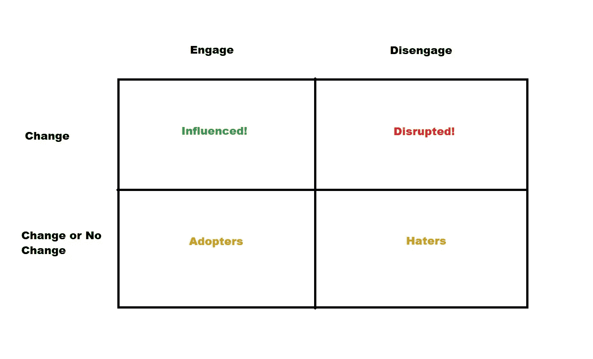

# 4 个基本的 A/B 测试部分

> 原文：<https://towardsdatascience.com/4-essential-a-b-testing-segments-c966f01b0b0e?source=collection_archive---------43----------------------->

## 进行 A/B 测试时，您应该回顾的 4 个部分

# 动机

根据 [Fast.ai / FastBook](https://github.com/fastai/fastbook/blob/master/08_collab.ipynb) ，

> 试着思考反馈回路在你的系统中的所有表现方式，以及如何在你的数据中识别它们。最后，这又回到了我们最初的建议，即在推出任何类型的机器学习系统时，如何避免灾难。

简而言之，考虑您的用户群和可能影响您的 ML 系统的特定细分市场是有好处的(*部署前或部署后，但在这种情况下，我们更关注部署后*)。Fast.ai 很好地解释了各种用户群如何影响你的整体 ML 系统。如果我们想一想——如果我们使用 A/B 测试来评估我们的 ML 系统，那么这个想法也适用于 A/B 测试。所以，重要的是我们要思考我们的 A/B 测试可能会出错的原因。

# 介绍

几年前，我看到了一个关于 A/B 测试的精彩演示。该演示介绍了进行 A/B 测试时需要注意的 4 个部分。我的老板*(当时)*和我在工作中使用这个术语，发现它非常有见地。

快进到今天，到处都找不到原来的讲座 lol。所以我想我应该写一篇关于这个主题的文章*(为我自己也为别人)。*同样，如果我能找到的话，我会参考最初的演讲*(可能是优步)*。

那么这些神奇的段子我们应该考虑哪些呢？

# 这些片段

由作者用 MS Paint 创建

他们来了，光彩照人。我尽力记住了原来的段名，但是失败了，所以我创造了新的名字。这些原则应该仍然有效。好了，下面我给出了更多关于如何解读这张图的细节。

*   **影响了！** =如果你做出改变*(一个或多个)*这些是你帮助过的人。假设你正在 A/B 测试一个新的通知，这些人会在你的通知生效时积极行动！由于你所做的改变，这些人更多地使用你的应用程序。他们说“干得好！坚持下去！”
*   不管你在做什么，不管你在做什么实验，这些人都会继续使用你的应用。这些是你的收养者。他们采纳了你的应用，超越了所有的实验。不管你的应用程序有没有变化，这些都是你的强用户。不利的一面是，你做的任何事情都不能真正增强它们的用途。从好的方面来说，谁在乎呢？！这些人喜欢你的申请！
*   **打乱了！** = Ut-oh！以前有人很开心，现在你的改变让他们抓狂了。这些人要么不喜欢你所做的改变，要么他们讨厌改变，不管是哪种情况，都不要去管他们。
*   **憎恨者** =“这个应用程序很愚蠢”是这些人说的，不管你对你的应用程序做了什么改变。这些人只是不喜欢你所拥有的，很难将他们切换到*【受影响】*的部分。祝他们成为*【领养者】*好运。对一些人来说，你可能有更好的机会赢得乐透。例如，也许你有一个社交媒体应用程序，并说你有一个*【仇恨者】注册了，因为他们的朋友制作了它们。因此，这位客户确实不喜欢社交媒体，但他们碰巧有一个个人资料，只是为了取悦一个朋友。你的新通知系统不太可能赢得他们的支持*(有可能但不太可能)*。*

# *迷茫？别担心。让我们试一个例子。*

*假设你拥有世界上最好的纸尿裤在线零售商 Diapers.com。你的顾客需要注册一个账户，然后才能去买他们想要的所有尿布。因为你的网站没有顾客结账，你知道谁是你的顾客，他们买什么，他们不买什么。您想要测试您的结帐页面的新外观。你想看看新的背景色是否能促进销售。您有一个通常的结帐页面，它有一个浅红色的背景颜色，我们称之为'*红色*'视图。你想引入一个新的浅蓝色背景视图，我们称之为新的'T14 蓝色 T15'视图。我们希望新的'*蓝色*'结账视图将有助于增加销售额。*

*当你有'*红色*'页面时购买量减少，但有了新的'*蓝色*'页面时购买量增加的客户——这些是你的'**影响！”**顾客。这些顾客喜欢你新的结帐背景色！*

*那些在“*红色*页面购买了大量商品，并且仍然在新的“*蓝色*页面购买了大量商品的人——这些人就是你的“**采纳者**”。不管你做什么网站改变，这些顾客都会买纸尿裤。*

*那些以前没有买很多东西，并且仍然没有用你的新'*蓝色*'页面买很多东西的人——这些是你的'**憎恨者**。不管你做什么网站改变，这些顾客几乎不买纸尿裤。*

*最后，那些曾经购买很多，但现在随着您的新'T34 蓝色 T35'页面，他们购买较少-这些是您的'T36 中断！‘顾客’。这些顾客以前会买很多纸尿裤，但是你的新背景色导致他们买的纸尿裤变少了！哎呦！*

# *摘要*

*这有什么大不了的？嗯，你可以做你的 A/B 测试，汇总你所有客户的结果，然后报告你的发现。其实这是你应该做的事情。但是，如果你发现你的 A/B 测试对你的人群几乎没有什么影响呢？你最终可能会扔掉一些用户非常喜欢的非常好的特性。将你所有客户(在你的测试人群中)的 A/B 测试结果汇总是你应该做的事情，但这不应该是你唯一做的事情。*

*既然*【仇恨者】*和*采纳者*没有受到你的实验的影响，也许你应该把他们从你的 A/B 测试结果中去掉(*或者至少有一个排除了这些群体的结果版本*)。为什么？好吧，在你的结果中包括这些客户会给你的结果增加很多噪音，从而淹没你对业务的真正影响。*

*你能识别出*“中断的”*片段吗？如果是这样的话，您可以为这些客户关闭该功能。为什么要从你的*“影响”中去掉一个特征呢*顾客爱在你没有的时候？也许你可以定制每个客户的体验？为什么要扔掉能让你赚钱的东西呢？*

*此外，您可以在宏观和/或微观层面上查看这些细分市场。例如，您可以通过多次实验对您的客户进行细分。或者，您可以针对一个实验对您的客户进行细分。无论哪种方式，都有新的信息可以获得。这种细分之所以如此有效，是因为它让你更好地了解你的实验表现**和你的客户群**。哪些客户在拖后腿？哪些客户喜欢你做的一切？分解你的 A/B 测试结果会有很多收获。*

# *结束了*

*就是这样！感谢您的阅读，并希望您发现这是有帮助的！*