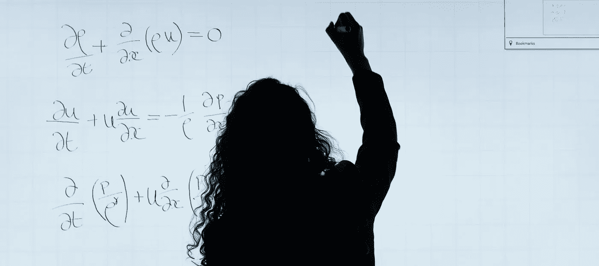

# 4 门免费数学课程，用于隔离和提升您的数据科学技能

> 原文：<https://towardsdatascience.com/4-free-maths-courses-to-do-in-quarantine-and-level-up-your-data-science-skills-f815daca56f7?source=collection_archive---------3----------------------->

来源:[this is engineering](https://www.pexels.com/@thisisengineering)@ Pexels—免费库存图片

## 因为没有数学数据就没有科学

当我进入数据科学和机器学习领域时，任何与数学和统计相关的东西都是我在大约 10 年前最后一次访问的，我估计这可能是我一开始觉得很难的原因。我花了很多时间阅读和观看视频，对我们在行业中日常使用的许多工具的事情是如何发生的有了一些基本的了解。然而，到了一定程度，我觉得有必要对我在 Jupyter 笔记本上做的所有“导入”和“适应”背后发生的事情有一个坚实的理解。所以我决定是时候擦掉我数学知识上的灰尘了。

现在，我还在做这件事，我想这永远不够。此外，我来自商界，身处一个充斥着来自工程、统计、物理和其他精确科学的专业人士的行业。我知道在数据科学的世界里有很多东西要学，但是你知道吗？技术和语言可能来来去去，但是这个领域的数学背景将会一直存在。

这就是为什么今天我总结了 4 门课程来提高你的数学知识，并利用一些由于这种不幸的情况而给予我们的空闲时间。因为，你知道，这些天你应该呆在家里😉。

**1。** [**机器学习的数学**](https://www.coursera.org/specializations/mathematics-machine-learning)

地点:Coursera

参与机构:伦敦帝国理工学院

所需时间:104 小时(实际上至少+50%)

先前要求:无

课程本身的摘要:

> 对于机器学习和数据科学中的许多高级课程，你发现你需要更新数学基础知识——这些东西你可能以前在学校或大学里学过，但在另一种背景下教授，或者不是很直观，以至于你很难将其与计算机科学中的使用联系起来。这个专业旨在弥合这一差距，让你跟上基础数学的速度，建立直观的理解，并将其与机器学习和数据科学联系起来。

涵盖的主题:

*   线性代数
*   多元微积分
*   主成分分析

**提示**:Coursera 的大部分课程和专业都有审核的选项。你不会获得证书，但你可以使用课程的大部分资源。我个人觉得这已经足够了。注册时，只需选择课程审核选项:)。

**2。** [**机器学习必备数学:Python 版**](https://www.edx.org/es/course/essential-math-for-machine-learning-python-editi-2)

地点:edX

参与机构:微软

所需时间:50 小时

先决条件:Python 和一些数学基础知识

课程本身的摘要:

> 想学习机器学习或人工智能，但又担心自己的数学能力可能达不到？像“代数”和“微积分”这样的词会让你感到恐惧吗？你是否已经很久没有在学校学过数学了，以至于你已经忘记了很多当初学过的东西？
> 
> 你并不孤单。机器学习和人工智能建立在数学原理上，如微积分、线性代数、概率、统计和优化；许多潜在的人工智能实践者发现这令人望而生畏。这门课程不是为了让你成为数学家而设计的。相反，它旨在帮助你学习一些重要的基本概念和用来表达它们的符号。本课程提供了处理数据和应用所学技术的实践方法。

涵盖的主题:

*   方程式、函数和图形
*   差异化和最优化
*   向量和矩阵
*   统计和概率

**提示**:本课程有开始日期，但你可以选择一个更早的开始日期，并免费查看该群组的所有内容。

**3。** [**数据科学中的概率统计使用 Python**](https://www.edx.org/es/course/probability-and-statistics-in-data-science-using-p)

地点:edX

参与机构:加州大学圣地亚哥分校

所需时间:100-120 小时

先修要求:多元微积分和线性代数

课程本身的摘要:

> 对不确定性的推理是噪声数据分析中固有的。概率和统计为这种推理提供了数学基础。
> 
> 在这门课程中，你将学习概率和统计的基础。您将学习数学理论，并获得使用 Jupyter 笔记本将该理论应用于实际数据的实践经验。

涵盖的主题:

*   机器学习的数学基础
*   统计素养:理解诸如“在 99%的置信水平上”这样的陈述的含义

**提示**:本课程有开始日期，但您可以选择一个更早的开始日期，并免费查看该群组的所有内容。

**4。** [**贝叶斯统计:从概念到数据分析**](https://www.coursera.org/learn/bayesian-statistics)

地点:Coursera

参与机构:加州大学圣克鲁斯分校

所需时间:22 小时(实际上不少于 30 小时)

先决条件:对概率有一些基本的了解

课程本身的摘要:

> 本课程介绍了统计的贝叶斯方法，从概率的概念开始，到数据的分析。我们将学习贝叶斯方法的哲学，以及如何对常见类型的数据实施它。我们将比较贝叶斯方法和更普遍教授的频率主义方法，并看到贝叶斯方法的一些好处。

涵盖的主题:

*   概率和贝叶斯定理
*   统计推断
*   离散数据的先验和模型
*   连续数据模型

这就是现在所有的窥视。我建议按照给出的顺序学习这些课程，当然，如果你符合要求，也可以学习你喜欢的任何课程:)。

别忘了看看我的一些最新故事:

*   我们数据人为什么以及如何帮助对抗新冠肺炎
*   [官方:时间不存在](/its-official-time-doesn-t-exist-8c786530eca1?source=friends_link&sk=65f4f8a97a96efccc3931faef4046595)；如何处理时间特征？
*   [我应该在我的机器学习模型中包含截距吗？](/should-i-inlcude-the-intercept-in-my-machine-learning-model-2efa2a3eb58b?source=friends_link&sk=018f163d3307c669fe45e700f94a8400)

此外，请随意访问[我在 Medium](https://medium.com/@gonzaloferreirovolpi) 上的个人资料，查看我的其他故事和**如果您想直接在您的电子邮件上收到我的最新文章，只需** [**订阅我的简讯**](https://gmail.us3.list-manage.com/subscribe?u=8190cded0d5e26657d9bc54d7&id=3e942158a2) **:)。**最后，我想知道您是否对未来故事的其他特定类型的课程感兴趣:

回头见！感谢您的阅读！