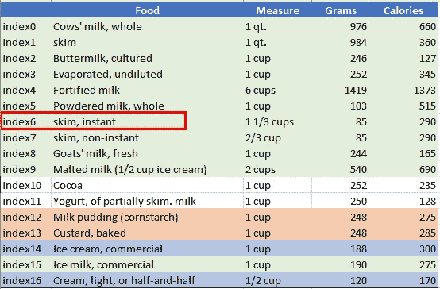
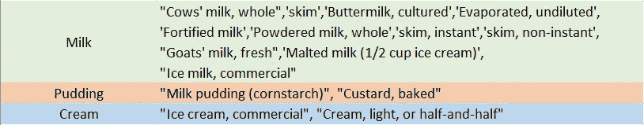

# 地道熊猫代码的 4 个隐藏的宝石

> 原文：<https://towardsdatascience.com/4-hidden-gems-for-idiomatic-pandas-code-99c706e6ce93?source=collection_archive---------24----------------------->

图片来源:[像素](https://www.pexels.com/photo/woman-holding-six-polished-stones-1147946/)

## 分享更多熊猫提示来提高你的数据处理水平

我的上一篇文章，[熊猫的 6 个鲜为人知但令人敬畏的技巧](/6-lesser-nown-yet-awesome-tricks-in-pandas-32236f3785c8)，希望已经给你一些熊猫高效编码的味道。继续这个话题，如果你还不知道的话，让我们来探索更多关于熊猫的小技巧和窍门。

这篇博客将使用我们在[上一篇博客](/6-lesser-nown-yet-awesome-tricks-in-pandas-32236f3785c8)中讨论过的 html 技巧，使用直接从维基页面[食物营养成分表](https://en.wikipedia.org/wiki/Table_of_food_nutrients)中抓取的乳制品表。这是一张表格的快照，显示了食物名称、度量单位/克数以及相应的热量值。

**1。** `**Pandas series**` **或** `**list**` **或** `**series of lists**`

简单来说，Pandas 中的 series 是一个带有索引标签的一维数组。与设计用于指示元素位置的列表索引不同，序列中的索引标签可以是用户定义的任何内容。这当然在使用序列时提供了灵活性，但是如果你不熟悉索引标签在 pandas 中是如何工作的，这也“设置了一个陷阱”。

所以我们今天的任务#1 是检查一个值(例如，`skim, instant`)是否存在于一个序列中(例如，`dairy_table[‘Food’]`)。如果是，则返回 true 否则为假。很简单，这个任务只需要一行代码，如下图所示，

惊讶和困惑？用最直观的 `in` 操作符，我们的第一个代码返回**假**，然而第二个代码返回**真**？为什么 Python 告诉我**食物**一栏不含`skim, instant`，含`index6`？

嗯，原因是使用`in`直接检查熊猫系列将检查`skim, instant`是否存在于**索引**标签中，而不是我们的食物列的**值**。因此，为了避免落入这个“陷阱”，我们必须指定**值/值列表**作为我们的搜索空间，下面演示了几种方法，

当在 Pandas 中处理系列时，继续下一个潜在的“陷阱”,也就是说，允许一个单独的系列包含列表/元组，并且需要额外的步骤将它们解析到它们自己的列中。例如，让我们将我们的 dairy 表修改为一个包含值元组的数据帧，作为一个新的列 **Nums** ，

现在，我们的任务#2 是将 **Nums** 列分成两个单独的列。同样，最直观的方式是通过索引来访问元组中的每个元素，

当然，对于每个元组中只有两个值的例子来说，这是可行的。如果我们有数百个值，而无法手动访问每个元素，该怎么办？另外，正如我们从输出中看到的，这个 list comprehension 返回一个必须进一步转换为整数值的字符串列表。相当多的基本细节！

那么有没有一个简单的方法来实现它呢？答案是肯定的，而且非常简单，如下所示，

**** * *更新 2022:加入我们的 YouTube 社区🎦*** [***【数据说话带吉】***](https://www.youtube.com/channel/UCbGx9Om38Ywlqi0x8RljNdw) ***😄***

**2。宁滨值潇洒地用** `**map**` **或** `**applymap**`

我们的任务#3 是将食物值分为三类——牛奶、布丁和奶油，定义如下:

与其单调乏味地创建多个`if`语句或`isin()`函数，不如通过利用映射技巧以更智能的方式来实现。首先，我们将值组织到一个映射字典中，其中每个值属于其对应的 bin，

然后，我们使用`map`或`applymap`来替换原始值，

这里有两点需要注意:

(1)我们交换了原始映射字典中的键和值，以便它的键与数据集中的实际食物名称匹配。

(2)我们演示了两种实现方式:`map`和`applymap`，我经常被问到这两个概念的区别。简单来说，`**map**` 取入并返回**系列**，而`**applymap**`取入并返回**数据帧**。例如，上面代码中的`map()`函数用于*食物*序列，它用序列方法`fillna()`将字典中没有的值重新编码为*‘其他’*。

相比之下，第二个函数`applymap()`用于整个数据帧，搜索与字典关键字匹配的值(即食物名称)，然后用相应的字典值(即 bin 名称)替换它们。如果没有找到匹配的键，代码将保持原始值不变。

因此，`map()`或`applymap()`都可以工作，上面的一行代码写起来简洁且易于维护，更不用说它应该比遍历每个食物名称的组要快得多。

**3。** `**where**` **用作相当于** `**ifelse**` **中的 R**

R 中我最喜欢的一个函数是`ifelse`；类似地，Pandas 提供了`where`函数来做同样的事情:当指定的布尔条件不满足时替换值。

例如，下面显示了一个食品名称列表，我们的目标是用*‘其他’*替换列表中省略的食品名称。现在，让我们看看`where(other)`如何方便地完成这个数据操作任务，

**4。**类型`**category**` 类型**保存内存**

最后但同样重要的是，我想讨论一个关于 Pandas 中的**分类**数据类型的技巧，这是为**对象**数据节省空间的另一种选择。保存为`object-dtype`的字符串通常会占用大量内存，而`category-dtype`在后端使用整数值来表示原始值，因此更节省空间和时间。现在，让我们仔细看看我们刚刚创建的 object-dtype**Food _ Category**列，

这里有几个注意事项，(1)一旦被转换为类别类型， **Food_Category** 被编码为整数；(2)通过将对象数据类型转换成类别数据类型，存储器使用从 1051 字节减少到 427 字节(即，减少 60%)。

然而，关于 category-dtype 的两个警告不能被忽略。首先，就像 R 中的`factors`，`category-dtype`在新值赋值方面不像`object-dtype`那样灵活。例如，如果我们想用下面的代码向 **Food_Category** 列添加一个新的类别/级别，我们将得到臭名昭著的 ValueError msg。该错误指示新级别(即，另一个 _ 类别)在被分配给任何行之前必须首先被添加到容器中，

因此，正确的方法是首先使用`add_categories()`方法设置电平值，

关于`category-dtype`的另一个警告是，对于具有较少重复值的列，极端情况是所有的值都是唯一的，`category-dtype`将比`object-dtype`占用更多的内存。让我们以**食物**列为例，这里所有的值都是唯一的，

我们可以看到，一旦**食物**列被转换为`category-dtype`，memory_usage 从 1605 字节增加到 2262 字节(即增加了 41%)。因此，当一个`object-dtype` 列包含许多重复值时，分类将最有利于高效存储。

**上前练习**

总而言之，我已经分享了我的熊猫小贴士和技巧，我希望我能早点知道。[完整代码链接在我的 Github](https://github.com/YiLi225/Pandas_Tricks/blob/master/Top10_Pandas_Tricks.py) 里。现在轮到你开始编码了！😃

> 没有不断的练习，就不会有优秀的音乐[熊猫]。
> 
> 简·奥斯汀《傲慢与偏见》中的凯瑟琳夫人(第 31 章)

我希望你喜欢这个博客！ ***想要更多数据科学和编程技巧？使用*** [***我的链接***](https://yilistats.medium.com/membership) ***注册 Medium，获得我所有内容的全部访问权限。***

***还订阅我新创建的 YouTube 频道*** [***《数据与吉谈》***](https://www.youtube.com/channel/UCbGx9Om38Ywlqi0x8RljNdw)

*以下是我的其他博客，你可能也会觉得很有启发性。*

* [## 每个数据科学家都应该知道的 6 个 SQL 技巧

### 提高分析效率的 SQL 技巧

towardsdatascience.com](/6-sql-tricks-every-data-scientist-should-know-f84be499aea5)  [## SQL、R 和 Python 中的数据整形

### 从 Python vs. R 到 Python & R

towardsdatascience.com](/data-reshaping-in-sql-r-and-python-d44ca19e71b8)*