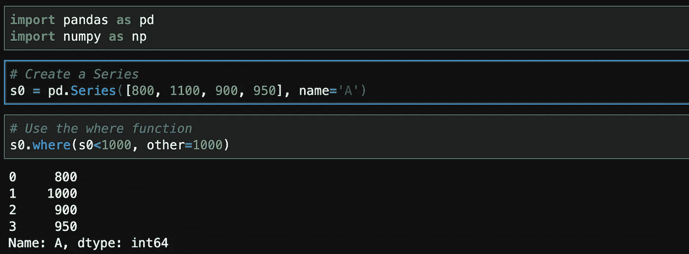
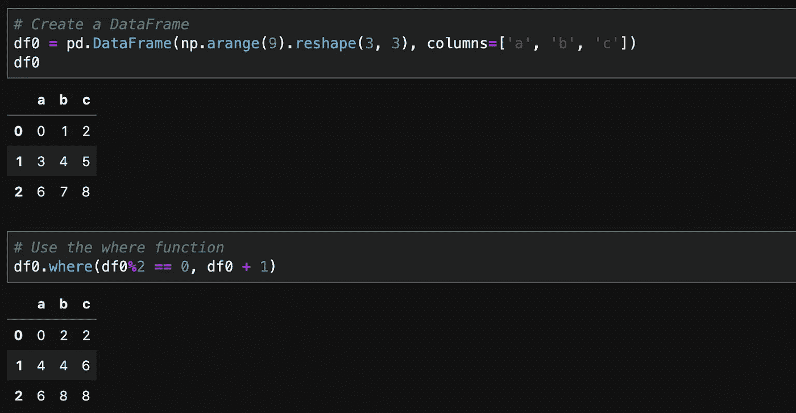
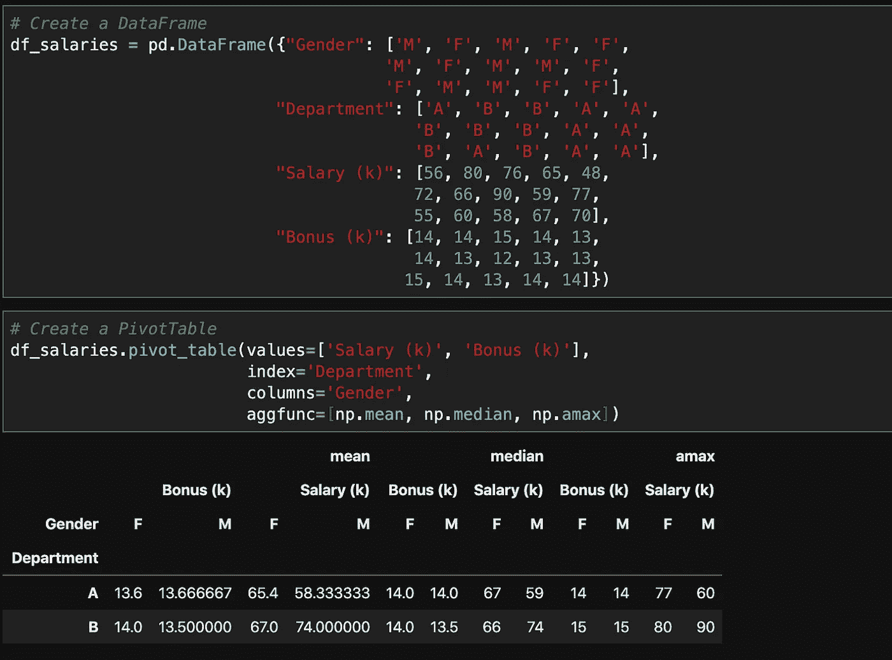
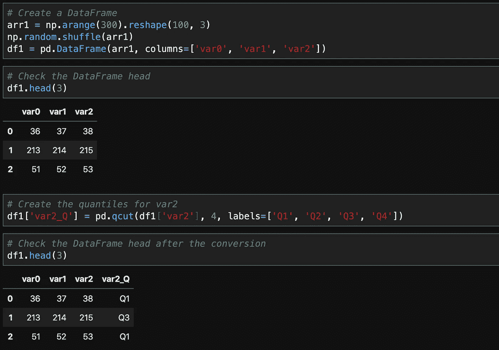
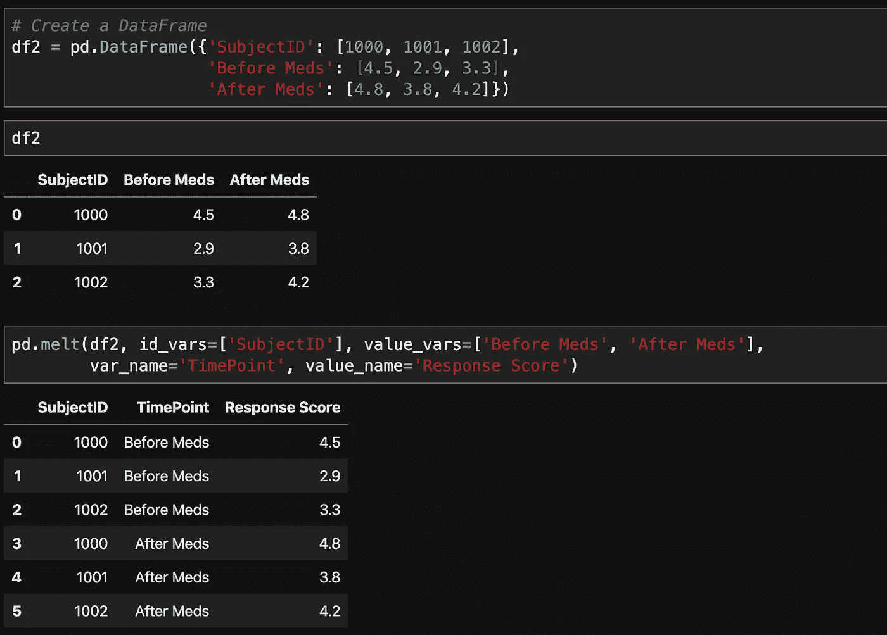

# 4 个鲜为人知的熊猫功能，可以让你的工作更轻松

> 原文：<https://towardsdatascience.com/4-less-known-pandas-functions-that-can-make-your-work-easier-5e430cac7a82?source=collection_archive---------25----------------------->

## 为数据科学学习熊猫

## 增强你的数据科学项目

照片由 [Jérémy Stenuit](https://unsplash.com/@stenuitj?utm_source=medium&utm_medium=referral) 在 [Unsplash](https://unsplash.com?utm_source=medium&utm_medium=referral) 上拍摄

许多数据科学家一直使用 Python 作为他们的编程语言选择。作为一种开源语言，Python 通过提供各种数据科学相关的库获得了相当大的流行。特别是，pandas 库可以说是基于 Python 的数据科学家中最流行的工具箱。

不得不说熊猫库开发的太好了，为各种操作提供了非常庞大的函数集合。然而，这个强大的工具箱的缺点是，一些有用的功能可能不太为初学者所知。在这篇文章中，我想分享四个这样的功能。

## 1.where()函数

大多数时候，对于我们正在处理的数据集，我们必须进行一些数据转换，以使数据具有可分析的格式。`[where()](https://pandas.pydata.org/pandas-docs/stable/reference/api/pandas.DataFrame.where.html)`[函数](https://pandas.pydata.org/pandas-docs/stable/reference/api/pandas.DataFrame.where.html)用于替换不满足条件的值。让我们考虑下面的例子来了解它的用法。当然，我们首先需要导入 pandas 和 numpy，就像我们处理所有数据操作步骤一样。

对 Series 使用 where()

在上图中，我们创建了一个序列并应用了`where()`函数。具体来说，这个函数的签名用法是`where(condition, other)`。在这个调用中，`condition`参数将产生布尔值，当它们为`True`时，原始值被保留，当它们为`False`时，将使用由另一个参数指定的值。在我们的例子中，任何低于 1000 的值都被保留，而等于或大于 1000 的值被分配给 1000。

该函数不仅可用于 Series，也可用于 DataFrame。让我们看看 DataFrame 的类似用法。在下面的例子中，数据帧`df0`的奇数将全部增加 1，偶数保持不变。

将 where()与 DataFrame 一起使用

## 2.函数的作用是

与`where()`函数不同，`[pivot_table()](https://pandas.pydata.org/pandas-docs/stable/reference/api/pandas.pivot_table.html)`[函数](https://pandas.pydata.org/pandas-docs/stable/reference/api/pandas.pivot_table.html)仅适用于 DataFrame。这个函数创建一个电子表格风格的数据透视表，因此它是一个很好的工具，通过以一种简单的方式显示数据来汇总、分析和呈现数据。用一个更现实的例子可以最好地展示它的威力。

对 DataFrame 使用 pivot_table()

在上图中，我们创建了一个数据框架，其中包含工资和奖金记录以及雇员的性别和部门信息。然后，我们使用`pivot_table()`函数创建了一个数据透视表。具体来说，我们将工资和奖金列设置为`values`参数，将部门设置为`index`参数，将性别设置为`columns`参数，将`[np.mean, np.median, np.amax]`设置为`aggfunc`参数。

在输出中，您可以看到我们有一个数据透视表，其中显示了 2(性别)乘 2(部门)的表格，分别是工资和奖金变量的平均值、中值和最大值。一些有趣的观察结果包括，在 A 部门，女性的工资高于男性，而在 b 部门，情况正好相反。在这两个部门，女性和男性的奖金相似。

## 3.函数的作用是

当我们有一个包含序数度量的数据集时，有时创建分类分位数来识别可能的模式比参数化地检查这些序数度量更有意义。理论上，我们可以自己计算分位数临界值，并使用这些临界值映射数据，以创建新的分类变量。

然而，这个操作可以通过`[qcut()](https://pandas.pydata.org/pandas-docs/stable/reference/api/pandas.qcut.html)`[函数](https://pandas.pydata.org/pandas-docs/stable/reference/api/pandas.qcut.html)轻松实现，该函数根据变量的等级将变量离散成大小相等的池(例如，分位数和十分位数)。让我们通过下面的例子来看看这个函数是如何工作的。

对 DataFrame 使用 qcut()

在上图中，我们创建了一个包含 3 列的数据帧。我们对生成`var2`列的分位数感兴趣。因此，我们将`q`参数指定为 4(如果需要十分位数，也可以是 10)。我们还指定了标签列表来标记这些分位数。

## 4.melt()函数

根据数据科学家使用的工具，一些人喜欢“宽”格式(例如，一个主题一行多个变量)，而另一些人喜欢“长”格式(例如，一个主题多行一个变量)。因此，我们经常需要在这些格式之间进行数据转换。

与[完全转置数据帧的转置](https://pandas.pydata.org/pandas-docs/stable/reference/api/pandas.DataFrame.T.html) `[T](https://pandas.pydata.org/pandas-docs/stable/reference/api/pandas.DataFrame.T.html)` [函数](https://pandas.pydata.org/pandas-docs/stable/reference/api/pandas.DataFrame.T.html)不同，`[melt()](https://pandas.pydata.org/docs/reference/api/pandas.melt.html)`[函数](https://pandas.pydata.org/docs/reference/api/pandas.melt.html)对于将数据从宽格式转换为长格式特别有用。让我们通过下面的例子来看看它是如何工作的。

对 DataFrame 使用 melt()

在上图中，我们创建了一个宽格式的数据帧。具体来说，我们有服药前和服药后两种措施。然后我们使用`melt()`函数产生一个长格式的数据帧。我们将`SubjectID`指定为`id_vars`，将两个度量指定为`value_vars`，并将列重命名为更有意义。

## 在你走之前

我们可以探索熊猫的更多功能。在本文中，我们刚刚学习了四个我们有些人不太了解的函数，但它们在我们的日常数据操作工作中非常有用。

我希望你喜欢读这篇文章。你可以在 [GitHub](https://gist.github.com/ycui1/ef359c672f03b8a05e305669a564ef44) 上找到代码。

## 关于作者

我写关于 Python 和数据处理与分析的博客。万一你错过了我以前的一些博客，这里有一些与当前文章相关的文章链接。

 [## 提升 Python 编码水平的 30 个简单技巧

### 更好的 Python

medium.com](https://medium.com/better-programming/30-simple-tricks-to-level-up-your-python-coding-5b625c15b79a)  [## 理解 map()函数操纵熊猫系列

### 了解使用 map()函数将数据转换为所需格式的基本原理

towardsdatascience.com](/understand-map-function-to-manipulate-pandas-series-8ac340d514f7)  [## 关于在 NumPy 中生成随机数的备忘单

### 查看 NumPy 中最常用的生成随机数的函数。

towardsdatascience.com](/a-cheat-sheet-on-generating-random-numbers-in-numpy-5fe95ec2286)