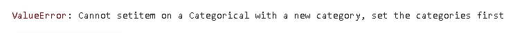
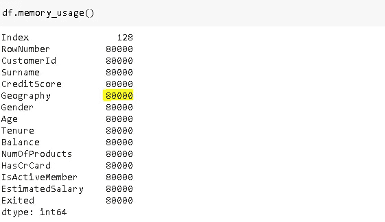
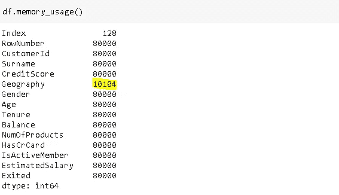
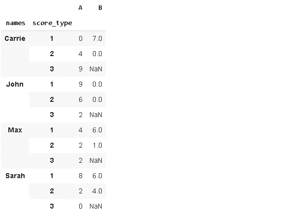
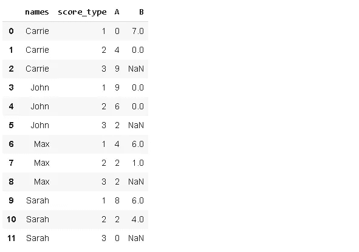

# 4 个鲜为人知但非常实用的熊猫手术

> 原文：<https://towardsdatascience.com/4-less-known-yet-very-functional-pandas-operations-46dcf2bd9688?source=collection_archive---------42----------------------->

## 发现更多的熊猫


照片由[金莎·艾利斯](https://unsplash.com/@kymellis?utm_source=unsplash&utm_medium=referral&utm_content=creditCopyText)在 [Unsplash](https://unsplash.com/s/photos/view?utm_source=unsplash&utm_medium=referral&utm_content=creditCopyText) 上拍摄

Pandas 是使用最广泛的数据分析和操作库，它提供了许多处理数据的函数和方法。由于它们执行的任务，其中一些比其他的更频繁地被使用。

在本帖中，我们将介绍 4 个熊猫手术，它们不太常用，但仍然非常实用。

先说进口 NumPy 和熊猫。

```
import numpy as np
import pandas as pd
```

# **1。因式分解**

它提供了一种编码分类变量的简单方法，这是大多数机器学习技术中的一项必需任务。

这是来自客户流失数据集的分类变量。

```
df = pd.read_csv('/content/Churn_Modelling.csv')df['Geography'].value_counts()
France     5014 
Germany    2509 
Spain      2477 
Name: Geography, dtype: int64
```

我们可以用一行代码对类别进行编码(即转换成数字)。

```
df['Geography'], unique_values = pd.factorize(df['Geography'])
```

factorize 函数返回转换后的值以及类别索引。

```
df['Geography'].value_counts()
0    5014 
2    2509 
1    2477 
Name: Geography, dtype: int64unique_values
Index(['France', 'Spain', 'Germany'], dtype='object')
```

如果原始数据中有丢失的值，您可以为它们指定一个值。默认值为-1。

```
A = ['a','b','a','c','b', np.nan]
A, unique_values = pd.factorize(A)
array([ 0,  1,  0,  2,  1, -1])A = ['a','b','a','c','b', np.nan]
A, unique_values = pd.factorize(A, na_sentinel=99)
array([ 0,  1,  0,  2,  1, 99])
```

# **2。分类**

它可用于创建分类变量。

```
A = pd.Categorical(['a','c','b','a','c'])
```

类别属性用于访问类别:

```
A.categories
Index(['a', 'b', 'c'], dtype='object')
```

我们只能从一个现有类别中分配新值。否则，我们将得到一个值错误。

```
A[0] = 'd'
```



我们还可以使用 dtype 参数指定数据类型。缺省值是 CategoricalDtype，由于内存消耗，它实际上是最好的选择。

我们来做一个例子，比较一下内存使用情况。



这是每列的内存使用量(以字节为单位)。

```
countries = pd.Categorical(df['Geography'])
df['Geography'] = countries
```



内存使用比原始功能少 8 倍。对于较大的数据集，节省的内存量将进一步增加，尤其是当我们只有很少的类别时。

# **3。区间**

它返回一个表示区间的不可变对象。

```
iv = pd.Interval(left=1, right=5, closed='both')3 in iv
True5 in iv
True
```

closed 参数指示边界是否包含在内。它取的值是“两个”、“左”、“右”和“都不是”。默认值为“右”。

```
iv = pd.Interval(left=1, right=5, closed='neither')5 in iv
False
```

当我们处理日期-时间数据时，时间间隔很方便。我们可以很容易地检查日期是否在指定的间隔内。

```
date_iv = pd.Interval(left = pd.Timestamp('2019-10-02'), 
                      right = pd.Timestamp('2019-11-08'))date = pd.Timestamp('2019-10-10')date in date_iv
True
```

# **4。宽到长**

Melt 将宽数据帧转换为长数据帧。这个任务也可以用融化功能来完成。Wide_to_long 提供了一种不太灵活但更用户友好的方式。

考虑下面的样本数据帧。


它包含了一些人不同的分数。我们希望以一行(而不是单独的一列)表示分数类型的方式来修改(或重塑)该数据帧。例如，A 下面有 3 种分数类型(A1、A2、A3)。在我们转换数据帧之后，将只有列(A)和类型(1，2，3)将用行值表示。

```
pd.wide_to_long(df, stubnames=['A','B'], i='names', j='score_type')
```



stubnames 参数指示将包含这些值的新列的名称。宽格式的列名需要以 stubnames 开头。“I”参数是用作 id 变量的列,“j”参数是包含子类别的列的名称。

返回的数据帧有一个多级索引，但我们可以通过应用 reset_index 函数将其转换为普通索引。

```
pd.wide_to_long(df, stubnames=['A','B'], i='names', j='score_type').reset_index()
```



Pandas 在数据科学和机器学习领域的成功和优势归功于功能和方法的多样性和灵活性。一些方法执行基本的任务，但是也有更详细和更具体的任务。

熊猫通常有多种方式来完成一项任务，这使得它很容易很好地适应特定的任务。

感谢您的阅读。如果您有任何反馈，请告诉我。