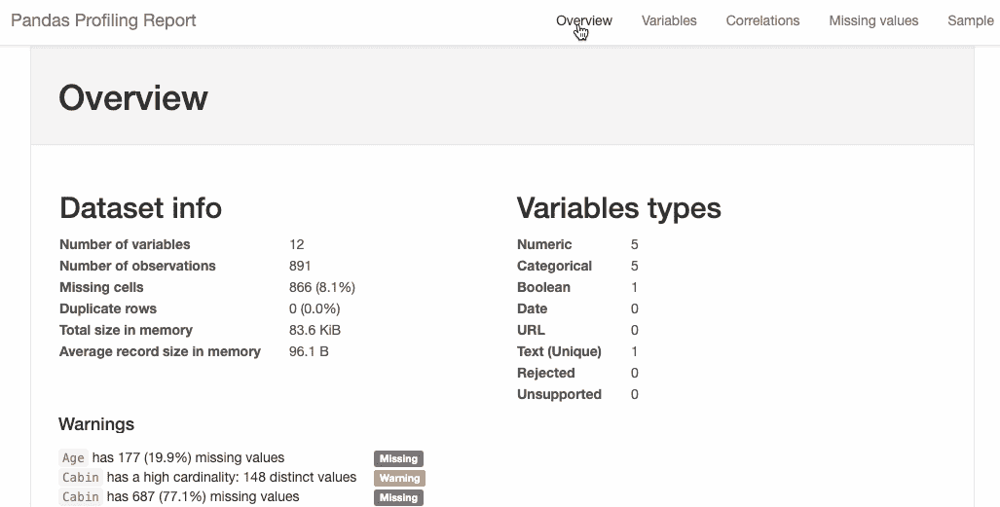
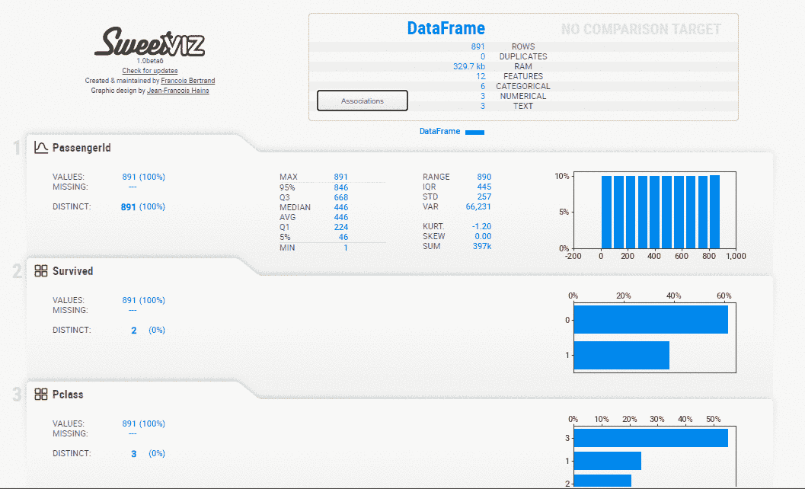
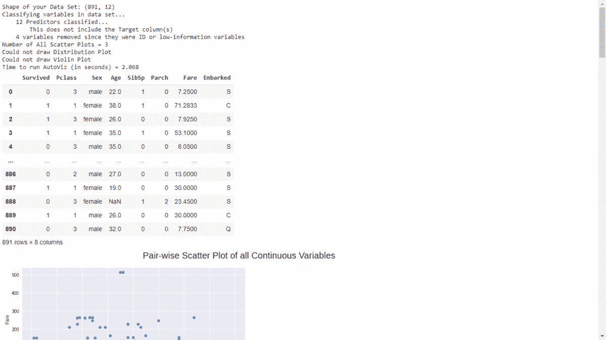
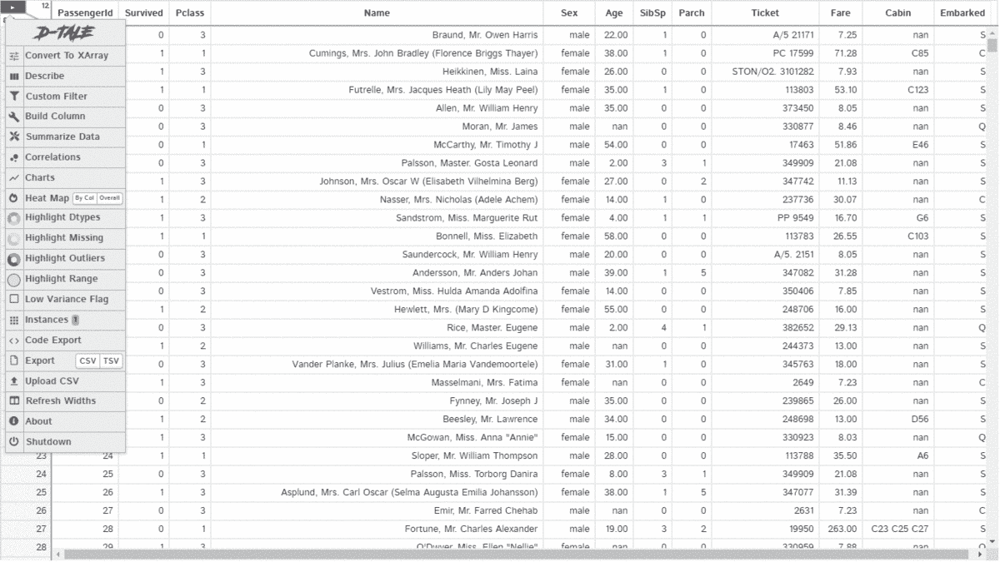

# 4 个可以在一行 python 代码中执行 EDA 的库

> 原文：<https://towardsdatascience.com/4-libraries-that-can-perform-eda-in-one-line-of-python-code-b13938a06ae?source=collection_archive---------3----------------------->

## 使用 Pandas Profiling、Sweetviz、Autoviz 和 D-Tale 进行探索性数据分析


图片由 [Pixabay](https://pixabay.com/?utm_source=link-attribution&amp;utm_medium=referral&amp;utm_campaign=image&amp;utm_content=3539412) 的 [Mudassar Iqbal](https://pixabay.com/users/kreatikar-8562930/?utm_source=link-attribution&amp;utm_medium=referral&amp;utm_campaign=image&amp;utm_content=3539412) 拍摄，使用 [Pixlr](https://pixlr.com/) 编辑

探索性数据分析(EDA)是一种分析数据并发现模式、视觉洞察等的方法。在继续建模之前。人们花费大量时间进行 EDA 以更好地理解数据，这可以通过使用自动可视化工具来最小化，例如 **Pandas-profiling、Sweetviz、Autoviz、**或 **D-Tale**

EDA 涉及许多步骤，包括一些统计测试、使用不同类型的图来可视化数据等等。EDA 的一些步骤讨论如下:

*   **数据质量检查:**可以使用`describe()`、`info()`、`dtypes()`等熊猫库函数完成。它用于查找多个特征、其数据类型、重复值、缺失值等。
*   **统计测试:**进行一些统计测试，如皮尔逊相关、斯皮尔曼相关、肯德尔测试等，以获得特征之间的相关性。它可以使用 *stats* 库在 python 中实现。
*   **定量检验:**一些定量检验用于发现数值特征的扩散，计数分类特征。它可以使用 pandas 库的函数在 python 中实现。
*   **可视化:**特征可视化对于理解数据非常重要。条形图、饼图等图形技术用于了解分类特征，而散点图、直方图则用于数字特征。

为了执行上述任务，我们需要输入几行代码。这里**自动可视化**库开始发挥作用，它可以使用一行代码执行所有这些任务。我们将在本文中讨论一些自动可视化工具:

*   **熊猫简介**
*   Sweetviz
*   **Autoviz**
*   **D-Tale**

使用 pandas-profiling 库进行探索性数据分析的数据集是从 Kaggle 下载的 Titanic 数据集[。](https://www.kaggle.com/c/titanic/data)

# 熊猫-简介:

**Pandas profiling** 是一个开源的 python 库，可以自动化 EDA 过程并创建详细的报告。Pandas Profiling 可以很容易地用于大型数据集，因为它非常快，可以在几秒钟内创建报告。

## 安装:

您可以使用 PyPl 安装 pandas-profiling:

```
**pip install pandas-profiling**
```

> GitHub [熊猫档案库](https://github.com/pandas-profiling/pandas-profiling/)。

## 用法:

## 报告:

**pandas-profiling** 库生成一个报告，其中包含:

*   数据集概述
*   可变属性
*   变量的相互作用
*   变量的相关性
*   缺少值
*   抽样资料



(作者 GIF)

# Sweetviz:

**Sweetviz** 是一个开源的 python 自动可视化库，它可以生成一份报告，在高密度绘图的帮助下探索数据。它不仅自动化了 EDA，还用于比较数据集并从中得出推论。可以通过将一个数据集视为训练数据集而将另一个数据集视为测试数据集来对两个数据集进行比较。

## 安装:

您可以使用 PyPl 安装 Sweetviz:

```
**pip install sweetviz**
```

> Sweetviz 的 GitHub [存储库](https://github.com/fbdesignpro/sweetviz)。

## 用法:

## 报告:

**Sweetviz** 库生成一份报告，其中包含:

*   数据集概述
*   可变属性
*   范畴关联
*   数字联想
*   数字特征的最频繁、最小、最大值



(作者 GIF)

# Autoviz:

**Autoviz** 是一个开源的 python 自动可视化库，主要致力于通过生成不同类型的绘图来可视化数据之间的关系。

## 安装:

您可以使用 PyPl 安装 Autoviz:

```
**pip install autoviz**
```

> 用于 Autoviz 的 GitHub [库](https://github.com/AutoViML/AutoViz)。

## 用法:

## 报告:

**Autoviz** 库生成一份报告，其中包含:

*   数据集概述
*   连续变量的成对散点图
*   分类变量的分布
*   连续变量的热图
*   每个分类变量的平均数值变量



(作者 GIF)

# d-童话:

D-Tale 是一个开源的 python 自动可视化库。它是最好的自动化数据可视化库之一。D-Tale 帮助您获得数据的详细 EDA。它还有一个功能是**代码导出**，用于报告中的每个绘图或分析。

## 安装:

您可以使用 PyPl 安装 D-Tale:

```
**pip install dtale**
```

> 用于 D-Tale 的 GitHub [库](https://github.com/man-group/dtale)。

## 用法:

## 报告:

**dtale** 库生成一份报告，其中包含:

*   数据集概述
*   自定义过滤器
*   相关性、图表和热图
*   突出显示数据类型、缺失值、范围
*   代码导出



(作者 GIF)

# 结论:

我更喜欢使用几个 python 库，通过自定义函数来完成我的 EDA。应该使用上面讨论的库来加速您的工作。

对于初学者来说，在尝试这些库之前，使用 pandas 的库开始做 EDA 并编写 python 代码是很好的，因为更重要的是具备基础知识和编程实践。

上面讨论的最好的数据自动可视化是 **DTale** 库，因为它报告了详细的 EDA、定制过滤器和代码导出。**代码输出是这个库比其他库更好的主要亮点**。

# 参考资料:

[1]走向数据科学(2020 年 8 月 30 日):[一行 python 代码的 EDA](/exploratory-data-analysis-with-1-line-of-python-code-5fe25387c84b)

*喜欢这篇文章吗？成为* [*中等会员*](https://satyam-kumar.medium.com/membership) *继续无限制学习。如果你使用下面的链接，我会收到你的一小部分会员费，不需要你额外付费。*

[](https://satyam-kumar.medium.com/membership) [## 加入我的推荐链接-萨蒂扬库马尔媒体

### 作为一个媒体会员，你的会员费的一部分会给你阅读的作家，你可以完全接触到每一个故事…

satyam-kumar.medium.com](https://satyam-kumar.medium.com/membership) 

> 感谢您的阅读