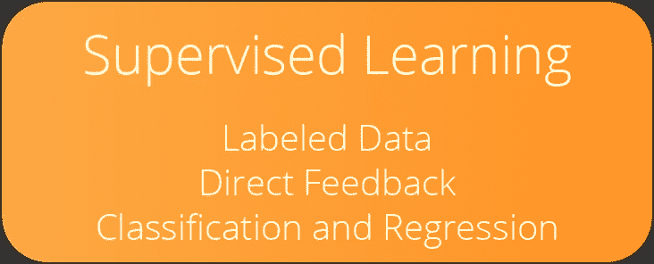
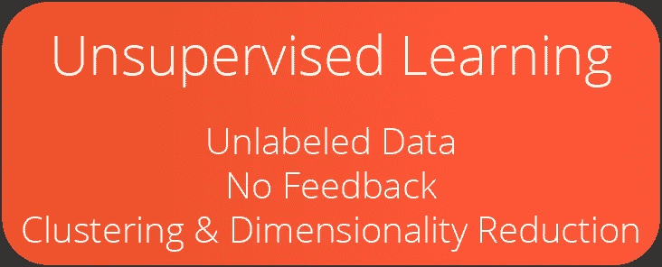
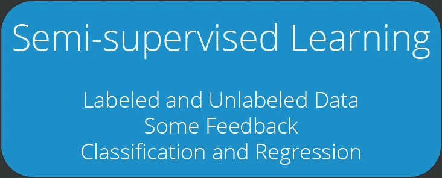
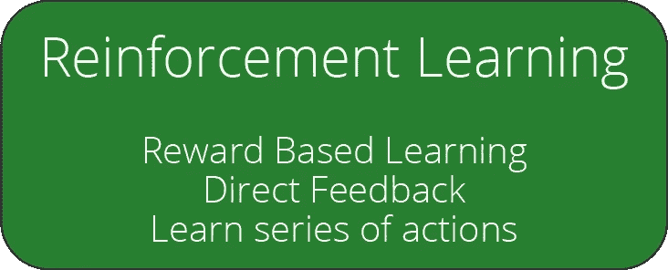
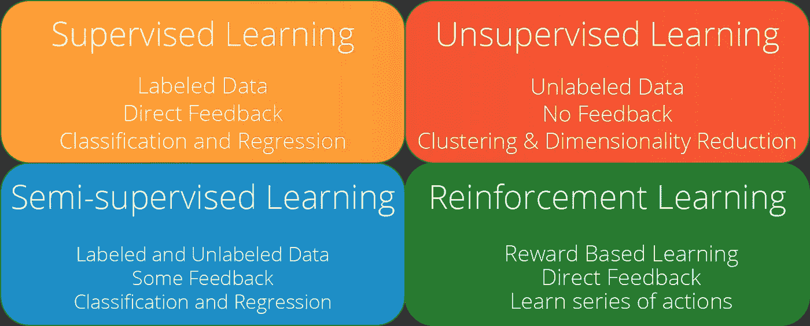

# 每个数据科学家都应该知道的 4 种机器学习方法

> 原文：<https://towardsdatascience.com/4-machine-learning-approaches-that-every-data-scientist-should-know-e3a9350ec0b9?source=collection_archive---------7----------------------->

## 人工智能精要

## 了解主要的最大似然学习方法:监督学习，非监督学习，半监督学习，强化学习

图一。阿德里安·特林考斯在 [Unsplash](https://unsplash.com?utm_source=medium&utm_medium=referral) 上拍摄的照片

随着人工智能的不断进步，这个领域已经变得太大了，以至于无法全部专攻。有无数的问题，我们可以用无数的方法去解决。一个经验丰富的人工智能研究人员在一个领域的知识可能对另一个领域毫无用处。理解不同机器学习问题的本质非常重要。尽管机器学习问题的列表很长，不可能在一篇文章中解释清楚，但我们可以将这些问题分为四种不同的学习方法:

*   监督学习；
*   无监督学习；
*   半监督学习；和
*   强化学习。

> 在我们深入研究这些方法之前，让我们先来看看什么是机器学习:

# 什么是机器学习？

“机器学习”一词是由 IBM 科学家、计算机游戏和人工智能领域的先驱阿瑟·塞缪尔在 1959 年首次提出的。机器学习被认为是人工智能领域下的一个子学科。它旨在利用经验自动提高为特定任务设计的计算机算法的性能。在机器学习研究中，经验来自训练数据，训练数据可以被定义为根据先前记录的观察或实时反馈收集的样本数据。通过这种体验，机器学习算法可以学习和建立数学模型来进行预测和决策。

学习过程从将训练数据(*例如，示例、直接经验、基本说明*)输入模型开始。通过使用这些数据，模型可以非常快速地在数据中找到有价值的模式。这些模式然后被用于对相关事件进行预测和决策。如果开发者构建了允许连续训练的合适的机器学习系统，则即使在部署之后，学习也可以继续。

# 四种机器学习方法

顶级机器学习方法根据其学习反馈机制的性质进行分类。大多数机器学习问题可以通过采用这些方法中的一种来解决。然而，我们可能仍然会遇到不适合这些方法之一的复杂的机器学习解决方案。

这种分类是必要的，因为它将帮助您快速发现将来可能遇到的问题的本质，分析您的资源，并开发合适的解决方案。

> 让我们从监督学习方法开始。

# 监督学习

> 有监督的学习是机器学习任务，学习基于示例输入-输出对将输入映射到输出的函数。它从由一组训练样本组成的带标签的训练数据中推断出一个函数。

T 当数据集包含响应变量值(或标签)的记录时，可以采用监督学习方法。根据上下文，这些带有标签的数据通常被称为“标签数据”和“训练数据”

**示例 1:** 当我们试图使用一个人的体重、年龄和性别来预测他的身高时，我们需要包含他的体重、年龄、性别信息以及实际身高的训练数据。这些数据允许机器学习算法发现身高和其他变量之间的关系。然后，使用这些知识，该模型可以预测给定人的身高。

**示例 2:** 我们可以根据之前看到的垃圾邮件和非垃圾邮件的区别特征，例如电子邮件的长度和电子邮件中特定关键字的使用，将电子邮件标记为“垃圾邮件”或“非垃圾邮件”。从训练数据的学习持续进行，直到机器学习模型在训练数据上达到高水平的准确度。

图二。关键点——监督学习(作者提供的图表)

有两个主要的监督学习问题:(I)分类问题和(ii)回归问题。

## 分类问题

在分类问题中，模型学习根据它们的变量值对观察值进行分类。在学习过程中，模型会接触到大量带有标签的观察结果。例如，在看到数千名顾客的购物习惯和性别信息后，模型可以根据他/她的购物习惯成功预测新顾客的性别。二元分类是用于在两个标签下分组的术语，例如男性和女性。另一个二元分类的例子可能是预测图片中的动物是“猫”还是“不是猫”，如图 2–4 所示。

图 3。监督学习中的分类问题(作者图)(由 [Freepik](https://www.freepik.com/) 制作的图标，那些图标，来自 [Flaticon](http://www.flaticon.com) 的桉树)

另一方面，当有两个以上的标签时，使用多标签分类。识别和预测图像上的手写字母和数字是多标签分类的一个例子。

## 回归问题

在回归问题中，目标是通过利用其他变量(*即自变量、解释变量或特征*)和目标变量(*即因变量、响应变量或标签*)之间的关系来计算值。我们的目标变量和其他变量之间的关系强度是预测值的关键决定因素。根据客户的历史数据预测客户会花多少钱是一个回归问题。

# 无监督学习

> [无监督学习是一种机器学习，在没有预先存在的标签和最少人工监督的情况下，在数据集中寻找以前未检测到的模式。](https://en.wikipedia.org/wiki/Unsupervised_learning)

监督学习是一种在 ML 算法中使用的学习方法，用于从不包含标签的数据集进行推断。

图 4。关键点——无监督学习(作者提供的图表)

有两个主要的无监督学习问题:(I)聚类和(ii)降维。

## 使聚集

无监督学习主要用于聚类分析。

> 聚类分析是一种分组工作，其中一个组(即一个聚类)的成员比其他聚类的成员彼此更相似。

有许多不同的聚类方法可用。它们通常利用一种基于选定度量的相似性度量，例如欧几里德距离或概率距离。生物信息学序列分析、遗传聚类、模式挖掘和对象识别是可以用无监督学习方法解决的一些聚类问题。

## 降维

无监督学习的另一个用例是降维。维度相当于数据集中使用的要素数量。在某些数据集中，您可能会发现存储在各个列中的数百个潜在要素。在大多数数据集中，这些列中有几个是高度相关的。因此，要么选择最好的，即*特征选择，*要么结合已有特征提取新的特征，即*特征提取*。这就是无监督学习发挥作用的地方。降维方法帮助我们创建更整洁的模型，没有噪音和不必要的特征。

# 半监督学习

EMI-监督学习是一种结合了监督学习和非监督学习特点的机器学习方法。当我们有少量标记数据和大量未标记数据可用于训练时，半监督学习方法特别有用。监督学习特征有助于利用少量的标签数据。相比之下，无监督学习特征对于利用大量未标记数据是有用的。

> [半监督学习(Semi-supervised learning)是一种在训练过程中结合少量已标记数据和大量未标记数据的机器学习方法。](https://en.wikipedia.org/wiki/Semi-supervised_learning)

嗯，你可能会想，如果半监督学习有实用的现实应用。虽然监督学习是一种强大的学习方法，但标记数据(用于监督学习)是一个昂贵而耗时的过程。另一方面，即使没有标记，大量的数据也是有益的。因此，在现实生活中，如果做得正确，半监督学习可能会成为最合适和最有成效的 ML 方法。

在半监督学习中，我们通常从聚类未标记的数据开始。然后，我们使用标记数据来标记聚类的未标记数据。最后，大量现在标记的数据用于训练机器学习模型。半监督学习模型可能非常强大，因为它们可以利用大量的数据。

图 5。关键点——半监督学习(作者提供的图表)

半监督学习模型通常是监督和非监督学习中使用的现有机器学习算法的转换和调整版本的组合。这种方法成功地应用于语音分析、内容分类和蛋白质序列分类等领域。这些领域的相似之处在于，它们提供了丰富的未标记数据，而只有少量的标记数据。

# 强化学习

强化学习是机器学习的主要方法之一，它涉及在特定的环境中寻找最优的代理行为来最大化回报。代理人学习完善自己的行动，以获得尽可能高的累积回报。

> [强化学习(RL)是机器学习的一个领域，涉及软件代理应该如何在环境中采取行动，以最大化累积回报的概念。](https://en.wikipedia.org/wiki/Reinforcement_learning)

强化学习有四个主要元素:

*   代理:执行分配给它的任务的可训练程序
*   **环境:**代理完成任务的真实或虚拟世界。
*   **动作:**导致环境中状态改变的代理的移动
*   **奖励:**基于行动的消极或积极的报酬。

强化学习既可用于现实世界，也可用于虚拟世界:

**例 1:** 你可以创建一个不断发展的广告投放系统，根据不同设置产生的广告收入来决定在网站上投放多少广告。广告投放系统将是现实世界应用的一个很好的例子。

**例 2:** 另一方面，你可以在一个具有强化学习的视频游戏中训练一个代理，与其他玩家竞争，通常被称为机器人。

**例 3:** 最后，用强化学习方法进行虚拟和真实机器人的运动训练。

图 6。要点—强化学习(作者提供的图表)

一些流行的强化学习模型可以列举如下:

*   [Q-学习](https://en.wikipedia.org/wiki/Q-learning)，
*   [状态-动作-奖励-状态-动作(SARSA)](https://en.wikipedia.org/wiki/State%E2%80%93action%E2%80%93reward%E2%80%93state%E2%80%93action) ，
*   [深 Q 网(DQN)](https://www.tensorflow.org/agents/tutorials/0_intro_rl) ，
*   [深度确定性政策梯度(DDPG)](https://spinningup.openai.com/en/latest/algorithms/ddpg.html) ，

流行的深度学习框架的一个缺点是缺乏对强化学习的全面模块支持， [TensorFlow](http://tensorflow.org) 和 [PyTorch](http://pytorch.org) 也不例外。深度强化学习只能用建立在现有深度学习库之上的扩展库来完成，比如 [Keras-RL](https://github.com/keras-rl) 、 [TF。代理](https://www.tensorflow.org/agents)，和 [Tensorforce](https://tensorforce.readthedocs.io/en/latest/) 或者专用的强化学习库比如[开放 AI 基线](https://github.com/openai/baselines)和[稳定基线](https://stable-baselines.readthedocs.io/en/master/)。

> 既然我们已经介绍了所有四种方法，下面是一个总结图，可以对不同的 ML 方法进行基本比较:

图 7。关键点——所有四种 ML 方法(作者提供的图表)

# 最终注释

人工智能领域正在迅速发展，并成为一个主要的研究领域。随着领域的扩大，AI 的子领域、子子领域已经开始出现。虽然我们不能掌握整个领域，但我们至少可以了解主要的学习方法。

这篇文章的目的是让你熟悉这四种机器学习方法。在接下来的文章中，我们将会介绍其他的人工智能要素。

# 订阅邮件列表获取我的最新内容

> 如果你喜欢这篇文章，可以考虑订阅[**简讯**](http://eepurl.com/hd6Xfv) **！✉️**

除了我的最新内容，我还分享我的 Google Colab 笔记本，其中包含我发表的每篇文章的完整代码。

既然你正在阅读这篇文章，我确信我们有着相似的兴趣，并且现在/将来会从事相似的行业。那么我们就通过[*Linkedin*](https://linkedin.com/in/orhangaziyalcin/)*来连线吧！请不要犹豫发送联系请求！*[*Orhan g . Yal n—Linkedin*](https://linkedin.com/in/orhangaziyalcin/)

看看我的内容指南:

 [## 我的人工智能内容指南

### 帮助您轻松浏览我的内容的指南。

oyalcin.medium.com](https://oyalcin.medium.com/a-guide-to-my-content-on-artificial-intelligence-c70c9b4a3b17)