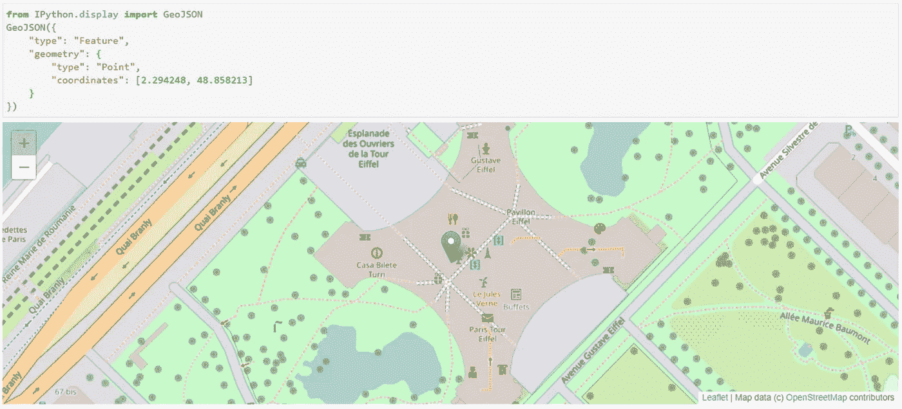
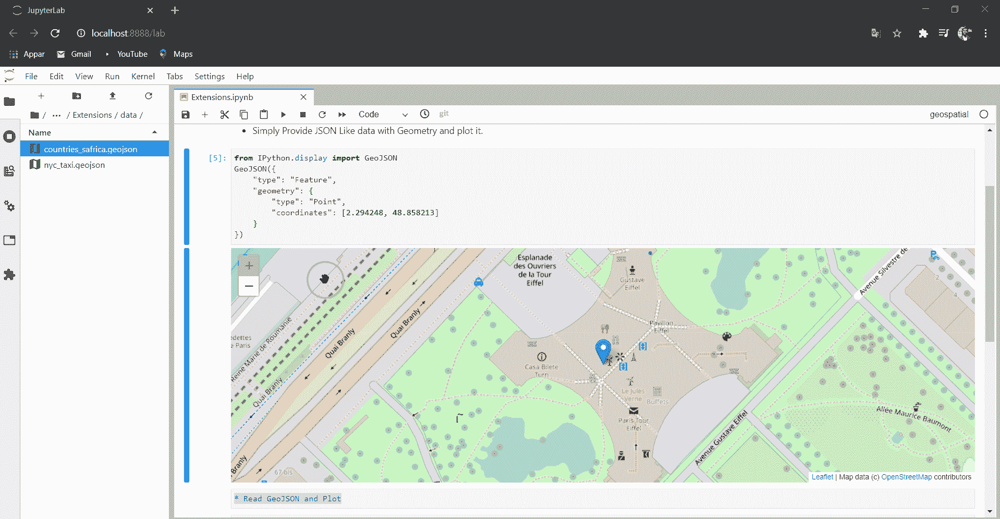
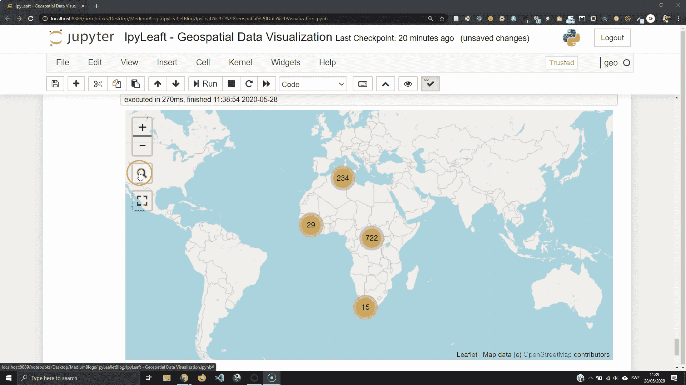
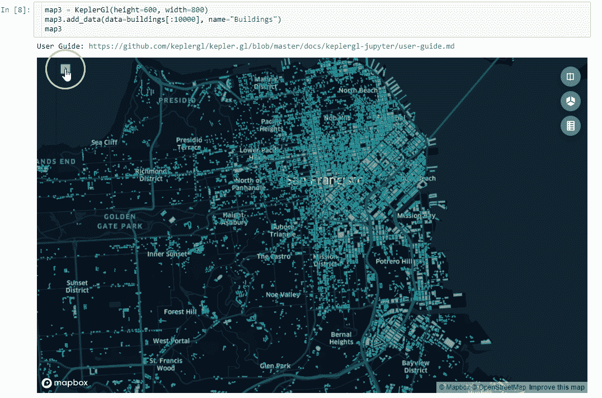

# 地理空间数据科学的 4 个必备 JupyterLab 扩展

> 原文：<https://towardsdatascience.com/4-must-have-jupyterlab-extensions-for-geospatial-data-science-f3cf7822de4b?source=collection_archive---------20----------------------->

## GIS 和交互式地理空间数据的基本 JupyterLab 扩展。


由 [Lucas Ludwig](https://unsplash.com/@luddyphoto?utm_source=medium&utm_medium=referral) 在 [Unsplash](https://unsplash.com?utm_source=medium&utm_medium=referral) 拍摄

毫无疑问，JupyterLab 是研究数据科学的最佳工具之一。它被设计成可扩展和可定制的，事实上，有很多可用的扩展。

作为一名地理空间数据科学家，我在考虑一些我在新安装 Anaconda 环境后经常使用的 JupyterLab 扩展。我意识到我错过了一些扩展，并思考了它们在我的 JupyterLab 体验中的重要性。

在本文中，我将分享四个最受欢迎和最基本的 JupyterLab 扩展，用于使用 JupyterLab 进行空间数据科学研究。这些是用于在 JupyterLab 中渲染地图或地理空间数据的特定工具。

# 1.geo JSON-扩展

geo Jon 扩展使您能够在 Jupyter 实验室内快速绘制 geo Jon 数据。无需读取数据或使用其他桌面软件将其可视化。

在这个例子中，我们用 JupyterLab 单元格中的几何图形绘制一个类似 JSON 的数据。



在 JupyterLab 中直接绘制 GeoJSON 数据—图片由作者提供。

它还可以让你渲染 Geosjon 文件，并在 Jupyter notebook 中显示出来。GeoJSON-extension 创建一个单独的输出，并附带从 Openstreetmap 加载的底图。多方便啊？💪只需将您的数据作为 Geosjon 文件，然后双击它。



GeoJSON 输出视图-图片由作者提供。

使用 GeoJSON-extension 是一种快速便捷的可视化地理空间数据的方法，无需使用 Geopandas 等 python 库在内存中读取数据。要启用 GeoJSON-extension，您可以在 Conda 终端上运行以下命令:

```
jupyter labextension install @jupyterlab/geojson-extension
```

有关更多信息，请访问 GeoJSON-extension 资源库。

[](https://www.npmjs.com/package/@jupyterlab/geojson-extension) [## @jupyterlab/geojson-extension

### 用于渲染 GeoJSON 的 JupyterLab 扩展安装@jupyterlab/geojson-extension 以渲染…

www.npmjs.com](https://www.npmjs.com/package/@jupyterlab/geojson-extension) 

## Jupyter Matplotlib — Ipympl

我喜欢使用 Geopandas 和 Matplotlib 来创建非交互式地理空间数据可视化。但是，我最近发现可以用 Jupyter matplotlib 扩展— Ipympl 来扩展 Matplotlib 交互式绘图。从那时起，它就是我的 go 工具，可以通过 Geopandas 实现快速交互式地理空间数据可视化。

以下示例显示了 Jupyter Matplotlib 扩展的交互功能。可以像往常一样创建 Geopandas 地块，只需要调用 Jupyter magic 命令:`%matplotlib widget`。


交互式 Geopandas plot 与 Ipympl——图片由作者提供。

要使用 Ipympl 的交互功能，您可以使用 Conda/ pip 安装它:

```
conda install -c conda-forge ipympl
pip install ipympl
```

如果使用的是 jupyterLab，还需要安装 node js 和 Jupyter Lab 扩展管理器。

```
conda install -c conda-forge nodejsjupyter labextension install @jupyter-widgets/jupyterlab-manager
jupyter lab build
```

如果您想开始并设置您的环境，您可以阅读这篇文章。

[](/how-to-produce-interactive-matplotlib-plots-in-jupyter-environment-1e4329d71651) [## 如何在 Jupyter 环境下生成交互式 Matplotlib 图

### 使用所有使用 Matplotlib 的 Python 库创建交互式绘图/地图

towardsdatascience.com](/how-to-produce-interactive-matplotlib-plots-in-jupyter-environment-1e4329d71651) 

## IpyLeaflet

IpyLeaflet 是 Jupyter 笔记本世界和流行传单可视化图书馆之间的桥梁。通过 Ipyleaflet，您可以在 Ipywidgets 的帮助下创建交互式的高级地理空间数据可视化。它还允许您创建双向通信地图。



使用 IpyLeaflet 的搜索栏和全屏缩放—图片由作者提供

要安装 IpyLeaflet，您可以使用 Conda 或 pip。

```
conda install -c conda-forge ipyleafletpip install ipyleaflet
```

您还需要启用 JupyterLab 扩展:

```
jupyter labextension install **@jupyter**-widgets/jupyterlab-manager jupyter-leaflet
```

我在这里还有一份关于 Ipyleaflet 交互式制图的广泛的初学者指南:

[](/ipyleaflet-interactive-mapping-in-jupyter-notebook-994f19611e79) [## IpyLeaflet:Jupyter 笔记本中的交互式映射

### IpyLeaflet 交互式地理空间数据可视化初学者指南。

towardsdatascience.com](/ipyleaflet-interactive-mapping-in-jupyter-notebook-994f19611e79) 

## 开普勒格尔-朱皮特

KeplerGL Jupyter 笔记本扩展附带了一个最好的大数据地理空间数据可视化工具。有了这个扩展，你在 Jupyter 中就有了一个强大的用户界面来创建交互式的、漂亮的地图。

借助 KeplerGL Jupyter Lab extension，您可以将世界一流的可视化工具、易于使用的用户界面(UI)以及 python 和 Jupyter 笔记本的灵活性(3D 可视化 GIF)结合起来



KeplerGL Jupyter 的 3D 建筑足迹—图片由作者提供

要安装 Keplergl Jupyter notebook，只需在终端上运行这三行代码。

```
pip install ipywidgets
pip install keplergl
$ jupyter labextension install [@jupyter](http://twitter.com/jupyter)-widgets/jupyterlab-manager keplergl-jupyter
```

要开始使用开普勒，您可以阅读这篇文章:

[](/kepler-gl-jupyter-notebooks-geospatial-data-visualization-with-ubers-opensource-kepler-gl-b1c2423d066f) [## 开普勒。GL & Jupyter 笔记本:优步开源开普勒的地理空间数据可视化。标距长度

### 在 Jupyter 笔记本中绘制地理空间数据&轻松地与开普勒的用户界面交互以调整可视化。

towardsdatascience.com](/kepler-gl-jupyter-notebooks-geospatial-data-visualization-with-ubers-opensource-kepler-gl-b1c2423d066f) 

## 结论

JupyterLab 是我最喜欢的工具，这些地理空间扩展的可用性让我坚持下来👌🏻带着它而不是回到 Jupyter 笔记本。在本文中，我分享了专门为地理空间数据科学家和 Geo 人员必备的四个 JupyterLab 扩展。

如果您在地理空间数据科学应用中使用了其他特定的 JupyterLab 扩展，请告诉我。你可以在推特上找到我。