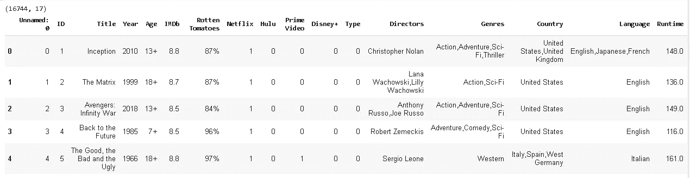
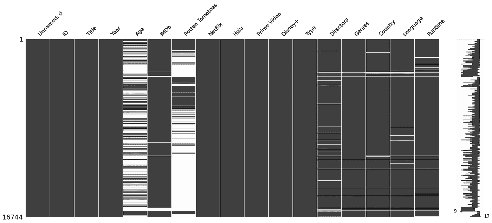
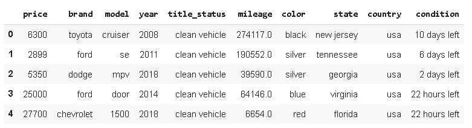
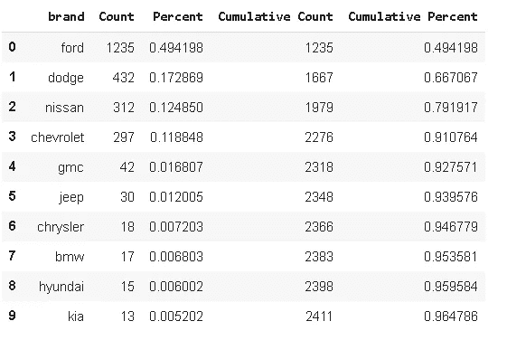
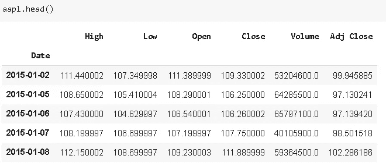

# 熊猫生态系统中 4 个必去的图书馆

> 原文：<https://towardsdatascience.com/4-must-know-libraries-in-pandas-ecosystem-7c01326c4724?source=collection_archive---------30----------------------->

## 用这些附件增强你的熊猫技能。


[公园巡警](https://unsplash.com/@parktroopers?utm_source=unsplash&utm_medium=referral&utm_content=creditCopyText)在 [Unsplash](https://unsplash.com/s/photos/community?utm_source=unsplash&utm_medium=referral&utm_content=creditCopyText) 拍摄的照片

Pandas 是一个非常强大和通用的 Python 数据分析库，它加速了数据科学项目的预处理步骤。它提供了许多在数据分析中非常有用的函数和方法。

虽然熊猫的内置功能能够进行有效的数据分析，但定制的工具或库为熊猫增加了价值。在本帖中，我们将探索 4 种工具来增强熊猫的数据分析过程。

# **失踪人口**

Pandas 提供了检查数据集中缺失值数量的函数。 **Missingno** 库更进一步，通过信息可视化提供数据集中缺失值的分布。

使用**缺失号**的图，我们能够看到缺失值在每一列中的位置，以及不同列的缺失值之间是否存在相关性。在处理缺失值之前，在数据集中探索它们是非常重要的。因此，我认为 **Missingno** 是数据清理和预处理步骤中非常有价值的资产。

让我们首先尝试探索一个关于流媒体平台上电影的数据集。数据集可在 Kaggle 上的[这里](https://www.kaggle.com/ruchi798/movies-on-netflix-prime-video-hulu-and-disney)获得。



该数据集包含 16744 部电影和描述每部电影的 17 个特征。Pandas **isna** 函数结合 **sum()** 给出了每一列中缺失值的数量。但是，在某些情况下，我们需要的不仅仅是计数。让我们用 **Missingno** 来探究缺失值。

```
import missingno as msno
%matplotlib inline #render plots within jupyter notebook
```

我们将使用的第一个工具是缺失值矩阵。

```
msno.matrix(df)
```



白线表示缺少值。“年龄”和“烂番茄”栏以白线为主。但是，在其他缺少值的列中有一个有趣的趋势。它们通常在公共行中缺少值。如果某行的“导演”列中缺少值，则很可能“流派”、“国家”、“语言”和“运行时间”列中也缺少值。在处理缺失值时，这是非常有价值的信息。

Missingno 还提供了热图和条形图，可以更深入地了解数据帧中缺失的值。如果你想进一步阅读，这里有一个更详细的帖子和例子:

[](/visualize-missing-values-with-missingno-ad4d938b00a1) [## 可视化缺失值和缺失号

### 浏览数据集中缺失的值。

towardsdatascience.com](/visualize-missing-values-with-missingno-ad4d938b00a1) 

# **侧钻**

[Sidetable](https://github.com/chris1610/sidetable) 根据选择的列创建频率表。假设我们有一个数据集，其中包含某个分类变量的一些测量值(例如模型)。我们有许多不同的类别，每个类别有许多观察值(行)。通过使用 sidetable，我们可以了解每个模型在数据集中所占的份额。这也可以使用 pandas 的 **value_counts** 函数来实现，但是 sidetable 提供的信息更多，我们将在示例中看到。

如果您使用 jupyter 笔记本，我们首先需要用`pip`或`!pip`安装它:

```
!pip install sidetable
```

然后导入它:

```
import pandas as pd
import sidetable
```

我们现在可以使用 **stb** 作为数据帧的存取器。我将使用 Kaggle 上可用的数据集。它包含了拍卖的二手车的数据。

```
df = pd.read_csv("/content/USA_cars_datasets.csv")#drop redundant columns
df.drop(['Unnamed: 0','vin','lot'], axis=1, inplace=True)df.head()
```



**Sidetable** 返回每个类别的计数和百分比以及累积值。让我们将它应用于“品牌”栏:

```
df.stb.freq(['brand'])[:10]
```



它肯定比 **value_counts** 更能提供信息。我们对数据集中的分布有了更多的了解。累积值的一个额外特性是**我们可以设置累积百分比的阈值**。然后，达到阈值后的类别被标记为“其他”。

如果你想获得更详细的概述并了解 sidetable 的其他功能，这里有一个关于 sidetable 的更详细的帖子:

[](/pandas-sidetable-just-announced-708e5f65938f) [## 熊猫侧桌刚刚宣布

### 对数据框架的信息丰富、见解深刻的概述。

towardsdatascience.com](/pandas-sidetable-just-announced-708e5f65938f) 

# **熊猫-datareader**

Pandas-datareader 是熊猫的远程数据访问库。它使得用几行代码获取股票价格数据变得非常简单。如果您想从事时间序列预测或算法交易，您可以使用 datareader 轻松获得股票价格的原始数据。

我们来做一个简单的例子。

```
import numpy as np
import pandas as pd
from pandas_datareader import dataaapl = data.DataReader("AAPL", 
                        start='2015-1-1',
                        end='2019-12-31',
                        data_source='yahoo')
```

仅此而已！我们现在已经将 2015 年至 2020 年的苹果股价数据保存在熊猫数据框架中。



如果您计划使用 LSTMs(一种特殊类型的递归神经网络)做项目，预测股票价格是一个不错的选择。通过 pandas-datareader 可以很容易地访问流程的原始数据。当然，在将数据输入模型之前，您需要对数据进行一些预处理和重新格式化。

# **特征工具**

[Featuretools](https://github.com/FeatureLabs/featuretools) 是构建在 pandas 之上的自动化特征工程工具。这在构建机器学习模型时非常有用，因为特征工程是机器学习管道的关键预处理步骤。

我们对这些特征和它们之间的关系了解得越多，我们建立的机器学习模型就越好，越健壮。因此，Featuretools 是您的宝贵财富。

熊猫的功能丰富了第三方包。你可以选择长的方法，只用熊猫自己的函数和方法来做你的分析。但是，最好简化某些任务以节省时间。此外，第三方软件包通过展示不同的方法和视角来改进数据分析过程。

感谢您的阅读。如果您有任何反馈，请告诉我。