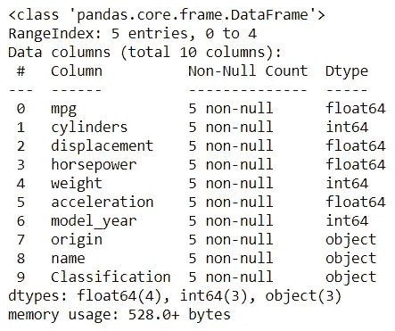
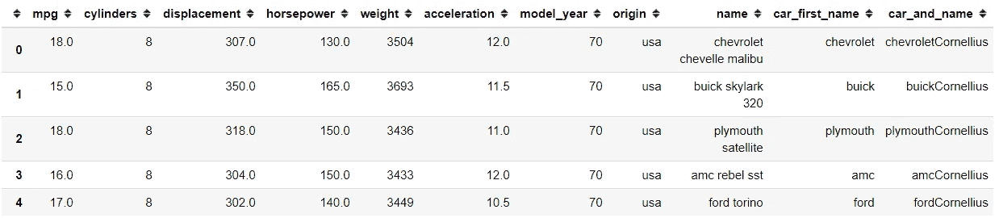
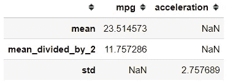

# 4 个必知的熊猫功能应用

> 原文：<https://towardsdatascience.com/4-must-know-pandas-function-application-852f5c4b4a1e?source=collection_archive---------27----------------------->

## 用函数转换数据


照片由[卢卡·布拉沃](https://unsplash.com/@lucabravo?utm_source=medium&utm_medium=referral)在 [Unsplash](https://unsplash.com?utm_source=medium&utm_medium=referral) 上拍摄

对于数据科学家来说，Pandas 是一个必不可少的模块，尤其是对于 Pythonist 爱好者来说。它允许我们用几行代码来存储、探索和操作数据，从而使我们的生活变得更加轻松。但是，有时您希望使用函数来管理数据。出于这个原因，我试图写一篇文章向您介绍一些我们可以在函数中用于数据操作的属性。

下面是熊猫功能应用四大必看。

# 1 .管道()

熊猫鼓励我们使用方法链来操作我们的数据。如果你不知道什么是方法链接，让我用下面的例子给你演示一下。

```
import pandas as pd
import seaborn as snsmpg = sns.load_dataset('mpg')#Method Chaining
mpg.head().info()
```



方法链接是在同一行代码中执行的连续函数。我们使用链式方法来减少我们编写的行数，从而更快地执行函数。

如果我们想链接我们的函数呢？下面我们来看一个简单的例子。

```
#Function to extract the car first name and create a new column called car_first_namedef extract_car_first_name(df):
    df['car_first_name'] = df['name'].str.split(' ').str.get(0)
    return df#Function to add my_name after the car_first_name and create a new column called car_and_namedef add_car_my_name(df, my_name = None):
    df['car_and_name'] = df['car_first_name'] + my_nameadd_car_my_name(extract_car_first_name(mpg), my_name = 'Cornellius')mpg.head()
```



正如我们所看到的，我们需要在另一个函数中执行我们的函数来产生结果。执行这些功能需要多长时间？


函数内函数的执行时间

执行一个功能代码中的一个功能需要 18ms。现在，让我向您介绍一个使用下面的`pipe`属性的链接方法。

```
mpg.pipe(extract_car_first_name).pipe(add_car_my_name, my_name = 'Cornellius')
```


Pandas 对象中的方法链接需要使用`pipe`属性。我们想要链接的每个函数都在`pipe`属性中输入。我们可以看到结果类似于上面的例子。执行时间呢？


使用管道属性的方法链接的执行时间

使用`pipe`属性进行方法链接只花了 6 毫秒。很清楚哪一个更快。看起来在执行时间上没有太大的不同，但是想象一下如果我们使用大数据。执行时间将发挥更大的作用。这就是为什么当我们对函数进行方法链接时，使用`pipe`是明智的。

# 2 .应用()

之前我们讨论了整个数据集的链接方法，但是如果我们想按行或按列传播我们的函数呢？在这种情况下，我们可以使用`apply`属性。让我用下面的例子来展示一下。

```
import numpy as np#Selecting only the numerical columns then applying mean function to each columnmpg.select_dtypes('number').apply(np.mean)
```


默认情况下，我们在`apply` 属性中输入的函数将被广播到每一列。结果是以列名作为索引、以函数返回值作为序列值的序列。

我们也可以创建自己的函数。事实上，这就是我们使用`apply`属性的原因。这是因为我们可以实现函数来按列或行转换数据。让我给你看下面的例子。

```
#Creating a function that accepting the column and return each column mean divided by 2def mean_divided_by_2(col):
    return (col.mean())/2mpg.select_dtypes('number').apply(mean_divided_by_2)
```


使用我自己的函数，我得到了每列平均值除以 2 的结果。如果您知道，我创建的函数接受一个名为 col 的参数，使用这个 col 参数，我通过使用`mean`属性返回每一列的平均值。这意味着我们为`apply`属性创建的函数将接受每列的一系列对象。这样，我们可以在自己的函数中使用任何一个系列方法。

行方式应用怎么样？是的，我们可以按行的方式将函数应用于数据集。下面让我用一个简单的例子来告诉你。

```
#Using print function and change the axis parameter to 1 in order for a row-wise applicationmpg.select_dtypes('number').apply(print, axis =1)
```


从结果中我们可以看到，我们正在打印每一行数据，其中每一行都被转换成一个 series 对象。序列索引是列名，序列值是每行中的值，序列名称是每行的索引名。

就像以前一样，我们可以创建自己的函数。下面让我给你看一个例子。

```
#Creating a classification function. If the mpg is below 18 and the model_year below 75 it would return Old-School, else it would return New-Schooldef mpg_classification(cols):
    if cols['mpg'] <18 and cols['model_year'] <75:
        return 'Old-School'
    else:
        return 'New-School'#Creating a new column called Classification by using the mpg_classification function input on apply attributempg['Classification'] = mpg.apply(mpg_classification, axis = 1)mpg.head()
```


如您所见，我们现在有了一个名为“分类”的新列。这些值基于我们在`apply`属性中使用的 mpg_classification 函数。在行方式的情况下，我们在每一行中迭代，所以我们输入的函数在每一行中都被应用。每次迭代都是一个系列对象，由行值组成，索引是列名。在我上面的函数中，cols 参数将由每行的 series 对象填充；这就是为什么我在 cols 参数中指定了我使用的列(cols['mpg']和 cols['model_year'])。

# 3.agg()

`aggregation`或`agg`允许以一种简洁的方式表达可能的多个聚合操作。对于不知道什么是聚合的人来说，让我用下面的例子来说明一下。

```
mpg.agg(np.mean)
```


使用一个函数的聚合类似于我们之前使用的`apply`属性。它对每一列应用一个函数并产生一个系列对象。`agg`的特别之处在于它可以实现多种功能。

```
#Instead of function, agg could receive the string of the basic statistic function. Additionaly, we could implement our own function here as well. If we have multiple function, we put it in the list.mpg.agg(['mean', 'std',mean_divided_by_2])
```


使用多个函数作为输入，我们得到一个数据框对象。`agg`属性的伟大之处在于该函数只适用于有效对象。如果我们输入的函数不能接受某些数据类型，它将被忽略。

将 dictionary 对象传递给`agg`属性允许我们指定哪个函数应用于哪个列。

```
#For example, I only use mpg and acceleration column. If we pass dictionary to the agg attribute, we need to specify the function we want to every column.mpg[['mpg', 'acceleration']].agg({'mpg': ['mean',mean_divided_by_2], 'acceleration': 'std'})
```



# 4.应用地图()

我们之前学习的所有属性都是基于整个数据集或列/行的。如果我们只想将函数应用于每个元素或值呢？在这种情况下，我们将使用`applymap`属性。下面让我给你看一个例子。

```
#You could input a lambda function as well. Here I create a function to transform each value into string object and return the length of the stringmpg.applymap(lambda x: len(str(x)))
```


结果是一个数据框对象，其中我们输入到`applymap`的函数被应用到数据集中的每个值。我们还为系列对象设置了`map`属性，它相当于数据框的`applymap`属性。

```
#Using map attribute on the series objectmpg['name'].apply(lambda x: len(str(x)))
```


# 结论

在本文中，我向您展示了四个熊猫函数应用程序，它们被证明在我们的日常数据科学工作中非常有用。它们是:

1.  管
2.  应用
3.  集料
4.  应用地图

希望有帮助！

# 如果你喜欢我的内容，并想获得更多关于数据或作为数据科学家的日常生活的深入知识，请考虑在这里订阅我的[时事通讯。](https://cornellius.substack.com/welcome)

> 如果您没有订阅为中等会员，请考虑通过[我的推荐](https://cornelliusyudhawijaya.medium.com/membership)订阅。