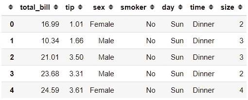
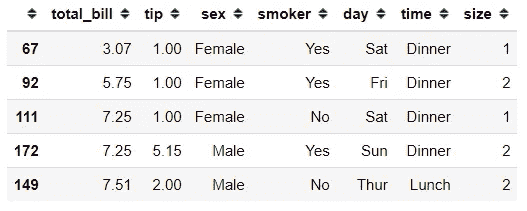
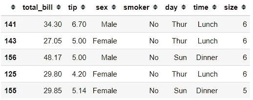
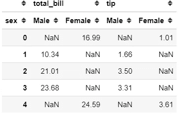
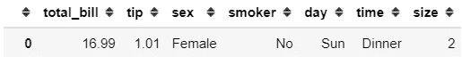
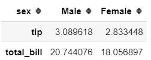
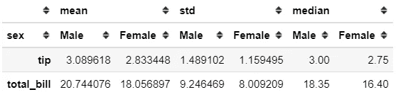
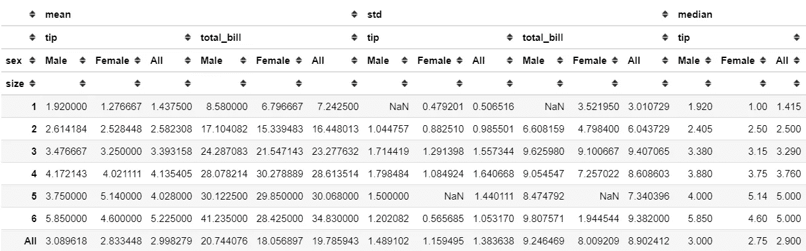
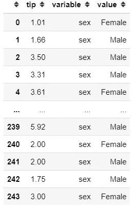

# 4 熊猫功能重塑餐桌布局

> 原文：<https://towardsdatascience.com/4-pandas-function-to-reshape-table-layout-f08e760c4602?source=collection_archive---------23----------------------->

## 根据你的需求改造你的熊猫桌


[安视觉](https://unsplash.com/@anvision?utm_source=medium&utm_medium=referral)在 [Unsplash](https://unsplash.com?utm_source=medium&utm_medium=referral) 上拍照

在处理数据时，有时您需要以您需要的方式转换您的表。这可能是因为您需要更清楚地查看您的数据，或者您需要将您的数据转换成更好的形式。

无论如何，本文将重点介绍四个不同的函数，您可以使用它们来转换您的 Pandas 数据框。让我们开始吧。

# 1 .排序值

简单而有用。这种优雅的方法是熊猫武器库中最有用的方法之一。仅仅从名字上，你就能猜出这个函数是做什么的。是的，这个函数根据特定列中的值对表进行排序。

让我用一个数据集的例子来说明。

```
import pandas as pd
import seaborn as sns#Loading dataset example
tips = sns.load_dataset('tips')
tips.head()
```



原始提示表

以上是我们的数据集示例。假设我想根据已排序的 total_bill 列重新调整我的表布局。我可以用下面的代码来做。

```
tips.sort_values('total_bill').head()
```



基于 total_bill 列的排序提示表

就像这样，我们根据 total_bill 列对表进行升序排序。如果您想基于大小列对列进行排序，然后以降序方式提示列，又会如何呢？用下面的代码也可以做到这一点。

```
#We put our columns in the list and input False value in the ascending parameter to change the sorting directiontips.sort_values(['size', 'tip'], ascending = False).head()
```



根据大小和提示列对表进行降序排序

现在我们首先按照 size 列对表进行排序，然后按照 tip 列降序排序。

# 2 .枢轴

Pivot 是一种基于列值从数据框重塑数据(生成“pivot”表)的方法。它使用指定索引/列中的唯一值来形成结果数据帧的轴。

我们所做的枢轴的另一个名称是**长到宽的桌子。**为了说明原因，让我们用 tips 数据集来尝试一下。

```
#I specify the as the column and the both total_bill and tip column as the valuetips.pivot(columns = 'sex', values = ['total_bill', 'tip'])
```



如您所见，我们现在将表布局更改为数据透视表。性别列中的前一个类现在变成了它们各自的列，并且在它们的位置上用数值填充了值。

NaN 值，因为在原始数据的该行中不存在任何值。例如，索引 0 在男性列中包含 NaN 发生这种情况是因为在行索引 0 中，性别值是女性。看下图就知道了。



# 3 .数据透视表 _ 表格

熊猫数据框对象中有一个方法。与 pivot 方法相比有什么不同？我们就试试吧。

```
tips.pivot_table(columns = 'sex', values = ['total_bill', 'tip'])
```



现在，结果与 pivot 方法相比明显不同。这是因为在 pivot_table 函数中，我们得到的不是包含每个数据值的行，而是聚合值。

默认情况下，聚合函数是 **mean(平均值)**；这就是为什么在上面的数据透视表中，值是每个组合的平均值。

我们可以尝试在我们的数据透视表中有另外几个聚合函数。

```
tips.pivot_table(columns = 'sex', values = ['total_bill', 'tip'], aggfunc = ['mean', 'std', 'median'])
```



在上面的数据透视表中，我们添加了 mean 之外的另一个聚合函数；标准差和中位数。它创建了一个附加的多级数据透视表，其中包含聚合函数的所有值。

如果您想要创建一个更详细的分离和汇总值，我们可以用下面的代码来完成。

```
#Specificed the size column as the index and margins as True to get the total summarytips.pivot_table(columns = 'sex', values = ['total_bill', 'tip'], aggfunc = ['mean', 'std', 'median'], index = 'size',
                margins = True)
```



上面我们得到了我们需要的详细的数据透视表。

# 4.熔化

熔化是枢轴功能的逆过程。在这个函数中，我们创建了一个从**宽到长的**表。或者换句话说，我们把桌子拆了。让我们试一下这个函数的功能。

```
tips.melt(id_vars = 'tip', value_vars = 'sex')
```



就这样，我们得到了融化的桌子。在上面的非透视表中，我们得到三列；提示、变量和值列。提示列是提示列的原始值，可变列值是原始列名，值列值是类类别或可变列值中的值。

# 结论

在本文中，我向您展示了四个熊猫函数来重塑表格布局:

1.  排序值
2.  在枢轴上转动
3.  数据透视表 _ 表格
4.  熔化

希望有帮助！

# 如果你喜欢我的内容，并想获得更多关于数据或作为数据科学家的日常生活的深入知识，请考虑在这里订阅我的[时事通讯。](https://cornellius.substack.com/welcome)

> 如果您没有订阅为中等会员，请考虑通过[我的推荐](https://cornelliusyudhawijaya.medium.com/membership)订阅。