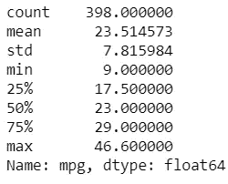
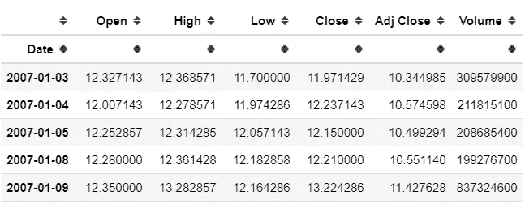
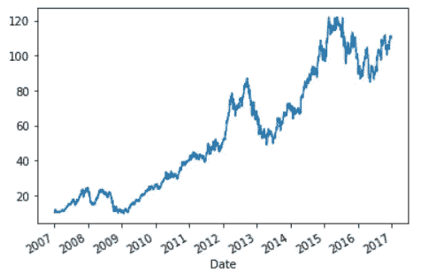
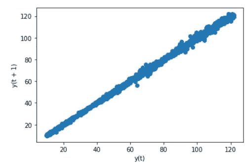
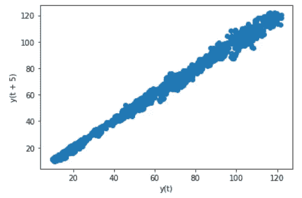
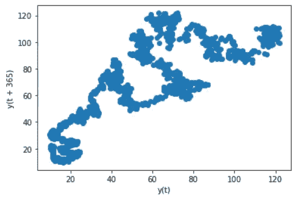
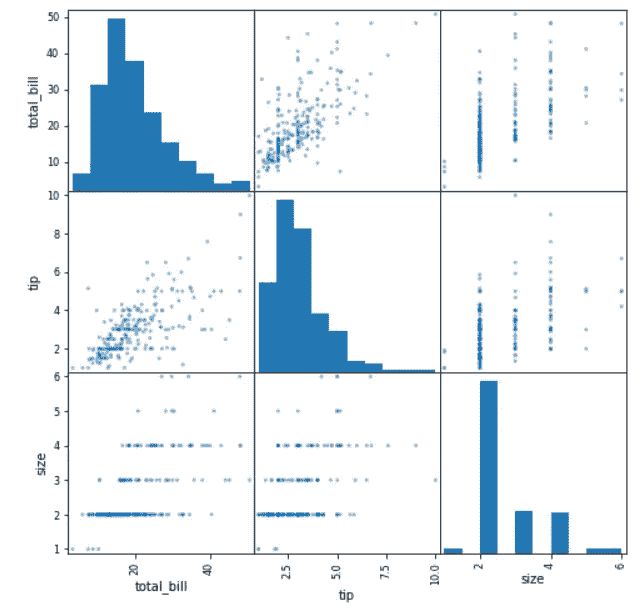

# 4 你应该知道的熊猫绘图功能

> 原文：<https://towardsdatascience.com/4-pandas-plotting-function-you-should-know-5a788d848963?source=collection_archive---------18----------------------->

## 一些你可能从来不知道的熊猫的简单策划


艾萨克·史密斯在 [Unsplash](https://unsplash.com?utm_source=medium&utm_medium=referral) 上拍摄的照片

对于数据科学家来说，Pandas 是一个强大的软件包。我们使用熊猫有很多原因，例如数据争论、数据清理和数据操作。虽然，有一种关于熊猫包装的方法很少被提及，那就是**数据绘制**。

数据绘图，顾名思义，是将数据绘制成一些图形或图表以使数据可视化的过程。虽然我们有更好的可视化软件包，但是一些方法在熊猫绘图 API 中是可用的。

让我们来看看我选择的几个精选方法。

# 1.拉德维兹

RadViz 是一种将 N 维数据集可视化为 2D 图的方法。当我们拥有超过 3 维(特征)数据或更多数据时，问题是我们不能可视化它，但是 RadViz 允许它发生。

据 Pandas 称，radviz 允许我们将一个 N 维数据集投影到 2D 空间，其中每个维度的影响都可以被解释为所有维度重要性之间的平衡。用一个更简单的术语来说，这意味着我们可以用一种原始的方式把多维数据投射到 2D 空间。

让我们试着在一个样本数据集中使用这个函数。

```
#RadViz example
import pandas as pd
import seaborn as sns#To use the pd.plotting.radviz, you need a multidimensional data set with all numerical columns but one as the class column (should be categorical).mpg = sns.load_dataset('mpg')
**pd.plotting.radviz(mpg.drop(['name'], axis =1), 'origin')**
```


RadViz 结果

以上是 RadViz 函数的结果，但是你会如何解读这个情节呢？

因此，数据帧中的每个系列都表示为一个圆形上均匀分布的切片。只看上面的例子，有一个圆圈，上面有系列名称。

然后，根据每个系列的值，将每个数据点绘制在圆圈中。数据框中高度相关的系列更靠近单位圆。在本例中，我们可以看到日本和欧洲的汽车数据更接近车型年份，而美国汽车更接近排量。这意味着日本和欧洲汽车最有可能与年款相关，而美国汽车与排量相关。

如果你想了解更多关于 RadViz 的信息，你可以点击查看论文[。](https://citeseerx.ist.psu.edu/viewdoc/summary?doi=10.1.1.135.889)

# 2.自举图

根据 Pandas 的说法， **bootstrap plot** 用于通过依赖替换随机抽样来估计统计数据的不确定性。更简单地说，**通过替换**(你可以多次采样相同的数据)对数据进行重采样，试图确定基础统计中的不确定性，如均值和中值。你可以在这里阅读更多关于 bootstrap [的信息。](https://en.wikipedia.org/wiki/Bootstrapping_%28statistics%29)

boostrap_plot 函数将为给定大小的给定数量的样本生成均值、中值和中间范围统计的自举图。让我们通过一个示例数据集来尝试使用该函数。

例如，我有 mpg 数据集，并且已经有关于 mpg 特征数据的信息。

```
mpg['mpg'].describe()
```



我们可以看到平均每加仑跑 23.51 英里，中位数是 23 英里。虽然这只是真实世界数据的快照。总体中的值实际上是多少是未知的，这就是为什么我们可以用 bootstrap 方法来测量不确定性。

```
#bootstrap_plot examplepd.plotting.bootstrap_plot(mpg['mpg'],size = 50 , samples = 500)
```


以上是 bootstap_plot 函数的结果示例。请注意，结果可能与示例不同，因为它依赖于随机重采样。

我们可以在第一组图(第一行)中看到采样结果，其中 x 轴是重复，y 轴是统计数据。第二组是统计分布图(平均值、中间值和中间值)。

以平均值为例，大多数结果在 23 左右，但也可能在 22.5 到 25 之间(或多或少)。这在现实世界中设定了不确定性，即人口中的平均值可能在 22.5 和 25 之间。请注意，有一种方法可以通过取位置 2.5%和 97.5%分位数(95%置信)的值来估计不确定性，尽管这仍然取决于您的判断。

# 3.滞后 _ 绘图

**滞后图**是一个时间序列的散点图，同样的数据滞后。滞后本身是一个固定量的流逝时间；例如，滞后 1 是具有 1 天时间滞后的第 1 天(Y1)(Y1+1 或 Y2)。

滞后图用于检验时间序列数据是否随机，以及数据之间是否相关。随机数据不应该有任何可识别的模式，如线性。尽管如此，我们为什么要为随机性或相关性而烦恼呢？这是因为许多时间序列模型是基于线性回归的，并且一个假设是没有相关性(具体来说就是没有自相关)。

让我们用一个例子数据来试试。在这种情况下，我将使用一个名为 yahoo_historical 的特定包从 Yahoo Finance 中删除股票数据。

```
pip install yahoo_historical
```

有了这个包，我们可以废弃特定的股票数据历史。让我们试一试。

```
from yahoo_historical import Fetcher#We would scrap the Apple stock data. I would take the data between 1 January 2007 to 1 January 2017 
data = Fetcher("AAPL", [2007,1,1], [2017,1,1])
apple_df = data.getHistorical()#Set the date as the index
apple_df['Date'] = pd.to_datetime(apple_df['Date'])
apple_df = apple_df.set_index('Date')
```



上面是我们以日期为索引的苹果股票数据集。我们可以尝试用一种简单的方法来绘制数据，以观察随时间变化的模式。

```
apple_df['Adj Close'].plot()
```



我们可以看到 Adj Close 随着时间的推移而增加，但数据本身是否显示出任何滞后模式？在这种情况下，我们将使用 lag_plot。

```
#Try lag 1 day
pd.plotting.lag_plot(apple_df['Adj Close'], lag = 1)
```



正如我们在上面的图中看到的，它几乎是线性的。这意味着每日的密切相关。这是意料之中的，因为股票的每日价格每天不会有太大的变化。

每周一次怎么样？让我们试着画出来

```
#The data only consist of work days, so one week is 5 dayspd.plotting.lag_plot(apple_df['Adj Close'], lag = 5)
```



我们可以看到模式类似于滞后 1 图。365 天怎么样？会有什么不同吗？

```
pd.plotting.lag_plot(apple_df['Adj Close'], lag = 365)
```



我们现在可以看到模式变得更加随机，尽管非线性模式仍然存在。

# 4.散布矩阵

**scatter_matrix** 顾名思义；它创建了一个散点图矩阵。我们马上用一个例子来试试。

```
import matplotlib.pyplot as plttips = sns.load_dataset('tips')
pd.plotting.scatter_matrix(tips, figsize = (8,8))
plt.show()
```



我们可以看到，scatter_matrix 函数自动检测传递给该函数的数据框中的数字特征，并创建散点图的矩阵。

在上面的示例中，两个数字特征之间绘制在一起以创建散点图(total_bill 和大小、total_bill 和小费以及小费和大小)。而对角线部分是数字特征的直方图。

这是一个简单的函数，但是足够强大，因为我们可以通过一行代码获得很多信息。

# 结论

在这里，我向你展示了 4 种不同的熊猫绘图功能，你应该知道，其中包括:

1.  拉德维兹
2.  自举图
3.  滞后 _ 绘图
4.  散布矩阵

希望有帮助！

# 如果你喜欢我的内容，并想获得更多关于数据或作为数据科学家的日常生活的深入知识，请考虑在这里订阅我的[时事通讯。](https://cornellius.substack.com/welcome)

> 如果您没有订阅为中等会员，请考虑通过[我的推荐](https://cornelliusyudhawijaya.medium.com/membership)订阅。