# 大多数人不知道的 4 个熊猫戏法

> 原文：<https://towardsdatascience.com/4-pandas-tricks-that-most-people-dont-know-86a70a007993?source=collection_archive---------12----------------------->


[PublicDomainPictures](https://pixabay.com/users/PublicDomainPictures-14/) 在 [Pixabay](https://pixabay.com/photos/autumn-black-dark-decoration-fall-21495/#) 拍摄的照片

## 熊猫的一些不常见但有趣的方法可以节省我们的时间

如果你是数据分析师或数据科学家，你一定知道 Python 中的 Pandas 库，它已经成为 Python 中数据角力/清理工具的标准。然而，熊猫有一些小技巧，我打赌你可能不知道所有的技巧。

在这篇文章中，我将分享一些我知道的熊猫技巧。我相信它们会加快我们的工作，有时会让我们的生活更轻松。现在我们应该开始了！

# 1.从剪贴板创建数据帧


由 [StockSnap](https://pixabay.com/users/StockSnap-894430/) 在 [Pixabay](https://pixabay.com/photos/clipboards-papers-text-quotes-924044/) 上拍摄的照片

好吧，你一定知道熊猫可以很容易的从 CSV，JSON 甚至直接从数据库中使用 SQLAlchemy 读取，但是你知道熊猫也可以从我们操作系统的剪贴板中读取吗？

假设我们有一个包含多个数据表的 Excel 文件。现在，我们希望用 Python 处理一个表中的部分数据。为了实现这一点，我们通常会做些什么？

1.  从数据表中复制我们需要用 Python 处理的数据。
2.  将其粘贴到另一个数据表中。
3.  将当前工作表保存为 CSV 文件。
4.  获取新 CSV 文件的路径。
5.  转到 Python，使用`pd.read_csv('path/to/csv/file')`将文件读入 Pandas 数据框。

肯定有更简单的方法，那就是`pd.read_clipboard()`。

1.  复制您需要的数据区域。
2.  去 Python，用`pd.read_clipboard()`。

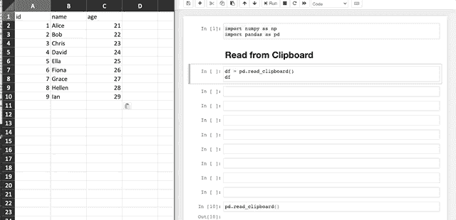

如上图，多简单啊！如果您只是想将一些数据加载到 Pandas 中，则不需要有单独的 CSV 或 Excel 文件。

这个函数也有更多的技巧。例如，当我们有日期格式的数据时，它可能无法正确加载，如下所示。

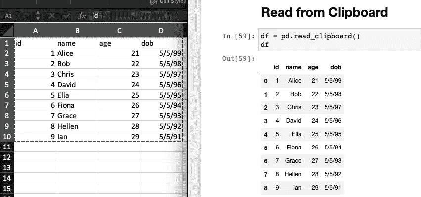

诀窍是让熊猫知道哪一列是需要解析的日期格式。

```
df = pd.read_clipboard(parse_dates=['dob'])
```

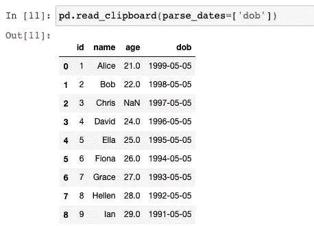

# 2.使用测试方法生成虚拟数据


照片由 [pszmajduch](https://pixabay.com/users/pszmajduch-125906/) 在 [Pixabay](https://pixabay.com/photos/printing-house-colors-samples-276390/) 上拍摄

有时我们可能想生成一些样本数据帧。最常见的方法可能是使用 NumPy 生成一个带有随机值的数组，然后从该数组生成数据帧。

我会说，如果我们需要数据具有某种分布，比如正态分布，我们就必须使用 Numpy。但是，很多时候我们可能并不关心数据是否正态分布，我们只是希望有一些数据可以随便玩玩。在这种情况下，有一种更简单的方法。即使用`pandas.util.testing`包生成样本数据帧。

```
pd.util.testing.makeDataFrame()
```

数据框的索引将使用随机字符串生成。默认情况下，将有 30 行 4 列。

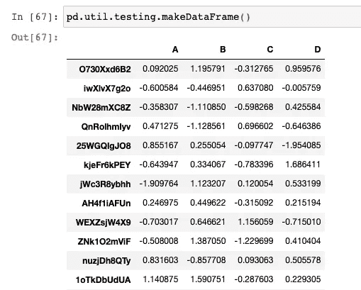

如果我们需要一定数量的行和列，我们可以将`testing.N`定义为行数，将`testing.K`定义为列数。

```
pd.util.testing.N = 10
pd.util.testing.K = 5
pd.util.testing.makeDataFrame()
```

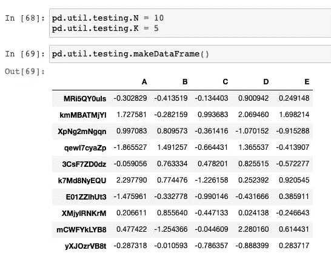

# 3.将数据帧输出到压缩文件


照片由 [stevepb](https://pixabay.com/users/stevepb-282134/) 在 [Pixabay](https://pixabay.com/photos/stress-tension-pressure-stressing-624220/) 上拍摄

你要知道我们可以很容易的将一个数据帧输出到一个文件中，比如`df.to_csv()`、`df.to_json()`等等。但有时，我们可能希望压缩文件以节省磁盘空间或用于其他目的。

举个例子，作为一个数据工程师，我确实满足了这样一个要求，就是把熊猫数据帧输出成 CSV 文件，传输到远程服务器。为了节省空间和带宽，文件需要在发送前压缩。

通常，典型的解决方案可能是在正在使用的调度工具(如 Airflow 或 Oozie)中增加一个步骤。但是我们知道我们可以直接让熊猫输出一个压缩文件。因此，解决方案会更简洁，步骤更少，也更简单。

让我们使用技巧№2 生成一个随机数据帧:)

```
pd.util.testing.N = 100000
pd.util.testing.K = 5
df = pd.util.testing.makeDataFrame()
```

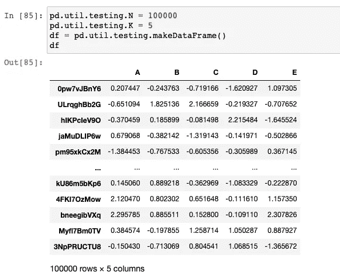

在这种情况下，我们只需要一个数据框，其中的值完全不重要。

现在，让我们将数据帧保存到 CSV 文件中，并检查其大小。

```
import osdf.to_csv('sample.csv')os.path.getsize('sample.csv')
```

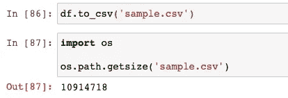

然后，我们可以测试将相同的数据帧输出到一个压缩文件中，并检查文件的大小。

```
df.to_csv('sample.csv.gz', compression='gzip')os.path.getsize('sample.csv.gz')
```

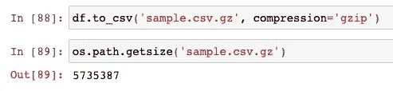

我们可以看到压缩后的文件不到正常 CSV 文件的一半。

请注意，这可能不是一个好例子，因为在我们的随机数据框中没有任何重复的值。在实践中，如果我们有任何分类值，压缩率可以非常高！

顺便说一句，也许你在想我要说的事情。可以，熊猫可以直接把压缩文件读回一个数据帧。不需要在文件系统中解压。

```
df = pd.read_csv('sample.csv.gz', compression='gzip', index_col=0)
```

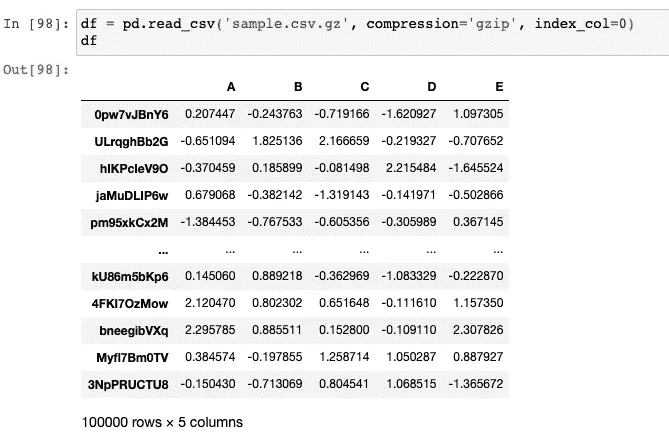

我更喜欢用`gzip`，因为它默认存在于大多数 Linux 系统中。熊猫也支持更多的压缩格式，比如“zip”和“bz2”。

# 4.从多列获取日期时间


[布鲁诺](https://pixabay.com/users/Bru-nO-1161770/)在[皮克斯贝](https://pixabay.com/photos/clock-pocket-watch-movement-3179167/)拍摄的照片

相信你在熊猫里一定用过`pd.to_datetime()`方法把某种字符串转换成 DateTime 格式。我们通常将这种方法与格式字符串一起使用，比如`%Y%m%d`。

但是，有时我们可能会使用以下类型的数据框作为原始数据。

```
df = pd.DataFrame({
    'year': np.arange(2000, 2012),
    'month': np.arange(1, 13),
    'day': np.arange(1, 13),
    'value': np.random.randn(12)
})
```

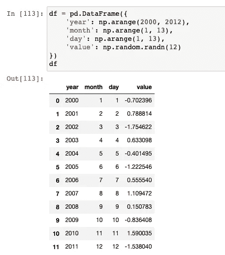

在数据框中将年、月和日作为单独的列并不罕见。事实上，我们可以使用`pd.to_dateframe()`一步将它们转换成日期时间列。

```
df['date'] = pd.to_datetime(df[['year', 'month', 'day']])
```

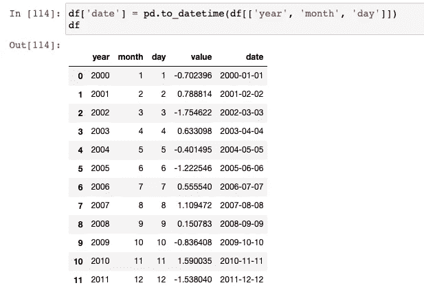

多简单啊！

# 摘要


照片由 [Engin_Akyurt](https://pixabay.com/users/Engin_Akyurt-3656355/) 在 [Pixabay](https://pixabay.com/photos/coffee-cup-espresso-hands-food-2608864/) 上拍摄

在本文中，我分享了一些我认为在 Python Pandas 库中非常有用的技巧。我会说，这些小技巧当然不是我们必须知道的要点。但是了解它们有时可以节省我们生活中的时间。

我会继续为 Python 寻找更多有趣的东西。请关注我的个人资料。

[](https://medium.com/@qiuyujx/membership) [## 通过我的推荐链接加入灵媒-陶

### 作为一个媒体会员，你的会员费的一部分会给你阅读的作家，你可以完全接触到每一个故事…

medium.com](https://medium.com/@qiuyujx/membership) 

如果你觉得我的文章有帮助，请考虑加入 Medium 会员来支持我和成千上万的其他作者！(点击上面的链接)