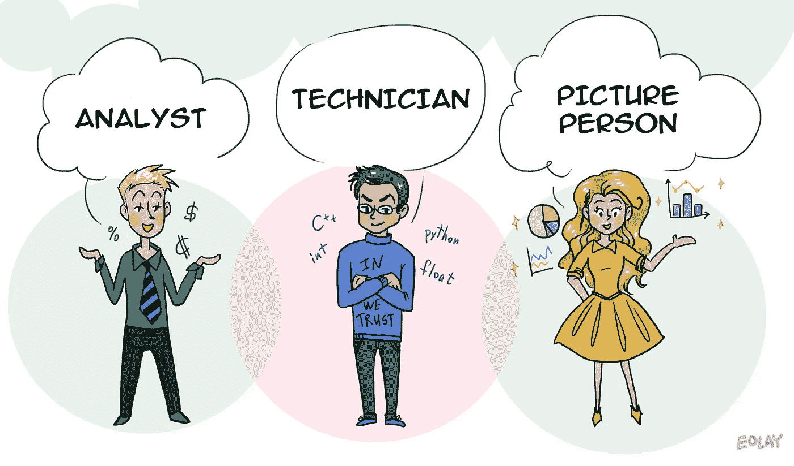
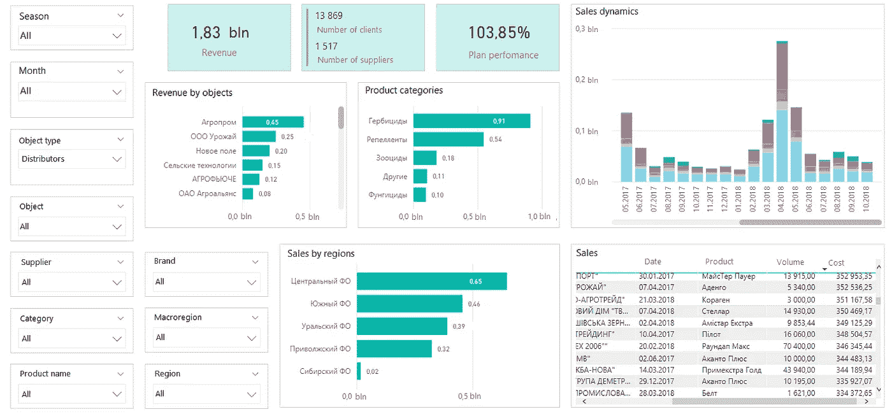
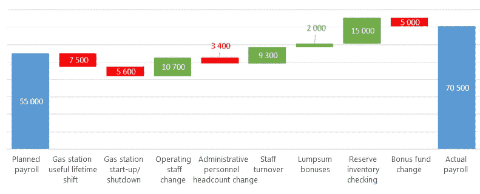
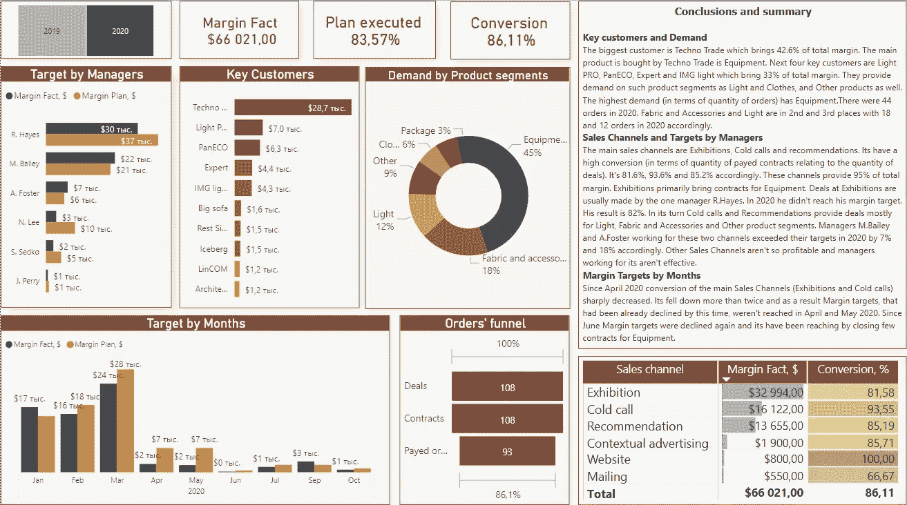

# 走向数据驱动文化的 4 个悖论

> 原文：<https://towardsdatascience.com/4-paradoxes-on-the-way-to-data-driven-culture-c378a5e99187?source=collection_archive---------50----------------------->

来源:[娜塔莉亚·基塞列娃](https://medium.com/@eolay13)经由[分析师的漫画](https://static.tildacdn.com/tild6138-3639-4865-b037-626433373962/3profi.png) (CC BY-NC-ND)

## 构建数据驱动系统时，分析师需要具备哪些技能？

M 通过 KPI 管理企业，根据运营数据和预测做出决策，在人工智能的帮助下找到商业见解是每个经理和企业主的梦想。然而，构建这样一个系统并不容易——有一个完整的 IT 服务动物园，每个都需要支持。最终，一切都归结到人身上，那些知道如何“与机器交流”并将工作结果转化为商业语言的数据分析师。

将大数据转化为商业解决方案(一种信息产品)的过程包括几个阶段，需要不同人员的团队合作。甚至还有这样一个名词——***数据驱动型组织。这是一家管理层根据分析做出决策的公司，而不仅仅是经验、意见或直觉。***

为了成为这样的公司，仅仅雇佣一个顶尖的程序员团队或购买一个先进的 CRM 系统是不够的，你需要改变企业沟通的文化，了解这些过程的参与者的心理。

分析师不一定是一个职位，它是一个角色，最重要的是:许多员工参与管理报告的编写。但是，客户和经理经常从他们的分析师那里收到大量的表格和幻灯片，而不是适合决策的信息。

在我整合公司报告系统的 10 年中，我观察到许多期望与现实不符的情况，并在本文中进行了描述。这将有助于你了解你的公司在沟通方面存在哪些缺陷，以及如何消除你走向数据驱动文化的障碍。

# 3 种类型的分析师

处理数据和报告的人员可以分为三组:**分析师、图片人员和技术人员。**他们对数据、数据处理和结果有不同的角色、任务和要求。他们都使用不同的方法共同工作。这就是他们工作态度的矛盾之处。

1.  分析师是寻找特定问题答案的金融专家、经济学家和营销专家。为此，他们进行研究，收集信息，并得出结论。他们的任务是分析数据，确定因果关系，研究各种因素对业务流程的影响。例如，一位经济学家确定了影响成本增长的因素，而一位网络分析师从搜索查询关键词中构建了网站的语义核心。
2.  **技术人员**是数据库开发人员、数学家和数据科学专家。他们衍生信息处理算法，设计数据仓库，并自动生成报告。对他们来说重要的是系统是如何工作的，是什么影响了它，如何让这个过程不出错不中断，也就是创造一个完美的算法。
3.  **图片人**制作最终产品，知道如何把表格变成清晰的图表、幻灯片甚至仪表盘。通常，他们不担任设计师的职位，而是了解业务需要什么并能为设计师和开发人员设定任务的经理。一个分析师也可以扮演一个形象化的角色，在可用性的类别中思考，并且有一种美感。

他们每个人都认为他们那部分工作是最重要的。分析师认为是寻找问题答案的过程，图片人认为是呈现的美感和可及性，技术人员认为是模型和算法。结果是对最终客户来说不明显的矛盾。

## 悖论 1。分析师不需要可视化

分析师的完美工具是 Excel 电子表格、OLAP 立方体或可以通过 Qlik 或 Power BI 连接的数据展示。对他们来说，结果是几个表或数组的交集。他们感到舒适和方便，他们理解他们。他们把一切都切成薄片，用细胞组织起来，这不是没有原因的。

简单的图表或演示幻灯片对分析师来说并不有趣，对他们来说，它们只是“美丽的图片”,如果不沉浸在上下文中，这些图片毫无用处。毕竟你总是可以钻研表格，刨根问底的。他们理解仪表板的价值，但使它们过于复杂，许多书签过滤器占据了屏幕的一半。

*只有分析师才能理解的多过滤器仪表板*

这是一个常见的问题—

> 分析师不知道如何授权访问信息。

他们为自己建立了不同的报告，他们将根据您的要求收集数据并准备必要的样本。但这样一来，它们自己就成了汇总表的构造者，封闭了自身的信息流。这样的员工会花半天时间创建相同的报告，只是从不同的角度，抱怨他们没有足够的时间进行分析。

## 悖论二。图片人不关心数据质量

我说的‘图片人’，指的是视觉思维发达的分析师，而不是设计师。他们塑造分析结果，在追求和谐和美学的过程中，信息的可靠性对他们来说变得无足轻重。那么一个喜欢图片的人可能会错过一些重要的细节，而这些细节是分析研究人员肯定会注意的。例如，在这个因素分析图中，颜色选择不正确。

实际工资总额偏离计划工资总额的因素

根据图表的想法，那些带负号的因素用红色表示，增加的用绿色表示。但是在这里我们分析工资超支的原因，减少、节约是好的，相反，费用的增加应该被标上红色。

> 但是画这幅图的人并没有注意上下文，因为这幅图本身看起来清晰而有逻辑。

## 悖论三。程序员不关心商业结果

数据科学家，机器学习者，这听起来很酷，但事实上这是数学家的职业，一个与算法打交道的程序员。对他们来说，技术方面很重要，机器学习的模型所描述的关系的性质，但如何进一步处理这些信息并不困扰他们。他们会为你建立一个理想员工职业能力的模型，但不会告诉你如何找到一个，如何管理它们。

我并不是批评开发人员关心数据库结构的完整性，而不是如何增加客户忠诚度。相反，我说的是这样一个事实，即期望从他们那里获得现成的商业发展解决方案是幼稚的。

如果可视化不是一种数据库通信方案，程序员也不会感兴趣。他们也不对数据质量负责。

> 他们的职责范围是稳定工作、系统性能和无错误。

不过，这也非常重要。

## 悖论 4。业务需要文本

在文章的开始，我谈到了三个角色，但是在这个过程中还有另一个参与者——业务客户，决策者。最令人惊讶的是，他们不关心可视化，分析研究的深度，或算法的可行性。

业务需要结论、明确定义的解决方案或策略选项，以及对结果的预测。理想情况下，他们需要一个坚实、清晰的文本，包含简单的句子，没有任何分词从句:什么价格将确保最大的销售量，为什么在这个特定项目上的投资会有回报。

当然，如果给一位高管提供一份分析报告的直截了当的文本，他们不会高兴。

> 他们需要文本、可视化和结论，都在一个屏幕上。

我开始看到越来越多的仪表板包含一个带有书面结论的模块，甚至还有自动从仪表板生成文本的双系统插件。

*管理仪表板，带有一组书面结论*

起初，我认为这样的需求是异想天开的，但是现在我承认这是有效性控制的一个额外阶段，在这个阶段，分析师可以理解结论。这不是关于从表格到图表的手工复制数据，而是关于理解偏离计划的原因，关于会议的准备。

# 下一步是什么？

因此，分析师寻找问题的答案并构建数据，图片人员创建和谐的图片，技术人员推导算法，并监控他们工作的连续性。企业等待简单明了的结论，以便做出具体的决策。

你不应该期望一个专家，即使他们和你有相同的观点和看法，来建立你的端到端的业务流程分析系统。这里你需要团队合作，人们互相补充，正确理解顾客的期望。

如果你从一个设计师那里订购了一个房子或公寓的项目，那么期望他们也会为交流设计一个布局是天真的。同样，去理发店时，你也不希望修指甲或背部按摩。虽然你可以在综合大楼里得到所有这些服务，但前者是在建筑公司，后者是在美容院。

你可以争辩说雇佣一整个团队的各种各样的分析师太贵了，从系统集成商那里订购一个项目甚至更贵。当然，如果您有一个简单的任务来优化当前流程或执行一个修饰性的报告刷新，那么您可以自行处理。只是不会是那种数字化转型，向数据驱动文化的过渡。

有一个选项，你可以在不增加人力资源的情况下得到结果。为了达到平衡，你必须让管理团队参与进来，让他们沉浸在操作活动、过程度量中，扮演技术人员的角色，或者至少是分析师、研究人员或图片人员。当主管成为首席分析师和数据驱动决策文化的领导者时，这是“最正确”的选择。