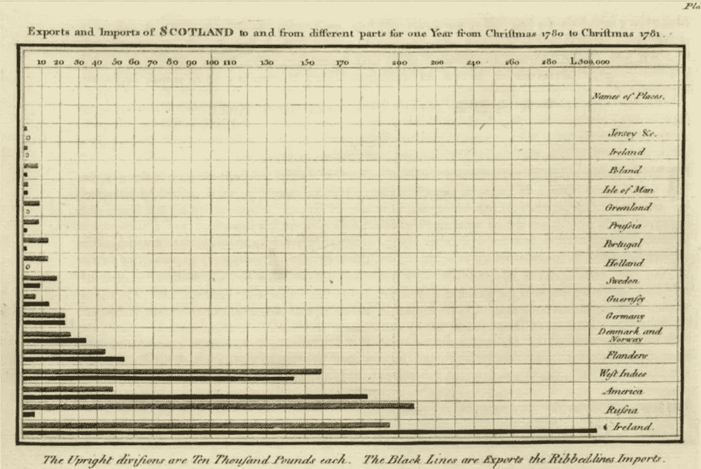
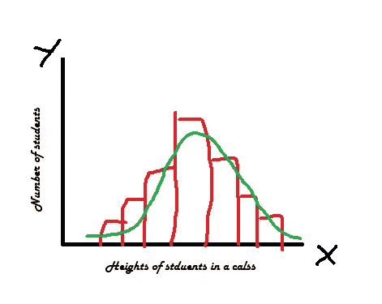
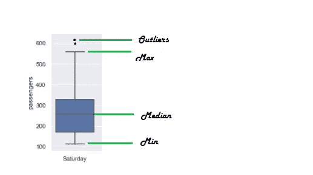
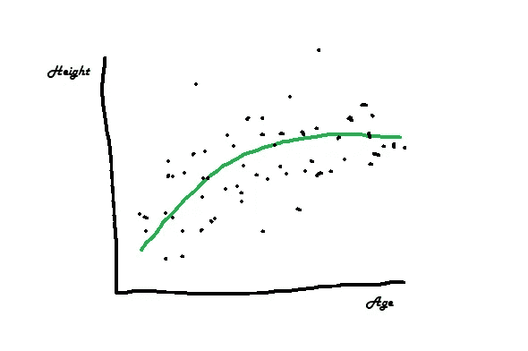
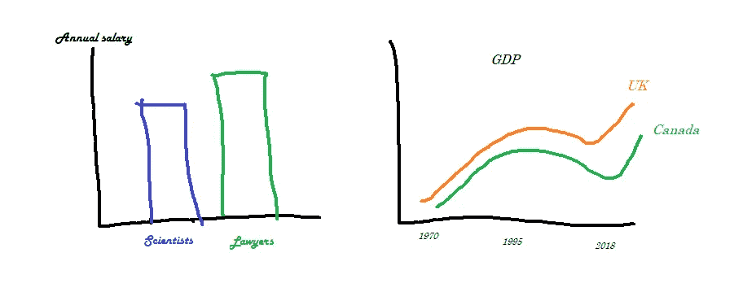
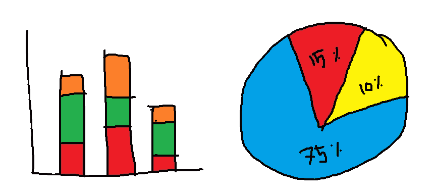

# 数据可视化的 4 大支柱:分布、关系、组合和比较

> 原文：<https://towardsdatascience.com/4-pillars-of-data-visualization-distribution-relationship-composition-comparison-935cf9248f97?source=collection_archive---------12----------------------->

在 [Unsplash](https://unsplash.com?utm_source=medium&utm_medium=referral) 上由 [Kelli Tungay](https://unsplash.com/@kellitungay?utm_source=medium&utm_medium=referral) 拍摄的照片

## 数据可视化的原理

几个世纪前，科学家们没有照相机来拍摄遥远的星系或显微镜下的微小细菌。绘画是交流观察、想法甚至理论的主要媒介。事实上，绘制抽象概念和物体的能力是科学家的一项基本技能(查看[威廉·普莱费尔](https://en.wikipedia.org/wiki/William_Playfair)18 世纪的收藏)。

显示苏格兰进出口的条形图(威廉·普莱费尔:公共领域)

现在依然如此。我们不能拍摄分布变量或它们的相关性。相反，我们通过现代工具和技术，通过绘图和插图(也称为数据可视化)来传达它们。

数据集包含一个或多个变量，我们可以以多种方式可视化每个变量及其与其他变量的交互。选择哪种可视化取决于数据和我们想要交流的信息类型。然而，从根本上说，它们有四种不同的类型:

*   **单变量的分布**
*   **两个变量之间的关系**
*   **单个或多个变量的组成**
*   **不同类别/个人之间的比较**

在本文中，我将通过插图来分解数据可视化的这 4 个基石。

# **1)分配**

统计学和数据科学中的一个重要概念是分布。分布一般指一个结果发生的概率。在 100 次抛硬币的分配中，有多少次是正面，多少次是反面？像这样的频率分布用直方图或曲线表示。

下面是游泳课上学生身高分布的示意图。x 轴显示不同的身高类别，y 轴显示每个类别的学生人数。

学生身高频率分布(图:作者)

这是一个频率分布。但还有另一种分布——更广为人知的是分散——它显示了一个变量相对于其中心趋势是如何分散/扩散的。

离差的一个经典表示是箱线图。

分解箱线图以显示变量值的离差

上面的箱线图代表了几年来周六飞机乘客数量的分布。这张图揭示了如此多的信息——周六乘客的平均/中值数量、最小值和最大值、异常值等等！

# **2)**关系

树木在早年随着年龄的增长而长高。这是两个变量之间的关系——身高和年龄。

*身高= f(年龄)*

在另一个例子中，房子的价格取决于床的数量、浴室的数量、位置、面积等等。这是一个因变量和许多解释变量之间的关系。

*价格= f(床位、浴室、位置、面积)*

如果你只把数据集看成数字，就没有办法识别这些关系。但事实上，你可以，不需要进入复杂的统计分析，借助于一个好的可视化。

一个班学生年龄与身高的关系

# **3)**比较

数据可视化的第三个基石是*比较。*这种可视化材料比较数据集内的多个变量或单个变量内的多个类别。

让我们来看看下面两张图片:

展示对比的视觉效果

左边的一个在条形图上比较了两组观察结果(科学家和律师)之间的变量(工资)。右边的面板也是一个比较图表——在这种情况下，比较两组(英国和加拿大)之间的变量(GDP ),但沿着时间维度。

# **4)**作文

你听说过堆积条形图吗？但我相信你知道什么是饼状图。

这些图表的目的是以绝对数和标准化形式(如百分比)显示一个或多个变量的构成。

合成图是一些老派的可视化技术，现在的用例有限(你真的需要一个饼图来显示黄色 10%和红色 15%的合成吗？).尽管如此，有时他们能以一种视觉上的美感和熟悉的、复古的方式呈现信息。

合成图:堆积条形图(左)和饼图(右)

# 一锤定音

本文的目的是讨论数据可视化的四个基石:分布、关系、比较和组合。在学习可视化工具和技术之前，理解可视化的目的是什么以及你想要传达什么信息是很重要的。在以后的文章中，我将会写关于 python 和 R 编程语言中的特定工具，包括`matplotlib`、`seabon`和`ggplot2`。敬请期待！

[注:除了作者绘制的第一幅图之外，所有图]