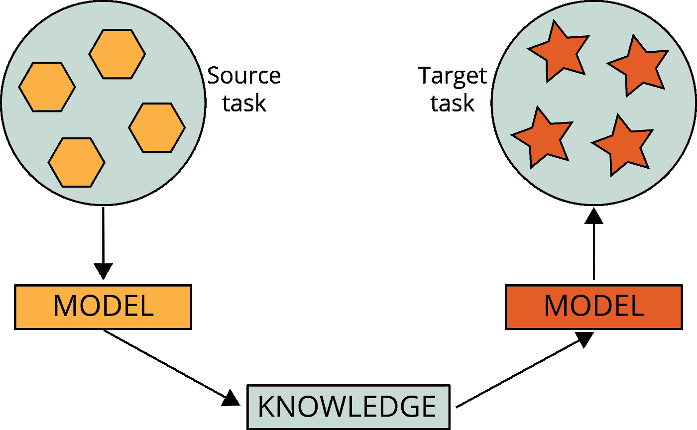
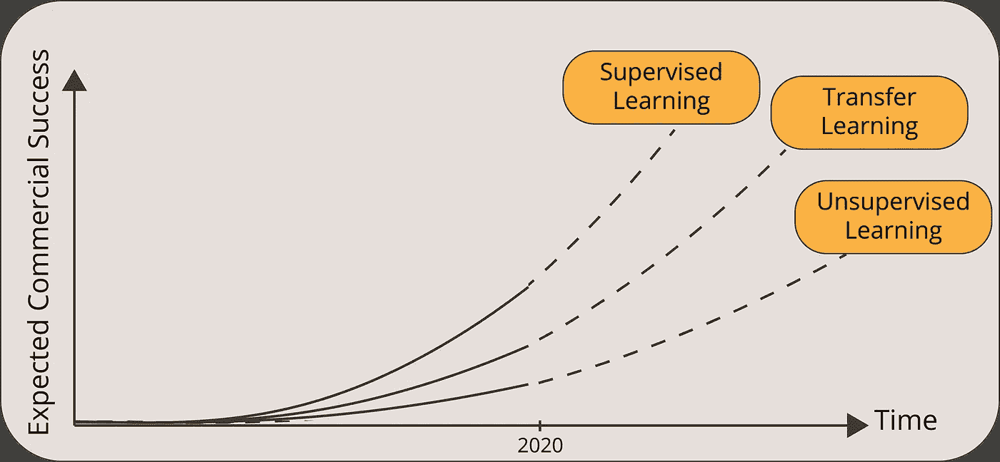
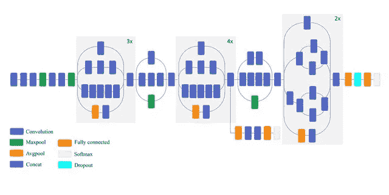
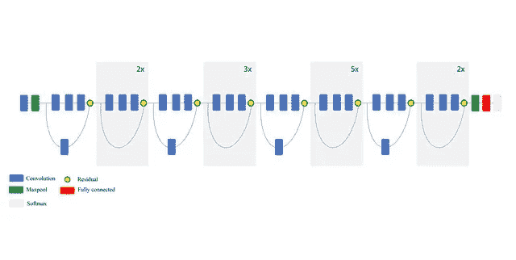
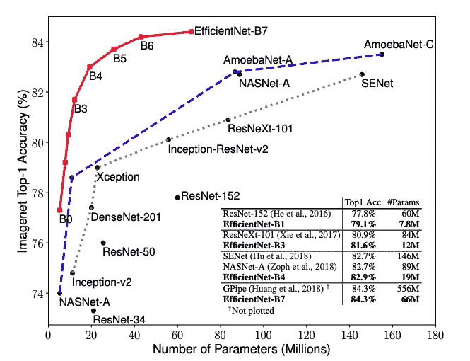

# 4 个预训练的 CNN 模型，用于具有迁移学习的计算机视觉

> 原文：<https://towardsdatascience.com/4-pre-trained-cnn-models-to-use-for-computer-vision-with-transfer-learning-885cb1b2dfc?source=collection_archive---------0----------------------->

## 深度学习案例研究

## 使用最先进的预训练神经网络模型，通过迁移学习解决计算机视觉问题

在我们开始之前，如果你正在阅读这篇文章，我确信我们有着相似的兴趣，并且现在/将来会从事相似的行业。那么我们就通过 [*Linkedin*](https://linkedin.com/in/orhangaziyalcin/) *来连线吧！请不要犹豫发送联系请求！*[*Orhan g . yaln—Linkedin*](https://linkedin.com/in/orhangaziyalcin/)

图一。迁移学习如何工作(图片由作者提供)

## 如果你一直在尝试建立高精度的机器学习模型；但从未尝试过迁移学习，这篇文章将改变你的生活。至少，它做到了我的！

我们大多数人已经尝试了几个机器学习教程来掌握神经网络的基础知识。这些教程非常有助于理解人工神经网络的基础知识，例如[递归神经网络](/using-recurrent-neural-networks-to-predict-bitcoin-btc-prices-c4ff70f9f3e4)、[卷积神经网络](/image-classification-in-10-minutes-with-mnist-dataset-54c35b77a38d)、 [GANs](/image-generation-in-10-minutes-with-generative-adversarial-networks-c2afc56bfa3b) 和[自动编码器](/image-noise-reduction-in-10-minutes-with-convolutional-autoencoders-d16219d2956a)。但是，它们的主要功能是让您为现实世界的实现做好准备。

现在，如果你计划建立一个利用深度学习的人工智能系统，你要么(I)必须有非常大的培训预算和优秀的人工智能研究人员供你使用，要么(ii)必须从迁移学习中受益。

# 什么是迁移学习？

迁移学习是机器学习和人工智能的一个分支，旨在将从一个任务(源任务)获得的知识应用到一个不同但相似的任务(目标任务)。

例如，在学习维基百科文本分类时获得的知识可以用来解决法律文本分类问题。另一个例子是使用在学习分类汽车时获得的知识来识别天空中的鸟。正如你所看到的，这些例子之间是有联系的。我们没有在鸟类检测上使用文本分类模型。

> 

总之，迁移学习是一个 ***让你不必重新发明轮子*** 并帮助你在很短的时间内构建人工智能应用的领域。

图二。不要重新发明轮子，转移现有的知识(照片由乔恩·卡塔赫纳[在](https://unsplash.com/@cartega?utm_source=unsplash&utm_medium=referral&utm_content=creditCopyText) [Unsplash](https://unsplash.com/s/photos/wheel?utm_source=unsplash&utm_medium=referral&utm_content=creditCopyText) 上拍摄)

# 迁移学习的历史

为了展示迁移学习的力量，我们可以引用吴恩达的话:

> [迁移学习将是继监督学习之后，机器学习商业成功的下一个驱动力。](https://www.youtube.com/watch?v=wjqaz6m42wU)

迁移学习的历史可以追溯到 1993 年。在她的论文[中，Lorien Pratt 打开了潘多拉的盒子，向世界展示了迁移学习的潜力。1997 年 7 月，《机器学习》杂志](http://papers.neurips.cc/paper/641-discriminability-based-transfer-between-neural-networks.pdf)[发表了一篇](https://www.springer.com/journal/10994)[专刊](https://link.springer.com/journal/10994/28/1/page/1)进行转移学习的论文。随着该领域的发展，多任务学习等相关主题也被纳入迁移学习领域。[学会学习](https://www.springer.com/gp/book/9780792380474)是这方面的先驱书籍之一。今天，迁移学习是科技企业家构建新的人工智能解决方案和研究人员推动机器学习前沿的强大来源。

图 3。吴恩达对机器学习子领域商业成功的期望(图片由作者提供)

# 迁移学习是如何工作的？

实现迁移学习有三个要求:

*   由第三方开发开源预训练模型
*   改变模型的用途
*   针对问题的微调

## 开发一个开源的预训练模型

预训练模型是由其他人创建和训练的模型，用于解决与我们类似的问题。在实践中，有人几乎总是一个科技巨头或一群明星研究员。他们通常选择一个非常大的数据集作为他们的基础数据集，如 [ImageNet](http://image-net.org/) 或[维基百科语料库](https://dumps.wikimedia.org/)。然后，他们创建一个大型神经网络(例如，VGG19 有 [143，667，240 个参数](https://keras.io/api/applications/))来解决一个特定的问题(例如，这个问题是 VGG19 的[图像分类](https://arxiv.org/pdf/1409.1556.pdf))。当然，这种预先训练好的模型必须公开，以便我们可以利用这些模型并重新调整它们的用途。

## 改变模型的用途

在得到这些预先训练好的模型后，我们重新利用学到的知识，包括层次、特征、权重和偏差。有几种方法可以将预先训练好的模型加载到我们的环境中。最终，它只是一个包含相关信息的文件/文件夹。然而，深度学习库已经托管了许多这些预训练的模型，这使得它们更容易访问和方便:

*   [TensorFlow Hub](https://www.tensorflow.org/hub)
*   [Keras 应用](https://keras.io/api/applications/)
*   [PyTorch 轮毂](https://pytorch.org/hub/)

您可以使用上面的来源之一来加载已训练的模型。它通常带有所有的层和权重，你可以随意编辑网络。

## 针对问题的微调

虽然目前的模型可能对我们的问题有效。由于以下两个原因，对预训练模型进行微调通常更好:

*   这样我们可以达到更高的精确度；
*   我们的微调模型可以以正确的格式生成输出。

一般来说，在神经网络中，底层和中间层通常表示一般特征，而顶层表示特定问题的特征。由于我们的新问题不同于原始问题，我们倾向于放弃顶层。通过针对我们的问题添加特定的层，我们可以实现更高的准确性。

放下顶层之后，我们需要放置我们自己的层，这样我们就可以得到我们想要的输出。例如，用 ImageNet 训练的模型可以分类多达 1000 个对象。如果我们试图对手写数字进行分类(例如， [MNIST 分类](/image-classification-in-10-minutes-with-mnist-dataset-54c35b77a38d))，最终得到只有 10 个神经元的最终层可能会更好。

在我们将自定义层添加到预训练模型后，我们可以使用特殊的损失函数和优化器对其进行配置，并通过额外的训练进行微调。

> 要获得快速转移学习教程，您可以访问下面的帖子:

 [## TensorFlow Hub & Magenta 在 5 分钟内实现快速神经风格转换

### 利用 Magenta 的任意图像风格化网络和深度学习，将梵高的独特风格转移到照片中

towardsdatascience.com](/fast-neural-style-transfer-in-5-minutes-with-tensorflow-hub-magenta-110b60431dcc) 

# 计算机视觉的 4 个预训练模型

下面是四个预先训练好的网络，您可以使用它们来完成计算机视觉任务，例如图像生成、神经类型转移、图像分类、图像字幕、异常检测等:

*   VGG19
*   第三版(谷歌网)
*   ResNet50
*   效率网

让我们一个一个地深入研究它们。

## VGG-19

VGG 是一个深度为 19 层的卷积神经网络。它是由牛津大学的卡伦·西蒙扬和安德鲁·齐泽曼在 2014 年构建和训练的，你可以访问他们在 2015 年发表的论文[大规模图像识别的超深度卷积网络](https://arxiv.org/pdf/1409.1556.pdf)中的所有信息。VGG-19 网络也使用来自 ImageNet 数据库的超过一百万幅图像进行训练。当然，您可以导入带有 ImageNet 训练权重的模型。这个预先训练好的网络可以对多达 1000 个对象进行分类。该网络在 224×224 像素的彩色图像上被训练。以下是关于其尺寸和性能的简要信息:

*   **大小:** 549 MB
*   **Top-1:** 准确率:71.3%
*   **前五名:**准确率:90.0%
*   **参数个数:**143667240
*   **深度:** 26

图 4。VGG-19 网络图(图由 [Clifford K. Yang](https://www.researchgate.net/profile/Clifford_Yang) 和 [Yufeng Zheng](https://www.researchgate.net/profile/Yufeng_Zheng) 在 [ResearchGate](https://www.researchgate.net/publication/325137356_Breast_cancer_screening_using_convolutional_neural_network_and_follow-up_digital_mammography) 上提供)

## 第三版(谷歌网)

Inceptionv3 是一个具有 50 层深度的卷积神经网络。它是由谷歌构建和训练的，你可以访问论文上的所有信息，标题是“[用卷积深入](https://arxiv.org/pdf/1409.4842.pdf)”。带有 ImageNet 权重的预训练版本的 Inceptionv3 可以对多达 1000 个对象进行分类。该网络的图像输入大小为 299x299 像素，大于 VGG19 网络。虽然 VGG19 在 2014 年的 ImageNet 比赛中获得亚军，但《盗梦空间》却获得了冠军。Inceptionv3 特性的简要总结如下:

*   **大小:** 92 MB
*   **Top-1:** 准确率:77.9%
*   **前五名:**准确率:93.7%
*   **参数个数:**23851784
*   **深度:** 159

图 5。Inceptionv3 网络图(图由 [Masoud Mahdianpari](https://www.researchgate.net/profile/Masoud_Mahdianpari) 、 [Bahram Salehi](https://www.researchgate.net/profile/Bahram_Salehi?_sg%5B0%5D=XVPUbjpBrkCmamnUeM5V3Bag4mOrrNkwZxuERGs67V10CIeThkt8REeWTKRve6zgW1bXs84.XLl-e8MR_C_AQFQqx6r3SRyac-xCqMH-eNwXtOuBwDdMW063NsTbPLBiIzp-hbbzf1NsQ6PhRtdUheI7cpee8g&_sg%5B1%5D=q4Cr5rl6btOnicAanokPQKqAzx9b0Ma0OMc6ppXeTrfyZ8Vc0pf0N4vMnxfowGYQpwusZN8.tIFdpj6W4XluchmSqfN1dI38dsRgFHQXBFNYg8y2ckCFavRwOYgnska6Cotvl2q0WDtN0dXllrEokDp8zAngPg) 和 [Mohammad Rezaee](https://www.researchgate.net/scientific-contributions/2144549279-Mohammad-Rezaee?_sg%5B0%5D=XVPUbjpBrkCmamnUeM5V3Bag4mOrrNkwZxuERGs67V10CIeThkt8REeWTKRve6zgW1bXs84.XLl-e8MR_C_AQFQqx6r3SRyac-xCqMH-eNwXtOuBwDdMW063NsTbPLBiIzp-hbbzf1NsQ6PhRtdUheI7cpee8g&_sg%5B1%5D=q4Cr5rl6btOnicAanokPQKqAzx9b0Ma0OMc6ppXeTrfyZ8Vc0pf0N4vMnxfowGYQpwusZN8.tIFdpj6W4XluchmSqfN1dI38dsRgFHQXBFNYg8y2ckCFavRwOYgnska6Cotvl2q0WDtN0dXllrEokDp8zAngPg) 在 [ResearchGate](https://www.researchgate.net/publication/326421398_Very_Deep_Convolutional_Neural_Networks_for_Complex_Land_Cover_Mapping_Using_Multispectral_Remote_Sensing_Imagery) 上提供)

## ResNet50(剩余网络)

ResNet50 是一个深度为 50 层的卷积神经网络。它是由微软在 2015 年建立和训练的，你可以在他们题为[图像识别的深度剩余学习](http://Deep Residual Learning for Image Recognition)的论文中访问模型性能结果。该模型还在来自 ImageNet 数据库的超过 100 万幅图像上进行训练。就像 VGG-19 一样，它可以分类多达 1000 个物体，网络是在 224x224 像素的彩色图像上训练的。以下是关于其尺寸和性能的简要信息:

*   **大小:** 98 MB
*   **Top-1:** 准确率:74.9%
*   **前五名:**准确率:92.1%
*   **参数个数:**25636712

如果您将 ResNet50 与 VGG19 进行比较，您会发现 ResNet50 实际上优于 VGG19，尽管它的复杂性更低。ResNet50 经过多次改进，您还可以获得更新的版本，如 [ResNet101](https://keras.io/api/applications/resnet/#resnet101-function) 、 [ResNet152](https://keras.io/api/applications/resnet/#resnet152-function) 、 [ResNet50V2](https://keras.io/api/applications/resnet/#resnet50v2-function) 、 [ResNet101V2](https://keras.io/api/applications/resnet/#resnet101v2-function) 、 [ResNet152V2](https://keras.io/api/applications/resnet/#resnet152v2-function) 。

图 6。ResNet50 网络的图解(图由[马苏德·马赫迪安帕里](https://www.researchgate.net/profile/Masoud_Mahdianpari)、[巴赫拉姆·萨利希](https://www.researchgate.net/profile/Bahram_Salehi?_sg%5B0%5D=XVPUbjpBrkCmamnUeM5V3Bag4mOrrNkwZxuERGs67V10CIeThkt8REeWTKRve6zgW1bXs84.XLl-e8MR_C_AQFQqx6r3SRyac-xCqMH-eNwXtOuBwDdMW063NsTbPLBiIzp-hbbzf1NsQ6PhRtdUheI7cpee8g&_sg%5B1%5D=q4Cr5rl6btOnicAanokPQKqAzx9b0Ma0OMc6ppXeTrfyZ8Vc0pf0N4vMnxfowGYQpwusZN8.tIFdpj6W4XluchmSqfN1dI38dsRgFHQXBFNYg8y2ckCFavRwOYgnska6Cotvl2q0WDtN0dXllrEokDp8zAngPg)和[穆罕默德·雷扎伊](https://www.researchgate.net/scientific-contributions/2144549279-Mohammad-Rezaee?_sg%5B0%5D=XVPUbjpBrkCmamnUeM5V3Bag4mOrrNkwZxuERGs67V10CIeThkt8REeWTKRve6zgW1bXs84.XLl-e8MR_C_AQFQqx6r3SRyac-xCqMH-eNwXtOuBwDdMW063NsTbPLBiIzp-hbbzf1NsQ6PhRtdUheI7cpee8g&_sg%5B1%5D=q4Cr5rl6btOnicAanokPQKqAzx9b0Ma0OMc6ppXeTrfyZ8Vc0pf0N4vMnxfowGYQpwusZN8.tIFdpj6W4XluchmSqfN1dI38dsRgFHQXBFNYg8y2ckCFavRwOYgnska6Cotvl2q0WDtN0dXllrEokDp8zAngPg)在[研究之门](https://www.researchgate.net/publication/326421398_Very_Deep_Convolutional_Neural_Networks_for_Complex_Land_Cover_Mapping_Using_Multispectral_Remote_Sensing_Imagery)上提供)

## 效率网

EfficientNet 是一个最先进的卷积神经网络，由谷歌在 2019 年通过论文“ [EfficientNet:反思卷积神经网络的模型缩放](https://arxiv.org/pdf/1905.11946.pdf)”进行训练并向公众发布。EfficientNet (B0 到 B7)有 8 个备选实现，即使是最简单的一个，EfficientNetB0 也很出色。它拥有 530 万个参数，实现了 77.1%的顶级精度性能。

图 7。EfficientNet 模型大小与 ImageNet 精度(由 [Mingxing Tan](https://scholar.google.com/citations?user=6POeyBoAAAAJ&hl=en) 和 [Quoc V. Le](https://scholar.google.com/citations?user=vfT6-XIAAAAJ&hl=en) 在 [Arxiv](https://arxiv.org/pdf/1905.11946.pdf) 上绘制)

EfficientNetB0 功能的简要概述如下:

*   **大小:** 29 MB
*   **前 1 名:**准确率:77.1%
*   前五名:准确率:93.3%
*   **参数个数:**~ 530 万
*   **深度:** 159

## 计算机视觉问题的其他预训练模型

我们列出了四个一流的获奖卷积神经网络模型。然而，还有许多其他模式可用于迁移学习。以下是对这些模型的基准分析，这些模型都可以在 [Keras 应用](https://keras.io/api/applications/)中找到。

表 1。预训练 CNN 模型的基准分析(作者列表)

# 结论

在一个我们可以轻松获得最先进的神经网络模型的世界里，试图用有限的资源建立自己的模型就像试图重新发明轮子一样。这毫无意义。

相反，尝试使用这些训练模型，考虑到您特定的计算机视觉任务，在顶部添加几个新层，然后进行训练。结果会比你从零开始建立的模型更成功。

# 订阅邮件列表获取完整代码

如果你想在 Google Colab 上获得完整的代码，并获得我的最新内容，请订阅邮件列表:✉️

> [现在就订阅](http://eepurl.com/hd6Xfv)

# 喜欢这篇文章吗？

如果你喜欢这篇文章，可以考虑看看我的其他类似文章:

 [## 使用 MNIST 数据集在 10 分钟内完成图像分类

towardsdatascience.com](/image-classification-in-10-minutes-with-mnist-dataset-54c35b77a38d)  [## TensorFlow 和 VGG19 可以帮助您将照片转换成美丽的波普艺术作品

### 神经风格转移基于安迪沃霍尔的门罗双联画与预训练的计算机视觉网络 VGG19，转移…

towardsdatascience.com](/tensorflow-and-vgg19-can-help-you-convert-your-photos-into-beautiful-pop-art-pieces-c1abe87e7e01)  [## 利用生成性对抗网络在 10 分钟内生成图像

### 使用无监督深度学习生成手写数字与深度卷积甘斯使用张量流和…

towardsdatascience.com](/image-generation-in-10-minutes-with-generative-adversarial-networks-c2afc56bfa3b)  [## 伯特和拥抱脸 10 分钟情感分析

### 学习预训练的自然语言处理模型的基础，伯特，并建立一个使用 IMDB 电影评论的情感分类器…

towardsdatascience.com](/sentiment-analysis-in-10-minutes-with-bert-and-hugging-face-294e8a04b671)