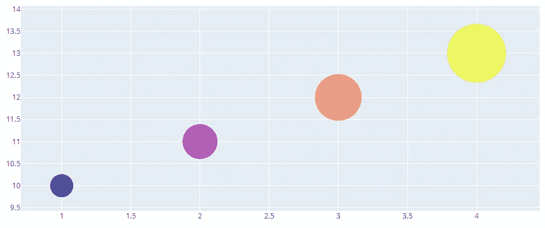
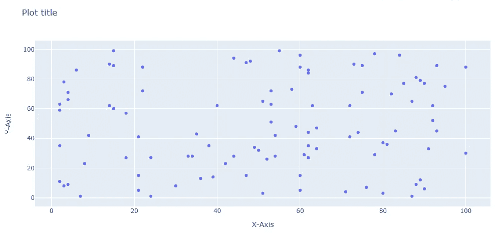

# 我选择 Plotly 作为我的主要可视化库的 4 个原因

> 原文：<https://towardsdatascience.com/4-reasons-why-im-choosing-plotly-as-the-main-visualization-library-dc4a961a402f?source=collection_archive---------11----------------------->

## 把你的想象带到 21 世纪

选择一个完美的数据可视化平台可能很难，因为这在很大程度上取决于你最擅长哪种编程语言，或者你是否愿意使用编程语言来进行可视化——因为这不是强制性的。


在一个有如此多优秀绘图库的世界里——特别是对于 JavaScript 用户——今天我将向你解释为什么我选择了 **Plotly** 而不是其他任何东西。

这可能不是你会同意的事情，但是给我几分钟时间来通读这些论点——这是值得的。

在开始之前，我只想说，我没有以任何方式，形状或形式与 Plotly 背后的开发人员有任何关系，也没有参与开发。这篇文章纯粹基于**的个人经验**，旨在帮助你为你的项目选择一个完美的可视化库。

话虽如此，让我们进入你在这里的原因。

# #1.是 Python

现在，只有当你已经了解 Python 时，你才会认为这是一个好处——但是既然你正在阅读一个数据科学博客，我想你也是。

Python 的语法清晰、干净、易于使用，Plotly 也不例外。看看生成一个简单的**气泡图**需要多少代码:

```
import plotly.graph_objects as go
fig = go.Figure(data=go.Scatter(
   x=[1, 2, 3, 4],
   y=[10, 11, 12, 13],
   mode=’markers’,
   marker=dict(size=[40, 60, 80, 100],
               color=[0, 1, 2, 3])
))
fig.show()
```

运行此代码将生成一个视觉上吸引人的图表，如下所示:



来自[文档](https://plot.ly/python/line-and-scatter/)

众所周知，我是 Python 语法的粉丝，但如果你不是，你仍然可以将 Plotly 与 *R* 和 *JavaScript* 一起使用。然而，让我们继续下一点。

# #2.它是互动的

如果您遵循了第一点并执行了所提供的代码，那么您已经意识到 Plotly 中的可视化是交互式的。


照片由 [Isaac Smith](https://unsplash.com/@isaacmsmith?utm_source=medium&utm_medium=referral) 在 [Unsplash](https://unsplash.com?utm_source=medium&utm_medium=referral) 上拍摄

如果您来自 JavaScript 背景，这可能对您来说不是一件大事，但是对于来自 Python 的任何人来说都是一件大事。通过`Matplotlib`制作的可视化效果不是交互式的，默认情况下看起来比 Plotly 的可视化效果差很多。

你不需要指定你希望你的图表是交互式的，但是你可以调整鼠标悬停时的可见性。

在后面的文章中会有更多的介绍，在这个 Plotly 系列中还会有更多的介绍。

# #3.清晰语法

您的 Plotly 图表将有一个`Figure`对象，填充有:

*   `Data`对象
*   `Layout`对象

正如您可能想到的，您将把制作图表的数据放在`data`中，在`layout`中，您将指定图表应该是什么样子。让我们看一个例子。

先来做几个**进口**:

```
import numpy as np
np.random.seed(42)
import plotly.offline as pyo
import plotly.graph_objs as go
```

现在让我们定义将进入图表的**数据**:

```
x = np.random.randint(1, 101, 100)
y = np.random.randint(1, 101, 100)data = [go.Scatter(
    x=x,
    y=y,
    mode='markers',
)]
```

就是这样。这将根据 x 轴和 y 轴上的随机整数创建散点图。现在让我们定义**布局**:

```
layout = go.Layout(
    title=’Plot title’,
    xaxis=dict(title=’X-Axis’),
    yaxis=dict(title=’Y-Axis’),
    hovermode=’closest’
)
```

现在让我们把所有的东西都放到一个`Figure`对象中，然后绘制它:

```
fig = go.Figure(data=data, layout=layout)
pyo.plot(fig)
```

如果你问我，这是数据可视化所能做到的最干净的了。如果您将这段代码放入一个单独的`.py`脚本中并运行它，可视化将被保存为一个`html`文件并自动在您的浏览器中打开:



不算太差，但是我们将在下面的文章中更深入地探讨样式。

# #4.仪表板

如果你知道一些基本的 HTML 和 CSS，那么将多个图表合并到一个单一的、好看的仪表板中是非常容易的。


[卡洛斯·穆扎](https://unsplash.com/@kmuza?utm_source=medium&utm_medium=referral)在 [Unsplash](https://unsplash.com?utm_source=medium&utm_medium=referral) 上的照片

Plotly 图表可以与`Dash`整合，这是一个构建**网络应用**的框架。

这里有一段来自官方文档:

> Dash 基于 Flask、Plotly.js 和 React.js 编写，非常适合用纯 Python 构建具有高度自定义用户界面的数据可视化应用程序。它特别适合任何使用 Python 处理数据的人。

这个`React`部分将把你的应用程序转变成一个**单页应用程序**，这意味着点击内容时不会有那些尴尬的刷新。所有这些都是在不了解任何网络开发的情况下完成的。太棒了。

我们现在不会深入仪表板开发，但是以后很少有文章会深入讨论它。

如果你迫不及待地想看看用`Dash`能制作出什么，这里有官方的**图库**:

 [## Dash 企业

### Dash 企业

dash enterprise dash-gallery . plot ly . host](https://dash-gallery.plotly.host/Portal/) 

# 在你走之前

我对查看表格数据非常满意。但是我工作的很大一部分是向他人展示调查结果和结论，每次展示图表都是一种有效得多的方法。

在接下来的一个月左右的时间里，我决定发表 10 篇左右的文章，这些文章将从上到下地详细介绍，确保数据可视化不会成为你未来痛苦的过程。

感谢阅读，敬请关注。

喜欢这篇文章吗？成为 [*中等会员*](https://medium.com/@radecicdario/membership) *继续无限制学习。如果你使用下面的链接，我会收到你的一部分会员费，不需要你额外付费。*

[](https://medium.com/@radecicdario/membership) [## 通过我的推荐链接加入 Medium-Dario rade ci

### 作为一个媒体会员，你的会员费的一部分会给你阅读的作家，你可以完全接触到每一个故事…

medium.com](https://medium.com/@radecicdario/membership)