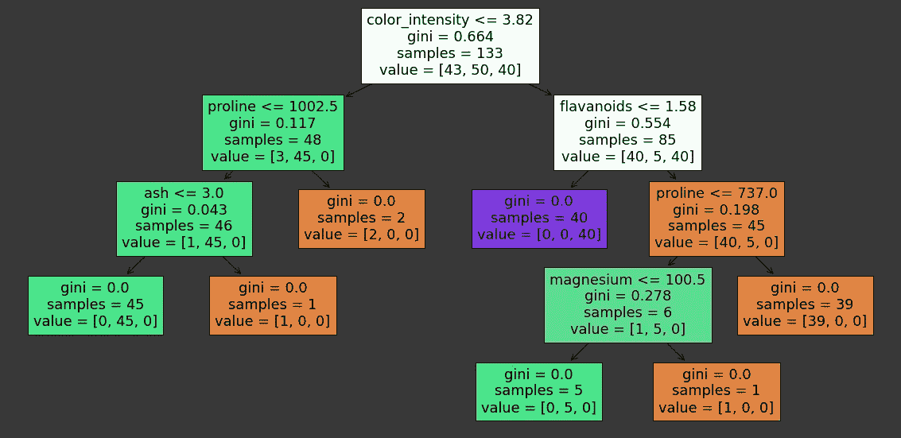
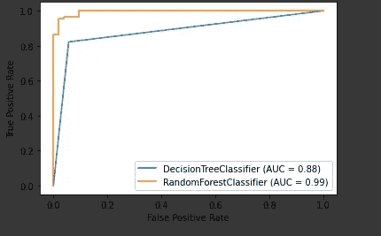
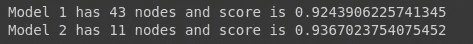
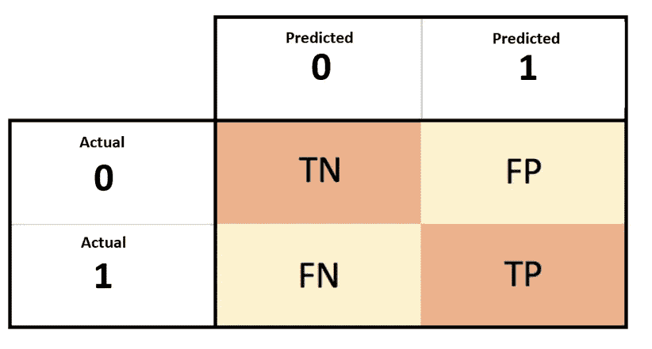
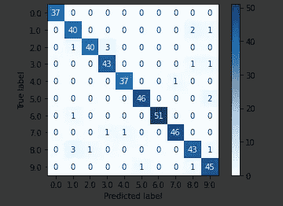

# 每个数据科学家都应该知道的 4 个简单技巧。

> 原文：<https://towardsdatascience.com/4-simple-hacks-every-data-scientist-should-know-45928b3dda37?source=collection_archive---------52----------------------->

## 机器学习技巧/窍门

## 这些技巧肯定会在任何项目中节省你的时间，并提高你的工作效率。


照片由[🇸🇮·扬科·菲利](https://unsplash.com/@itfeelslikefilm?utm_source=medium&utm_medium=referral)在 [Unsplash](https://unsplash.com?utm_source=medium&utm_medium=referral) 上拍摄

T ***通过这篇文章，我们将了解一些简单的技巧，它们可以真正提高您的机器学习、人工智能或数据科学项目的生产率。📔***

*希望你喜欢！！😊*

# **1。树木的可视化**

在使用任何机器学习模型时，我们只知道哪个模型将适合数据集来解决特定问题，并且基于数据集，我们通过一些数学/逻辑推理来设置模型的参数。该模型工作完全正常，符合目的。但是没人关心黑盒里有什么。听起来没那么吸引人，对吧？对于任何一个树模型来说都不是。让我们看看如何可视化黑盒。

我们将导入一些必要的库来设置我们自己的任务！

```
from sklearn.model_selection import train_test_split
from sklearn.tree import DecisionTreeClassifier,plot_tree
from sklearn.datasets import load_wine
import matplotlib.pyplot as plt
import numpy as np
import pandas as pd
```

为此，我们将使用著名的葡萄酒数据集。将数据集加载到 Pandas 数据框中，并分离为预测变量和响应变量。

```
wine=load_wine()df = pd.DataFrame(data= np.c_[wine['data'], wine['target']],
                   columns= wine['feature_names'] + ['target'])X = df.drop('target',axis=1)
y = df["target"]features = df.columns[:-1].values.tolist()
```

将数据分成训练集和测试集，选择适当的模型并拟合该模型。

```
X_train, X_test, y_train, y_test = train_test_split(X, y,random_state = 2020)model = DecisionTreeClassifier()distinguish between two thingsmodel.fit(X_train, y_train)
```

我们将使用 sklearn 的库。(*导入 sklearn.tree.plot_tree* )

```
plt.figure(figsize = (20, 10))
plot_tree(model, feature_names = features, filled = True)
```



来源:我的谷歌 Colab 笔记本

它告诉我们关于样本(元组的数量)、每个节点中的特征、节点的数量、我们制作树的标准(这里，默认情况下，我们使用基尼指数)。

更多细节和示例请参考[文件](https://scikit-learn.org/stable/modules/tree.html#tree)。

# **2。**在单个图中绘制 ROC 曲线

ROC ( *受试者操作特征*)曲线告诉我们该模型在将班级分成两个或更多个班级方面有多好。更好的模型可以准确地区分两者或更多。然而，一个差的模型将很难在两者之间进行分离。更多细节请参考[文章](/understanding-the-roc-and-auc-curves-a05b68550b69)。

导入一些必需的库

```
from sklearn.model_selection import train_test_split
from sklearn.metrics import plot_roc_curve
from sklearn.ensemble import RandomForestClassifier
from sklearn.tree import DecisionTreeClassifier
from sklearn.datasets import load_breast_cancer
```

为此，我们将使用乳腺癌数据集。将数据集加载到 Pandas 数据框中，并分离为预测变量和响应变量。

```
db=load_breast_cancer()
df = pd.DataFrame(data= np.c_[db['data'], db['target']])df=df.rename(columns={30:'target'})X = df.drop('target',axis=1)
y = df['target']
```

将数据分成训练集和测试集，选择适当的模型并拟合该模型。

```
X_train, X_test, y_train, y_test = train_test_split(X, y, random_state = 0)dt = DecisionTreeClassifier()
rf = RandomForestClassifier()dt.fit(X_train, y_train)
rf.fit(X_train, y_train)
```

使用*sk learn . metrics . plot _ roc _ curve*库显示图形。

```
disp = plot_roc_curve(dt, X_test, y_test)
plot_roc_curve(rf, X_test, y_test, ax = disp.ax_)
```



来源:我的谷歌 Colab 笔记本

我们可以看到两个分类器之间的 ROC 曲线以及 AUC 分数。随机森林分类器的 AUC 大于决策树分类器，因此随机森林分类器比决策树分类器更合适。

更多细节和示例请参考[文档](https://scikit-learn.org/stable/modules/generated/sklearn.metrics.plot_roc_curve.html?highlight=sklearn%20metric%20plot_roc_curve#sklearn-metrics-plot-roc-curve)。

# **3。修剪决策树**

当在某些数据集上训练决策树时，我们经常过度拟合训练集，因此我们的模型在测试集上的精度较低。这个问题可以通过修剪树的方法来解决。这种修剪过的树比没有修剪过的树表现更好。有不同的方法可以用来修剪树木。它们是后剪枝、前剪枝、成本复杂性剪枝，我们将对我们的模型使用成本复杂性剪枝。

DecisionTreeClassifier 提供了各种参数来防止树过度拟合。其中一个是成本复杂度参数，***CCP _ 阿尔法*** 。***CCP _ 阿尔法*** 的值越大，修剪的节点数越多。这里我们只展示了***CCP _ 阿尔法*** 对正则化树的影响，以及如何根据验证分数选择一个***CCP _ 阿尔法*** 。

```
from sklearn.model_selection import cross_val_score
from sklearn.model_selection import train_test_split
from sklearn.tree import DecisionTreeClassifier
from sklearn.datasets import load_breast_cancerdb=load_breast_cancer()df = pd.DataFrame(data= np.c_[db['data'], db['target']])df=df.rename(columns={30:'target'})X = df.drop('target',axis=1)
y = df['target']
```

型号 1。(*此处 Random_state 是为了再现性*)

```
model = DecisionTreeClassifier(random_state = 2020)model.fit(X, y)score = cross_val_score(model, X, y, scoring = "accuracy")
print("Model 1 has {} nodes and score is {}".format(model.tree_.node_count, score.mean()))
```

型号 2 的***CCP _ 阿尔法*** 值等于 0.01

```
model = DecisionTreeClassifier(ccp_alpha = 0.01, random_state = 2020)model.fit(X, y)score = cross_val_score(model, X, y, scoring = "accuracy")
print("Model 2 has {} nodes and score is {}".format(model.tree_.node_count, score.mean()))
```



来源:我的谷歌 Colab 笔记本

注意，分数上升了。修剪树木有很多好处，主要的好处是减少过度修剪。

更多细节和示例，请参考[文档](https://scikit-learn.org/stable/auto_examples/tree/plot_cost_complexity_pruning.html)。

# 4.情节混乱矩阵



[来源](https://subscription.packtpub.com/book/big_data_and_business_intelligence/9781838555078/6/ch06lvl1sec34/confusion-matrix)

混淆矩阵，名字本身就包含了混淆在里面。为什么会这样呢？第一次理解时，这个问题的答案似乎令人困惑，但一旦你理解了，它肯定会帮助你对你的模型做出一个富有成效的决定。更多细节请参考[文章](/understanding-confusion-matrix-a9ad42dcfd62)。

*注意:-在任何其他来源中，混淆矩阵的表示可以不同。*

导入一些必要的库

```
from sklearn.model_selection import train_test_split
from sklearn.metrics import plot_confusion_matrix
from sklearn.linear_model import LogisticRegression
from sklearn.datasets import load_digits
```

为此，我们将使用数字数据集。将数据集加载到 Pandas 数据框中，并分离为预测变量和响应变量。

```
db=load_digits()df = pd.DataFrame(data= np.c_[db['data'], db['target']])df=df.rename(columns={64:'target'})X = df.drop('target',axis=1)y = df['target']
```

将数据分成训练集和测试集，选择适当的模型并拟合该模型。

```
X_train, X_test, y_train, y_test = train_test_split(X, y, random_state = 0)model = LogisticRegression(random_state = 2020)model.fit(X_train, y_train)disp = plot_confusion_matrix(model, X_test, y_test, cmap = "Blues")
```



来源:我的谷歌 Colab 笔记本

更多细节和示例请参考[文档](https://scikit-learn.org/stable/modules/generated/sklearn.metrics.plot_confusion_matrix.html?highlight=confusion%20metrics#sklearn-metrics-plot-confusion-matrix)。

我相信这个技巧对你会有用，你会从这篇文章中有所收获。直到那时快乐编码！。