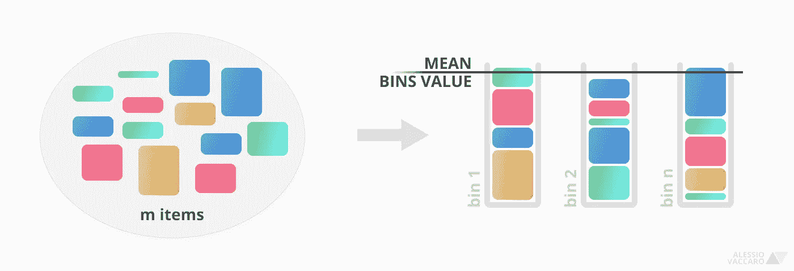
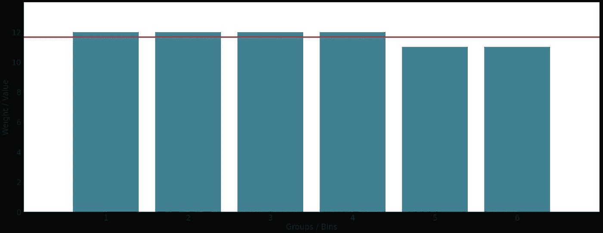

# 用 Python 和 Bin 打包轻松分配资源的🧱 4 步骤

> 原文：<https://towardsdatascience.com/4-steps-to-easily-allocate-resources-with-python-bin-packing-5933fb8e53a9?source=collection_archive---------22----------------------->

## *瞬间解决一维资源分配问题*


*【图片由作者提供】*

*在本文中，我们将使用 Python 和 binpacking 包来解决一个最常见的 NP-hard 问题:Bin Packing 问题。* 🗑️

*具体来说，通过贪婪的方法，我们将根据价值/分数在 n 个项目上分配 m 个资源。开始吧！*

# 0.问题的简要介绍

假设您有 ***m*** 个不同重量(*或值*)的物品，您需要将这些物品放入 ***n*** 个相等的平衡箱(*图 1* )。

💡这就是通常所说的 ***箱柜装箱问题*** 。

*BPP* 被计算复杂性理论归类为 *NP-hard 问题*，简而言之，其难度不亚于在 ***N*** *非确定性* ***P*** *多项式*时间 *NP 问题*中最难解决的问题。

*很简单，不是吗？* …🤔



图 1-小心:尽管使用了多边形，但问题仍然是一维的，因为所有矩形的宽度都是相同的。*【图片作者】*

虽然这些话看似近乎理解(*我可以向你发誓前面的句子*没有打字错误)，但是 ***装箱问题在日常生活中经常发生*** 。

以下是一些例子:

*   🛒:你在超市。你刚刚付了款，你要把所有的 ***m*** *产品*放在数量最少的 ***n*** 袋子里，尽量装得满满的，均衡的。
*   👔你是一个*项目经理*，需要*人员* ***m*** *资源*进行 ***n*** 项目。假设同样复杂的项目，你的目标将- *可能-* 是通过了解你的资源的估计贡献值来实现平衡的团队。
*   🚣‍♂️:你正计划和几个朋友去乘船旅行。不幸的是，船是有最大载重量的。你必须将你的 m 个朋友平均分配到由你支配的 n 艘船上。

是的。顾名思义 ***每当我们要用别的东西*** 来“填充”某物的时候，装箱问题就出现了。
正如你所想象的，有 *n* 维变量，这些变量考虑了其他有用的信息，如 ***体积*** 或 ***成本*** ( *背包问题*)。

# 1.摆桌子的时间到了:打包

让我们开始预热引擎。我们将只使用这两个包:

*   ***matplotlib*** :超流行的可视化软件包；
*   ***binpacking*** :一个贪心的 binpacking 问题求解器包；

要安装它们，只需在*命令提示符*中输入💻：

```
pip install binpacking matplotlib
```

*等你瞧*。搞定了。

# 2.导入包

现在让我们打开我们最喜欢的*笔记本*或者 *IDE* ，通过导入这两个包开始代码。

# 3.将笔放在纸上:参数

下面是我最喜欢的一个步骤: ***参数定义*** 。

🗑️让我们首先定义我们想要的 ***个仓*** 的数量，然后字典包含资源 的*估计/测量* ***值。***

我们将 ***21 个资源*** 分配给 ***6 个项目*** 的员工。👨‍👩‍👧‍👦

字典的每个关键字将对应于该资源的贡献值的估计。是的， ***一种分数的排序*** 。

# 4.打开箱子包装问题

考虑到在 *NP-hard* 问题、 ***中寻找最优解的极端复杂性，没有贪婪的方法*** 我们不可能成功。这里开始使用 *binpacking* package。

🧮贪婪算法允许以近似但可接受的方式找到困难问题的解决方案。简而言之，随着*贪婪*的逼近，**我们以牺牲问题的准确性**为代价来支付问题的解决方案。

好的，我喜欢。那是给我们的。 ✌️

该软件包的使用非常简单。

搞定了。难以置信的无痛。让我们试着 ***以不同的方式可视化结果*** 使用*列表理解*清除值。

**我们配备了所有资源**并创建了 6 个(*可能是*)平衡小组。

好了，不过现在 ***是时候看看算法表现如何了*** 。让我们看看这些群体之间是否真正平衡。

# 5.让我们探索结果

我们期望的是 6 个组，每个组的总值非常接近于总值除以组数的和。

这样就很容易计算出每组的 ***理想值*** 和每组的 ***值*****。**

**📊让我们试着给他们看看。**

**下面是图表: ***红色横线*** 代表每组 ***理想平均期望值***(*图 2* )。**

****

**图 2 -这是我们的垃圾箱。它们的值都在理想平均值(红线)左右。*【图片由作者提供】***

***Ta daa！正如我们所料，我们建立了 6 个平衡组*。每个组实际上都有一个非常接近理想值的分数。我认为目标已经达到。🥳****

**记住，事实上，我们得到的是一个与我们的问题兼容的 的 ***解，但是 ***不是最优的*** ，因为我们使用了一个*贪婪的*算法。*****

# *-1.结论*

*总之 ***装箱问题*** 真的是日常生活中很常见的*。** 

**一些精神食粮？如果我们想试着考虑物品 的 ***成本呢？如果我们还想整合第二维或第三维呢？简单的 1D 垃圾桶包装可能会有点紧。*****

**我认为我们应该在接下来的文章中谈论它…所以，敬请期待！😉**

**🤝*如有任何疑问、反馈或协作要求，请随时* ***联系我***[***Linkedin***](http://bit.ly/alessiovaccaroLinkedIn)*。我会很高兴和你聊天！***

**[👉](https://emojipedia.org/backhand-index-pointing-right/)要获得更多类似的内容，并关注即将发布的文章，请不要忘记在 Medium 上 ***关注我。*****

**🙏如需参考本文，请联系我。谢谢你。**