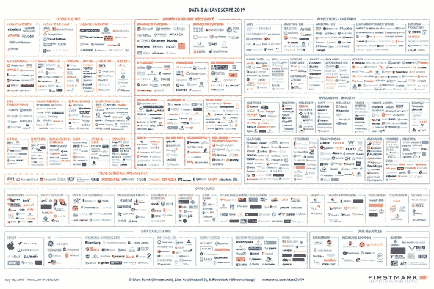
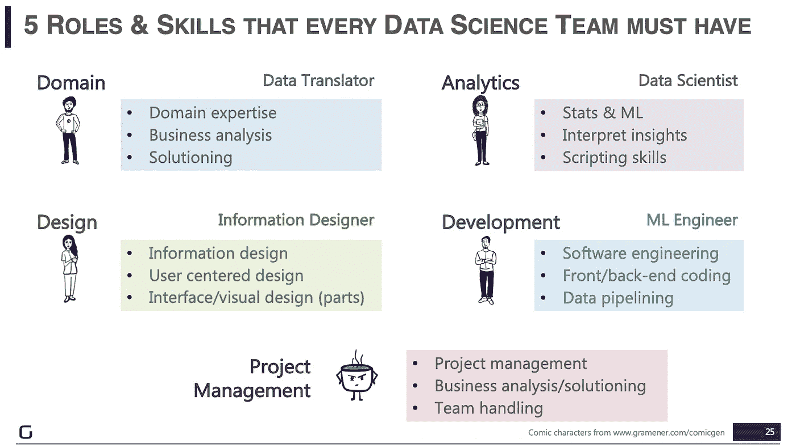
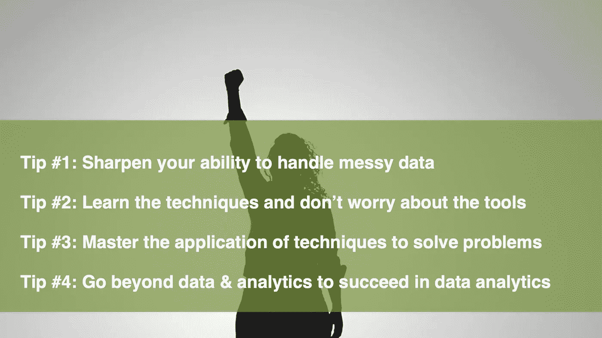

# 让你在数据科学职业生涯中不可或缺的 4 种超能力

> 原文：<https://towardsdatascience.com/4-superpowers-that-will-make-you-indispensable-in-a-data-science-career-6571e8e7d504?source=collection_archive---------19----------------------->

## 了解数据科学行业的这些最大挑战，以避免职业生涯停滞不前

*更新:你可以在* [*日语*](https://ainow.ai/2020/09/21/227685/) *阅读这篇文章(感谢 Koki Yoshimoto！)*

人们在数据科学职业生涯中遇到的挑战远比他们进入 it 行业时面临的挑战严重。

通常，工作期望和实际责任之间存在很大的不匹配。如果你有幸在你向往的领域工作，在数据科学项目中与其他角色合作可能是一场真正的斗争。

拔牙可能比应付项目经理的日常要求更容易。做好这一切，你可能会发现你的解决方案没有被用户触及。你可能会奇怪，为什么没有人理解或使用如此显而易见的东西。

在你的数据科学职业生涯的早期，所有这些都可能导致生存危机。对于这个领域的许多专业人士来说，职业停滞的风险很高。你如何解决这个问题？

我将分享数据科学项目中导致你许多个人奋斗的 4 大棘手挑战。基于我们在 [Gramener](https://gramener.com/) 的工作经验，我们将讨论它们对您的意义。以及如何粉碎它们，使它们在您的项目和数据科学行业中变得不可或缺。

# 1.提高您处理杂乱数据的能力

照片由[卡里姆·曼吉拉](https://unsplash.com/@karim_manjra?utm_source=unsplash&utm_medium=referral&utm_content=creditCopyText)在 [Unsplash](https://unsplash.com/s/photos/broom?utm_source=unsplash&utm_medium=referral&utm_content=creditCopyText) 拍摄

数据质量差是数据科学面临的最大挑战之一。坏数据[每年给](https://www.gartner.com/smarterwithgartner/how-to-create-a-business-case-for-data-quality-improvement/)组织造成超过 1500 万美元的损失。你需要干净、结构化的数据来得出大的、有用的、令人惊讶的见解。想不到使用了[深度学习](/decoding-deep-learning-a-big-lie-or-the-next-big-thing-b924298f26d4)技术？然后，你将需要更多的数据，并且这些数据必须被整齐地标记。

> **在数据科学中，80%的时间花在准备数据上，另外 20%的时间花在抱怨数据上！** —柯克·伯恩

您必须学会发现您的业务问题所需的数据的技能。了解如何管理和转换用于分析的数据。是的，数据清理在很大程度上是数据科学家的工作。玩数据，弄脏自己的手。你会发展出一双发现异常的眼睛，模式会开始跃入你的眼帘。

假设您的项目旨在分析客户体验。第一项任务是搜寻所有潜在的数据资产，如客户资料、交易、调查、社交活动。任何与你的业务问题无关的都必须放弃。检查和清理数据，你会丢失更多。这样做几周或几个月，然后你就准备好你的分析了！

# 2.学习技术，不要担心工具

数据和 AI 景观由[马特图尔克](https://mattturck.com/data2019/)。看不懂这个图表？别急，那是题外话！

数据科学行业充斥着数百种工具。没有一种工具能涵盖整个工作流程。每周都会有新的工具诞生。十几家倒闭或被收购。许多公司花费数百万购买企业许可证，却发现它们不再具有吸引力。

这个支离破碎的生态系统给有志之士带来了巨大的挑战。我经常被问到的一个问题是，*“我应该学习 Python 还是 R？PowerBI 还是 D3？”*我一直说工具真的不重要。对技术了如指掌。你可以在几周内将你的知识从一个工具转移到另一个工具。

> 工具真的不重要。重要的是这个人使用工具的技巧。

例如，要掌握可视化，不要从工具开始。学习信息设计的原则，视觉设计的基础，和色彩理论。然后获取一些真实的数据，通过解题将[技巧](/murdering-a-legendary-data-story-what-can-we-learn-from-a-grammar-of-graphics-ad6ca42f5e30)内化。任何你能得到的可视化工具都可以。不要过度优化。

# 3.掌握解决现实世界问题的技术应用

奥拉夫·阿伦斯·罗特内在 [Unsplash](https://unsplash.com/s/photos/solve-problems?utm_source=unsplash&utm_medium=referral&utm_content=creditCopyText) 上的照片

超过 80%的数据科学项目[失败](https://blogs.gartner.com/andrew_white/2019/01/03/our-top-data-and-analytics-predicts-for-2019/)。想知道为什么吗？在整个生命周期中都有挑战:从选择错误的业务问题到构建不正确的解决方案。从选择错误的技术到未能将它们传达给用户。数据科学中的每个角色都会导致这些失误。不，这些差距大多不是技术性的。

> 大多数数据科学项目没有带来业务投资回报，因为它们解决了错误的问题。

这里的共同点是什么？这是技能在商业问题上的拙劣应用。例如，当数据科学家只是*想要*构建伟大的模型，却忽略了关注他们用户的*需求*时，这就伤害了项目。不要停留在对某项技术或其背后的数学的直觉上。找到它的相关之处以及应用它需要什么。致力于解决用户的问题。

假设你已经掌握了十几种预测技术。当你的用户需要明天的价格进行交易，但只有一个过去的数据点时，你会选择哪一个？有 100 分或者 10000 分会有变化吗？如果她只需要知道是'*持有*还是'*以市场价*卖出怎么办？

# 4.超越数据和分析技能，在数据分析中取得成功！

公司通常雇佣来学习机器技能。他们投资于数据工程，可能会接受一些可视化和数据素养方面的培训。但是，这个[团队](/what-are-the-3-stages-where-data-science-teams-fail-e9f8bcd86825)是不平衡的，将交付次优的结果。每个数据科学团队都必须具备 5 项技能才能取得有效的项目成果。

在数据科学中实现价值的 5 个关键角色和技能(漫画:www.gramener.com/comicgen)

如果你正在扮演这些角色中的一个，你应该关心这个吗？绝对的。以下是你如何在任何项目中增加影响力的方法。掌握一项技能作为你的核心领域。这是你的主要角色。投资并学习一项次要技能。你应该能够在这一点上作为备份和支持介入。

其他三个呢？获得广泛的熟悉感。你必须能够[与他们](/whats-the-secret-sauce-to-transforming-into-a-unicorn-in-data-science-94082b01c39d)联系起来，理解痛点，并将他们与你的工作联系起来。做到这一点，你将价值连城！

> 要在数据分析行业取得成功，你需要的不仅仅是数据和分析

这里的一个关键要点是，[数据科学职业生涯中有 5 个角色](/whats-the-secret-sauce-to-transforming-into-a-unicorn-in-data-science-94082b01c39d)。不仅仅是“*数据科学家*”。假设你是一名 ML 工程师。你的第二技能可以是信息设计。了解图表以及如何选择正确的图表。找出用户在视觉上寻找什么，以及[它对你正在构建的 UI 有什么意义](/6-reasons-why-data-visualisation-projects-fail-1ea7a56d7602)。

# 现在是时候让自己变得不可或缺了

数据科学中的每个项目都面临这四个挑战。组织因[失败的数据科学](/5-reasons-why-businesses-struggle-to-adopt-deep-learning-85205e11d69a)投资而损失数百万。客户很担心，因为他们的业务问题仍未解决。数据科学的领导者和管理者都吓坏了，因为项目的失败率是疯狂的。

所有这些通常会转化为对数据科学专业人员的过度需求和高压力。理解这些大的挑战对你来说是一个很好的起点。同情你的[项目团队](/a-complete-data-science-team-requires-more-than-just-data-scientists-195cdbbca538)和领导。

你在这里学到的四个技巧将帮助你迎头应对挑战。开始实践它们，你会发现你的工作得到了更多的信任和认可。很快，你会变得不可或缺，在你的职业生涯中上升得更快。

祝你在项目中战胜这些挑战！

发现这些建议有用吗？有更多应对这些挑战的技巧吗？将它们添加到评论中。在[*Linkedin*](https://www.linkedin.com/in/gkesari/)*，*[*Twitter*](http://twitter.com/kesaritweets)*上与我保持联系。*

*标题照片由* [*史蒂文·利布拉龙*](https://unsplash.com/@libs?utm_source=unsplash&utm_medium=referral&utm_content=creditCopyText) *上* [*下*](https://unsplash.com/?utm_source=unsplash&utm_medium=referral&utm_content=creditCopyText) *。*