# 增强你在机器学习项目中的研究的 4 种技术

> 原文：<https://towardsdatascience.com/4-techniques-to-enhance-your-research-in-machine-learning-projects-c691892ab9dd?source=collection_archive---------27----------------------->

在我的帖子[机器学习项目的研究指南](/research-guidelines-for-machine-learning-projects-3a137c008277)中，我解释了如何将任何机器学习项目分成两个阶段(研究和开发)以及一些推动研究阶段的技巧。

## 在这篇文章中，我将深入研究一些技术和工具，帮助你掌握你的研究。在这个阶段工作时，你应该力求简单和专注。

# 项目布局

这是我倾向于在任何 ML 项目开始时使用的文件夹布局。只要项目需要成长，这个布局就可以扩展(例如添加一个`tests`文件夹、`deploy`文件夹等)。

```
project          # project root
├── data         # data files
├── models       # machine learning models
├── notebooks    # notebook files
└── src          # helper functions
```

与常规的软件开发项目不同，ML 项目有三块基石:由代码消耗/产生的**源代码**(笔记本和 src)、由代码和数据构建/消耗的**数据**和**模型**。

## 📁数据

在获取数据之后，我的建议是分阶段处理数据，每个阶段都有自己的文件夹。例如:

```
data
├── raw        # original files
├── interim    # preprocessed files
└── processed  # result files
```

从这个布局中，您可以像在管道中一样跟随数据流:从`raw`到`interim`，然后到`processed`。

首先是📁`raw`文件夹以原始格式存储数据。如果您可以使用离线数据，那么总是保存一份数据的冻结副本(*只读*)会非常方便。第二📁`interim`文件夹用于存储数据转换产生的数据。很可能，这些转换最终会扩大数据集。这就是我倾向于使用二进制格式的原因，二进制格式可以在序列化/反序列化任务中获得更好的性能。最常用的二进制格式之一是 [**拼花**](https://databricks.com/glossary/what-is-parquet) (查看如何使用`pandas`读取[/](https://pandas.pydata.org/pandas-docs/stable/reference/api/pandas.read_parquet.html)[保存](https://pandas.pydata.org/pandas-docs/stable/reference/api/pandas.DataFrame.to_parquet.html)拼花数据)。

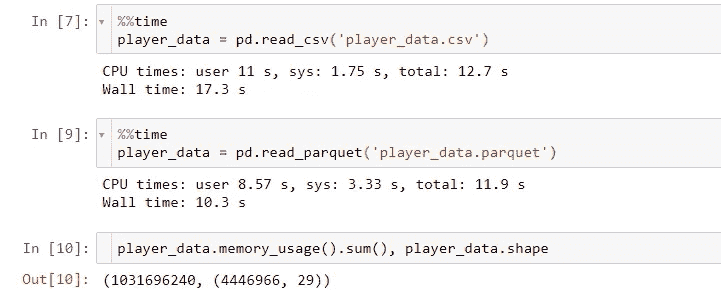

加载. csv 文件的时间与加载拼花文件的时间

最后，在📁`processed`文件夹用于存储机器学习模型的结果。

即使`raw`文件夹可以存储多种格式的文件(*)。csv* ，*。json* ，*。xls* 等)，我的建议是在`interim`文件夹中使用一些常用的格式(例如:二进制格式如*)。拼花地板*、*。羽化*，或 raw 格式，如*。csv* 、*。png* )并在`processed`文件夹中使用用户友好的格式(例如:*)。csv* 或 excel 文件允许利益相关者查看您的模型的结果)。有时，包含模型结果的汇总图是有意义的(例如:在构建推荐系统时，您的推荐分布是否遵循与您的销售分布相似的模式？)

## 📁笔记本电脑

在研究阶段工作时，我使用 Jupyter 笔记本作为我的执行平台/IDE。这就是为什么大多数支持机器学习生命周期的代码都存放在 Jupyter 笔记本上的原因


机器学习(简化)生命周期

因此，笔记本文件夹类似于(在某种程度上)ML 生命周期:

```
notebooks
├── 1__ingestion                 # |-> data/raw
├── 1_1__eda
├── 2__preprocessing             # |<- data/raw  
│                                  |-> data/interim
├── 2_1__eda
├── 3_1__model_fit_variant_1     # |-> model/variant_1.pkl
├── 3_2__model_fit_variant_2     # |-> model/variant_2.pkl
├── 3_3__models_validation       
└── 4__model_predict             # |<- data/interim, model/*.pkl  
                                   |-> data/processed
```

我不会深入研究每个笔记本负责什么的细节，因为我认为你们大多数人应该与机器学习生命周期有关。

在任何情况下，你都应该应用适合你工作方式的布局和命名约定(如果你愿意，也可以使用更复杂的布局[模板](https://drivendata.github.io/cookiecutter-data-science/))。也许你需要几次或更多的迭代来找到你自己的蓝图，但是把它作为学习过程的一部分。例如，我喜欢将 EDA 分成两部分，第一部分*仅使用原始数据，第二部分*关注预处理阶段后产生的“新数据”。但是，如果你喜欢做一个单一的 EDA，这也很好。这里展示的这些项目布局是为了让你有目的地做事，而不是按照你的自由意志行事。一旦您将项目移交到下一个阶段(开发)，这将非常重要，因为您的团队成员将能够识别您的项目的形状和组件。**

## 📁模型

建模笔记本的结果(训练后的 ML 模型)可以存储在该文件夹中。大多数 ML 框架(如 scikit-learn、spacy、PyTorch)都内置了对模型序列化的支持(*)。pkl* 、 *.h5* 等)；否则，检查出宏伟的 [cloudpickle](https://github.com/cloudpipe/cloudpickle) 包。

## 📁科学研究委员会

研发阶段的一个区别是，在研发阶段，`src`将会很小(包含助手和笔记本使用的其他常用功能)，而在研发阶段，这个文件夹将会被其他文件夹和*填满。py* 文件(为生产部署准备的代码)。

# WSL2

【Linux 的 Windows 子系统 (v2)是这个领域的新成员。如果您已经在使用 Linux 或 MacOS，可以跳过这一节。否则，如果你属于 Windows 用户类别，你应该继续阅读。大多数 python 包与 Windows 系统兼容；但是你永远不知道什么时候会面临不兼容 OS 包的逆境(比如:apache airflow 不在 Windows 环境下运行)。在这段时间里，您将学会爱上 WSL，因为它的行为就像一个完全成熟的 Linux 系统，无需离开您的 Windows 环境。性能相当不错，大多数 IDE 都兼容 WSL。

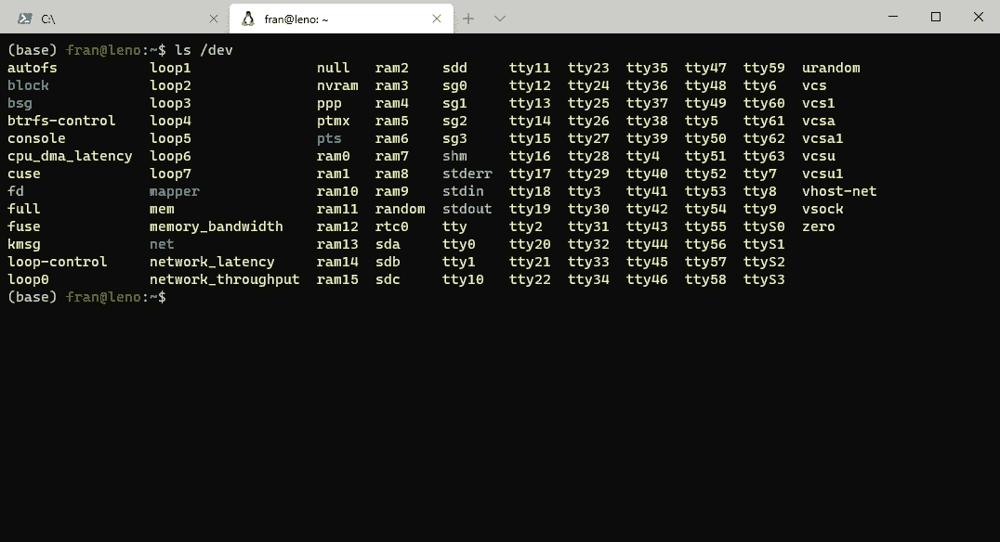

运行 WSL 的 Windows 终端

例如， [Visual Studio 代码有对 WSL](https://code.visualstudio.com/docs/remote/wsl) 的原生支持。这意味着使用常规插件加载任何 python 项目/文件夹，并执行或调试代码。因为 WSL 将主机驱动器挂载在`/mnt`文件夹中，所以您仍然可以访问 windows 主机文件夹。如果您最终在 Windows 和 WSL 中使用同一个项目，请考虑您可能会遇到一些互操作性问题。例如，由于文件权限或 CRLF 行尾，git 可能会错误地将文件检测为已更改。要解决这些问题，您可以在 WSL 中执行以下命令:

```
git config --global core.filemode false
git config --global core.autocrlf true
```

WSL 的未来充满希望:[原生访问 GPU](https://docs.microsoft.com/en-us/windows/win32/direct3d12/gpu-cuda-in-wsl) (=使用 GPU 训练深度学习模型)和 [Linux GUI](https://techcommunity.microsoft.com/t5/windows-dev-appconsult/running-wsl-gui-apps-on-windows-10/ba-p/1493242) (=不仅支持终端应用，也支持 GUI 应用)。最后，不要错过与 WSL 一起使用令人惊叹的 [Windows 终端](https://docs.microsoft.com/en-us/windows/terminal/)的机会。

# Jupyter 笔记本

毫无疑问，Jupyter 笔记本是我进行探索和研究的首选工具。但与此同时，Jupyter 笔记本电脑并不是将您的模型投入生产的最佳工具。在这两个对立的术语(研究/开发)之间，有一个共同点，那就是您可以改进如何使用 Jupyter 笔记本电脑。

## 装置

我推荐使用 [Anaconda](https://www.anaconda.com/) 和 conda 环境安装 Jupyter 笔记本。但是你可以使用任何其他的包管理工具(比如 [virtualenv](https://docs.python.org/3/tutorial/venv.html) 、 [pipenv](https://github.com/pypa/pipenv) 等)。但是你**必须**使用某人，因此，也在你的项目中使用它。

如何安装 Jupyter Notebook(或者更确切地说，我是如何将其安装在我的机器中的):

使用 Anaconda 安装 Jupyter 笔记本(因此，首先需要[安装 Anaconda](https://docs.anaconda.com/anaconda/install/))；然后在基本/默认(conda)环境中安装 Jupyter Notebook，执行以下命令:

```
conda activate base
conda install -c conda-forge notebook
```

这听起来违背了所有的良好实践(Jupyter Notebook 应该是一个项目依赖项)，但我认为作为 Visual Studio 代码(或*name-your-preferred-IDE-here*)本身，Jupyter Notebook 应该是一个机器级的依赖项，而不是项目级的依赖项。这使得以后的定制更容易管理:例如，在使用 Jupyter 扩展的情况下(下一节将详细介绍)，您只需配置一次扩展，然后它们就可以用于所有的内核/项目。

安装 Jupyter 笔记本后，就轮到 Jupyter 笔记本扩展了；在控制台中运行以下命令:

```
conda install -c conda-forge jupyter_contrib_nbextensions
jupyter contrib nbextension install --user
conda install -c conda-forge jupyter_nbextensions_configurator
```

然后，每当您创建一个新的 conda 环境时(您应该在每次启动一个新项目时创建一个新的环境)，您需要使它作为 Jupyter 内核可用，执行以下命令:

```
python -m ipykernel install --user --name retail --display-name "Python (retail)"
```

最后，要启动 Jupyter Notebook，您应该在基本环境中，然后执行:

```
project          # project root (launch jupyter notebook from here,
│                # using the base/default conda environment)
├── data
├── models
├── notebooks
└── srcconda activate base
jupyter notebook
```

Jupyter Notebook 在您的网络浏览器中启动后，您可以为您的笔记本选择所需的环境(内核):

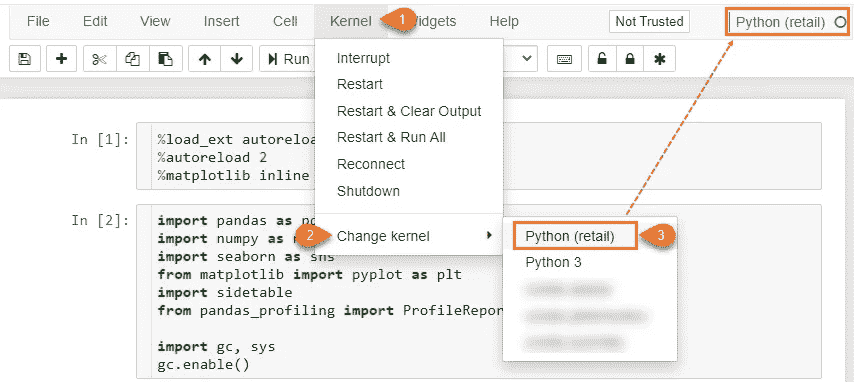

Jupyter 笔记本—更改内核

第一次在笔记本中设置内核时，它将被记录在笔记本元数据中，您无需在每次启动笔记本时进行设置。

## 笔记本扩展

使用 [Jupyter 笔记本扩展](https://jupyter-contrib-nbextensions.readthedocs.io/en/latest/index.html)。只是为了启用`Collapsing headers`扩展。当您使用大型笔记本时，这对于将信息组织到您的笔记本中非常有帮助，并且不会忘记在笔记本中来回翻页。我认为这是必须的。句号。

交付笔记本电脑时，您应该提供的最重要的事情之一是*可执行性*(一旦设置了依赖关系——内核和源文件，笔记本电脑必须从上到下都是可运行的)和*可再现性*(当笔记本电脑被执行时，应该总是返回相同的结果)。

但是由于我们处于研究阶段，我们可以允许一定程度的不确定性。支持这一点的一个很好的工具是`Freeze text`扩展，允许我们保存您过去实验的结果。使用工具栏，您可以将单元格*变为只读*(可以执行，但其输入不能更改)或*冻结*(不能更改或执行)。因此，如果您不能强制执行可再现性，至少您可以保留一些基本结果来与您当前的执行进行比较。

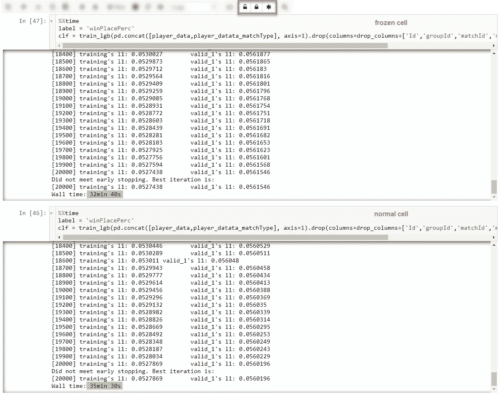

`Freeze text` Jupyter 笔记本扩展

例如，在上图中，您可以比较最后一个纪元和执行时间的准确性。此外，考虑到为了记录/跟踪您的实验，有更好的工具，如 [mlFlow](https://mlflow.org/) 和 [wandb](https://www.wandb.com/) (尽管我认为这些工具在开发阶段更相关)。

最后，我鼓励你去看看其他可用的扩展(比如 scratchpad，autopep，code folding 等等)。如果你按照我的安装设置，应该有一个名为`Nbextensions`的选项卡可供你配置笔记本扩展:

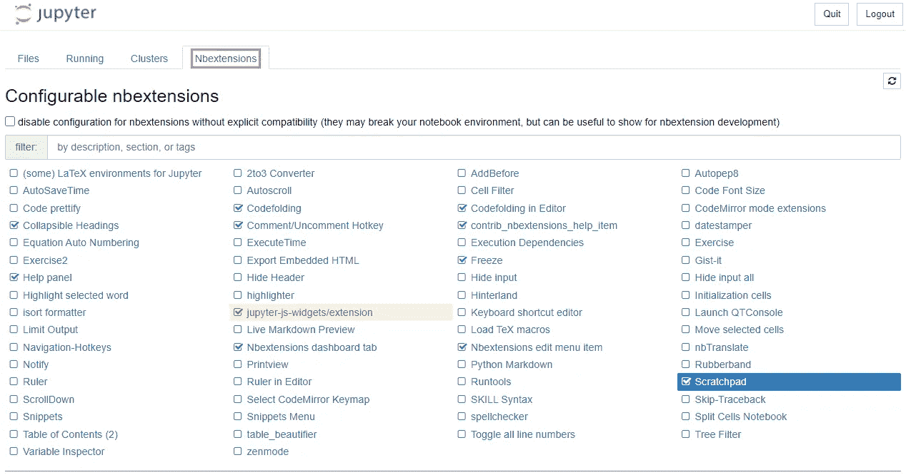

Jupyter 笔记本扩展管理器

否则，您可以通过命令行[启用扩展](https://jupyter-contrib-nbextensions.readthedocs.io/en/latest/install.html#enabling-disabling-extensions)。

## 笔记本测试和源代码控制

Jupyter 笔记本在测试和源代码控制方面都表现不佳。在**测试**的情况下，使用[造纸厂](https://papermill.readthedocs.io/en/latest/)和 [nbdev](https://github.com/fastai/nbdev) 会有一些帮助。另外，我强烈推荐使用*老派*技巧作为`assert`命令来验证你的代码假设。例如，在每个`pd.merge`之后，检查结果数据帧的基数(初始行数==最终行数)总是一个好的做法:

```
nrows_initial = df.shape[0]
df = pd.merge(df, df_sub, how="left")
assert nrows_initial == df.shape[0]
```

在**源控制**的情况下，可以检查`[nbdime](https://github.com/jupyter/nbdime)`，进行*区分*和*合并*笔记本。通常`git`在检测笔记本文件的变化方面提供的体验很差，但是相比之下`nbdime`是一个强大的工具，你可以从命令行(提供了与 git、bash 和 PowerShell 的集成)或者从 web 界面使用，这提供了更丰富的体验(也提供了与 Jupyter Notebook 的集成)。我非常欣赏`nbdime`根据输入单元格的变化、输出单元格的变化和单元格元数据的变化对更新进行分类。

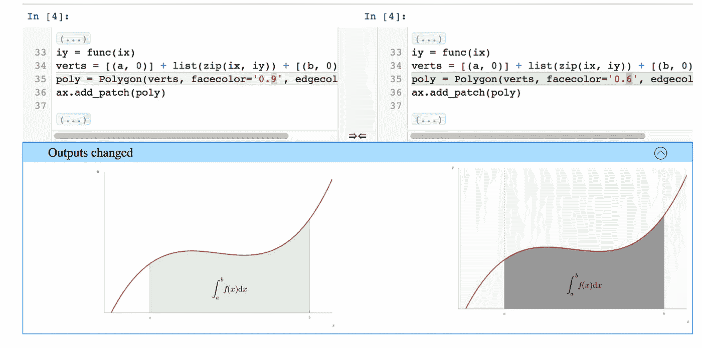

[NBD ime—Jupyter 笔记本的区分和合并](https://nbdime.readthedocs.io/en/latest/)

## 笔记本魔术命令

使用 Jupyter 笔记本的另一个建议是充分利用内置的 [%magic commands](https://ipython.readthedocs.io/en/stable/interactive/magics.html) 。我最喜欢的魔法命令是:

```
%load_ext autoreload
%autoreload 2
%matplotlib inline
```

在不重启内核的情况下，在内存中重新加载模块和包时，`%autoreload`这个神奇的命令变得非常方便。例如，如果你正在处理存储在经典*中的代码。py* 文件，当源文件被更新时，只要你执行笔记本中的一个单元格，新的源文件就会被重新加载到当前内核中，所做的更改就可以使用了。这种技术的另一个好处是，您可以在笔记本的环境中安装新的包，并且(大多数情况下)它可以导入到当前的笔记本中(同样，不需要重新启动内核)。另一方面，魔术命令`%matplotlib`用于将`matplotlib`输出重定向到当前画布笔记本。

另一个鲜为人知的魔法命令是:

`%%time`当您需要分析在笔记本中执行一个单元格所花费的时间时。我喜欢对需要长时间执行的复杂单元使用这个命令，因为我知道完成执行需要多少时间。如果你想了解更多这方面的信息，你可以阅读优秀的[剖析和计时代码——Python 数据科学手册](https://jakevdp.github.io/PythonDataScienceHandbook/01.07-timing-and-profiling.html)章节。

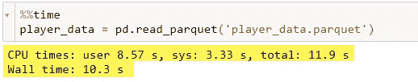

使用`%%time`分析执行时间

另一种分析代码的方法是使用 [tqdm](https://github.com/tqdm/tqdm) ，当执行“成批代码”时，它会显示一个漂亮的进度条。根据执行上下文(python、interactive 或 Jupyter Notebook)，输出可以很好地适应。

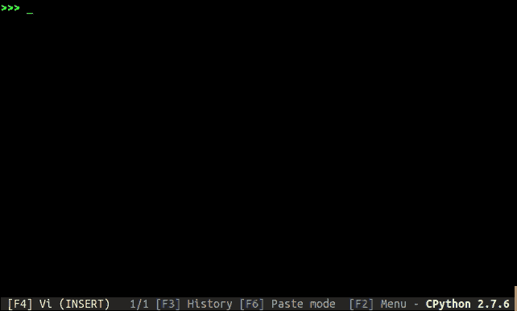

[tqdm](https://github.com/tqdm/tqdm)

如果您需要并行执行“成批代码”并显示它们的进度，您可以使用 [pqdm](https://github.com/niedakh/pqdm) 。

`%debug` ( *可以调试*)，当一个单元因错误而执行失败后，执行下一个单元的`%%debug`魔法命令。在此之后，您将进入(*华丽*【挖苦本意】)`pdb`调试界面；请记住，没有设置断点的花哨用户界面，只有“老式的”命令 alas ' s ' for step，q ' for quit，等等；您可以检查其余的 [pdb 命令](https://docs.python.org/2/library/pdb.html#debugger-commands)以自娱自乐。

# 预处理

## 数据管道

在我的上一个项目中，我从这篇文章[中获得了很大的灵感，这篇文章解释了如何构建机器学习预处理管道。最重要的想法是**而不是**推迟之前可以做的事情，并按照以下顺序转换数据:](https://medium.com/manomano-tech/a-framework-for-feature-engineering-and-machine-learning-pipelines-ddb53867a420)

1.  **预处理**:列操作(即`map`转换)
2.  **特征工程**:逐行操作(即`group by`变换)
3.  **合并**:数据帧方式操作(即`merge`转换)
4.  **上下文**:跨数据帧操作(即`map`跨上下文操作)

## 压型

从头开始做 EDA 很费力，因为你需要事先查询数据，以便知道要显示什么(或寻找什么)。这种情况最终导致编写重复的查询来显示数值变量的直方图、检查列中缺少的值、验证列的类型等。另一个选择是自动生成这些信息，使用像 [pandas-profiling](https://github.com/pandas-profiling/pandas-profiling) 这样的包，它可以报告各种信息。

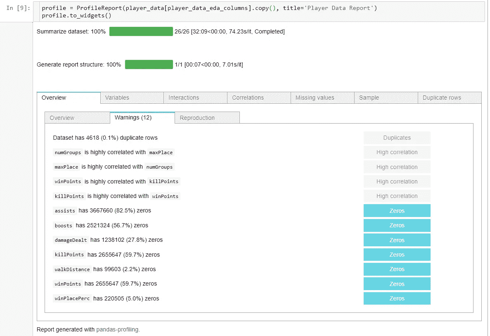

[熊猫简介](https://github.com/pandas-profiling/pandas-profiling)

检查缺失数据的经典方法是使用`df.isna().sum()`中的`pandas`API；同样，您可以查询执行`df.species.value_counts()`的数据频率。但是这些命令的输出是“不完整的”，因为只返回绝对数字。欢迎使用 [**sidetable**](https://github.com/chris1610/sidetable) ，它以一种漂亮的表格方式丰富了过去的查询:

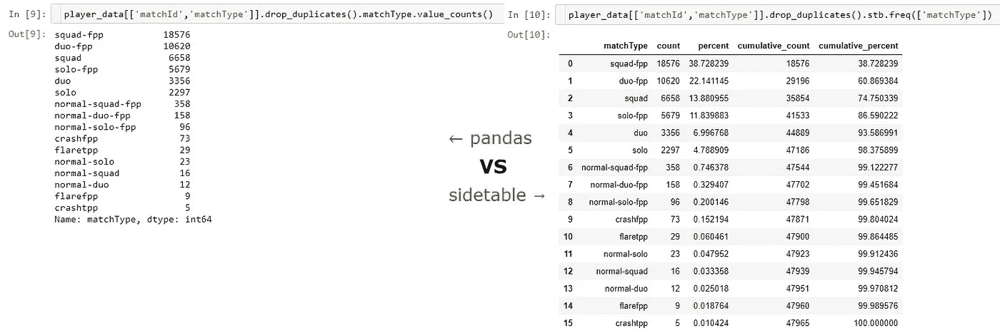

熊猫`value_counts()` vs 侧桌`freq()`

`sidetable`和`pandas-profiling` API 完全集成到`pandas` DataFrame API 中，支持 Jupyter 笔记本。

*PS:* 这个区域目前“炙手可热”，所以期待未来会有更多的包裹到来( [klib](https://github.com/akanz1/klib) )

## 形象化

对我们许多人来说，Seaborn 是一个老伙伴。下一个版本(0.11)要带来我期待了一段时间的东西:[堆积条形图](https://gist.github.com/mwaskom/8e1a25c8c7519fabf15845408c15e9a7)。

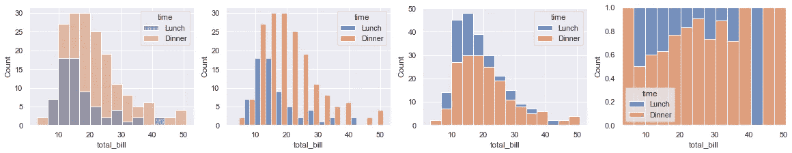

[堆积条形图](https://gist.github.com/mwaskom/8e1a25c8c7519fabf15845408c15e9a7)

如果你在这个特性还没有发布的时候读到这篇文章，记住你可以使用下面的命令直接从 GitHub 安装“开发”包:

```
pip install  [https://github.com/mwaskom/seaborn.git@4375cd8f636e49226bf88ac05c32ada9baab34a8#egg=seaborn](https://github.com/mwaskom/seaborn.git@4375cd8f636e49226bf88ac05c32ada9baab34a8#egg=seaborn)
```

您也可以在您的`requirements.txt`或`environment.yml`文件中使用这种 URL，尽管我建议确定存储库的提交散列(如后面的代码片段所示)。否则，您将安装“安装时可用的最新存储库版本”。此外，在产品中安装“测试”或“开发”版本时要小心。警告你

【更新】Seaborn 0.11 版本目前已经上市，不需要从 GitHub 安装开发版。尽管如此，为了知识的缘故，我将留下关于安装开发版本的注释。

在我的上一个项目中，我了解了一个非常方便的软件包，用于可视化地图和统计信息: [**kepler.gl**](https://kepler.gl/) ，这是一个最初的 node.js 模块，最近被移植到 Python，并且还获得了一个友好的扩展，可以将地图加载到 [Jupyter 笔记本](https://docs.kepler.gl/docs/keplergl-jupyter)。

我喜欢 kepler.gl 最重要的特点是:

1.  与`pandas` API 紧密集成。
2.  我能够制作一个令人印象深刻的 3D 地图可视化，包括一个在短时间内自动动画的动态时间轴。
3.  UI 具有许多 GIS 功能(图层等)，因此地图具有高度的交互性和可定制性。但最棒的是，你可以保存这些 UI 设置，并将其导出为一个 python 对象(准确地说是一个 python 字典)；下次加载地图时，可以传递这个 python 对象，避免从头开始重新设置地图。

```
from keplergl import KeplerGl
sales_map = KeplerGl(height=900, 
                     data={"company sales" : df,
                           "box info" : df.drop_duplicates(subset=["product_id"]), 
                           "kid_info" : df.drop_duplicates(subset=["user_id"]) },
                     config=config # configuration dictionary
                    )
sales_map
```

感谢你花时间阅读这篇文章。

*   我在这篇文章中解释的大多数问题都是基于我在 ML 项目中的工作经验。但它们不一定适合你的工作环境，但至少，我希望它们能为你提供一些思考的素材。
*   请记住，这篇文章关注的是研究阶段的实验，所以我允许一些*许可*，但我不会允许自己出现在最终产品中。同时，我尝试使用正确的工具来加强容易覆盖的领域(例如:使用`assert`的简单测试，管道的良好实践，等等)。
*   我不描述机器学习模型问题(训练、验证和部署)似乎会适得其反。但是在开始的时候，你将会花更多的时间来计划你的项目，转换你的数据和处理软件相关的麻烦，而不是执行 fit/predict 方法。
*   请在评论中分享你的笔记或经历。正如我之前所说的，我离开了多个领域，没有进一步的细节，但如果你对其中任何一个感兴趣，请说出来。这将有助于推进这个了不起的社区。